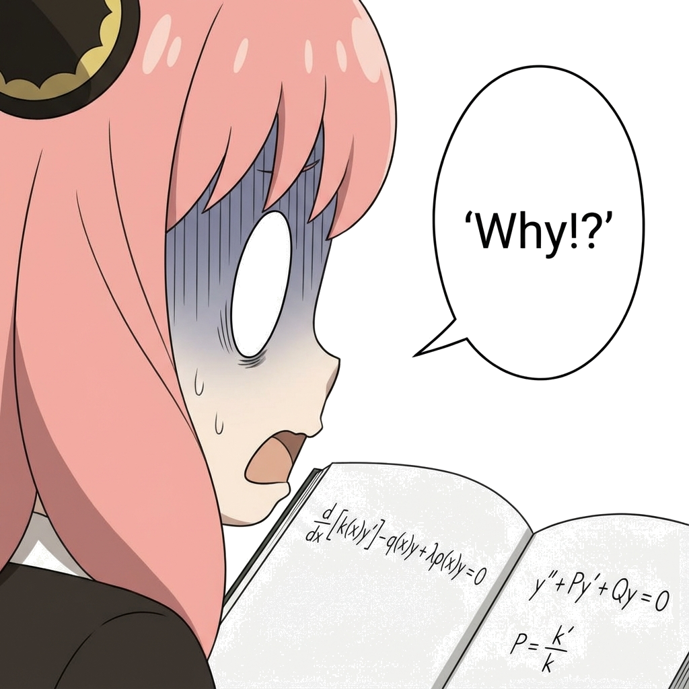
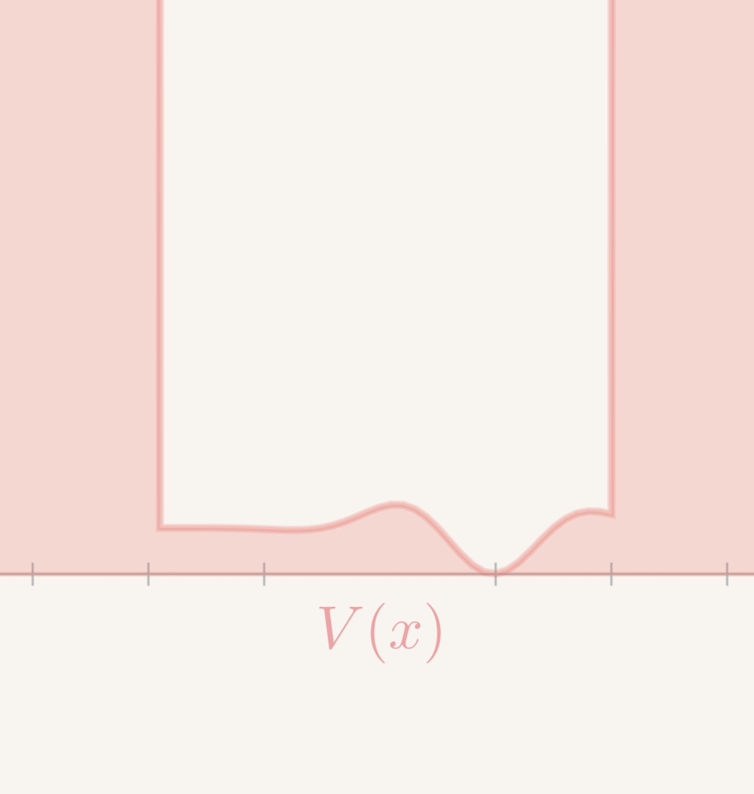
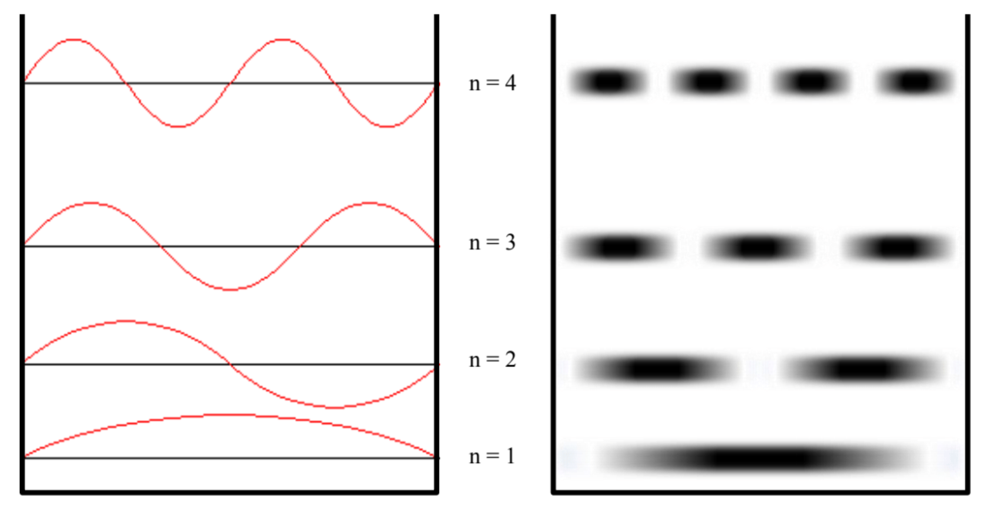

# Sturm-Liouville 本征值问题

$$
\gdef\red#1{{\color{cb8680}{#1}}} 
\gdef\green#1{{\color{4f8d63}{#1}}} 
\gdef\gray#1{{\color{gray}{#1}}} 
\gdef\purple#1{{\color{B189C6}{#1}}} 
\gdef\orange#1{{\color{dfa04b}{#1}}}
\gdef\white#1{{\color{white}{#1}}}
$$

<!-- footer: Sturm-Liouville 本征值问题 -->

---

### Sturm-Liouville 本征问题

- 数学家从大量实践中总结出一类 $\red{\boldsymbol{(a,b)}}$ 上有趣的 **<green>Sturm-Liouville** 型微分方程
  $$
  \frac{d}{dx} \bigg[
  k(x) \frac{dy}{dx}
  \bigg]
  ~\stackrel{\large\downarrow}{\red{\boldsymbol{-}}} ~ q(x) y(x) + \lambda \rho(x)y(x) = 0
  $$
  

  
  $k(x)$， $q(x)$，$\rho(x)$ 是 **<green>已知函数**，$y(x)$ 是 **<red>未知函数**，$\lambda$ 是**常数**，
  - $\rho(x)$ 称为 **<green>权函数**
  - 给定边界条件下，使得 $y(x)$ 有解的 $\lambda$ 值称为 **<green>本征值**
  - 给定边界条件以及合适的本征值 $\lambda$，对应的 $y(x)$ 称为 **<green>本征函数**
  - 方程 + 边界条件 $\to$ **<green>Sturm-Liouville 本征问题**
  

---
### Sturm-Liouville 本征问题

- Sturm-Liouville 方程的标准形式
  $$
  \frac{d}{dx} \bigg[k(x) y'(x) \bigg]
    - q(x) y(x) + \lambda \rho(x)y(x) = 0
  $$
- 之前学过的二阶线性齐次常微分方程的标准形式
  $$
  y''(x) + P(x) y'(x) + Q(x) y(x) = 0
  $$
- 看起来不一样

---
### Sturm-Liouville 本征问题
- 本质是同一个东西
  

  
  数学家喜欢一个东西变来变去

  

  
  

  

---
### Sturm-Liouville 本征问题

- Sturm-Liouville 标准形式重写
  $$
  y''(x) + \frac{k'(x)}{k(x)} y'(x) + \frac{\lambda \rho(x) - q(x)}{k(x)} y(x) = 0
  $$
- 与二阶线性常微分方程标准形式比较

  $$
  P(x) \sim \frac{k'(x)}{k(x)} = \frac{d}{dx}\ln k(x), \qquad
  Q(x) \sim \frac{\lambda \rho(x) - q(x)}{k(x)}
  $$
  

  
  $k$ 的**零点** $\Rightarrow$ $P(x)$, $Q(x)$ 的**奇点**；<orange><reveal>**<red>什么时候是正则奇点？**</reveal></orange>
  

---

### Sturm-Liouville 本征问题

- 最一般的 Sturm-Liouville 方程比较麻烦
- 下面简单介绍在**系数、解满足特定的条件**时的**一般性质**

---
### Sturm-Liouville 本征问题：特定条件

- 系数函数 $k(x)$, $q(x)$, $\rho(x)$ 在开区间 $\red{\boldsymbol{(a,b)}}$ 上是连续可微**实**函数，
  $$
  k(x) ~ \red{\boldsymbol{>}} ~ 0, \quad q(x) \ge 0, \quad \rho(x) \ge 0, \qquad x \in (a,b)
  $$
- 在边界处
  * $k(x)$ 在边界 $a, b$ **有限**，可以有**零点**，**<red>最高二阶零点**
  * $q(x)$ 在边界 $a,b$ **<red>最高一阶** **极点**
    

    
    保证 $q(x)/k(x)$ 极点 **<red>不超过二阶**
    

  * $\rho(x)$ 在边界 $a, b$ 处**有限**，可以有**零点**

---
### Sturm-Liouville 本征问题：特定条件
* 未知函数 $y(x)$ 在开区间 $(a,b)$ 上**连续可微**，在闭区间 $[a,b]$ 上**连续有界**
  

  
  在 $[a,b]$ 上**连续有界**其实就是**自然边界条件**
  

* 后面讨论在边界 $a, b$ 额外添加其他**边界条件**
  

  
  这些额外边界条件与自然边界条件**相容**
  

---
### Sturm-Liouville 本征问题：特定条件

**无界区间**

$a,b$ 可能取正负无穷。此时一般要求 $y(x)$ 在该无限区间上面满足**平方可积性**，
$$
 \int |y(x)|^2 dx < \infty
$$

---

### Sturm-Liouville 本征问题例子

- 波动方程的分离变量法得到，第一二三类边界条件
  $$
  y''(x) + \lambda y(x) = 0
  $$
  $$
  \alpha y' - \beta y \big|_{x = a} = (\gamma y'+\delta y)\big|_{x = b} = 0
  $$
* 读取在开区间 $(a,b)$ 内
  $$
  k(x) = 1 > 0, \qquad q(x) = 0 \ge 0, \qquad \rho(x) = 1 > 0
  $$
  在边界处 $k(a) = k(b) = 1$，**<red>没有零点**

---
### Sturm-Liouville 本征问题例子
- 勒让德方程的本征问题，**自然边界**条件
  $$
  y''(x) \green{- \frac{2x}{1-x^2}} y' + \green{\frac{\lambda}{1 - x^2}}y = 0, \qquad
  |y(\pm 1)| < \infty
  $$
  $$
  \frac{d}{dx}\bigg[(1 - x^2) y'(x)\bigg] + \lambda y(x) = 0, \qquad
  |y(\pm 1)| < \infty
  $$
  

  
  **<red>拉普拉斯算符在什么坐标系的分离变量法会出现勒让德方程？**<answer>球坐标</answer>
  

---
### Sturm-Liouville 本征问题例子
* 开区间 $(-1，1)$ 内
  $$
  k(x) = 1 - x^2  > 0, \qquad q(x) = 0 \ge 0, \qquad \rho(x) = 1 \ge 0
  $$
  在左右边界处，$k(\pm1)$ 有 **<red>一阶零点**，同时有 **自然边界条件**

---
### Sturm-Liouville 本征问题例子
- Bessel 方程本征值问题，**自然边界**与第三类边界
  $$
  \frac{d}{dx}\bigg(x \frac{dy}{dx}\bigg) - \frac{m^2}{x} y + \lambda x y = 0, \quad 0 < x < a \\
  $$
  $$
  \purple{|y(0)| < \infty} , \quad 
  \alpha y'(a) + \beta y(a) = 0
  $$
  

  
  * **<red>在柱坐标系分离变量，$m$ 跟什么对称性有关？** <answer>$z$-轴旋转对称性</answer>
  * **<red>在柱坐标系分离变量，$\lambda$ 跟什么对称性有关？** <answer>$z$-轴平移对称性</answer>
  

---
### Sturm-Liouville 本征问题例子
* 开区间 $(0, a)$ 内
  $$
  k(x) = x  > 0, \qquad q(x) = \frac{m^2}{x} \ge 0, \qquad \rho(x) = x \ge 0
  $$
  在边界处 $k(0) = 0$，有 **<red>一阶零点**，同时有 **自然边界条件**

---
### Sturm-Liouville 本征问题例子

- 球坐标径向函数 $y(x) \coloneqq R(r=x/k)$ 满足球 Bessel 方程本征值问题，**自然边界**与第一类边界条件
  $$
  \frac{d}{dx}\bigg[
    x^2 \frac{dy}{dx}
  \bigg] - \lambda_1 y + \lambda_2 x^2 y = 0, \quad 0<x<a
  $$
  $$
  |y(0)| < \infty, \qquad y(a) = 0
  $$
* 开区间 $(0, a)$ 内 ($\lambda_2$ 是**本征值**)
  $$
  k(x) = x^2 > 0, \qquad q(x) = \lambda_1 \ge 0, \qquad \rho(x) = x^2 \ge 0
  $$
  在边界 $x = 0$ 处，$k(0) = 0$ 有 **<red>二阶零点**，同时有 **自然边界条件**

---

### Sturm-Liouville 本征问题例子

- 一维量子力学不含时**薛定谔方程** ($m > 0, \hbar > 0$, $V(x) \ge 0$)
  $$
  \begin{align*}
    & \ -\frac{\hbar^2}{2m} \frac{d^2 \psi(x)}{dx^2} + V(x) \psi(x) = E \psi(x)\\
    \Rightarrow & \ \quad  \frac{d}{dx}\left[{\frac{d \psi(x)}{dx}}\right] - \frac{2m}{\hbar^2}V(x)\psi(x) + \green{\frac{2m}{\hbar^2}E} \psi(x)  = 0
  \end{align*}
  $$
  读取
  $$
  k(x) = 1, \qquad q(x) = \frac{2m}{\hbar^2} V(x) \ge 0, \qquad \rho(x) = 1 > 0, \quad \lambda = \green{\frac{2m}{\hbar^2} E}
  $$

---
### Sturm-Liouville 本征问题的边界条件

- 之前提到的边界条件有**三维来源**：球坐标与柱坐标的分离变量法
- 对物理的朴素理解：周期性边界、自然边界条件
- 系统边界与外界的耦合形式：第一二三类边界条件
* **<red>如果脱离三维物理背景，SL 本征问题边界条件是否可以随心所欲地设置？**

---
### Sturm-Liouville 本征问题的边界条件

- 讨论三种常见边界条件的使用场景
  

  
  

---
### Sturm-Liouville 本征问题的边界条件
* **齐次** **第一二三类**边界条件
  

  
  适用于**闭区间** $\red{[a,b]}$ 上全程 $k(x)~ \red{>}~ 0$
  

  $$
  \alpha y'(a) \ \red{\boldsymbol{-}} \ \beta y(a) = 0, \quad
  \gamma y'(b) + \delta y(b) = 0
  $$
  其中 **$\alpha, \beta, \gamma, \delta \ge 0$**，$\alpha^2 + \beta^2 > 0$，$\gamma^2 + \delta^2 > 0$
  

  
  既然用到 $y, y'$ 在边界上的值，就暗示了 $y$ 及其导数 在 $[a,b]$ 上 **连续且有界**，即已经满足**自然边界条件**
  

---
### Sturm-Liouville 本征问题的边界条件
- **周期性**边界条件
  

  
  适用于**正定周期**系数 $k(a) = k(b) \ \red{> 0}$, 以及周期 $q(a) = q(b)$, $\rho(a) = \rho(b)$ 的方程
  

  $$
  y(a) = y(b), \quad y'(a) = y'(b)
  $$

  

  
  既然用到 $y, y'$ 在边界上的值，就暗示了 $y$ 及其导数 在 $[a,b]$ 上 **连续且有界**，即已经满足**自然边界条件**
  $$
  |y(a)| < \infty, \qquad |y(b)| < \infty
  $$
  

---
### Sturm-Liouville 本征问题的边界条件

- **自然边界条件**
  

  
  * 准确地说应该是 **<red>没有添加别的边界条件**

  * 更准确来说是 **<red>没有办法添加别的边界条件**
  
  

---
### Sturm-Liouville 本征问题的边界条件

- 端点 $a$ (或 $b$) 处**只使用**自然边界条件 (不加第一二三类) 的 **充要条件** 是 $k(a) = 0$ (或 $k(b) = 0$)

* **<red>Why?**

* 核心动机：Sturm-Liouville 本征问题想找到一个**本征函数** (保留一个自由常数)
* 核心原因：$k(a)$ 是否为零决定了 $a$ 处是**常点**还是**正则奇点**

---
### Sturm-Liouville 本征问题的边界条件

- 下面对比**齐次第一二三类边界条件**和**自然边界条件**的适用范围
- Sturm-Liouville 方程是二阶齐次 ODE：两个线性独立解，两个自由度，要想办法**降低一个自由度**

* 常点附近
  * 解是**解析函数**，函数值天然有限
  * 可以**独立地**、任意指定 $y(a), y'(a)$
  * 通过指定第一二三类条件**降低一个自由度**
  * 另一个端点的齐次边界条件确定**本征值**

---
### Sturm-Liouville 本征问题的边界条件

- 正则奇点附近
  * 第一解有限，第二解发散
  * 自然边界条件**筛走发散解 (降低一个自由度)**
  * 另外一个端点的齐次边界条件确定**本征值**

---

### Sturm-Liouville 方程的一般性质

- 下面探讨满足上述特定条件的 Sturm-Liouville 方程的一些**一般性质**

---

### Sturm-Liouville 方程的一般性质

- 性质 1：本征值是**非负实数**：$\lambda \ge 0$ (可以取零)
* 性质 2：本征值**无穷多且分立 (可数无穷多)**，$\lambda_1 \le \lambda_2 \le \cdots$,
  $$
  \lim_{n \to +\infty} \lambda_n = +\infty
  $$
  

  
  证明很困难
  

* 性质 3：本征值**非简并**，即每个 $\lambda_n$ 只有一个解 $y_n(x)$
  

  
  **<red>除了** **周期性** 边界条件
  

---
### Sturm-Liouville 方程的一般性质

- 性质 4：设 $\lambda_n$ 对应的解为 $y_n$，则 $y_{n + 1}(x)$ 比 $y_n(x)$ **多一个零点**
  

  
  不作证明
  

---
### Sturm-Liouville 方程的一般性质

* 性质 5：不同本征值的本征函数**带权正交**，即
  $$
  \int_a^b \overline{y_m(x)}  y_n(x)\rho(x) dx = 0, \quad n \ne m
  $$
  

  
  $\overline{y(x)}$ 表示 $y(x)$ 的复共轭
  
  万一出现简并，可以对**相同本征值**的本征函数进行 **Schmidt 正交化**
  

* 本征函数族在 $[a,b]$ 上**完备**
  

  
  证明很困难
  

---

### Sturm-Liouville 方程的本征值非负

**证明本征值非负**
- 方程的标准形式
  $$
  \green{\frac{d}{dx} \bigg[k(x) y'(x) \bigg]}
    \orange{- q(x) y(x)} + \purple{\lambda \rho(x)y(x)} = 0
  $$
* 方程两边同乘 $\overline{y(x)}$，并对 $x$ 在 $[a,b]$ 上积分
  $$
  \begin{align*}
    \purple{\lambda \int \rho(x) |y(x)|^2}
    = & \ \int \orange{q(x) |y(x)|^2} - \green{\int \overline{y(x)} \frac{d}{dx}\left({k(x)y'(x)}\right)} \\
    = & \ \int q(x) |y(x)|^2
     \ \red{\boldsymbol{-}} \ (\overline{y(x)} k(x) y'(x))\Big|_a^b + \int k(x) |y'(x)|^2
  \end{align*}
  $$

---

### Sturm-Liouville 方程的本征值非负

**证明本征值非负**

- 由于 $q(x) \ge 0$，$\rho(x) \ge 0$
  $$
  \begin{align*}
    & \ \int q(x) |y(x)|^2
     \ \red{\boldsymbol{-}} \ (\overline{y(x)} k(x) y'(x))\Big|_a^b + \int k(x) |y'(x)|^2\\
    \red{\boldsymbol{\ge}} & \ 0 + \overline{y(a)} k(a)y'(a) - \overline{y(b)} k(b)y'(b) + 0
  \end{align*}
  $$

---
### Sturm-Liouville 方程的本征值非负

**证明本征值非负**
$$
\overline{y(a)} k(a)y'(a) - \overline{y(b)} k(b)y'(b)
$$

- 根据边界条件分项、分类讨论
* $a$ 处齐次第一类、第二类：$y(a) = 0$ 或者 $y'(a) = 0$，自然有
  $$
  \overline{y(a)}k(a)y'(a) = 0
  $$
* $a$ 处齐次第三类：$\alpha \orange{y'(a)} = \beta y(a)$，$\alpha, \beta > 0$ 从而
  $$
  \overline{y(a)}k(a)\orange{y'(a)} = \frac{\beta}{\alpha} k(a) |y(a)|^2 > 0 \ .
  $$

---
### Sturm-Liouville 方程的本征值非负

* $b$ 处齐次第一类、第二类
  $$
  \overline{y(b)}k(b)y'(b) = 0
  $$
* $b$ 处齐次第三类：$\gamma \purple{y'(b)} = \red{\boldsymbol{-}} \ \delta y(b)$，$\gamma, \delta > 0$，从而
  $$
  \red{\boldsymbol{-}} \ \overline{y(b)}k(b)\purple{y'(b)} = + \frac{\delta}{\gamma} k(b) |y(b)|^2 > 0
  $$

---
### Sturm-Liouville 方程的本征值非负

- 周期性边界条件：$y(a) = y(b)$, $y'(a) = y'(b)$，$k(a) = k(b)$，
  $$
  \overline{y(a)} k(a)y'(a) - \overline{y(b)} k(b)y'(b) = 0
  $$
* 自然边界条件：$k(a) = 0$ 或 $k(b) = 0$，对应项为零
* 于是
  $$
  \lambda \int \rho(x) |y(x)|^2 \ge 0 + 0 + 0 = 0
  $$
  其中 $\rho(x)\ge0$, $|y(x)| \ge 0$，那只能 $\lambda \ge 0$。

---
### Sturm-Liouville 方程的每个本征值都没有简并

**证明每个本征值都没有简并**

- 设 $\lambda$ 有两个**本征函数** $y_1, y_2$，对应**相同**本征值 $\lambda$。
* 让两个解乘以另一个函数所满足的方程
  $$
  \begin{align*}
    y_1(x) \left[{\frac{d}{dx}\Big(k(x) y'_2(x)\Big) - \red{q(x) y_2(x) + \lambda \rho(x) y_2(x)}}\right] = 0\\
    y_2(x) \left[{\frac{d}{dx}\Big(k(x) y'_1(x)\Big) - \red{q(x) y_1(x) + \lambda \rho(x) y_1(x)}}\right] = 0
  \end{align*}
  $$

---
### Sturm-Liouville 方程的每个本征值都没有简并

**证明每个本征值都没有简并**

- 作差：
  $$
  y_1(x) \frac{d}{dx}\Big({k(x) y'_2(x)}\Big) - y_2(x) \frac{d}{dx}\Big({k(x) y'_1(x)}\Big) = 0
  $$

---
### Sturm-Liouville 方程的每个本征值都没有简并

**证明每个本征值都没有简并**
- 重新打包成一个全导数，
  $$
  \begin{align*}
    & \ \frac{d}{dx} \left[{y_1(x) k(x) \frac{dy_2(x)}{dx} - y_2(x) k(x) \frac{dy_1(x)}{dx}}\right] = 0\\
  \Rightarrow  & \ 
  y_1(x) k(x) \frac{dy_2(x)}{dx} - y_2(x) k(x) \frac{dy_1(x)}{dx} = \green{C}
  \end{align*}
  $$
* 上式与 $x$ 无关：选 $x = a$
  $$
  \begin{align*}
    y_1(a) k(a) \orange{y'_2(a)} - y_2(a) k(a) y'_1(a) = C
  \end{align*}
  $$

---
### Sturm-Liouville 方程的每个本征值都没有简并

**证明每个本征值都没有简并**
$$
\purple{y_1(a)} \red{k(a)} \orange{y'_2(a)} - \purple{y_2(a)} \red{k(a)} \orange{y'_1(a)} = C
$$
- 若 $a$ 端为自然边界条件：$\red{k(a)} = 0$，则 $C = 0$
* 若 $a$ 端为第一类边界条件：$\purple{y_1(a)} = \purple{y_2(a)} = 0$，则 $C = 0$
* 若 $a$ 端为第二类边界条件：$\orange{y_1'(a)} = \orange{y_2'(a)} = 0$，则 $C = 0$
* 若 $a$ 端为第三类边界条件：
  $$
    y_{1,2}'(a) = \frac{\beta}{\alpha} y_{1,2}(a)
      \Rightarrow
      C = y_1(a)k(a) \frac{\beta}{\alpha} y_2(a) - y_2(a) k(a) \frac{\beta}{\alpha} y_1(a) = 0
  $$

---
### Sturm-Liouville 方程的每个本征值都没有简并

**证明每个本征值都没有简并**
- 于是 (约掉 $k(x) > 0$)
  $$
  y_1(x) \frac{dy_2(x)}{dx} = y_2(x) \frac{dy_1(x)}{dx} \quad\Rightarrow\quad
  \frac{d}{dx} \ln y_1(x) = \frac{d}{dx} \ln y_2(x)
  $$
  即
  $$
  y_1(x) = C' y_2(x)
  $$

---
### Sturm-Liouville 方程不同本征值的本征函数带权正交

**证明本征函数带权正交**

- 设本征值 $\lambda_m \ne \lambda_n$，对应的本征函数为 $y_m, y_n$
* 对 $y_n$ 方程两边同乘 $\overline{y_m}$，
  $$
  \overline{y_m} \frac{d}{dx} (k y'_n) - \red{q \overline{y_m}y_n} + \orange{\lambda_n \rho \overline{y_m} y_n} = 0 
  $$
* 对 $y_m$ 方程两边同乘 $\overline{y_n}$，再取**复共轭**，
  $$
  y_n \frac{d}{dx} (k \overline{y'_m}) - \red{q y_n \overline{y_m}} + \orange{\lambda_m \rho y_n \overline{y_m}} = 0
  $$

---
### Sturm-Liouville 方程不同本征值的本征函数带权正交

- 两式作差并在 $[a,b]$ 上积分
  $$
  \begin{align*}
   & \  \orange{(\lambda_n - \lambda_m) \int_a^b \rho y_n \overline{y_m} dx}
  = \int_a^b dx \left[{\overline{y_m} \frac{d}{dx}(k y'_n) - y_n \frac{d}{dx}(k \overline{y'_m})}\right]\\
  \text{凑全导数} = & \ \int_a^b dx  \frac{d}{dx}\left({\overline{y_m}k y'_n - y_nk \overline{y'_m}}\right)
  = \overline{y_m} k y'_n - y_n k \overline{y'_m} \bigg|_a^b\\
  ~\\
  = & \ k(b) \Big[\purple{y'_n(b)\overline{y_m}(b) - y_n(b) \overline{y'_m}(b)} \Big] \\
    & \ - k(a) \Big[ y'_n(a)\overline{y_m}(a) - y_n(a) \overline{y'_m}(a) \Big]\\
  \end{align*}
  $$

---
### Sturm-Liouville 方程不同本征值的本征函数带权正交

- 考虑三种边界条件
* **周期性边界**显然导致结果为零
* 如果一侧是**自然边界条件**，则该侧 $k$ 值为零，该项贡献为零。如果两边都是自然边界条件，则结果为零。
* 潜在**非零**贡献来自第一二三类边界条件。

---
### Sturm-Liouville 方程不同本征值的本征函数带权正交

- 对于 $b$ 侧第一二三类边界条件，得到
  $$
  \gamma y_n'(b) + \delta y_n(b) = 0, \quad \gamma \overline{y_m'(b)} + \delta \overline{y_m(b)} = 0
  $$
  作为以 **$\gamma, \delta$ 为未知数**的方程组，要保证 $\gamma, \delta$ **<red>不同时为零**，只能要求
  $$
  \det \begin{pmatrix}
    y_n'(b) & y_n(b) \\
    \\
    \overline{y_m'(b)} & \overline{y_m(b)}
  \end{pmatrix}
  = \purple{y_n'(b) \overline{y_m(b)} - y_n(b) \overline{y_m'(b)}} = 0
  $$
  从而 $b$ 侧不贡献。
* 另一 $a$ 侧也是一样，如果是第一二三类，则不贡献。

---
### Sturm-Liouville 方程不同本征值的本征函数带权正交

- 因此，结合 $\lambda_m \ne \lambda_n$
  $$
  \orange{(\lambda_n - \lambda_m) \int_a^b  y_n \overline{y_m} \rho dx} = 0 \quad \Rightarrow
  \quad \int_a^b y_n \overline{y_m} \rho dx = 0
  $$

---
### 薛定谔方程

- 经典力学：不含时问题，动能 + 势能 = 能量
  $$
  \purple{\frac{p(x)^2}{2m}} + V(x) = E
  $$
* 量子力学：状态由复值波函数 $\psi(x)$ 描述，一维量子力学不含时**薛定谔方程**
  

  
  $m > 0, \hbar > 0$, $V(x) \ge 0$，势能是**非负实函数**
  

  $$
  \purple{- \frac{\hbar^2}{2m} \frac{d^2}{dx^2}} \psi(x) + V(x) \psi(x) = E \psi(x)
  $$
  
  

  
  $\psi(x)$ 刻画粒子在 $x$ 处被探测到的**概率幅**，概率密度为 $|\psi(x)|^2$，总概率
  $$
  \int_{-\infty}^{+\infty} |\psi(x)|^2 dx = 1
  $$
  

---

### 薛定谔方程

- 移项，调整系数，得到 Sturm-Liouville 问题
  $$
  \Rightarrow \quad \frac{d^2 \psi(x)}{dx^2}
  - \frac{2m}{\hbar^2} V(x) \psi(x)
   + \frac{2m}{\hbar^2} E \psi(x) = 0
  $$

* 无限深势阱 $V(x)$，在 $(a,b)$ 间**连续**
  $$
  V(x \le a) = +\infty, \quad V(x \ge b) = +\infty, \qquad
  0 \le V(a < x < b) < \infty
  $$
---
### 薛定谔方程

 

方势阱

---
### 薛定谔方程
- 求解区间 $(a,b)$，**第一类边界条件**
  $$
  \psi(a) = \psi(b) = 0
  $$
  

  
  $\psi$ 只在 $(a,b)$ 之间非零，由于势墙**无穷高**，粒子被束缚在阱内，称为 **<green>束缚态 (bound state)**
  

---
### 薛定谔方程

- 束缚态本征能量 $E \ge 0$, 是**实数**
* 束缚态本征能量**分立**，有**无穷多**个能级，本征值 $0 \le E_1 < E_2 < \cdots$ 且 $\lim_{n \to +\infty}E_n = +\infty$

---
### 薛定谔方程
* 任意束缚态能量本征值 $E_n$ **<red>没有简并**，因此相应本征波函数 $\psi_n(x)$ 可以选为 **实**连续函数
  

  
  * 势能是实函数，若 $\psi(x)$ 是本征波函数，则 $\overline{\psi(x)}$ 也是。
  * 由于 **<red>无法简并**，只能 $\overline{\psi(x)} = \lambda \psi(x)$，其中 $\lambda$ 是个复常数。
  * 因此可以通过调整 $\psi(x)$ 的辐角，使得 $\psi(x)$ 是**实函数**。
  

* 能级越高的波函数的**零点**越多，$\psi_n(x)$ 恰好有 $n - 1$ 个零点

---
### 薛定谔方程

---
### 薛定谔方程
- 不同能级的波函数**正交**
  $$
  \int_a^b \overline{\psi_m(x)} \psi_n(x) dx = 0, \quad n \ne m
  $$

---
### 薛定谔方程

* 本征函数族在 $(a,b)$ 上**完备**，即任意波函数 $\psi(x)$ 都可以用本征函数 $\psi_n(x)$ 展开
  $$
  \psi(x) = {\sum}_{n=1}^\infty c_n \psi_n(x)
  $$
  

  
  全体波函数构成一个 **<green>Hilbert 空间**，即量子态空间
  

