# 二阶线性常微分方程
<!-- $$
\newcommand\blue[1]{{\color[rgb]{0.20, 0.43, 0.75}{#1}}}
\newcommand\red[1]{{\color[rgb]{0.839844, 0.507813, 0.488281}{#1}}}
\newcommand\green[1]{{\color[rgb]{.359375, .59765625, .41015625}{#1}}}
\newcommand\gray[1]{{\color[rgb]{0.5, 0.5, 0.5}{#1}}}
\newcommand\purple[1]{{\color[rgb]{0.63515625, 0.49609375, 0.80859375}{#1}}}
\newcommand\orange[1]{{\color[rgb]{0.85, 0.55, 0.25}{#1}}}
$$ -->

$$
\gdef\red#1{{\color{cb8680}{#1}}} 
\gdef\green#1{{\color{4f8d63}{#1}}} 
\gdef\gray#1{{\color{gray}{#1}}} 
\gdef\purple#1{{\color{B189C6}{#1}}} 
\gdef\orange#1{{\color{dfa04b}{#1}}}
\gdef\white#1{{\color{white}{#1}}}
$$

---
<!-- footer: 二阶线性常微分方程 -->

# 纲要

- 常点邻域的级数解
  - 例：Legendre 方程
- 正则奇点邻域的级数解
  - 例：Bessel 方程
- Sturm-Liouville 本征值问题

---

# 
# 常点邻域的级数解

- 方程的一般性质
- 常点与奇点
- 常点附近的级数解

---
<!-- header: 常点邻域的级数解 -->

### 线性常微分方程

- **$n$ 阶常系数**齐次线性常微分方程 **其中 $y_0 \ne 0$**
  $$
  \frac{d^ny}{dx^n} + a_1 \frac{d^{n - 1} y}{dx^{n - 1}} + \cdots + a_n y = 0
  $$
  通解是 $e^{\lambda_i x}$ 的线性叠加，$\lambda_i$ 为特征方程的根
  

  右边把零改成一个已知函数 $f(x)$，就是**非齐次**方程
  

---
### 线性常微分方程
- **1 阶变系数**线性常微分方程
  $$
  y'(x) + f(x)y(x) = g(x)
  $$
- 解为
  $$
  y = e^{-F(x)} \left[ \int_0^x e^{F(y)} g(y) dy + C \right]
  $$
  其中
  $$
  F(x) = \int_0^x f(y) dy
  $$

---
### 线性常微分方程

- **$n \ge 2$ 阶变系数**线性常微分方程：**<red>没有**像 $n = 1$ 那样的**一般积分解**
  

  类似「五次代数方程没法通过系数与有理数进行有限次四则运算与开根号来求根」 (Abel-Ruffini 定理)
  **<red>什么方程有积分解？</red>** **微分伽罗化理论**回答这一问题
  

- 退而求其次：可以寻找**级数解**

---

### 二阶线性齐次常微分方程

$$
y'' + p(x) y'(x) + q(x) y(x) = 0
$$
- 未知函数 $y(x)$
  

  $x$ 可以看成实数或复数，$y(x)$ 可以是**实变**也可以是**复变**函数
  看成复变函数允许我们使用复变函数的工具
  

- 常微分：**单**自变量 $x$
- 线性性：方程式 $y$ 及其导数 $y', y''$ 的**线性** (一次或零次) 组合
  

  线性组合系数是已知**函数** $p(x)$, $q(x)$
  

- **<green>齐次**：方程右边为**零**

---

### 二阶线性齐次常微分方程

- $p(x)$, $q(x)$ 是 **<green>系数函数**：假设为区域 $D$ 内 **单值**、**解析/亚纯**
  

  可能有有限个孤立奇点；**<red>没有** **支点**
  当 $x \in \mathbb{R}$，$p(x), q(x) \in \mathbb{R}$
  

---
### 二阶线性齐次常微分方程
- **<green>定义**：若 $x_0 \in D$ 是 $p(x)$ 和 $q(x)$ 的解析点，则称为方程的 **<green>常点** **<green>(regular point)**
  

  可以在常点 $x_0$ 处设定初始条件
  $$
  y(x_0) = c_0, \qquad y'(x_0) = c_1
  $$
  

- **<green>定义**：若 $x_0 \in D$ 是 $p(x)$ 或者 $q(x)$ 的**极点**或者**本性**奇点，则称其为方程的 **<green>奇点 (singularity)**

---

### 二阶线性齐次常微分方程

- 例子：Legendre 方程, 原点 $0$ 是**常点**，$\pm 1$ 是 **<red>奇点**
  $$
  y''(x) \green{- \frac{2x}{1-x^2}} y' + \green{\frac{\lambda}{1 - x^2}}y = 0
  $$
  

  来自**球坐标**的分离变量的 $\theta$-向方程，**$m = 0$**，$x = \cos\theta$
  

---
### 二阶线性齐次常微分方程

- 例子：Bessel 方程, 原点是 **<red>奇点**
  $$
  y'' + \green{\frac{1}{x}} y' + \green{\left(1 - \frac{\nu^2}{x^2}\right)}y = 0, \qquad \nu \in \mathbb{R}_{\ge 0}
  $$
  

  来自**柱坐标**的分离变量的 $\rho$-向方程，$x = \sqrt{\lambda}\rho$; **升级** $m^2 \to \nu^2$
  

---

### 常点附近级数解

- **定理**：设 $x_0 \in D$ 是方程的**常点**，即 $p, q$ 在圆盘 $|x - x_0| < R$ 内解析，则在圆盘内方程和**初始条件**的解是**存在**、**唯一**且**解析**的。
  

  **二阶**常微分方程，需要**两条**初始条件
  $$
  y(x_0) = c_0, \qquad y'(x_0) = c_1
  $$
  $~$
  该定理对 $p(x), q(x)$ 的具体形态 **<red>没有要求**
  

---
### 常点附近级数解
- 方程在**常点**处可以求级数解
- 对系数函数、未知函数做 **Taylor 展开**，
  $$
  \begin{align*}
    p(x) = {\sum}_{n = 0}^{+\infty} \ p_n(x - x_0)^n\\
    q(x) = {\sum}_{n = 0}^{+\infty} \ q_n(x - x_0)^n\\
    y(x) = {\sum}_{n = 0}^{+\infty} \ y_n(x - x_0)^n\\
  \end{align*}
  $$
  

  $p_n, q_n \in \mathbb{C}$ 是 **<green>已知** 的系数，但是 $y_n \in \mathbb{C}$ 是 **<red>未知** 的系数
  

---
### 常点附近的级数解

二阶导数
$$
\begin{align*}
  y'' = & \ \sum_{n = 0}^{+\infty} n(n - 1) y_n  (x - x_0)^{n - 2}\\
  \gray{(n = 0, 1~\text{不贡献}) } = & \ \sum_{n = \orange{\boldsymbol{2}}}^{+\infty} n(n - 1) y_n  (x - x_0)^{n - 2}\\
  \gray{(n \to n + 2)}\quad  = & \ \sum_{n = \orange{\boldsymbol{0}}}^{+\infty} (n + 2)(n + 1) y_{n + 2}  (x - x_0)^{n}\\
\end{align*} 
$$

---
### 常点附近的级数解

一阶导数项

$$
\begin{align*}
  y'(x) = & \ \sum_{n = 0}^{+\infty} n y_n (x - x_0)^{n - 1}\\
  \gray{(n = 0~\text{不贡献})}= & \ \sum_{n = 1}^{+\infty} n y_n (x - x_0)^{n - 1}\\
  \gray{(n \to n + 1)}= & \ \sum_{n = 0}^{+\infty} (n + 1) y_{n + 1} (x - x_0)^{n}
\end{align*}
$$

---
### 常点附近的级数解

一阶导数项

$$
\begin{align*}
  p(x) y'(x) = & \ \sum_{n = 0}^{+\infty} p_n (x - x_0)^n \sum_{m = 0}^{+\infty} (m + 1) y_{m + 1} (x - x_0)^m\\
  = & \ \sum_{m, n = 0}^{+\infty} (m + 1) p_n y_{m + 1} (x - x_0)^{m + n}\\
  \gray{N = m + n, \quad n = N - m} \ = & \ \sum_{N = 0}^{+\infty} \sum_{m = 0}^{N} (m + 1) p_{N - m} y_{m + 1} (x - x_0)^N
\end{align*}
$$

---
### 常点附近的级数解

<video width='1024' src='media/videos/animations/2160p60/ChangeOfDoubleSum.mp4' controls></video>

---
### 常点附近级数解

零阶导数项
$$
\begin{align*}
  q(x)y(x) = & \ \sum_{n = 0}^{+\infty} q_n (x - x_0)^n \sum_{m = 0}^{+\infty} y_m (x - x_0)^m\\
  = & \ \sum_{m, n = 0}^{+\infty} q_n y_m (x - x_0)^{m + n}\\
  \gray{N = m + n, \quad n = N - m} \  = & \ \sum_{N = 0}^{+\infty} \sum_{m = 0}^{N} q_{N - m} y_m (x - x_0)^N
\end{align*}
$$

---

### 常点附近级数解

- 把上述泰勒展开代入方程，
  $$
  \begin{align*}
    0 = & \ \sum_{n = 0}^{+\infty} (n + 2)(n + 1)y_{n + 2}(x-x_0)^n\\
     \gray{N \to n} \qquad & \ + \sum_{n=0}^{+\infty}{\Big( \sum_{m=0}^n (m+1)p_{n-m} y_{m+1} \Big) \left( x-x_0 \right) ^n} \\
    & \ + \sum_{n=0}^{+\infty}{\Big( \sum_{m=0}^n q_{n-m} y_m \Big) \left( x-x_0 \right) ^n}
  \end{align*}
  $$

---
### 常点附近级数解

- 合并同类项，得到 $\purple{(x - x_0)^n}$ 的系数
  $$
  0 = (n + 2)(n + 1)y_{n + 2} + \sum_{m = 0}^{n}(m+1)p_{n-m} y_{m+1} + q_{n - m}y_m
  $$

---
### 常点附近级数解

- **初始条件**: 结合 $y(x) = \sum_{n = 0}^{+\infty}y_n x^n$
  $$
  y(x_0) = y_0 = c_0, \quad y'(x_0) = y_1 = c_1
  $$
- $n = 0$
  $$
  2y_2 + p_0 y_1 + q_0 y_0 = 0
  $$
  

  $y_0, y_1$ **<green>已知**，**$y_2$ 可解**
  

- $n = 1$
  $$
  6y_3 +2p_0 y_2 + p_1 y_1 + q_0 y_1 + q_1 y_0 = 0
  $$
  

  $y_0, y_1, y_2$ **<green>已知**，**$y_3$ 可解**
  

---
### 常点附近级数解

- 对于 $n \ge 2$，
  $$
  y_{n + 2} = - \frac{\sum_{m = 0}^{n}(m + 1)p_{n - m}y_{m + 1} + q_{n - m}y_m}{(n + 2)(n + 1)}
  $$
- 以此类推，解出全部 $y_n$ $\Rightarrow$ **级数解** $y(x)$
- 所有 $y_{n \ge 2}$ 均可以写成 $y_0, y_1$ 的函数，而 $y_0, y_1$ 由**初始条件**确定

---
### 常点附近级数解
- 但是有时 **<red>并没有** 初始条件，而是有**边界条件**
- **<red>并非**所有 $p(x), q(x)$ 能使得**边界条件**满足：**本征值问题**
  

  本征值问题：$p(x), q(x)$ 需要具有 **特殊**形式，才使得方程有**特殊**解
  本征值问题的解是**特殊**的级数解，称为**本征函数**，对应的参数称为**本征值**
  

---
<!-- header: Legendre 方程 -->

# Legendre 方程

- Legendre 方程
- 本征值问题

---
### Legendre 方程及其本征值问

- 回忆球坐标下 Helmholtz 方程的分离变量
  $$
  u(r, \theta, \varphi) = R(r)H(\theta)\Phi(\varphi)
  $$
- $\theta$ 方向的方程
  $$
  \begin{align*}
    & \ \frac{1}{\sin \theta}\frac{d}{d\theta} \left({\sin \theta \frac{dH}{d\theta}}\right) + \left({\lambda - \frac{m^2}{\sin^2 \theta}}\right)H = 0\\
    \Rightarrow & \ \frac{d}{dx} \left[{(1 - x^2)\frac{dP}{dx}}\right] + \left({\lambda - \frac{m^2}{1 - x^2}}\right) P = 0
  \end{align*}
  $$

---
### Legendre 方程

- 考虑 $m = 0$：
  $$
  \begin{align*}
    \frac{d}{dx} \left[{(1 - x^2)\frac{dP}{dx}}\right] + \lambda P = & \ 0\\
    \Rightarrow (1 - x^2)\frac{d^2P}{dx^2} - 2x \frac{dP}{dx} + \lambda P = & \ 0\\
    \Rightarrow \frac{d^2 P}{dx^2} - \frac{2x}{1 - x^2} \frac{dP}{dx} + \frac{\lambda}{1 - x^2} P = & \ 0
  \end{align*}
  $$
  

  $m = 0$ 可能来自**轴对称**条件，也作为一般情况中必须考虑的部分解
  

---
### Legendre 方程

- **自然边界条件**：$m = 0$ 时，$P(x)$ 在 $x = \pm 1$ 处**有限**
  

  $m \ne 0$ 时，$P(\pm 1) = 0$
  

---

### Legendre 方程

**<green>Legendre 方程**：<gray>重命名 $P(x)$ 为 $y(x)$</gray>
$$
y''(x) - \frac{2x}{1-x^2} y' + \frac{\lambda}{1 - x^2}y = 0
$$
- 读出
  $$
  p(x) = - \frac{2x}{1 - x^2}, \qquad
  q(x) = \frac{\lambda}{1 - x^2}
  $$
  

  标准形式
  $$
  y''(x) + p(x) y'(x) + q(x) y(x) = 0
  $$
  

---
### Legendre 方程

- $p(x)$, $q(x)$ **奇点**位于 $x = \pm 1$；此外都是**常点**，比如原点 $x = 0$
- $p(x)$, $q(x)$ 在圆盘 $|x| < 1$ 内**解析**
  $$\begin{align*}
    p(x) = & \ -2(x + x^3 + x^5 + x^7 + \cdots)\\
    q(x) = & \ \lambda(1 + x^2 + x^4 + x^6 + \cdots )
  \end{align*}$$
- 解 $y(x)$ 也在 $|x|<1$ **解析**
- 以**常点 $x = 0$** 作为中心，求 $y(x)$ 的级数解
  $$
  y(x) = \sum_{n = 0}^{+\infty} y_n x^n 
  $$

---
### Legendre 方程

- 两种方法建立递推 $y_n$ 的递推关系
- 方法一：利用之前所得结果，逐级求解
  $$
  y_{n + 2} = - \frac{\sum_{m = 0}^n (m + 1)p_{n - m}y_{m + 1} + q_{n - m}y_m}{(n + 2)(n + 1)}
  $$
  

  这方法有点麻烦
  

  
  

---
### Legendre 方程
- 方法二：方程同乘 $(1 - x^2)$，重新展开得到
  $$
  \begin{align*}
    & \ (n + 2)(n + 1) y_{n + 2} - n(n+1)y_n + \lambda y_n = 0\\
  \end{align*}
  $$

---
### Legendre 方程

**重新展开计算**

- 方程两边同乘 $1-x^2$：$(1 - x^2)y'' - 2x y' + \lambda y = 0$

- 二阶导数项
  $$
  \begin{align*}
    & \ (1 - x^2)y''(x) = (\orange{1} - \green{x^2})\sum_{n = 0}^{+\infty} n(n-1)y_n x^{n - 2}\\
    = & \ \orange{\sum_{n = 2}^{\infty}n(n - 1)y_n x^{n -2}} - \green{\sum_{n = 0}^{\infty}n(n - 1)y_n x^n}\\
    \green{n \to n + 2} = & \ \sum_{n = \orange{\boldsymbol{0}}}^{\infty} (n + 2)(n + 1)y_{n + 2}x^n
    \purple{- \sum_{n = 0}^{\infty}n(n - 1)y_n x^n}
  \end{align*}
  $$

---
### Legendre 方程

**重新展开计算**

- 第二项
  $$
    -2 x y' = -2x \sum_{n = 0}^{+\infty} n y_n x^{n - 1} = \purple{-2 \sum_{n = 0}^{+\infty} n y_n x^{n}}
  $$
- 第三项
  $$
  \lambda y = \lambda \sum_{n = 0}^{+\infty} y_n x^n
  = \sum_{n = 0}^{+\infty} \lambda y_n x^n
  $$

---

### Legendre 方程

**重新展开计算**

- 所有项加起来，合并同类项， 
  $$
  (1 - x^2) y'' - 2xy' + \lambda y = 0
  $$
  $$
  \Rightarrow 
  \sum_{n = 0}^{+\infty} \Big[{(n + 2)(n + 1) y_{n + 2} ~ \purple{- n(n - 1)y_n - 2ny_n} + \lambda y_n}\Big]x^n = 0
  $$
  幂级数为零，说明**逐项系数**为零

---

### Legendre 方程

- 求解得到
  $$
  y_{n + 2} = \frac{n(n + 1) - \lambda}{(n + 2)(n + 1)} y_n, \quad n = 0, 1,2, ...
  $$
  
  

  第二种方法快速得到递推关系

  

  

  **隔代遗传**：$y_2$ 由 $y_0$ 确定，$y_3$ 由 $y_1$ 确定，如此类推
  

  

    
  

---

### Legendre 方程

- $y_\text{even}$, $y_\text{odd}$ 是**独立**的
- 奇偶项递推关系
  $$
  \begin{align*}
    y_{2m} = & \ y_0 \prod_{\ell = 1}^m \frac{y_{2\ell}}{y_{2\ell - 2}}
  = y_0 \prod_{\ell = 1}^m \frac{(2\ell - 1)(2\ell - 2) - \lambda}{(2\ell)(2\ell - 1)} \\
    y_{2m + 1} = & \ y_1 \prod_{\ell = 1}\frac{y_{2\ell + 1}}{y_{2\ell - 1}} = y_1 \prod_{\ell = 1}^m \frac{2\ell(2\ell - 1) - \lambda}{(2\ell + 1)2 \ell}
  \end{align*}
  $$

---
### Legendre 方程

- 例子
  $$
  \begin{align*}
    y_{6}
  = & \ \frac{\purple{(5 \cdot 4 - \lambda)(3 \cdot 2 - \lambda)(1 \cdot 0 - \lambda)}}{\purple{(6 \cdot 5) \cdot (4 \cdot 3) \cdot (2 \cdot 1)}} y_0\\
    y_8
  = & \ \frac{(7 \cdot 6 - \lambda)\purple{(5 \cdot 4 - \lambda)(3 \cdot 2 - \lambda)(1 \cdot 0 - \lambda)}}{(8 \cdot 7) \cdot \purple{(6 \cdot 5) \cdot (4 \cdot 3) \cdot (2 \cdot 1)}} y_0\\
    y_7
  = & \ \frac{(6 \cdot 5 - \lambda)(4 \cdot 3 - \lambda)(2 \cdot 1 - \lambda)}{(7 \cdot 6) \cdot (5 \cdot 4) \cdot (3 \cdot 2)} y_1
  \end{align*}
  $$

---
### Legendre 方程

- 级数解：两个**独立**的部分，两个**线性独立解**
  $$
  y(x) = \sum_{n = 0}^{+\infty} y_n x^n 
  = \sum_{n = \text{even}}^{+\infty}  y_n x^n 
  + \sum_{n = \text{odd}}^{+\infty}  y_n x^n 
  $$
  

  * 方程是**二阶**线性常微分方程，自然有**两个**线性独立解
  * 提取 $\purple{y_0, y_1}$ 公共因子，
    $$
    y(x) = \purple{y_0} \sum_{n = \text{even}} \green{a_n} x^n + \purple{y_1}\sum_{n = \text{odd}} \green{a_n} x^n
    $$
    其中 **<green>$a_n \coloneqq y_n/y_0$** ($n =$ even 或 odd) 与 $y_0, y_1$ **<red>无关**
  

---
### Legendre 方程
- **定理**：两个幂级数在单位圆盘内均**收敛**
  

  **说明**

  达朗贝尔方法说明收敛半径为 $1$：
  $$
  \lim_{n \to + \infty} \bigg|\frac{y_{n + 2}}{y_n}\bigg|
  = \lim_{n \to +\infty} \bigg|\frac{n(n + 1) - \lambda}{(n
  + 2)(n + 1)}\bigg| = 1
  $$
  
  

- 但是我们 **<red>不能满足** 于圆盘内收敛：需关心 $x = \pm 1$ 时的 $y$ 值
  

  
  收敛圆周 $|x| = 1$ 上 **<red>有发散的风险**
  

---
### Legendre 方程
- 对于 **<red>一般 (generic)** 参数 $\lambda$，$y(\pm 1)$ 是 **<red>非平凡无穷级数**，**<red>发散**
  

  **说明**

  * 尝试论证
    $$
    \lim_{m \to +\infty} \frac{y_{2m}}{1/m} = \text{const}, \
    \lim_{m \to +\infty} \frac{y_{2m+1}}{1/(2m+1)} = \text{const}
    $$
  * 即当求和项数足够多的时候，
    $$
    y_1\sim \sum_m \frac{1}{2m} x^{2m}, \quad
    y_2 \sim \sum_m \frac{1}{2m + 1}x^{2m + 1}
    $$
    在 $x = \pm 1$ 处 **对数发散**，$\sim \ln(1 \pm x)$
  

---
### Legendre 方程

- 球坐标 $H(\theta) = y(x = \cos\theta)$ 的自然边界条件：
  $$
  |y(\pm 1)| < \infty
  $$
- 自然边界条件要求 $y(x)$ 级数解 **截断 (truncate)** 成多项式
- 截断要求 **$\lambda$ 取特殊值**，使得只有 **<red>有限个** $y_n$ **非零**
  * $\lambda = 2m (2m + 1)$
  * $\lambda = (2m + 1)(2m + 2)$
  * 两种情况分别 **<red>抛弃** 两个线性独立解中的一个：该解仍然是无穷级数，**<red>不满足**自然边界条件

---
### Legendre 方程及其本征值问题

- $\lambda = 2m (2m + 1)$，<gray>偶小奇大</gray>
  $$
  y_{2m + 2} = y_0 \prod_{\ell = 1}^{m + 1} \frac{(2\ell - 2)(2\ell - 1) - \lambda}{(2\ell)(2\ell - 1)} = 0, \qquad
  y_{n \ge 2m + 2} = 0
  $$
- $\lambda = (2m + 1)(2m + 2)$，<gray>偶大奇小</gray>
  $$
  y_{2m + 3} = y_1 \prod_{\ell = 1}^{m + 1} \frac{(2\ell - 1)2\ell - \lambda}{(2\ell + 1)2\ell} = 0, \qquad 
  y_{n \ge 2m + 3} = 0
  $$
- $\lambda = 2m(2m+1)$ 或者 $\lambda = (2m + 1)(2m + 2)$: 都是 **<red>非负** 的

---
### Legendre 方程及其本征值问题

- 当 $\lambda = 2m(2m + 1)$ 且 **<red>同时 $y_1 = 0$**，则
  $$
  y(x) = {\sum}_{\ell = 0}^{m} y_{2\ell} x^{2\ell} + \red{0} = \orange{y_0} \sum_{\ell = 0}^{m} a_{2\ell} x^{2\ell}
  $$
  

  正比于 **<red>$y_1$ 部分** 是一个级数 $\red{Q_{2m}(x)}$：排除 **<red>不要**
  

---
### Legendre 方程及其本征值问题
- 调整 $y_0$，使得最高幂项系数
  $$
  y_{2 m} = \frac{(4m)!}{2^{2m} ((2m)!)^2}
  $$
- 相应的多项式解称为 $P_{2m}$
  $$
  y(x) = P_{\green{2m}}(x) = {\sum}_{k = 0}^{\green{m}} (-1)^k \frac{(\green{4m} - 2k)! x^{\green{2m} - 2k}}{2^{\green{2m}}k!(\green{2m} - k)! (\green{2m} - 2k)!} 
  $$

---
### Legendre 方程及其本征值问题

- 当 $\lambda = (2m + 1)(2m + 2)$ 且 **<red>同时** $y_0 = 0$，则
  $$
  y(x) = \red{0} +  {\sum}_{\ell = 0}^{m} y_{2\ell + 1} x^{2\ell + 1} 
  = \orange{y_1} \sum_{\ell = 0}^{m} a_{2\ell + 1} x^{2\ell + 1}
  $$
  

  **<red>$y_0$ 对应部分**是一个级数 $\red{Q_{2m + 1}(x)}$：排除 **<red>不要**
  

---
### Legendre 方程及其本征值问题
- 调整 $y_1$，使得最高幂次系数
  $$
  y_{2m + 1} = \frac{(4m + 2)!}{2^{2m + 1}((2m + 1)!)^2}
  $$
- 相应的解称为
  $$
  \begin{align*}
    y(x) =  P_{\green{2m + 1}}(x) 
  = {\sum}_{k = 0}^{\green{m}}(-1)^k \frac{(\green{4m + 2} - 2k)! x^{\green{2m + 1} - 2k}}{2^{\green{2m + 1}}k!(\green{2m + 1} - k)!(\green{2m + 1} - 2k)!}
  \end{align*}
  $$

---

### Legendre 方程及其本征值问题

- 不管哪一种情况，所得**多项式**称为 **<green>Legendre 多项式**，统一记为
  $$
  P_\ell(x) = \sum_{k = 0}^{\lfloor \ell/2 \rfloor}
  (-1)^k \frac{(2\ell - 2k)!}{2^\ell k!(\ell - k)! (\ell - 2k)!} x^{\ell - 2k}
  $$
  

  - 适用于 $\lambda = 2m(2m + 1)$ 或者 $\lambda = (2m + 1)(2m + 2)$

  - 具体表达式通过递推、总结、归纳得到
  
  - 最高幂次为 $\ell$，$P_\ell(x)$ 是 $x$ 的 **$\ell$ 次多项式**
  

---
### Legendre 方程及其本征值问题
- 不管 $\lambda = 2m(2m + 1)$ 还是 $\lambda = (2m + 1)(2m + 2)$，都有一个未能截断的**无穷级数** $Q_\ell(x)$，排除 **<red>不要**
  

  $Q_\ell(x)$ 确实是 Legendre 方程的另一个线性独立解，在 $\pm 1$ 处 **<red>发散**，只是被**自然边界条件**所排除
  

---
### Legendre 方程及其本征值问题

- 常用低阶 Legendre 多项式
  $$
  \begin{align*}
    P_0(x) = & \ 1,\\
    P_1(x) = & \ x,\\
    P_2(x) = & \ \frac{1}{2}(3x^2 - 1),\\
    P_3(x) = & \ \frac{1}{2}(5x^3 - 3x),\\
  \end{align*}
  $$

---
### Legendre 方程及其本征值问题

<video width='1000' src='media/videos/animations/2160p60/LegendrePolynomials.mp4' controls></video>

<!-- 

 -->

---
<!-- header: 正则奇点与正则解 -->

# 
# 正则奇点与正则解

- 正则奇点
- 正则解的一般形式
- 正则解的一般规律

---
### 正则奇点与正则解：整体框架

<object data="regular_singular_points_flowchart.svg" type="image/svg+xml" height="500"></object>

---
### 正则奇点邻域的级数解

- 考虑二阶线性齐次常微分方程
  $$
  y'' + p(x) y'(x) + q(x) y(x) = 0
  $$
- 设 $x_0$ 是 $p$ 或 $q$ 的 **<red>极点或本性奇点**：在去心邻域 $0 < |x - x_0| < R$ 中展开
  $$
  \begin{align*}
    p(x) = \sum_{n = -\infty}^{+\infty} p_n (x - x_0)^n\\
    q(x) = \sum_{n = -\infty}^{+\infty} q_n (x - x_0)^n
  \end{align*} 
  $$
  

  求和一般来说可能从 **<red>负无穷** 开始
  

---
### 正则奇点邻域的级数解

- 解 $y$ 也可以在 $x_0$ 处展开：但 **<red>可能不是** **幂级数**
  

  $x_0$ 可能是解 $y(x)$ 的极点、本性奇点，以及**支点**
  

  

  
  但要记得 $x_0$ **<red>不能**是 $p(x), q(x)$ 的支点
  

---
### 正则奇点邻域的级数解
- **定理** (不作证明)：**一般而言 (generically)**，有两个线性独立解：$s_1, s_2, \beta \in \mathbb{C}$
  $$
  \begin{align*}
    \orange{\boldsymbol{y_{(1)}(x)}} = & \ \red{(x - x_0)^{s_1}} \sum_{n = -\infty}^{+\infty} \green{a_n} (x - x_0)^n, \\
    y_{(2)}(x) = & \ \red{(x - x_0)^{s_2}} \sum_{n = -\infty}^{+\infty} \purple{b_n} (x - x_0)^n + \beta \orange{\boldsymbol{y_{(1)}(x)}} \ln(x - x_0)
  \end{align*}
  $$
  

  原则上从 **<red>$\boldsymbol{-\infty}$** 开始求和
  

---
### 正则奇点邻域的级数解

Lazarus Immanuel Fuchs

---
### 正则奇点邻域的级数解

- **定理 (Fuchs)**：在极点 $x_0$ 有**正则解**的**充要条件**是 $p, q$ 在 $x_0$ 处的极点阶数**分别** **<red>不高于** 1 阶和 2 阶 (也称为 **<green>正则 (regular) 奇点 (singular point)**)，有两个 **<green>正则解**
  $$
  第一解：\purple{\boldsymbol{y_{(1)}(x)}} = \sum_{n = 0}^{+\infty} y_n (x - x_0)^{n + s_1} 
  $$
  $$
  第二解：y_{(2)}(x) = \sum_{n = 0}^{+\infty} \red{y'_n} (x - x_0)^{n + s_2} + \beta \purple{\boldsymbol{y_{(1)}(x)}} \ln(x - x_0)
  $$
  其中 $s_1, s_2 \in \mathbb{C}$ 称为 **<green>正则解的指标** 或者 **<green>indicial roots**，满足 $\operatorname{Re}s_1 \ge \operatorname{Re}s_2$。

---

### 正则奇点邻域的级数解

- 正则解与一般解的核心差别在于 **求和下限** 是 **<red>有限** 的，**<red>不是 $-\infty$**
- 通过调整 $s_1$ 与 $s_2$ 的值，可以使求和下限**从 $n=0$ 开始** 

---
### 正则奇点邻域的级数解

**indicial 方程**

- 假设 **<green>$x_0 = 0$** 是**正则奇点**
- $p$ 的极点阶数不超过 1，$q$ 的极点阶数不超过 2
  $$p(x) = \sum_{n = -1}^{+\infty} p_n x^n, \qquad q(x) = \sum_{n = - 2}^ {+\infty} q_n x^n
  $$

---
### 正则奇点邻域的级数解

**indicial 方程**

- 假设 **<red>领头阶** $y(x) = x^s + O(x^{s+1})$，则
  $$
  y''(x) = s(s-1)x^{s - 2} + O(x^{s-1}), \qquad y'(x) = s x^{s - 1} + O(x^s)
  $$
- 则方程的**领头阶**贡献为
  $$
    \big(s(s - 1)+ p_{-1} s + q_{-2}\big) x^{s - 2} + O(x^{s-1}) = 0
  $$
* 此方程称为 **<green>indicial 方程**，其解为 **<green>indicial roots $s_{1,2}$**，刚好以 $p(x), q(x)$ 的级数展开领头阶系数 $p_{-1}, q_{-2}$ 为方程的系数

---

### 正则解的一般规律

- 对于**正则奇点**
  - **<purple>非对数**正则解必然**存在** (第一个解)
  - 第二个解可能是 **<red>对数** ($\beta \ne 0$)，可能 **<purple>非对数** ($\beta = 0$)
  

  二阶线性常微分方程必然有 2 个解
  

---
### 正则解的一般规律
- 两个 indicial roots 实部可以比大小：假设 $\operatorname{Re}s_1 \ge \operatorname{Re}s_2$
  

  **<purple>非对数解**一定对应**实部较大**的正则指标
  

- 一般情况 (generic)：若 $s_1 - s_2 \ \red{\boldsymbol{\not\in}} \ \mathbb{N}$，则第二个正则解 **<purple>非对数**
- 若 $s_1 - s_2 = 1, 2, 3, ...$，则第二个正则解**可能**对数，**可能**非对数
- 若 $s_1 - s_2 = 0$，则第二正则解必然是 **<red>对数解**

---
### 正则解的一般规律

---
<!-- header: Bessel -->
### Bessel 方程

Friedrich Wilhelm Bessel (1784-1846)

---
### Bessel 方程

- **<green>Bessel 方程**的一般形式为
  $$
  y'' + \frac{1}{x} y' + \frac{x^2 - \nu^2}{x^2}y = 0, \qquad \green{\operatorname{Re}\nu \ge 0}
  $$

    
  

  $\nu \in \mathbb{C}$，但由于 $\nu^2 = (-\nu)^2$，选 $\green{\operatorname{Re}\nu \ge 0}$ 
  

  

  
  在柱坐标系分离变量得到 $\rho$ 方向方程
  $$
  \frac{1}{x} \frac{d}{dx} \bigg(x \frac{dy}{dx}\bigg) + \bigg(1 - \frac{m^2}{x^2}\bigg)y = 0, \qquad x = \sqrt{\lambda}\rho
  $$
  对应 $\nu = m \in \mathbb{N}$，现在是考虑**更一般的情况**
  

---
### Bessel 方程

- 根据方程
  $$
  y'' + \frac{1}{x} y' + \frac{x^2 - \nu^2}{x^2}y = 0, \qquad \operatorname{Re}\nu \ge 0
  $$
- 读取系数 $p(x), q(x)$ 及展开
  $$
  p(x) = \frac{1}{x} = x^{-1}, \qquad
  q(x) = \frac{x^2 - \nu^2}{x^2} = -\nu^2 x^{-2} + \cdots
  $$
  

  标准形式
  $$
  y'' + p(x) y' + q(x) y = 0
  $$
  

---
### Bessel 方程的级数解

- $x = 0$ 是**正则**奇点，以 $x = 0$ 为中心寻求正则解
- 考虑正则级数解 (**<gray>适用于第一解，也适用于非对数第二解**)
  $$
  y(x) = \sum_{n = 0}^{+\infty} y_n x^{n + s}, \qquad \green{y_0 \ne 0}
  $$

  

  
  不失一般性，假定 **<green>$y_0 \ne 0$**。$n = 0$ 称为 **<green>领头阶**
  

---
### Bessel 方程的级数解

- 方程
  $$
  y'' + \frac{1}{x} y' + \frac{x^2 - \nu^2}{x^2}y = 0
  $$
- 两边乘以 $x^2$，得到
  $$
  \orange{x^2 y'' + x y'} + (\red{x^2} - \purple{\nu^2})y = 0
  $$
* 求 $y_n$ 递推关系

---
### Bessel 方程的级数解

**获取递推关系**

二阶导数项
$$
\begin{align*}
  \red{x^2} y'' = & \ \red{x^2} \sum_{n = 0}^{+\infty} (n + s)(n + s - 1) y_n x^{n + s \red{\boldsymbol{- 2}}} \\
  = & \ \sum_{n = 0}^{+\infty} \purple{(n + s)(n + s - 1)} y_n x^{n + s} \\
\end{align*}
$$

---
### Bessel 方程的级数解

**获取递推关系**

一阶导数项
$$
\begin{align*}
  \red{x} y' = & \ \red{x} \sum_{n = 0}^{+\infty} (n + s) y_n x^{n + s \red{\boldsymbol{- 1}}}
  = \sum_{n = 0}^{+\infty} \orange{(n + s)} y_n x^{n + s}
\end{align*}
$$

---
### Bessel 方程的级数解

**获取递推关系**

二阶导数与一阶导数加起来，
$$
\begin{align*}
  x^2 y'' + x y' = & \ \sum_{n = 0}^{+\infty} \purple{(n + s)(n + s - 1)} y_n x^{n + s} + \sum_{n = 0}^{+\infty} \orange{(n + s)} y_n x^{n + s} \\
  = & \ \sum_{n = 0}^{+\infty} \Big[\purple{(n + s)(n + s - 1)} + \orange{(n + s)}\Big]y_n x^{n + s} \\
  = & \ \sum_{n = 0}^{+\infty} \green{(n + s)^2} y_n x^{n + s} 
\end{align*}
$$

---
### Bessel 方程的级数解

**获取递推关系**

零阶导数项
$$
(x^2 - \nu^2)y = \red{\sum_{n = 0}^{+\infty} y_n x^{n + s + 2}} - \purple{\nu^2} \sum_{n = 0}^{+\infty} y_n x^{n + s}
$$

---
### Bessel 方程的级数解
- 代入**级数解**级数展开表达式，
  $$
  \begin{align*}
    & \ \sum_{n = 0}^{+\infty} [\orange{(n + s)^2} - \purple{\nu^2}]y_n x^{n + s} 
    + \red{\sum_{n = 0}^{+\infty} y_n x^{n + s + 2}}\\
    = & \ \sum_{n = 0}^{+\infty} [(n + s)^2 - \nu^2]y_n x^{n + s} 
    + \sum_{\red{n = 2}}^{+\infty} y_{\red{n - 2}} x^{n + s}\\
    = & \ \sum_{n = 0}^{+\infty} [(n + s)^2 - \nu^2]y_n x^{n + s} 
    + \sum_{\red{\boldsymbol{n = 0}}}^{+\infty} y_{n - 2} x^{n + s} 
  \end{align*}
  $$
  

  最后一行中最后一项追加约定：**<green>$y_{-1} = y_{-2} = 0$**
  

---
### Bessel 方程的级数解
- **系数递推方程**：对 **<red>所有 $n \in \mathbb{N}$** 都要成立
  $$
  ((n + s)^2 - \nu^2)y_n + \red{y_{n - 2}} = 0, \qquad n \ge 0
  $$
  

  
  要记得约定 **<green>$y_{-2} = y_{-1} = 0$**
  

- **领头阶 $n = 0$**：根据约定 **<green>$y_{-2} = 0$**，**<red>$\boldsymbol{y_0 \ne 0}$**
  $$
  \begin{align*}
    \gray{n = 0:} \quad & \ [(0 + s)^2 - \nu^2]y_0 + \red{0} = 0, \qquad \red{y_0 \ne 0}
  \end{align*}
  $$
- 这就是 **<green>indicial 方程**：$s(s-1) + s + (-\nu^2) = 0$，$p_{-1} = 1$，$q_{-2} = -\nu^2$

---
### Bessel 方程的级数解

- indicial 方程有两个 $s$ 解，就是 **<green>indicial roots**，
  $$
  s^2 = \nu^2  \quad \Rightarrow \quad s_1 = \nu, s_2 = - \nu
  $$
  

  
  只有 $s^2 = \nu^2$，级数 $\sum_n y_n x^{n + s}$ 才可能是 Bessel 方程解
  

- 由于约定了 $\operatorname{Re}\nu \ge 0$
  $$
  \operatorname{Re}s_1 \ge \operatorname{Re}s_2
  $$

---
### Bessel 方程的级数解

- **<red>更一般的 $y_n$ 解是什么？**
- 进一步求解之前，需要先对 $\nu$ 分类讨论

---
### Bessel 方程的级数解

- Bessel 方程可分**三种情况**
  

  $\nu \in \mathbb{C}$，$\operatorname{Re}\nu \ge 0$
  

  

  
  - **<green>generic**: $\nu \not \in \frac{1}{2} \mathbb{N}$
    

    最简单

    无对数项
    

  - 半奇数：$\nu = \frac{1}{2}, \frac{3}{2}, \frac{5}{2}, \cdots$
    

    
    次简单，跟 $\nu \not \in \frac{1}{2}\mathbb{N}$ 基本一样
    

  - 自然数：$\nu = 0, 1, 2, \cdots$
    

    最复杂，有对数解
    

  
  

---
### Bessel 方程的第一解

**双重过滤**

- 第一重过滤：一般奇点 + 一般解 (复杂)，正则奇点 + 正则解 (简单~~一丁点~~)
- 第二重过滤：$\green{s_1 - s_2 \not \in \mathbb{N}}$，$\purple{s_1 - s_2 \in \mathbb{N}_+}$，$\red{s_1 - s_2 = 0}$
- 第二重过滤如今体现为 $\green{\nu \not\in \frac{1}{2}\mathbb{N}}$，$\nu \in \mathbb{N} + \frac{1}{2}$，$\nu \in \mathbb{N}$
  - $\green{\nu \not \in \frac{1}{2}\mathbb{N}}$ 对应 $\green{s_1 - s_2 \not \in \mathbb{N}}$
  - $\nu = \frac{1}{2}, 1, \frac{3}{2}, 2, \cdots$ 对应 $\purple{s_1 - s_2 = 1, 2, 3, 4, \cdots}$
  - $\nu = 0$ 对应 $\red{s_1 - s_2 = 0}$

---
### $\nu \not \in \frac{1}{2}\mathbb{N}, s = s_1 = \nu$：第一解

- **考虑第一种情况**：假设 $\nu$ 取一般值 (generic)，**<red>不是** 整数或者半整数
- 求解此时的**第一解** $y_{(1)}(x)$
- 系数满足递推方程
  $$
  [(n + s)^2 - \nu^2] y_n + y_{n - 2} = 0, \qquad n = 0, 1, 2, \cdots
  $$
  

  领头项 $n = 0$ 递推刚才已经做了，得到 indicial 方程
  $$
  s^2 = \nu^2
  $$
  

---
### $\nu \not \in \frac{1}{2}\mathbb{N}, s = s_1 = \nu$：第一解
- 系数递推方程 $n = 1$：
  $$
  [\purple{(1 + s_1)^2 - \nu^2}] y_1 + \red{y_{-1}} = 0
  $$
  * 由**约定** $\red{y_{-1} = 0}$，以及 indicial root $s_1 = \nu$，
    $$
    (1 + s_1)^2 = (1 + \nu)^2
    $$
  * 由 $\nu \not \in \frac{1}{2}\mathbb{N}$，
    $$
    1 + \nu \ne \pm \nu, \qquad \Rightarrow \qquad \purple{(1 + \nu)^2 - \nu^2} \ne 0
    $$
* 因此 $y_1 = 0 \Rightarrow y_\text{odd} =0$，**第一解** $y_{(1)}(x)$ 展开只有**偶数项**，

---
### $\nu \not \in \frac{1}{2}\mathbb{N}, s = s_1 = \nu$：第一解

- 递推方程，只有**偶数项**，$m = \red{\cancel{0}},  1, 2, 3, \cdots$
  $$
  \frac{y_n}{y_{n - 2}} = - \frac{1}{(n + \nu)^2 - \nu^2}, \qquad
  \frac{y_{2m}}{y_{2m - 2}} = - \frac{1}{(2m + \nu)^2 - \nu^2}
  $$
- $y_{(1)}(x)$ 展开，
  $$
  y_{2m} = y_0 \prod_{\ell = 1}^m \frac{y_{2\ell}}{y_{2\ell - 2}} = y_0  \prod_{\ell = 1}^m \frac{- 1}{(2\ell + \nu)^2 - \nu^2}, \quad m \in \mathbb{N}
  $$
- $y_{2m}$ 可以用 $\Gamma$ 函数化简

---
### $\nu \not \in \frac{1}{2}\mathbb{N}, s = s_1 = \nu$：第一解

- $\Gamma$ 函数是 $\mathbb{C}$ 上的**解析函数**
  

  在 $z = 0, -1, -2, -3, \dots$ 有**单极点**
  

- 当 **<red>$\operatorname{Re}z > 0$**，该函数可以表达成**复积分**,
  $$
  \Gamma(z) = \int_0^{+\infty} t^{z - 1} e^{-t} dt, \quad \operatorname{Re}z > 0
  $$
  

  $\Gamma(1) = \int_0^{+\infty}e^{-t}dt = 1$
  

---
### $\nu \not \in \frac{1}{2}\mathbb{N}, s = s_1 = \nu$：第一解

- **递推关系**：$\Gamma(z + 1) = z\Gamma(z)$
- 利用递推关系：当 $z = 1, 2, 3, \cdots$, $\Gamma(z) = (z - 1)!$
  $$
  \Gamma(1) = 1, \qquad \Gamma(2) = 1, \qquad \Gamma(3) = 2
  $$
  

  $\Gamma$ 函数是 **阶乘** 的一个 **解析延拓**，在 **<red>额外条件** 加持下，是**唯一**的解析延拓
  

---
### $\nu \not \in \frac{1}{2}\mathbb{N}, s = s_1 = \nu$：第一解

证明递推公式 ($\operatorname{Re}z > 0$)
- 利用分部积分，$e^{-t} dt = - de^{-t}$，
  $$
  \Gamma(z + 1) = \int_0^z t^{z} e^{-t} dt = - t^z e^{-t} \bigg|_0^\infty + z \int_0^\infty t^{z - 1} e^{-t} dt = z\Gamma(z)
  $$
- 边界项利用 $\operatorname{Re}z > 0$，
  $$
  \lim_{t \to 0} t^z = 0, \quad \lim_{t \to +\infty} e^{-t} = 0
  $$

---
### $\nu \not \in \frac{1}{2}\mathbb{N}, s = s_1 = \nu$：第一解

- $f(n) = (n - 1)!$ 的解析延拓 **<red>不唯一**
* 比如 $\Gamma(z) + \sin \pi z$ 具有相同的特殊值
  $$
    \Gamma(n) = (n - 1)!, \quad n = 1, 2, 3, \cdots
  $$

* $\Gamma(z) e^{\sin (2m \pi z)}$ 也是 $(n-1)!$ 的解析延拓，甚至还满足
  $$
    \Gamma(z + 1) = z\Gamma(z)
  $$
* 众多解析延拓中，$\Gamma(z)$ 是唯一一个具有 **对数凸性 (logarithmically convexity)** 的解析延拓

---
### $\nu \not \in \frac{1}{2}\mathbb{N}, s = s_1 = \nu$：第一解

$\Gamma(x)$

---
### $\nu \not \in \frac{1}{2}\mathbb{N}, s = s_1 = \nu$：第一解

$\Gamma(z) + \sin \pi z$

---
### $\nu \not \in \frac{1}{2}\mathbb{N}, s = s_1 = \nu$：第一解

$\Gamma(z) e^{\sin 2\pi z}$

---
### $\nu \not \in \frac{1}{2}\mathbb{N}, s = s_1 = \nu$：第一解

- 除了 $\Gamma(n \in \mathbb{N}) = (n - 1)!$，还有
  $$
  \Gamma(n + \frac{1}{2}) = \frac{(2n)!}{2^{2n}n!}\sqrt{\pi}, \qquad n = 0, 1, \dots
  $$
  另外
  $$
  \Gamma(- \frac{n}{2}) = \frac{-\pi}{\sin (\frac{n}{2}\pi)\Gamma(1 + \frac{n}{2})}, \qquad n = 1, 3, 5, \dots  
  $$
  

  恒等式
  $$
  \Gamma(z)\Gamma(1 - z) = \frac{\pi}{\sin \pi z}
  $$
  

---
### $\nu \not \in \frac{1}{2}\mathbb{N}, s = s_1 = \nu$：第一解

- $y_{2m}$ 的通式
  $$
  \begin{align*}
    y_{2m} = & \ y_0 \prod_{\ell = 1}^m \frac{ - 1}{2(\ell + \nu)(2\ell)}
    = y_0 \prod_{\ell = 1}^m \frac{\green{-1}}{
      \purple{4} \orange{\ell} (\ell + \nu)
      }
    = y_0 \frac{ \green{(-1)^m} \orange{\Gamma(\nu + 1)}}{
      \purple{2^{2m}} \orange{m!}\orange{\Gamma(\nu + 1 + m)}
      }
  \end{align*}
  $$
  

  利用
  $$
  \begin{align*}
  \frac{\Gamma(z + 1)}{\Gamma(z)}
  = & \ z
  \quad \Rightarrow \quad
  \frac{\Gamma(z + m)}{\Gamma(z)}
  = \prod_{\ell = 1}^m \frac{\Gamma(z + \ell)}{\Gamma(\purple{z + \ell - 1})}
  = \prod_{\ell = 1}^m (\purple{z + \ell - 1}) \\
  \frac{\orange{\Gamma(\nu + 1)}}{\orange{\Gamma(\nu + 1 + m)}} = & \
  \prod_{\ell = 1}^m \frac{1}{\nu + \ell}
  \end{align*}
  $$
  

---
### $\nu \not \in \frac{1}{2}\mathbb{N}, s = s_1 = \nu$：第一解

- 正则第一解
  $$
  y_{(1)}(x) = y_0 \sum_{m = 0}^{+\infty} \frac{(-1)^m \red{\Gamma(\nu + 1)}}{
      \red{2^{2m}}m!\Gamma(\nu + m + 1)
      } x^{2m + \nu}
  $$
- **归一化**，选择 $y_0$ 为
  $$
  y_0 = [\orange{2^\nu}\red{\Gamma(\nu + 1)}]^{-1}
  $$
  则所得的函数为 **<green>$\nu$-阶 Bessel 函数 $J_\nu(x)$**
  $$
  J_\nu(x) = \sum_{m = 0}^{+\infty} \frac{(-1)^m}{m! \Gamma(\nu + m + 1)} \left(\frac{x}{\orange{2}}\right)^{\red{2m} + \orange{\nu}}, \quad \nu \in \mathbb{C}
  $$

---
### $\nu \not \in \frac{1}{2}\mathbb{N}, s = s_1 = \nu$：第一解

- **<green>$\nu$-阶 Bessel 函数 $J_\nu(x)$**
  $$
  J_\nu(x) = \sum_{m = 0}^{+\infty} \frac{(-1)^m}{m! \Gamma(\nu + m + 1)} \left(\frac{x}{\red{2}}\right)^{2m + \nu}, \quad \nu \in \mathbb{C}
  $$
  

  适用于 **<green>一般** 的 $\nu$：即使 $\nu \in \frac{1}{2}\mathbb{N}$，这 $J_\nu(x)$ 也依然是个 **<green>合法的解**,是**第一解**
  

- Bessel 函数是一个特殊函数，可以对任意 $\nu \in \mathbb{C}$ 定义，可以**对 $\nu$ 求导**
  

  $$
  \frac{\partial J_\nu(x)}{\partial \nu}\bigg|_{\nu = 1, 2, 3, ...} = J_\nu(x)\ln \frac{x}{2} + O(x^\nu)
  $$
  

---
### $\nu \not \in \frac{1}{2}\mathbb{N}, s = s_1 = \nu$：第一解

<video width='720' src='media/videos/animations/2160p60/BesselJnu.mp4' controls></video>

---
### $\nu \not \in \frac{1}{2} \mathbb{N}, s = s_1 = \nu$： 第二解

- 下面研究**一般情况**的**第二解 $y_{(2)}(x)$**

* 级数展开
  $$
  y_{(2)}(x) = \sum_{n = 0}^{+\infty} y'_n (x) x^{n + s_2}, \qquad s_2 = -\nu, \qquad \green{y'_0 \ne 0}
  $$
  

  根据 Fuchs 定理，我们已事先预期第二解 **<red>不含** 对数
  

* 代入方程，与前面相同的计算得到递推关系
  $$
  [(n + s_2)^2 - \nu^2]y'_n + y'_{n - 2} = 0,\qquad
  \frac{y'_n}{y'_{n - 2}} = - \frac{1}{(n + s_2)^2 - \nu^2}
  $$

---
### $\nu \not \in \frac{1}{2} \mathbb{N}, s = s_1 = \nu$： 第二解

- 系数递推关系 $[(n + \green{s_2})^2 - \nu^2]y'_n + y'_{n - 2} = 0$
  $$
  \begin{align*}
    n = 0 & \ \quad \Rightarrow \quad [(\green{-\nu})^2 - \nu^2]y'_0 = 0\\
    n = 1 & \ \quad \Rightarrow \quad [(\green{-\nu} + 1)^2 - \nu^2]y'_1 = (1 - 2\nu)y'_1 = 0
  \end{align*}
  $$
- $\red{y'_1 = 0}$，第二解 $y_{(2)}(x)$ 只有**偶数项**
  

  $\nu$ 不是半整数，$1 - 2\nu \ne 0$
  

---
### $\nu \not \in \frac{1}{2} \mathbb{N}, s = s_1 = \nu$： 第二解

- 只关心**偶数项**：递推公式
  $$
  \frac{y_{2m}}{y_{2m - 2}} = - \frac{1}{(2m - \nu)^2 - \nu^2}, \qquad m = 1, 2, \cdots
  $$
  

  跟第一解几乎一模一样，只要替换 $\nu \to -\nu$ 即可
  

- **第二解**即为 $y'_{(2)}(x) = J_{-\nu}(x)$
  $$
  J_{-\nu}(x) = \sum_{m = 0}^{+\infty} \frac{(-1)^m}{m! \Gamma(m - \nu + 1)} \left({\frac{x}{2}}\right)^{2m - \nu}
  $$

---
### $\nu \not \in \frac{1}{2} \mathbb{N}, s = s_1 = \nu$： 第二解
- 当 $\nu \not \in \frac{1}{2}\mathbb{N}$，$J_\nu$ 与 $J_{-\nu}$ **线性独立**，提供了 $\nu \not \in \frac{1}{2}\mathbb{N}$ 时的第一解和第二解
  $$
  y_{(1)}(x) = J_\nu(x), \qquad y_{(2)}(x) = J_{-\nu}(x)
  $$
- 级数收敛半径**无穷大**
  
 

  证明：**<red>移除 $x^{\pm\nu}$ 系数**，剩余幂级数用 d' Alembert 判别法
  $$
  \lim_{n \to +\infty} \bigg|\frac{y_{n + 2}}{y_n} \bigg| = \lim_{n \to \infty} \frac{1}{|(n \pm \nu)^2 - \nu^2|} = 0
  $$
  

---
### $\nu \in \frac{1}{2} + \mathbb{N}, s = s_1 = \nu$ 的正则解

- **考虑第二种情况**：$\nu = \frac{1}{2}, \frac{3}{2}, \cdots$
  $$
  s_1 = \nu, \qquad s_2 = - \nu, \qquad s_1 - s_2 = 2 \nu = 1, 3, \cdots
  $$
  第二解**可能**非对数，也可能对数
  

  
  实际计算发现 **<red>不含** 对数项
  

  

---
### $\nu = \frac{1}{2}$: 第一解

- 考虑其中最简单的情况 $\nu = \frac{1}{2}$
- **第一解** 是非对数解 (Fuchs 定理)，
  $$
  y_{(1)}(x) = \sum_{n = 0}^{+\infty} y_n x^{n + s_1},  \qquad \green{y_0 \ne 0} 
  $$
  

  计算过程跟一般的 $\nu$ 基本一样
  

---
### $\nu = \frac{1}{2}$: 第一解
- 代入级数表达式，得到递推方程
  $$
  [(n + s_1)^2 - \nu^2]y_n + y_{n - 2} = 0
  $$
* 领头阶 $n = 0$，按照约定 **<red>$y_{-2} = 0$**
  $$
  [(0 + s_1)^2 - \nu^2]y_0 + y_{-2} = 0 \quad \Rightarrow \quad s_1 = \nu
  $$
  

  另外的解 $s_2 = -\nu$ 实部较小，对应第二解
  

---
### $\nu = \frac{1}{2}$: 第一解
- 次领头阶 $n = 1$，按照约定 **<red>$y_{-1} = 0$**
  $$
  [\purple{(1 + s_1)^2 - \nu^2}]y_1 + y_{-1} = 0 \quad \Rightarrow \quad \red{y_1 = 0}
  $$
  

  $s_1 = \nu = \frac{1}{2}$，$\purple{(1 + \nu)^2 - \nu^2} = \frac{9}{4} - \frac{1}{4} \ne 0$
  

- 因此 $y_1 = 0 \Rightarrow y_\text{odd} = 0$，**第一解** $y_{(1)}(x)$ 展开只有**偶数项**，

---
### $\nu = \frac{1}{2}$: 第一解

- 只关注 **偶数项**：递推方程
  $$
  \frac{y_n}{y_{n - 2}} = - \frac{1}{(n + \nu)^2 - \nu^2}, \qquad
  \frac{y_{2m}}{y_{2m - 2}} = - \frac{1}{(2m + \nu)^2 - \nu^2}
  $$
  

  <gray> 由于 $\nu = \frac{1}{2}$，其实递推可以化简为
  $$
  \frac{y_{2m}}{y_{2m - 2}} = - \frac{1}{(2m + \nu)^2 - \nu^2} = \orange{\frac{-1}{(2m)(2m + 1)}}
  $$
  

- $y_{(1)}(x)$ 展开系数通项
  $$
  y_{2m} = y_0 \prod_{\ell = 1}^m \frac{y_{2\ell}}{y_{2\ell - 2}} = y_0  \prod_{\ell = 1}^m \frac{- 1}{(2\ell + \nu)^2 - \nu^2}
  = y_0 \prod_{\ell = 1}^m \frac{- 1}{4\ell(\ell + \nu)}
  $$

---
### $\nu = \frac{1}{2}$: 第一解

- 通项可以用 $\Gamma$ 函数表达
  $$
  y_{2m} = y_0 \prod_{\ell = 1}^m \frac{- 1}{\purple{4}\orange{\ell}(\green{\ell + \nu})}
  = y_0 \frac{(-1)^m \green{\Gamma(\nu + 1)}}{\purple{2^{2m}}\orange{m!}\green{\Gamma(\nu + m + 1)}}
  $$
- 第一解，
  $$
  y_{(1)}(x) = y_0 \sum_{m = 0}^{+\infty} \frac{(-1)^m \Gamma(\nu + 1)}{2^{2m}m!\Gamma(\frac{1}{2} + m + 1)} x^{2m + \nu}
  $$

---
### $\nu = \frac{1}{2}$: 第一解

- 取特殊的 $y_0$
  $$
  y_0 = \Big[2^\nu \Gamma(\nu + 1)\Big]^{-1}
  $$
- 得到 $\nu = \frac{1}{2}$ 的第一解：**<green>$\frac{1}{2}$-阶 Bessel 函数**
  $$
  y_{(1)}(x) = \green{J_{\frac{1}{2}}(x) = \sum_{m = 0}^{+\infty} \frac{(-1)^m}{m!\Gamma(\frac{1}{2} + m + 1)} \left(\frac{x}{2}\right)^{2m + \frac{1}{2}}}
  $$
* 很复杂：但其实可以**化简**
  $$
  y_{(1)}(x) = J_{\frac{1}{2}}(x) = \sqrt{\frac{2}{\pi x}} \sin x
  $$

---
### $\nu = \frac{1}{2}$: 第一解

**正弦函数与 Bessel 函数**

- 利用 $\Gamma$ 函数的性质
  $$\begin{align*}
  \Gamma(m + \frac{3}{2})  = \frac{\sqrt{\pi}}{2^{2m+2}} \frac{(2m+2)!}{(m+1)!}  = & \ \frac{\sqrt{\pi}}{2^{2m + \red{2}}} \frac{\red{(2m+2)} (2m+1)!}{\red{(m+1)} m!}\\  = & \ \frac{\sqrt{\pi}}{2^{2m + 1}} \frac{(2m+1)!}{m!}  \end{align*}
  $$

* 上述 Bessel 函数其实是
  $$
  J_{\nu = \frac{1}{2}}(x) = \sum_{m = 0}^{+\infty} \frac{1}{\sqrt{\pi}} \frac{(-1)^m \red{2^{2m + 1}}}{(2m + 1)!} \left(\frac{x}{\red{2}}\right)^{2m + \frac{1}{2}} = \sqrt{\frac{2}{\pi x}} \sin x
  $$

---
### $\nu = \frac{1}{2}$: 第一解

---
### $\nu = \frac{1}{2}$: 第二解

- 下面尝试求解第二解
* 根据 Indicial roots
  $$
  s_1 = \nu = \frac{1}{2}, \quad s_2 = - \nu = - \frac{1}{2}
  $$
  $$
  \Rightarrow
  \qquad
  s_1 - s_2 = 1
  $$

* 第二解可能是对数解，也可能是非对数解

* **<red>不知道是对数还是非对数，怎么办？**

---
### $\nu = \frac{1}{2}$: 第二解

- 先试试 **<purple>非对数解** ~~<gray>试一下，不花钱~~ ~~<gray> 等发现没解再说~~
  $$
  y_{(2)}(x) = \sum_{n = 0}^{+\infty} y'_n x^{n + s_2}
  $$

---
### $\nu = \frac{1}{2}$: 第二解

- 系数递推公式
  $$
  [(n + s_2)^2 - \nu^2]y'_n + y'_{n - 2} = 0
  $$
- 领头阶 $n = 0$，**<red>$y'_{-2} = 0$**
  $$
  [(0 + s_2)^2 - \nu^2]y'_0 = 0 \quad \Rightarrow \quad s_2 = - \frac{1}{2}
  $$
- 次领头阶 $n = 1$，**<red>$y'_{-1} = 0$**，但是 $y'_1$ **<green>自由**
  $$
  [(1 + s_2)^2 - \nu^2]y'_1 = \Big[\red{(1 - \frac{1}{2})^2 - \frac{1}{4}} \Big]y'_1 = 0
  $$

---
### $\nu = \frac{1}{2}$: 第二解

- $y'_0 \ne 0$
- $y'_1$ 也自由非零
- 这一次 $y_{(2)}$ 的**偶数项**和**奇数项**均可以 **<red>非零**，与之前 $\nu \not \in \frac{1}{2}\mathbb{N}$ **<red>不一样**

- 第二解的系数递推关系：这次 $n$ **<red>可奇可偶**
  $$
  \frac{y'_{n}}{y'_{n - 2}} = - \frac{1}{(n + s_2)^2 - \nu^2}
  $$

---
### $\nu = \frac{1}{2}$: 第二解

- 当前 $\nu = \frac{1}{2}$，$s_2 = - \frac{1}{2}$，
  $$
  \frac{y'_{2m}}{y'_{2m - 2}}
  = - \frac{1}{(2m - \frac{1}{2})^2 - 1/4}
  = \frac{-1}{(2m - 1)(2m)}
  $$
  $$
  \frac{y'_{2m + 1}}{y'_{2m - 1}}
  = - \frac{1}{(2m + \frac{1}{2})^2 - 1/4}
  = \purple{\frac{-1}{(2m)(2m + 1)}}
  \purple{= \frac{y_{2m}}{y_{2m - 2}}}
  $$
- **奇数项**递推与第一解 $J_{(1)}(x)$ 中 **<purple>偶数项** 递推 **<red>一样**

---
### $\nu = \frac{1}{2}$: 第二解

- 偶数项
  $$
  y'_{2m} = y'_0 \prod_{\ell = 1}^m \frac{y'_{2\ell}}{y'_{2\ell - 2}}
  = \prod_{\ell = 1}^m \frac{-1}{(2\ell - 1)(2\ell)}
  = y'_0 \frac{(-1)^m}{(2m)!}
  $$
- 奇数项
  $$
  y'_{2m + 1} = y'_1 \prod_{\ell = 1}^m \frac{y'_{2\ell + 1}}{y'_{2\ell - 1}}
  = y'_1 \prod_{\ell = 1}^m \frac{-1}{(2\ell)(2\ell + 1)}
  = y'_1 \frac{(-1)^m}{(2m + 1)!}
  $$

---
### $\nu = \frac{1}{2}$: 第二解

- 代入到级数展开中，
  $$
  \begin{align*}
    y_{(2)}(x) = & \ \sum_{m = 0}^{+\infty} y'_{2m} x^{2m + s_2} + \sum_{m = 0}^{+\infty} y'_{2m + 1} x^{2m + 1 + s_2}  \\
    = & \ y'_0 \sum_{m = 0}^{+\infty} \frac{(-1)^m}{(2m)!}x^{2m - \frac{1}{2}}
    + y'_1 \sum_{m = 0}^{+\infty} \frac{(-1)^m}{(2m + 1)!} x^{2m + \frac{1}{2}} \\
    = & \ y'_0 \sqrt{\frac{1}{x}} \cos(x) + \red{y'_1 \sqrt{\frac{1}{x}} \sin(x)}
  \end{align*}
  $$
* $y'_0$、$y'_1$ 均为自由参数，可以任意选择。

---
### $\nu = \frac{1}{2}$: 第二解

- 初步结论
  $$
  y_{(2)}(x) = y'_0 \sqrt{\frac{1}{x}} \cos(x) + \red{y'_1 \sqrt{\frac{1}{x}} \sin(x)}
  $$
- **<red>跟 Bessel 函数 $J_\nu(x)$ 有什么关系？**
- 红色项 $=J_{\frac{1}{2}}(x)$
* 第一项其实也是 Bessel 函数 $J_{-\frac{1}{2}}(x)$

---
### $\nu = \frac{1}{2}$: 第二解

**正弦余弦与 Bessel 函数**

- $J_\nu(x)$ 作为一个特殊函数，适用于**所有的 $\nu \in \mathbb{C}$**，包括 $\nu = - \frac{1}{2}$
  $$
  J_\nu(x) = \sum_{m = 0}^{+\infty} \frac{(-1)^m}{m! \Gamma(\nu + m + 1)} \left(\frac{x}{2}\right)^{2m + \nu}
  $$

---
### $\nu = \frac{1}{2}$: 第二解

**正弦余弦与 Bessel 函数**

* 取 $\nu \to - \frac{1}{2}$，得到
  $$  J_{-1/2}(x) = \sum_{m = 0}^{+\infty} \frac{(-1)^m}{m! \Gamma(m + 1/2)} \left(\frac{x}{2}\right)^{2m - \frac{1}{2}} = \sqrt{\frac{2}{\pi x}} \cos(x)  $$
  其中用到
  $$    
  \Gamma(m + \frac{1}{2})  = \frac{(2m)!}{2^{2m}m!}\sqrt{\pi}  
  $$

---
### $\nu = \frac{1}{2}$: 第二解

**正弦余弦与 Bessel 函数**

- 代入到级数展开中
  $$
  \begin{align*}
    y_{(2)}(x) = & \ \sum_{m = 0}^{+\infty} y_{2m} x^{2m + s_2} + \sum_{m = 0}^{+\infty} y_{2m + 1} x^{2m + 1 + s_2}  \\
    = & \ y'_0 \purple{\sqrt{\frac{1}{x}} \cos(x)} + y'_1 \orange{\sqrt{\frac{1}{x}} \sin(x)} \\
    = & \ y'_0 \purple{\sqrt{\frac{\pi}{2}} J_{-1/2}(x)} + y'_1 \orange{\sqrt{\frac{\pi}{2}} J_{1/2}(x)}
  \end{align*}
  $$
  $y'_0$、$y'_1$ 均为自由参数，可以任意选择。

---
### $\nu = \frac{1}{2}$: 第二解

- 最终结论：$\nu = \frac{1}{2}$ 的时候，
  $$
  y_{(2)}(x) = y'_0 \sqrt{\frac{\pi}{2}} J_{-1/2}(x) + y'_1 \sqrt{\frac{\pi}{2}} J_{1/2}(x)
  $$
  不妨扔掉 $J_{1/2}(x)$ 项，因为第一解已经是 $J_{1/2}(x)$ 了

---
### Bessel 方程的正则解: $\nu \in \frac{1}{2} + \mathbb{N}$

- 考虑 $\nu = \frac{3}{2}, \frac{5}{2}, \cdots$
- 第一解非对数 (Fuchs 说的)，$y_{(1)}(x) = J_\nu(x)$
  

  计算跟之前一般 $\nu$ 是一样的
  

- 第二解**可能**是对数解，也可能是非对数解
- 最终发现：第二解 **<purple>非对数**，可以**选择** $y_{(2)}(x) = J_{-\nu}(x)$

---
### Bessel 方程的正则解: $\nu \in \frac{1}{2} + \mathbb{N}$

**求解第二解**

- 系数递推公式
  $$
  [(n + s_2)^2 - \nu^2]y'_n + y'_{n - 2} = 0
  $$
- 领头阶 $n = 0$，$y'_{-2} = 0$
  $$
  [(0 + s_2)^2 - \nu^2]y'_0 = 0 \quad \Rightarrow \quad s_2 = - \nu
  $$
- 次领头阶 $n = 1$，$y'_{-1} = 0$，这次还是 $\red{y'_1 = 0}$
  $$
  [(1 + s_2)^2 - \nu^2]y'_1 = [(1 - \nu)^2 - \nu^2]y'_1 = (1 - 2\nu)y'_1 = 0
  $$
  因为 $\nu \ne 1/2$。

---
### Bessel 方程的正则解: $\nu \in \frac{1}{2} + \mathbb{N}$

- 递推方程，只有**偶数项**
  $$
  \frac{y_{2m}}{y_{2m - 2}} = - \frac{1}{(2m - \nu)^2 - \nu^2}
  = - \frac{1}{4m(m - \nu)}
  $$
- 通项
  $$
  y_{2m} = y_0 \prod_{\ell = 1}^m \frac{y_{2\ell}}{y_{2\ell - 2}}
  = y_0 \prod_{\ell = 1}^m \frac{- 1}{4\ell(\ell - \nu)}
  = y_0 \frac{(-1)^m \Gamma(-\nu + 1)}{2^{2m}m!\Gamma(-\nu + m + 1)}
  $$
- 第二解
  $$
  y_{(2)}(x) = J_{-\nu}(x)
  $$

---
### Bessel 方程的正则解: $\nu \in \frac{1}{2} + \mathbb{N}$

- 对于 $\nu = \frac{1}{2}, \frac{3}{2}, \cdots$，最后得到的线性独立解为
  $$
  y_{(1)} = J_{\nu}(x), \qquad y_{(2)}(x) = J_{-\nu}(x)
  $$
- 没有对数解

---
### Bessel 方程的正则解: $\nu \in \frac{1}{2} + \mathbb{N}$

  <video width='720' src='media/videos/animations/2160p60/BesselJHalfInteger.mp4' controls></video>

---
### Bessel 方程的正则解: $\nu \in \frac{1}{2} + \mathbb{N}$

- 已知 $J_{\pm\frac{1}{2}}(x)$ 恰好是正弦余弦
- 半奇数阶 Bessel 函数其实都是**初等函数**
  $$
  J_{\frac{2n + 1}{2}}(x)
  = (-1)^n \frac{x^{\frac{2n + 1}{2}}}{\sqrt{\pi/2}} \left({\frac{1}{x}\frac{d}{dx}}\right)^n \frac{\sin x}{x} 
  $$
- **<green>球 Bessel 函数** $\green{j_\nu(x) \coloneqq \sqrt{\frac{\pi}{2x}} J_{\nu + \frac{1}{2}}(x)}$，满足 **球 Bessel 方程**
  $$
  y'' + \frac{2}{x} y' + \left(1 - \frac{\nu(\nu + 1)}{x^2}\right) y = 0
  $$

---
### Bessel 方程的正则解: $\nu = 0$

- **考虑最后一组情况**：$\nu \in \mathbb{N}$
- 先考虑其中 $\nu = 0$
- indicial roots 为 $s_1 = s_2 = 0$：Fuchs 说明**一定存在对数解**

---
### Bessel 方程的正则解: $\nu = 0$

- 第一个解是非对数解，即为 $y_{(1)}(x) = J_0(x)$
  

  结合 $s_1 = 0$，用递推公式 $n^2 y_n + y_{n - 2} = 0$ 推导所有系数
  

- $J_0(x)$ 级数展开，使用 $\Gamma(n) = (n-1)!$
  $$
  J_0(x)
  = \sum_{m = 0}^{+\infty} \frac{(-1)^m}{m! \Gamma(m + 1)} \left(\frac{x}{2}\right)^{2m}
  = \sum_{m = 0}^{+\infty} \frac{(-1)^m}{(m!)^2} \left(\frac{x}{2}\right)^{2m}
  $$

---
### Bessel 方程的正则解: $\nu = 0$

- 第二个解**只能**是 **<red>对数解**，可以算出结果为 **<green>Neumann 函数 $N_{\nu = 0}(x)$**
  

  见下一页
  

  $$
  y_{(2)}(x) = N_0(x) \coloneqq - (\cdots) + \red{\frac{2}{\pi} J_0(x) \ln \frac{x}{2}} 
  $$
  

  从表达式可以读出 $\beta = \frac{2}{\pi}$
  

- $\nu = 0$ 的 Bessel 方程的两个线性独立解为
  $$
  \{J_0(x), N_0(x)\}
  $$

---
### Bessel 方程的正则解: $\nu = 0$

**说明第二解必须含有 **<red>对数项****

- 把**非对数**的 $y_{(2)}(x) = \sum_{n = 0}^{+\infty} y'_n x^{n + s_2}$ 代入方程，得到
  $$
  s_2^2 - \red{\nu^2} = s_2^2 = 0 \quad \Rightarrow \quad s_2 = 0 \quad \Rightarrow \quad y_{(2)}(x) = y_{(1)}(x)
  $$
  **<red>重复了**，所以第二解不能是非对数解。
- 至于为什么一定**正则对数解**，那就是 Fuchs 定理的内容了。
- 一旦知道第二解是 Fuchs 的对数解，可以把级数展开式代入方程，直接算出 $N_0(x)$ 的级数展开式。

---
### Bessel 方程的正则解: $\nu = 1, 2, 3, ...$

- 考虑 $\nu = 1, 2, 3, \cdots$
- 第一解 $y_{(1)}(x) = J_\nu(x)$
  

  当 $\nu = 0, 1, 2, ...$
  $$
  \Gamma(\nu + m + 1) = (\nu + m)!
  $$
  第一解有简化级数形式
  $$
  J_\nu(x) = \sum_{m = 0}^{+\infty}\frac{(-1)^m}{m!(\nu+m)!} \left(\frac{x}{2}\right)^{2m + \nu},
   $$
  

---
### Bessel 方程的正则解: $\nu = 1, 2, 3, ...$
- **结论**：第二解 $y_{(2)}(x)$ 必然是**对数解**

---
### Bessel 方程的正则解: $\nu = 1, 2, 3, ...$

说明第二解必然是对数解。

- **反证法：** **倘若**第二解是 **<purple>非对数解**，即 $y_{(2)}(x) = \sum_{n = 0}^{+\infty} y'_n x^{n + s_2}$
- 代入方程，结合 $\red{y'_0 \ne 0}$，得到领头 $n = 0$ 项约束
  $$
  \gray{n = 0}: s_2^2 - \nu^2 = 0, \quad \Rightarrow \quad s_2 = -\nu < s_1
  $$
- 次领头 $n = 1$ 项约束：$s_2 = -\nu$，
  $$
  \gray{n = 1}: [(1 + s_2)^2 - \nu^2]y'_1 = 0 \quad \Rightarrow \quad y'_1 = 0 \quad \Rightarrow \quad \red{y'_\text{odd} = 0}
  $$
- $y_{(2)}(x)$ 只含偶数项。偶项递推
  $$
  [(n + s_2)^2 - \nu^2] y'_n + y'_{n - 2} = 0, \qquad n = \text{even}
  $$

---
### Bessel 方程的正则解: $\nu = 1, 2, 3, ...$

- 由 $s_2 = -\nu$，偶项递推关系为
  $$
  \frac{y'_{2m}}{y'_{{2m} - 2}} = - \frac{1}{({2m} \ \red{\boldsymbol{-}} \ \nu)^2 - \nu^2} = - \frac{1}{2m(2m  \ \red{\boldsymbol{-}} \  2\nu)}
  $$
- 于是偶项通式为
  $$
  y'_{2m} = y'_0 \prod_{\ell = 1}^{m}\frac{y'_{2\ell}}{y'_{2\ell - 2}} = y'_0 \prod_{\ell = 1}^{m} \frac{-1}{(2\ell)(2\ell  \ \red{\boldsymbol{-}} \  2\nu)}
  $$
- 但是 **<red>$y'_{2m \ge 2\nu} = \infty$**，不可能

---
### Bessel 方程的正则解: $\nu = 1, 2, 3, ...$
- 两个线性独立解由 **Bessel 函数** 与 **<green>Nuemann 函数 $N_\nu(x)$** 共同给出
  $$
  \{J_\nu(x), N_\nu(x)\}
  $$
  其中第二解含有对数
  $$
  N_\nu(x) = \frac{2}{\pi} \orange{J_\nu(x)} \ln \frac{x}{2} - (\cdots)
  $$
  

  在求解区间边界 $x = 0$ 有 **<red>奇性**，$|y(0)| \not < \infty$
  

---
### Bessel 方程的正则解: $\nu = 1, 2, 3, ...$

第二解 Neumann 函数的级数形式为
$$
  \begin{align*}  N_\nu(x) = & \ \frac{2}{\pi} J_\nu(x) \ln \frac{x}{2} -  \frac{1}{\pi} \sum_{k = 0}^{\nu - 1} \frac{(\nu - k - 1)!}{k!} \left({\frac{x}{2}}\right) ^{2k - \nu}\\  & \ - \frac{1}{\pi} \sum_{k = 0}^{+\infty} \frac{(-1)^k}{k!(k + \nu)!} \Big[  \psi(k + \nu + 1) + \psi(k + 1)  \Big] \left({\frac{x}{2}}\right)^{2k + \nu} \end{align*}
$$
这里使用了 $\psi$ 函数，$\green{\psi(z) \coloneqq \frac{d}{dz}\ln \Gamma(z)}$

---
### Neumann 函数

- **<green>定义** 对于一般 $\nu \in\mathbb{C}$，**<green>Neumann 函数**
  $$
  \green{N_\nu(x) \coloneqq \frac{J_\nu(x) \cos \pi\nu - J_{- \nu}(x)}{\sin \pi \nu}}
  $$
- 也称为 **<green>第二类 Bessel 函数**，也时常被记作 **<green>$N_\nu(x) = Y_\nu(x)$**
  

  $J_\nu(x)$ 则称为 **<green>第一类 Bessel 函数**
  在 `Mathematica` 中，$J_\nu(x)$ 是 `BesselJ[ν,x]`，$Y_\nu(x)$ 是 `BesselY[ν,x]`
  

---
### Neumann 函数

$$
  \green{N_\nu(x) \coloneqq \frac{J_\nu(x) \cos \pi\nu - J_{- \nu}(x)}{\sin \pi \nu}}
$$
- 当 $\nu \to 0, 1, 2, ...$，表达式是 $0/0$ 型**不定式**，应理解为取**极限**，得到前面讨论的 $N_{\nu \in \mathbb{N}}$，同时
  $$
  J_{-\nu}(x) = (-1)^\nu J_\nu(x)
  $$
- 当 $\nu \in \frac{1}{2} + \mathbb{N}$，$\red{\cos \pi \nu = 0}$，$\sin \pi \nu = \pm 1$，因此
  $$
  N_{\nu}(x) = (-1)^{\nu + \frac{1}{2}} J_{-\nu}(x)
  $$

---
### Neumann 函数的性质

  

---
### Neumann 函数的性质

说明为什么出现**不定型**。
- 考虑 $\nu \to 0$，显然 $N_\nu(x)$ 分子分母都趋于零
  $$
    J_\nu(x) \cos (\pi\nu) \to J_0(x), \quad
    J_{-\nu}(x) \to J_0(x), \quad
    \sin(\pi\nu) \to 0
  $$

---
### Neumann 函数的性质

**说明 $\nu \in \mathbb{N}$ 时，$J_{-\nu}(x) = (-1)^\nu J_{\nu}(x)$**

- 考虑 $\nu \to 1, 2, 3, \dots$
- $J_{-\nu}(x)$ 级数展开
  $$
  J_{-\nu}(x) = \sum_{m = 0}^{+\infty} \frac{(-1)^m}{m! \Gamma(m - \nu + 1)} \left({\frac{x}{2}}\right)^{2m - \nu}
  $$
- 当 $\nu \to 1, 2, 3, \dots$，
  $$
  \frac{(-1)^m}{m! \Gamma(m - \nu + 1)} \xrightarrow{m = 0, 1, 2, \dots, \nu - 1: \ m - \nu + 1\le 0} 0
  $$

---
### Neumann 函数的性质

- $J_{-\nu}(x)$ 里头前 $\nu$ 项不贡献
- 当宗量 $> 0$
  $$
  \Gamma(m - \nu + 1) = \orange{(m - \nu)!}
  $$
- 剩余级数在极限 $\nu \to 1, 2, 3, \dots$ 下给出
  $$
  \begin{align*}
    J_{-\nu}(x)
    = & \ \sum_{\red{\boldsymbol{m = \nu}}}^{+\infty} \frac{(-1)^m}{m!\orange{(m - \nu)!}} \left({\frac{x}{2}}\right)^{2m - \nu}
    = \sum_{\red{\boldsymbol{m = 0}}}^{+\infty} \frac{(-1)^{m + \nu}}{(m + \nu)!\orange{m!}} \left({\frac{x}{2}}\right)^{2m + \nu}  \\ 
    = & \ J_\nu(x) (-1)^\nu
  \end{align*}
  $$

---
### Neumann 函数的性质

- 给定 $\nu > 0$，$J_\nu(x)$ 与 $N_\nu(x)$ 的行为差别比较大：
  $$
  J_\nu(x \to +0) = 0, \qquad N_\nu(x \to +0) \to \infty
  $$
- 对任意 $\nu \in \mathbb{C}$：$J_\nu(x)$ 与 $N_\nu(x)$ 总是**线性独立**
  

  当 $\nu \ne 0, 1, 2, 3, \cdots$，第一和第二解可以选为 $J_\nu(x), J_{-\nu}(x)$，也可以选为 $J_\nu(x)$ 与 $N_\nu(x)$
  

