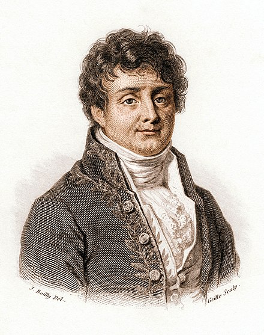
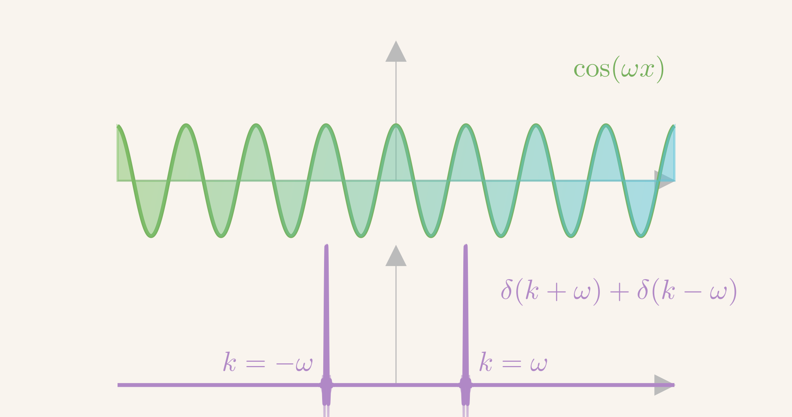
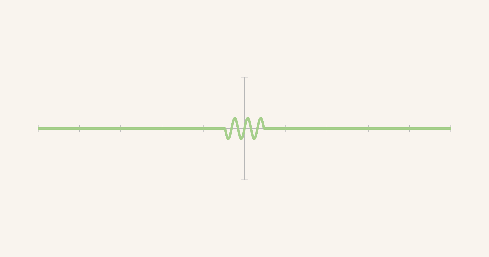
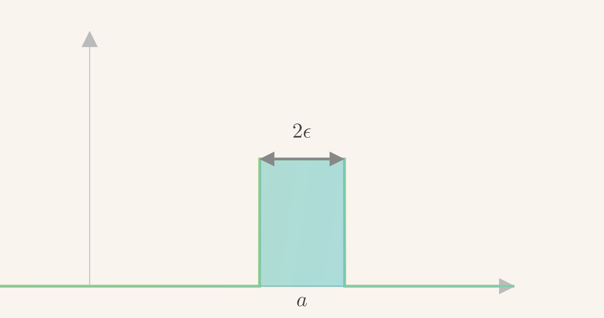
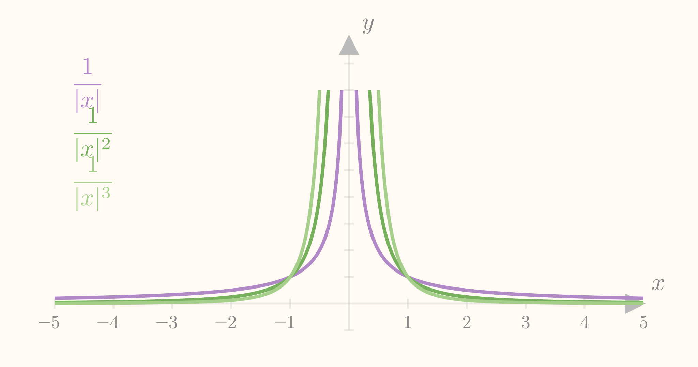
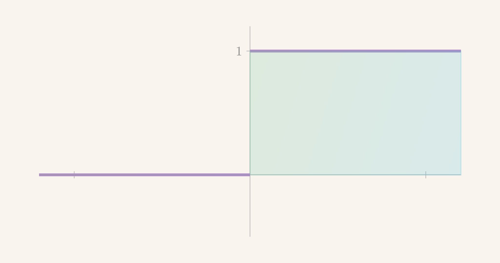
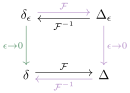
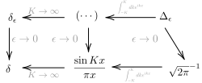

$$
\gdef\red#1{{\color{cb8680}{#1}}} 
\gdef\green#1{{\color{4f8d63}{#1}}} 
\gdef\gray#1{{\color{gray}{#1}}} 
\gdef\purple#1{{\color{B189C6}{#1}}} 
\gdef\orange#1{{\color{dfa04b}{#1}}}
\gdef\white#1{{\color{white}{#1}}}
$$

# 傅里叶变换 (Fourier Transformation)

---
<!-- footer: 第八章：傅里叶变换 -->

# 纲要

- 傅里叶变换
- 无界弦的振动
- $\delta$ 函数
- 无界杆热传导

---

# 
# 傅里叶变换

- 傅里叶级数
- 傅里叶变换
- 傅里叶变换的性质

---
<!-- header: 傅里叶变换 -->

### 函数空间

- 一定区间上的全体函数形成**函数空间**
  

  **<red>粗略**的说法；没有明确边界条件、微分性质
  

* 许多情况下，是个**线性空间**
  

  空间中的一个矢量代表一个函数
  
  无穷维线性空间
  

* 求解偏微分、常微分方程：在空间里面寻找满足条件的矢量
* **<red>如何刻画函数空间？**

---
### 函数空间

- 线性空间：**基底**
* 必备条件：**线性独立性**，**完备性**
  

  空间内的任意矢量都可以用该基底展开，且展开表达式唯一
  

---
### 函数空间

- 泰勒展开：提供 **<green>单项式作为基底 $x^0, x^1, x^2, \cdots$**
  $$
  f(x) = \sum_{n = 0}^{+\infty} \frac{f^{(n)}(0)}{n!} \green{\boldsymbol{x^n}}
  $$
  

  无穷多个基底矢量：无穷维空间
  
  实光滑函数的展开可能 **<red>不收敛为原来函数**
  

---
### 函数空间
- **本征问题**：提供一套满足特定边界条件的 **完备** 基底
  * $[0, \ell]$ 有 $\{\sin \frac{n \pi }{\ell} x\}$、$\{\cos \frac{n \pi}{\ell} x\}$，$\{\sin \frac{(n + 1/2)\pi}{\ell} x\}$, $\cdots$
  * $[0, 2\pi]$ 或者 $[-\pi, \pi]$ 有 $\{\sin nx, \cos nx\}$ 或者 $\{e^{imx}, m \in \mathbb{Z}\}$
    

    $\sin$ 负责**奇**函数，$\cos$ 负责**偶**函数
    

  * $[-\ell, \ell]$ 有 $\{e^{i m \pi x/\ell}, m \in \mathbb{Z}\}$

---

### 函数空间

- **<red>非必备**性质：**正交性、归一性**
* **<red>什么叫正交？什么叫归一？</red>**
* **<red>什么是内积？**

---
### 函数空间

- 例子：**实**线性空间 $\mathbb{R}^n$ 中的内积，
  $$
  (v, w) = \sum_{i=1}^{n} v_i w_i = v_1 w_1 + ... + v_n w_n \in \mathbb{R} \ .
  $$
  

  也称为 **<green>点乘 (dot product)**，**<green>标量积 (scalar product)**
  也可以记为 $\langle v, w\rangle, \quad \langle v|w\rangle, \quad ...$
  

---
### 函数空间

- 例子：**复**线性空间 $\mathbb{C}^n$ 中的内积，
  $$
  (v, w) = \sum_{i=1}^{n} \overline{v_i} w_i = \overline{v_1} w_1 + ... + \overline{v_n} w_n \ .
  $$
  

  模方 $|v|^2 = (v, v) \in \mathbb{R}$
  

* **<red>正交**基底，**<green>归一**基底
  $$
  \red{(e_i, e_j) = \left\{ \begin{array}{cc}
    0 & i \ne j \\
    \ell_i > 0 & i = j
  \end{array}\right.} \ , \qquad  \green{\ell_i = 1} 
  $$

---
### 函数空间
- **<red>如何定义函数之间的内积？** 
* 方法并 **<red>不唯一**：
* 其中一种适用于 $[-\ell, \ell]$ 上的**复值**光滑函数，
  $$
  {\color{green}(f, g)} \coloneqq \int_{-\ell}^\ell \overline{f(x)}g(x) dx \ .
  $$

---
### 傅里叶级数

Joseph Fourier (1768-1830)

---
### 傅里叶级数
- 指数函数 $\{e^{i n \pi x/\ell}\}$ 具有 **完备性</green>**：$[-\ell, \ell]$ 上的连续函数可以用指数函数展开成 **<green>傅里叶级数 (Fourier series)**，
  $$
  f(x) = \sum_{n = - \infty}^{+\infty} \green{f_n} e^{i n \pi x/\ell} \ .
  $$
  其中 **<green>系数 $f_n$** 可以被明确算出，
  $$
  \green{f_n} = \green{\frac{1}{2\ell} \int_{-\ell}^{+\ell} f(\xi) e^{- i n \pi \xi/\ell}d\xi} \ , \qquad \forall n \in \mathbb{Z} \ .
  $$

---
### 傅里叶级数

**周期函数**

$[-\ell, \ell]$ 上的连续函数可以延拓为 $\mathbb{R}$ 上的**周期**函数，同样可以用 $\{e^{i m \pi x/\ell}\}$ 可以对他们进行展开，展开系数跟 $[-\ell, \ell]$ 的结果一样

---
### 傅里叶级数
- **正交性**:
  $$
  (e^{im \pi x/\ell}, e^{in \pi x/\ell}) = 0, \qquad m \ne n \ .
  $$
* **可归一化**：
  $$
  \begin{align*}
    & \ (e^{im \pi x/\ell}, e^{im \pi x/\ell}) = 2 \ell < \infty \ , \\
  \Rightarrow & \ \bigg(\frac{1}{\sqrt{2\ell}} e^{i m \pi x/\ell}, 
  \frac{1}{\sqrt{2\ell}} e^{i m \pi x/\ell} \bigg) = 1 \ .
  \end{align*}
  $$

---
### 傅里叶级数

直接验证**正交性**，考虑 $m \ne n$，
$$
(e^{i n \pi x/\ell}, e^{i m \pi x/\ell})
  = \int_{-\ell}^{+\ell} e^{i (m - n) \pi x/\ell} dx = \frac{\ell}{i\pi} \frac{e^{i (m - n) \pi x/\ell}}{m - n}\bigg|_{-\ell}^{+\ell} = 0
$$
直接验证**可归一化**，考虑 $m = n$，
$$
  (e^{i n \pi x/\ell}, e^{i n \pi x/\ell}) = \int_{-\ell}^{+\ell} dx = 2\ell
$$

--- 
<!-- header: 傅里叶变换 -->

### 傅里叶变换
- **傅里叶变换** $\sim$ $\ell\to +\infty$ 的傅里叶级数：可以对任意 $\mathbb{R}$ 上函数做 (不一定周期性)
* 当 $\ell \to +\infty$，$1/2\ell \to 0$，
  $$
  \begin{align*}
    f(x)
    = & \ \sum_{n = -\infty}^{+\infty} \orange{\frac{1}{2\ell}}
      \green{\bigg[\int_{-\ell}^{+\ell}f(\xi)e^{- i n \pi \xi/\ell}d\xi
      \bigg]} e^{+i n \pi x/\ell} \\
    \sim & \ \sum_{n = -\infty}^{+\infty} \orange{\text{无穷小量}} \times \green{\big[...
      \big](n)} e^{+ i \purple{n \pi} x/\purple{\ell}}
  \end{align*}
  $$
  

  形成 **黎曼积分** 的结构
  

---
### 傅里叶变换

- 考虑**替换**
  $$
  \purple{k_n \coloneqq \frac{n \pi }{\ell}}, \quad
  \Delta k_n = k_{n + 1} - k_n = \frac{\pi}{\ell} , \quad
  \orange{\frac{1}{2\ell} = \frac{\Delta k_n}{2\pi}}
  $$
* 函数的傅里叶展开变成
  $$
  \begin{align*}
    f(x) = & \ \sum_{n = -\infty}^{+\infty} \orange{\frac{1}{2\ell}}
      \green{\bigg[\int_{-\ell}^{+\ell}f(\xi)e^{- i n \pi \xi/\ell}d\xi
      \bigg]} e^{+i \purple{n \pi} x/\purple{\ell}} \\
    = & \ \sum_{n = -\infty}^{+\infty} \orange{\frac{\Delta k_n}{2\pi}}  \green{\big[...\big](k_n)} e^{+i \purple{k_n} x}
  \end{align*}
  $$

---
### 傅里叶变换
- $\ell \to \infty$，拆分 $\red{\frac{1}{2\pi}}$，$k_n \to k$，$\Delta k_n \to dk$，$\red{\frac{1}{\sqrt{2\pi}}}[...](n) \to F(k)$
  $$
  f(x) = \red{\frac{1}{\sqrt{2\pi}}} \int_{-\infty}^{+\infty} dk F(k) e^{+i k x}
  $$
  其中
  $$
  F(k) = \frac{1}{\sqrt{2\pi}} \int_{-\infty}^{+\infty} f(\xi) e^{- i k \xi} d\xi
  $$

---
### 傅里叶变换
- 对任意连续函数 $f(x)$，可以写成平面波 $e^{+ikx}$ 的积分，
  $$
  f(x) = \int_{-\infty}^{+\infty}\frac{dk}{\sqrt{2\pi}}
  F(k) e^{+i k x}
  $$
  **<green>定义** 系数 $F(k)$ 为 $f(x)$ 的 **<green>傅里叶变换**，或称为$f(x)$ 的傅里叶变换 **<green>像函数**
  $$
  \green{F(k) \coloneqq \frac{1}{\sqrt{2\pi}} \int_{-\infty}^{+\infty}f(x)e^{- i k x}dx} \ .
  $$
  $f(x)$ 称为 $F(k)$ 的傅里叶变换 **<green>原函数**

---
### 傅里叶变换
- **<purple>原本 $f(x)$ 的展开**称为傅里叶 **<green>逆变换**：$F(k) \to f(x)$
  $$
  f(x) = \frac{1}{\sqrt{2\pi}} \int_{-\infty}^{+\infty} F(k) e^{i k x}dk 
  $$
* 常用记号
  $$
    f(x) \leftrightarrow F(k)
  $$
  $$
    F = \mathscr{F}[f], \quad f = \mathscr{F}^{-1}[F]
  $$
  $$
    F(k) = \mathscr{F}(f(x)), \qquad f(x) = \mathscr{F}^{-1}[F(k)]
  $$

---

### 傅里叶变换与基底变换

- 正交基底 $\{e_m\}$：$v = \sum_{m} v_m e_m$
* 新正交归一基底 $\{e'_n\}$：$v = \sum_{n} v'_n e'_n$
  

  $$
    e_m = \sum_{m} A_{mn} e'_n, \qquad A_{mn} = (e'_n, e_m) = e'_n \cdot e_m
  $$
  

* 矢量 $v$ 的重新分解
  $$
  \begin{align*}
    v = & \ \sum_{m} v_m \orange{e_m} = \sum_{m} v_m \orange{\sum_{n} (e'_n, e_m) e'_n}\\
  = & \ \sum_{n} \green{\left[{\sum_{m}v_m (e'_n, e_m)}\right]}  e'_n
  = \sum_{n} \green{v'_n} e'_n
  \end{align*}
  $$

---

### 傅里叶变换与基底变换

波函数 $\psi(x)$：坐标基底 $|x\rangle$ 下的**分量**
$$
  |\psi\rangle = \int_{-\infty}^{+\infty} dx \psi(x) |x\rangle
$$
动量基底 $|k\rangle$，
$$
\langle k |x \rangle = e^{-i k x}
$$

---
### 傅里叶变换与基底变换

动量基底下重新展开
$$
\begin{align*}
  |\psi\rangle
= & \ \int_{-\infty}^{+\infty} dx
  \left({\int_{-\infty}^{+\infty} dk |k\rangle \langle k|}\right) \psi(x) | x\rangle\\
= & \ \int_{-\infty}^{+\infty}dk
\green{\left[{\int_{-\infty}^{+\infty}dx \psi(x) \langle k|x\rangle}\right]} |k\rangle\\
= & \ \int_{-\infty}^{+\infty} dk \green{\Psi(k)} |k\rangle
\end{align*}
$$

---
### 傅里叶变换与基底变换

动量基底下的展开系数 (波函数)
$$
\Psi(k) = \int_{-\infty}^{+\infty} dx \psi(x) \langle k|x\rangle
= \int_{-\infty}^{+\infty} dx \psi(x) e^{- i k x}
$$

---
### 高维傅里叶变换

- 可以推广到**多变量**函数 $f(x, y)$、$f(x, y, z)$, $\cdots$
* **二维**傅里叶变换
  $$
  \begin{align*}
    F(k, \ell) \coloneqq & \ \frac{1}{2\pi} \int_{-\infty}^{+\infty}f(x, y) e^{-i (kx + \ell y)} dx dy\\
    f(x, y) \coloneqq & \ \frac{1}{2\pi}\int_{-\infty}^{+\infty} F(k, \ell) e^{i (k x + \ell y)}dk d\ell
  \end{align*}
  $$
  

  多元函数可以选择对其中**一个**或**若干个**变量做傅里叶变换。其中 $2\pi = (\sqrt{2\pi})^2$
  

---
### 高维傅里叶变换

- $f(x, y)$ **先对 $x$** 做傅里叶变换，**再对 $y$** 做傅里叶变换。
  $$
  \tilde F(k, y) = \frac{1}{\sqrt{2\pi}}\int_{-\infty}^{+\infty} f(x, y) e^{-i k x} dx
  $$
* 像函数 $\tilde F(k, y)$ 里 $k$ 看成**参数、常数**。再对 $y$ 做傅里叶变换
  $$
  F(k, \ell) = \frac{1}{\sqrt{2\pi}}\int_{-\infty}^{+\infty} \tilde F(k, y) e^{-i \ell y} dy
  $$

---
### 傅里叶变换的性质

常用积分公式
$$
  \int_{-\infty}^{+\infty} f(x) dx = \int_{-\infty}^{+\infty} f(-x) dx
$$

$$
  \int_{-\infty}^{+\infty} f(x+a) dx = \int_{-\infty}^{+\infty} f(x') d(x'-a)
  = \int_{-\infty}^{+\infty} f(x) dx
$$

---
### 傅里叶变换的性质

- “**厄米性**”：当 $f(x)$ 是**实**函数，则
  $$
  F(-k) = \overline{F(k)}
  $$
  
  

  直接计算，利用 $\overline{f(x)} = f(x)$，
  $$
  \overline{F(k)} = \frac{1}{\sqrt{2\pi}}\int_{-\infty}^{+\infty} f(x) e^{+ i k x} dx
  = F(-k)
  $$
  

---
### 傅里叶变换的性质

- 当 $f(x)$ 是**偶**函数，则 $F(k)$ 也是**偶**函数

  

  直接计算，
  $$
  \begin{align*}
    F(-k) = & \ \int_{-\infty}^{+\infty} f(x) e^{+ i k x} \frac{dx}{\sqrt{2\pi}} \\
    = & \int_{-\infty}^{+\infty} f(-x) e^{- i k x} \frac{dx}{\sqrt{2\pi}}
    = \int_{-\infty}^{+\infty} f(x) e^{- i k x} \frac{dx}{\sqrt{2\pi}} \\
    = & \ F(k)
  \end{align*}
  $$
  

---
### 傅里叶变换的性质

- **实偶性**：当 $f(x)$ 是**实偶**函数，则 $F(k)$ 也是**实偶**函数

  

  直接计算，
  $$
  \begin{align*}
    \overline{F(k)} = & \ \frac{1}{\sqrt{2\pi}}\int_{-\infty}^{+\infty}  f(x) e^{+ i k x} dx \\
    = & \ \frac{1}{\sqrt{2\pi}} \int_{-\infty}^{+\infty} f(-x) e^{- i k x} dx\\
    = & \ \frac{1}{\sqrt{2\pi}} \int_{-\infty}^{+\infty} f(x) e^{- i k x} dx
    = F(k)
  \end{align*}
  $$
  

---
### 傅里叶变换的性质
- **线性性**, $\lambda, \lambda_1, \lambda_2 \in \mathbb{R}$
  $$
  \begin{align*}
    \mathscr{F}[\lambda f] = & \ \lambda \mathscr{F}[f],\\
  \mathscr{F}[\lambda_1 f_1 + \lambda_2 f_2] = & \ \lambda_1 \mathscr{F}[f_1] + \lambda_2 \mathscr{F}[f_2]
  \end{align*}
  $$
  
  

  证明：显然
  

---
### 傅里叶变换的性质

- **微分定理**：如果 $f(\pm \infty) = 0$
  $$
  f'(x) \leftrightarrow (ik) F(k)
  $$
  

  用于把函数**导数**变成**乘积**，把**微分**方程变成**代数**方程
  

---
### 傅里叶变换的性质

微分定理证明：分部积分，
$$
\begin{align*}
  & \ \sqrt{2\pi}\mathscr{F}[f'](k)  = \int_{-\infty}^{+\infty}f'(x)e^{-ikx}dx \\
  = & \ f(x)e^{- i k x}\bigg|_{-\infty}^{+\infty} \red{-} \int_{-\infty}^{+\infty}f(x)(\red{-}ik)e^{-ikx}dx \\
  = & \ 0 + \sqrt{2\pi} ik F(k)
\end{align*}
$$

---
### 傅里叶变换的性质

- **微分定理推论**：如果 $f^{(k = 0, 1, \dots n-1)}(\pm \infty) = 0$，则
  $$
  f^{(n)}(x) \leftrightarrow (ik)^n F(k)
  $$
  

  **导数条件**
  $f^{(k)} = 0$ 均需单独列出：无穷远处函数趋零 **<red>不代表** 彻底躺平
  $$
      f(\pm \infty) = 0 \quad \red{\not \Rightarrow} \quad f^{(1)}(\pm \infty) = 0
  $$
  函数可以在**归零**的同时，以 **<red>越来越高** 的频率震荡
  
  

 

---

### 傅里叶变换的性质

_ManimCE_v0.18.1.png)
$\sin(x^2)/x$ 在 $(200, 201)$ 之间的图像

---

### 傅里叶变换的性质

_ManimCE_v0.18.1.png)

$\sin(x^2)/x$ 在 $(1000, 1000.5)$ 之间的图像

---
### 傅里叶变换的性质 

_ManimCE_v0.18.1.png)

*<purple>Do not go gentle into that good night.*
*<purple>Old age should burn and rave at close of day.*
*<purple>Rage, rage against the dying of the light.*

——Dylan Thomas

---
### 傅里叶变换的性质
- **积分定理**：如果 $\int_{-\infty}^{+\infty}f(x) dx = 0$，则
  $$
  f(x) \leftrightarrow F(k) \quad
  \Rightarrow \quad 
  \int_{-\infty}^x f(\xi)d\xi \leftrightarrow \frac{1}{ik}F(k)
  $$
  

  求导是**乘** $ik$，积分是**除** $ik$
  

---
### 傅里叶变换的性质

**说明**

- 记 $g(x) = \int_{-\infty}^x f(\xi)d\xi$。则 $g'(x) = f(x)$
* 根据题设，$g(-\infty) = 0$；另外显然 $g(+\infty) = 0$
* 设 $g(x) \leftrightarrow G(k)$。则由**微分定理**
  $$
  g'(x)=f(x) \leftrightarrow ik G(k)
  $$
* 但是根据题设，$f(x) \leftrightarrow F(k)$，所以
  $$
  ik G(k) = F(k) \quad \Rightarrow \quad G(k) = \frac{1}{ik} F(k)
  $$

---
### 傅里叶变换的性质
- **延迟定理 (平移变换行为)**：定义 **<green>延迟函数** $\green{f_a(x) \coloneqq f(x - a)}$
  $$
  f(x - a) \leftrightarrow e^{- i k a}F(k)
  $$
  

  
  或者说
  $$
  f(x + a) \leftrightarrow e^{ika}F(k), \qquad
  f(x - a) \leftrightarrow e^{-ika}F(k)
  $$
  

---
### 傅里叶变换的性质

**说明**
- 按定义，
  $$
  \begin{align*}
    F_a(k) = & \ \frac{1}{\sqrt{2\pi}}\int_{-\infty}^{+\infty} f(x - a) e^{-i k x}dx
  \end{align*}
  $$
* 定义 $\green{\boldsymbol{x'} = x - a}$
  $$
  =  \frac{1}{\sqrt{2\pi}} \int_{-\infty}^{+\infty} f(x') e^{-i k (x' + a)}dx'
  = e^{-i k a} F(k)
  $$

---
### 傅里叶变换的性质
- **相似定理 (标度变换行为)**：
  $$
  f(ax) \leftrightarrow \frac{1}{|a|} F\left({\frac{k}{a}}\right)
  $$
  

  **说明**

  **分情况**讨论，$a > 0$，$a < 0$，做个变量替换即可，过程略
  $$
    y = ax, \qquad dy = a dx
  $$
  但是要注意**符号**，当 $a < 0$，
  $$
    \int_{-\infty}^{+\infty} dx = \int_{-\infty}^{+\infty} d\left({\frac{y}{a}}\right)
    = \frac{1}{a} \int_{\red{+\infty}}^{\red{-\infty}} dy
    = - \frac{1}{a} \int_{-\infty}^{+\infty} dy
  $$
  

---
### 傅里叶变换的性质
- 定义 **<green>卷积 (convolution)**
  $$
  \green{(f_1 * f_2)(x) \coloneqq \frac{1}{\sqrt{2\pi}} \int_{-\infty}^{+\infty}f_1(\xi) f_2(x - \xi) d\xi}
  $$
  

  卷积是**对称**的，$f_1 * f_2 = f_2 * f_1$：通过变量替换
  $$
  x - \xi = \xi' \quad \Rightarrow \quad \xi = x - \xi',
  $$
  $$
    \int_{-\infty}^{+\infty} f_1(\xi) f_2(x - \xi) d\xi = \int_{-\infty}^{+\infty} f_1(x - \xi) f_2(\xi) d\xi
  $$
  

---
### 傅里叶变换的性质
- **卷积定理**：
  $$
  (f_1 * f_2)(x) \leftrightarrow F_1(k) F_2(k)
  $$

---
### 傅里叶变换的性质

卷积定理证明。

- 根据卷积的定义，以及傅里叶变换定义
  $$
  \mathscr{F}[f_1 * f_2](k) 
  = \frac{1}{\sqrt{2\pi}}\int_{-\infty}^{+\infty} \bigg[\frac{1}{\sqrt{2\pi}}\int_{-\infty}^{+\infty} f_1(\xi)f_2(x - \xi)d\xi\bigg] e^{-ikx}dx
  $$
* 交换 $dx, d\xi$ 积分顺序，将 $f_1(\xi)$ 移出 $x$ 积分，
  $$
  = \frac{1}{\sqrt{2\pi}}\int_{-\infty}^{+\infty} f_1(\xi) \bigg[\frac{1}{\sqrt{2\pi}}\int_{-\infty}^{+\infty} f_2(x - \xi)e^{-ikx}dx\bigg]d\xi
  $$

---

卷积定理证明。

- <green>定义 $\boldsymbol{x'} = x - \xi$</green>
  $$
  \begin{align*}
    & \ \frac{1}{\sqrt{2\pi}}\int_{-\infty}^{+\infty} f_1(\xi) \bigg[\frac{1}{\sqrt{2\pi}}\int_{-\infty}^{+\infty} f_2(x - \xi)e^{-ikx}dx\bigg]d\xi \\
    = & \ \frac{1}{\sqrt{2\pi}}\int_{-\infty}^{+\infty} f_1(\xi) \bigg[\frac{1}{\sqrt{2\pi}}\int_{-\infty}^{+\infty} f_2(\boldsymbol{\green{x'}})e^{-ik\boldsymbol{\green{x'}}}d\boldsymbol{\green{x'}}\bigg] \purple{e^{-i k \xi}}d\xi \\
    = & \ \frac{1}{\sqrt{2\pi}} \int_{-\infty}^{+\infty} f_1(\xi) F_2(k) e^{-ik\xi}d\xi = F_1(k) F_2(k)
  \end{align*}
  $$

---
### 傅里叶变换的性质

  | 操作 | 傅里叶变换                          |
  | :---: | :-------------------------------------: |
  |  求导 $d/dx$  |       $\times ik$                     |
  |  积分 $\int_{-\infty}^x$  |  $\div ik$                |
  |  平移 $x \to x - a$  | $\times e^{- i k a}$                          |
  |  标度 $x \to ax$  | $k \to k/a, \times \frac{1}{\operatorname{abs}(a)}$ |
  |  卷积  | 乘积 |

---

### 傅里叶变换的几何意义

- $F(0)$ 刻画 $f(x)$ 的 **<green>总量 $/ \sqrt{2\pi}$**
  $$
  F(0) = \frac{1}{\sqrt{2\pi}} \int_{-\infty}^{+\infty} f(x) dx
  $$
* $F(k)$ 刻画 $f(x)$ 的涨落的 **频率分布**
  * $f(x) = \cos \omega x$：$F(k)$ 是 Dirac $\delta(k+\omega) + \delta(k-\omega)$ 函数
  * $f(x) =$ 多个 $\sin \omega x$ 的叠加：$F(k)$ 是个梳子形 Delta 函数
* $F(k)$ 刻画 $f(x)$ 的 **局域化 (localization)** 程度
  * $f(x)$ 的方差 **<red>越大**，$F(k)$ 方差 **<green>越小**

---
### 傅里叶变换的几何意义

---

### 傅里叶变换的几何意义

- 例子：高斯函数、高斯波包
  $$
  f(x) = \frac{1}{\sigma\sqrt{2\pi}} e^{-\frac{x^2}{2 \sigma^2}} \quad \Rightarrow \quad F(k) = \frac{1}{\sqrt{2\pi}} e^{-\frac{\sigma^2}{2} k^2}
  $$
  

  高斯函数的傅里叶变换还是一个高斯函数
  

  
---
### 傅里叶变换的几何意义

<video controls="controls" width="720" src="media/videos/animations/1080p60/FourierOfGaussian.mp4"></video>

高斯函数及其 傅里叶变换

---
### 傅里叶变换的几何意义
- 例子
  $$
  f(x) = \frac{a}{2} e^{- a |x|}, \qquad
  \Rightarrow \qquad
  F(k) = \frac{1}{\sqrt{2\pi}} \frac{a^2}{a^2 + k^2}
  $$
  

  利用积分等式
  $$
    \int_0^{+\infty} e^{-a x} \cos x = \frac{a}{a^2 + 1}
  $$
  

---
### 傅里叶变换的几何意义
  

  <video controls="controls" width="720" src="media/videos/animations/1080p60/FourierOfExponential.mp4"></video>

  $\frac{a}{2} e^{- a |x|}$ 及其 傅里叶变换
  

---

---
<!-- header: 无界弦振动 -->

# 无界弦振动

- 傅里叶变换法
- 行波法

---
### 无界弦振动方程
- 考虑理想的**无穷长**的弦
  

  近似描述**很长**的弦的、**远离**两端的弦体振动，比如中部弦体受局域冲击的初期振动；此时**无穷远边界**为 $u(x = \infty, t) = 0$
  

  

  
  
  

---
### 无界弦振动方程
- 定解问题
  $$
  \begin{align*}
    \frac{\partial^2 u}{\partial t^2} - a^2 \frac{\partial^2 u}{\partial x^2} = & \ 0 \\
    u(t = 0, x) = & \ \varphi(x)
    \qquad
    \frac{\partial u}{\partial t}\bigg|_{t = 0} =  \psi(x)
  \end{align*}
  $$
  

  **<red>省略**边界条件，边界未受冲击，默认
  $$
    u^{(n)}(x = \infty) = 0 
  $$
  

---
### 无界弦振动方程
- 对 $u(x, t)$ 中的 $x$ 坐标进行傅里叶变换
  $$
  u(x, t) \quad \leftrightarrow \quad U(k, t)
  $$
  

  $x$ 是自变量，$t$ 看成一个外参数
  

* 傅里叶变换把 $x$ 的二阶导数变成**乘积** $(ik)^2$
  $$
  \frac{\partial^2 u}{\partial x^2} \leftrightarrow (ik)^2U(k, t)
  $$
  

  使用**微分定理**；$u^{(n)}(x = \infty) = 0$
  

---
### 无界弦振动方程
- 关于 $x$ 的**微分方程**变成 **$k$ 的代数方程**
  

  但还是参数 **<red>$t$ 的常微分方程**
  

  $$
  \begin{align*}
    \frac{d^2 U}{dt^2} + k^2 a^2 U = & \ 0
  \end{align*}
  $$
  

  解是 $\cos kat$，$\sin kat$ 的线性组合
  

---
### 无界弦振动方程

* 对**初始条件**进行傅里叶变换
  $$
  u(x, t = 0) = \varphi(x) \quad \leftrightarrow \quad U(k, t = 0) = \green{\Phi(k)}
  $$
  $$
  \frac{\partial u}{\partial t}\bigg|_{t = 0} = \psi(x) \quad \leftrightarrow \quad \frac{dU}{dt}\bigg|_{t = 0} = \green{\Psi(k)}
  $$

---
### 无界弦振动方程
- 求解 $U(k, t)$ 的常微分方程 + 初始条件
  $$
  U(k, t) = \green{\Phi(k)} \cos (k a t) + \green{\Psi(k)} \frac{\sin(kat)}{ka} 
  $$
  

  
  检验 $U(k, t = 0) = \Phi(k)$，$\frac{d}{dt}U(k, t = 0)=\Psi(k)$
  

---
### 无界弦振动方程
- 但是我们真正关心的是 $U(k, t)$ 的 **<green>原函数 $u(x, t)$**：傅里叶**逆变换**
  $$
  \begin{align*}
    u(x, t) = & \ \int_{-\infty}^{+\infty} \frac{dk}{\sqrt{2\pi}} U(k, t) e^{ikx}\\
    = & \ \int_{-\infty}^{+\infty} \frac{dk}{\sqrt{2\pi}} \green{\Big[\Phi(k) \cos(kat) + \Psi(k) \frac{\sin(kat)}{ka} \Big]} \purple{e^{ikx}} \\
    = & \ \int_{-\infty}^{+\infty} \frac{dk}{\sqrt{2\pi}} \green{T_k(t)} \purple{X_k(x)}
  \end{align*}
  $$
* **<red>似曾相识？**

---
### 无界弦振动方程

- 第 7 章**有界**波动方程的求解：
  $$
  u(x, t) = \sum_{n} T_n(t) X_n(x)
  $$
* 现在
  $$
  u(x, t) = \int \frac{dk}{\sqrt{2\pi}} T_k(t) X_k(x)
  $$

---
### 无界弦振动方程
- 傅里叶变换法 $\Leftrightarrow$ 分离变量法
  

  * 有界 $\rightarrow$ 无界
  * **离散动量** $\frac{n\pi}{\ell} \rightarrow$ **连续动量** $k$
  * 对 $n$ **求和** $\rightarrow$ 对 $k$ **积分**
  

---
### 行波法
- $\cos$ 与 $\sin$ 两项分别完成傅里叶逆变换
* $\cos$ 项 做**傅里叶逆变换**
  $$
  \begin{align*}
    \text{cos term}(x,t) = & \ \int_{-\infty}^{+\infty} \frac{dk}{\sqrt{2\pi}} \Phi(k) \green{\cos(kat)} e^{i k x}\\
    = & \ \int_{-\infty}^{+\infty} \frac{dk}{\sqrt{2\pi}} \Phi(k) \green{\frac{e^{ikat} + e^{- i kat }}{2}} \times e^{i k x}
  \end{align*}
  $$
* $\Phi$ 与 $e^{\pm ikat}$ 乘积的逆变换可以利用**延迟定理**，
  $$
  \text{cos term}(x,t) = \frac{1}{2}\varphi(x + at) + \frac{1}{2}\varphi(x - at)
  $$

---
### 行波法

- $\sin$ 项
  $$
  \begin{align*}
    & \ \int_{-\infty}^{+\infty}\frac{dk}{\sqrt{2\pi}}
  \Psi(k) \frac{\sin(kat)}{ka} e^{ikx}
  = \ \green{\frac{1}{2a}} \int_{-\infty}^{+\infty}\frac{dk}{\sqrt{2\pi}}
  \Psi(k)\frac{e^{i k at} - e^{- i ka t}}{\orange{i k}}e^{ikx}
  \end{align*}
  $$
* 分成两项
  $$
  = \frac{1}{2a}\int_{-\infty}^{+\infty}\frac{dk}{\sqrt{2\pi}}\frac{\Psi(k)e^{ik( at + x)}}{\orange{ik}} - \frac{1}{2a}\int_{-\infty}^{+\infty}\frac{dk}{\sqrt{2\pi}}\frac{\Psi(k)e^{ik(x - a t)}}{\orange{ik}}
  $$
---
### 行波法

- 假设 $\Psi(k) \leftrightarrow \psi(x)$，则
  $$
  \begin{align*}
    \Psi(k) e^{i k (x \pm at)} \ \leftrightarrow & \ \psi(x \pm at) \coloneqq \psi_{\pm at}(x)\\
    \frac{\Psi(k) e^{i k (x \pm at)}}{\orange{ik}} \ \leftrightarrow & \ \int_{-\infty}^x \psi_{\pm at}(\xi) d\xi
  \end{align*}
  $$
  

  延迟定理，积分定理
  

* 积分的上限吸收 $at$
  $$
  \int_{-\infty}^x \orange{\psi_{\pm at}(\xi)} d\xi 
  = \int_{-\infty}^x \orange{\psi(\xi \pm at)}d\xi
  = \int_{-\infty}^{\orange{\boldsymbol{x\pm at}}}\psi(\xi') d\xi'
  $$

---
### 行波法

积分定理需要 $\int_{-\infty}^{+\infty}f(x) dx = 0$。
- 这里 $f(x) = \psi(x + at) - \psi(x - at)$
* 做个变量替换
  $$
  \begin{align*}
    \int_{-\infty}^{+\infty} f(x) dx = & \ \int_{-\infty}^{+\infty} \psi(x + at) dx - \int_{-\infty}^{+\infty} \psi(x - at) dx\\
    = & \ \int_{-\infty}^{+\infty} \psi(x') dx' - \int_{-\infty}^{+\infty} \psi(x') dx'
    = 0
  \end{align*}
  $$

---
### 行波法
- 于是 $\sin$ 项的傅里叶逆变换为
  $$
  \frac{1}{2a} \bigg[\int_{-\infty}^{x + at} - \int_{-\infty}^{x - at} \bigg] \psi(\xi)d\xi
  = \frac{1}{2a}\int_{x - at}^{x + at}\psi(\xi)d\xi
  $$

---
### 行波法

- 总的傅里叶逆变换给出 $u(x, t)$
  $$
  u(x,t) = \frac{1}{2} \big(\varphi(x + at) + \varphi(x - at) \big) + \frac{1}{2a}\int_{x - at}^{x + at}\psi(\xi)d\xi
  $$
  

  此结果也称为 **<green>达朗贝尔 (d' Alembert) 公式**
  

* 左 ($\phi_\text{L}$) 右 ($\phi_\text{R}$) 行波
  $$
  \begin{align*}
    u(x, t) = & \ \green{\boldsymbol{\phi_\text{L}}}(x + at) + \green{\boldsymbol{\phi_\text{R}}}(x - at)  \\
    \green{\boldsymbol{\phi_\text{L/R}(x)}} \coloneqq & \ \frac{1}{2}\bigg(
    \varphi(x) \pm \int_{-\infty}^{x} \frac{\psi(\xi)}{a}d\xi
   \bigg)
  \end{align*}
  $$

---
### 行波法

- 记 $\xi \coloneqq x - at$，$\eta \coloneqq x + at$
  

  如果考虑电磁系统，$a$ 是光速，$\xi, \eta$ 称为 **<green>null coordinates**
  

---
### 行波法

- 重写波动方程
  $$
  \frac{\partial^2u}{\partial t^2} - a^2 \frac{\partial^2 u}{\partial x^2}
  = - 4a^2 \frac{\partial^2 u}{\partial \xi \partial \eta} = 0
  $$
  解为
  $$
  u(\xi, \eta) = \frac{1}{2} \phi_\text{L}(\eta) + \frac{1}{2}\phi_\text{R}(\xi)
  $$
  

  此时还未加入初始条件或者边界条件
  

---
### 行波法

- **初始时刻** $t = 0$：$\xi = \eta = \orange{\boldsymbol{x}}$
* 使用初始条件
  $$
  \begin{align*}
    u(\orange{\boldsymbol{x}}) = & \ \frac{1}{2}\phi_\text{L}(\orange{\boldsymbol{x}}) + \frac{1}{2}\phi_\text{R}(\orange{\boldsymbol{x}}) = \varphi(\orange{\boldsymbol{x}}) \\
    \frac{\partial}{\partial t}\bigg|_{t = 0}u(\orange{\boldsymbol{x}},t) = & \ a \frac{1}{2} \phi'_\text{L}(\orange{\boldsymbol{x}}) - \frac{1}{2}a \phi_\text{R}'(\orange{\boldsymbol{x}}) = \psi(\orange{\boldsymbol{x}})
  \end{align*}
  $$
  求解方程组便得到上述 d' Alembert 公式

---
<!-- header: delta 函数 -->

#
# $\delta$ 函数

- 定义
- 基本性质
- 不同表达式

---
### Dirac $\delta$ 函数

- $\delta$ 用于描述单位质量质点的质量密度
* 单位点电荷的电荷密度
* 点状单位磁通
* 瞬时单位冲量
* 瞬时单位电荷流量

---
### Dirac $\delta$ 函数
- 描述**高度局域化 (localized)** 的密度分布
* 考虑 $x$ 轴上高度集聚的**单位质量**分布：
  $$
  \rho(x) = \green{\boldsymbol{\delta_\epsilon}(x - a)} \coloneqq \left\{\begin{array}{cc}
    \frac{1}{2\epsilon}, & |x - a| < \epsilon\\
    0, & |x - a| > \epsilon
  \end{array}
  \right.
  $$
  

  总质量为 1
  $$
  \int_{-\infty}^{+\infty} \rho(x) dx = \int_{a + \epsilon}^{a - \epsilon}\frac{1}{2\epsilon}dx = 1
  $$
  

---

---
### Dirac $\delta$ 函数

- 考虑质量分布越来越密集：$\epsilon \to 0$，一个**点状 (point like)** 质点，定义 **<green>$\delta$ 函数**
  $$
  \green{\delta(x - a) \coloneqq \lim_{\epsilon \to 0}\delta_\epsilon(x - a) }
  $$
  这个函数称为 **<green>Dirac $\delta$ 函数**
  

  狄拉克在 1927 年的量子力学论文和教科书中引入了 Delta 函数
  

---
### Dirac $\delta$ 函数

* $\delta$ 函数满足关键性质，也是 $\delta$ 的 **<green>启发性定义**，
  $$
  \delta(x - a) = \left\{\begin{array}{cc}
    \infty, & x = a\\
    0, & x \ne a
  \end{array}
  \right., \quad \int_{-\infty}^{+\infty} \delta(x - a) dx = 1
  $$
* 质量为 $m$ 的质点：密度函数为
  $$
  \rho(x) = m \delta(x - a)
  $$

---
### Dirac $\delta$ 函数

<video width="1024" src="media/videos/animations/1080p60/LocalizedDensity.mp4" controls>
</video>

---
### Dirac $\delta$ 函数

- $\delta$ 函数 **<red>不是** 普通的 $\mathbb{R}$ 上函数
  

  $x = a$ 是 $\delta(x - a)$ 的定义域内的点，其值是无穷大
  

---
### Dirac $\delta$ 函数
* $\delta$ 函数属于 **<green>广义函数 (generalized function)/分布 (distribution)** 
  - 作为普通函数序列的极限
  - 作为积分的核、与测试函数 (test function) 配合，给出 **<green>第二定义**
    $$
    \green{\int_{-\infty}^{+\infty} f(x) \delta(x - a) dx = f(a), \qquad  \forall f: \mathbb{R}\to \mathbb{R} }
    $$
    

    即 $\delta(x - a) dx$ 定义为一种 **<red>奇异** 的**测度 (measure)**
    

---
### Dirac $\delta$ 函数

第二定义来自 $\delta$ 的极限定义，$\delta(x) \coloneqq \lim_{\epsilon \to 0}\delta_\epsilon(x)$，
$$
\int_{-\infty}^{+\infty} f(x) \delta(x - a) dx
\coloneqq \lim_{\epsilon \to 0}\int_{-\infty}^{+\infty} f(x) \delta_\epsilon(x - a) dx
= f(a)
$$

---
### 高维/多自变量 Dirac $\delta$ 函数

- 可以直接地推广到高维情况
  $$
  \int_{- \infty}^{+\infty} \delta^{(n)}(\vec x - \vec a) f(\vec x) d^n x = f(\vec a)
  $$
  或者使用坐标 $(x_1, ..., x_n)$
  $$
  \delta^{(n)}(\vec x - \vec a) = \prod_{i = 1}^n \delta(x_i - a_i)
  $$

---
### $\delta$ 函数的基本性质

- **归一化**
  $$
  \int_{- \infty}^{+\infty} \delta(x - a) dx = 1
  $$
* **定理**：若 $f$ **连续**，则
  $$
  f(x)\delta(x - a) = f(\orange{a}) \delta(x - a)
  $$
  

  证明。乘以任意测试函数 $g$，积分，
  $$
  \int_{-\infty}^{+\infty} \orange{f(x)\delta(x - a)} g(x) dx
  = f(a) g(a) = \orange{f(a)} \int_{-\infty}^{+\infty} \orange{\delta(x - a)} g(x) dx
  $$
  

---
### $\delta$ 函数的基本性质
- **推论**：当 $f(x) = |x|^a$, $a > 0$
  $$
  |x|^a \delta(x) = |x|^a|_{x = 0}\delta(x) = 0, \qquad \forall x \in \mathbb{R}
  $$
  

  证明：乘以任意测试函数积分即可
  

  

  $|x|^a \delta(x) = 0$ 说明 $\delta(x)$ 奇性非常**弱**
  

---
### $\delta$ 函数的基本性质

**对比**

选择 $a = 2$，考察几个简单奇性函数
$$
\lim_{x \to 0}|x|^{2} \frac{1}{|x|} = 0, \qquad
\lim_{x \to 0}|x|^{2} \frac{1}{|x|^2} = 1, \qquad
\lim_{x \to 0}|x|^{2} \frac{1}{|x|^3} = \infty
$$
奇性排行
$$
\delta(x) < ... < \frac{1}{|x|} < \frac{1}{|x|^2} < \frac{1}{|x|^3} < ...
$$

---

### $\delta$ 函数的基本性质

---
### $\delta$ 函数的基本性质
- $\delta(x) = \delta(-x)$，是**偶函数**
  

  证明：乘以任意测试函数积分即可
  

---
### $\delta$ 函数的基本性质
* 对于 $a \in \mathbb{R}_{\ne 0}$，$\delta(ax) = \frac{1}{|a|} \delta(x)$

  

  * 证明，考虑任意测试函数 $f$，以及 **<purple>$a > 0$**，$|a| = a$
    $$
      \int_{-\infty}^{+\infty} \delta(\green{ax})f(x) dx
      = \frac{1}{a} \int_{\purple{\boldsymbol{-\infty}}}^{\purple{\boldsymbol{+\infty}}} \delta(\green{x'}) f(x'/a) dx'
      = \frac{1}{a} \green{f(0)}
    $$
  * 于是有恒等式
    $$
    \int_{-\infty}^{+\infty} \delta(ax) f(x) dx
    = \frac{1}{a} f(0)
    = \int_{-\infty}^{+\infty} \green{\frac{1}{a} \delta(x)}f(x) dx
    $$
  

---
### $\delta$ 函数的基本性质
* 对于 $a \in \mathbb{R}_{\ne 0}$，$\delta(ax) = \frac{1}{|a|} \delta(x)$

  

  * 由于 $f$ 是**任意**的，因此
    $$
    \delta(ax) = \green{\frac{1}{a}\delta(x)} = \frac{1}{|a|} \delta(x)
    $$
  * 对于 **<red>$a < 0$** 也类似证明，
    $$
    \int_{-\infty}^{+\infty}\delta(\green{ax}) f(x)dx = \frac{1}{a} \int_{\red{\boldsymbol{+\infty}}}^{\red{\boldsymbol{- \infty}}} \delta(\green{x'})f(x'/a)dx' = - \frac{1}{a}f(0)
    $$
  

---
### $\delta$ 函数的基本性质
* 对于 $a \in \mathbb{R}_{\ne 0}$，$\delta(ax) = \frac{1}{|a|} \delta(x)$

  

  * 或者利用**偶函数性** $\delta(x) = \delta(-x)$，当 $a < 0$
    $$
    \delta(a x) = \delta(-|a|x) = \delta(|a|x) = \frac{1}{|a|} \delta(x)
    $$
  

---
### $\delta$ 函数的几种表达式

“……回字有四样写法，你知道么？”

——孔乙己 

* 回、囘、囬、外“囗”内“目” **<orange><reveal>、佪、廻、廽、迴、逥</reveal>**

---
### $\delta$ 函数的几种表达式
- $\delta$-函数有 **<red>非常多** 不同的表达式
  

  
  大有用处 ~~比如考试~~
  

* 先列举，再简单「论证」

---
### $\delta$ 函数的几种表达式

- **平面波**积分/傅里叶变换表达式
  $$
  \delta(x) = \frac{1}{2\pi} \int_{-\infty}^{+\infty} e^{i k x} dx
  $$
  

  即 $\delta$ 函数是**常函数 $1/\sqrt{2\pi}$** 的**傅里叶变换**：
  * 常函数 **<red>方差无限大**，傅里叶变换像函数 **方差无限小**；
  * 常函数只有**零频率** $\omega_0 = 0$，傅里叶变换只在 $k = \omega_0$ 有无穷高峰
  * 常函数总量**无穷**：原函数 $\delta(0) = \infty$
  

---
### $\delta$ 函数的几种表达式
- **三角函数**极限表达式
  $$
  \delta(x) = \lim_{K \to +\infty} \frac{\sin Kx}{\pi x}
  $$
  

---
### $\delta$ 函数的几种表达式

<video width="750"  src='media/videos/animations/1080p60/DeltaFunctionTrigonometric.mp4' controls></video>
高度震荡函数

* **<red>这函数像 $\delta$ 函数吗？**

---
### $\delta$ 函数的几种表达式

  
**逐点收敛**

*没有说右边 **<red>逐点收敛** 到左边，没有任何这个意思。但是你问数学家……对这个等号支持不支持，数学家说 **<green>支持**：* 利用 **<purple>Riemann-Lebesgue Lemma**
$$
\lim_{K \to +\infty} \int_{-\infty}^{\infty} \left( \frac{\sin Kx}{\pi x} \right) g(x) dx = g(0), \qquad \forall g
$$

---
### $\delta$ 函数的几种表达式

- **高斯**函数极限
  $$
  \delta(x) = \lim_{\sigma \to +0} \frac{1}{\sqrt{2\pi}\sigma} e^{ - \frac{x^2}{2\sigma^2}}
  $$
* Lorentz 分布极限
  $$
  \delta(x) = \lim_{\rho \to +0} \frac{\sigma}{\pi(x^2 + \sigma^2)}
  $$

---
### $\delta$ 函数的几种表达式
- Heaviside 阶梯函数 $\theta(x)$ 的**导数**
  $$
  \delta(x) = \theta'(x), \qquad \theta(x) = \left\{ \begin{array}{cc}
    1, & x \ge 0\\
    0, & x < 0
  \end{array}
  \right.
  $$
  

  反过来，
  $$
  \theta(x) = \int_{-\infty}^x \delta(x') dx'
  $$
  

---

### $\delta$ 函数的几种表达式

Heaviside 阶梯函数 $\theta(x)$

---
### $\delta$ 函数的几种表达式

<video width="720" src='media/videos/animations/1080p60/DeltaFunctionHeavisideTheta.mp4' controls></video>

用双曲正切函数逼近 Heaviside 阶梯函数及其导数

---
### $\delta$ 函数的几种表达式

###

**平面波积分表达式的证明**

- $\delta(x)$ 是 $\delta_\epsilon(x)$ 的小 $\epsilon$ 极限
* $\delta$ 的**傅里叶像函数**应该是 $\delta_\epsilon$ **傅里叶像函数**的小 $\epsilon$ 极限 (大概)

  

  
  
  

---
### $\delta$ 函数的几种表达式

- $\delta_\epsilon(x)$ 的傅里叶**变换** **<green>像函数 $\Delta_\epsilon(x)$**
  $$
  \begin{align*}
    \Delta_\epsilon(k)
  = & \ \int_{-\infty}^{+\infty} \frac{dx}{\sqrt{2\pi}}\purple{\delta_\epsilon(x)}e^{-ikx}
  =  \frac{1}{2\epsilon} \int_{\purple{-\epsilon}}^{\purple{+\epsilon}} \frac{dk}{\sqrt{2\pi}} \purple{1} \cdot e^{-i k x}\\
  = & \ \frac{1}{2\epsilon}\frac{i e^{- i kx}}{\sqrt{2\pi}k} \bigg|_{-\epsilon}^{+\epsilon}
  = \frac{i}{\sqrt{2\pi} k\epsilon} (e^{ - i k \epsilon} - e^{i k \epsilon})
  = \frac{1}{\sqrt{2\pi}} \frac{\sin(k \epsilon)}{k\epsilon}
  \end{align*}
  $$

---
### $\delta$ 函数的几种表达式

- **假设** $\lim_{\epsilon \to 0}$ 与傅里叶逆变换可以**交换**：先做 $\epsilon \to 0$
  $$
  \begin{align*}
    & \ \lim_{\epsilon \to 0} \Delta_\epsilon(k) = \lim_{\epsilon \to 0}\frac{1}{\sqrt{2\pi}} \frac{\sin (k \epsilon)}{k\epsilon}
    = \orange{\frac{1}{\sqrt{2\pi}}}
  \end{align*}
  $$
* 再做傅里叶逆变换
  $$
  \delta(x) = \lim_{\epsilon \to 0} \delta_\epsilon(x)
  = \frac{1}{\sqrt{2\pi}}\int_{-\infty}^{+\infty} \orange{\frac{1}{\sqrt{2\pi}}} e^{+ i k x} dk
  = \frac{1}{2\pi} \int_{-\infty}^{+\infty} e^{ikx} dk
  $$

---
### $\delta$ 函数的几种表达式

**三角函数表达式粗略理解**

- 积分归一 (回忆第五章)，**<red>与 $K$ 无关**
  $$
  \int_{-\infty}^{+\infty} \frac{\sin(Kx)}{\pi x} dx = 1
  $$
* $\sin(Kx)/\pi x$ 的零点
  $$
  \sin(Kx) = 0 \quad \Rightarrow \quad x = n\pi/K, \quad n \in \mathbb{Z}
  $$
* 当 $K \to +\infty$，零点分布**越来越密**

---
### $\delta$ 函数的几种表达式

**三角函数表达式粗略理解**

  

---
### $\delta$ 函数的几种表达式

**三角函数表达式粗略理解**

---
### $\delta$ 函数的几种表达式

**三角函数表达式粗略理解**

---

### $\delta$ 函数的几种表达式

**三角函数表达式粗略理解**

- 利用 $\delta_\epsilon(x)$ 的**傅里叶** **<red>逆变换**，
  $$
  \begin{align*}
    \delta_\epsilon(x) = & \ \int_{-\infty}^{+\infty} \frac{dk}{\sqrt{2\pi}} \Delta_\epsilon(k) e^{i k x}
    = \purple{\lim_{K \to \infty}} \int_{-K}^{+K}\frac{dk}{\sqrt{2\pi}} \Delta_\epsilon(k) e^{i k x}
  \end{align*}
  $$
  先做 $K$ 极限，再做 $\epsilon$ 极限 
* 假设 $\epsilon \to 0$ 与 $K \to +\infty$ **极限交换**，则
  $$
  \delta(x) = \lim_{\epsilon \to 0}\delta_\epsilon(x)
  = \purple{\lim_{K \to \infty}} \int_{-K}^{+K} \frac{dk}{\sqrt{2\pi}} \orange{\lim_{\epsilon \to 0} \Delta_\epsilon(k)} e^{i k x}
  $$

---
### $\delta$ 函数的几种表达式

- 定积分可以直接计算，
  $$
  \delta(x)
  = \lim_{K \to \infty} \int_{-K}^{+K} \frac{dk}{\sqrt{2\pi}} \orange{\frac{1}{\sqrt{2\pi}}} e^{i k x}
  = \lim_{K \to \infty} \frac{\sin(Kx)}{\pi x}
  $$

---
### $\delta$ 函数的几种表达式

**概率分布极限表达式证明**
* 率密度函数 (方差为 $\sigma$ )的归一化保证了
  $$
  \int_{-\infty}^{+\infty} \delta(x) dx = \lim_{\sigma \to 0} \int_{-\infty}^{+\infty} \rho_\sigma(x) dx = 1
  $$
* 当概率分布宽度 $\sigma \to 0$,
  $$
  \lim_{\sigma \to 0}\rho_\sigma(x) = 0, \qquad x \ne 0
  $$
* $\rho_\sigma$ 峰值一定趋于**无穷**，于是得到 $\delta$ 函数。

---

### $\delta$ 函数的几种表达式

**阶梯函数导数表达式证明**

- 几乎处处为**零**：$\theta'(x) = 0, \quad x \ne 0$
* 峰值**无穷**
  $$
  \theta'(x = 0) = \lim_{\Delta x \to 0} \frac{1 - 0}{\Delta x} = \infty
  $$
* 满足**归一化**
  $$
  1 = \theta(+\infty) - \theta(-\infty)
  = \int_{-\infty}^{+\infty} \theta'(x) dx
  $$

---

### $\delta$ 函数的导数

- **<green>定义**：$\delta'$ 是**广义函数**，需配合测试函数 (test function) $f$ 使用/定义
  $$
  \int f(x) \delta'(x - a)dx = - \int f'(x) \delta(x - a) dx = - f'(a)
  $$
  

  分部积分，以及 $\delta(\pm \infty) = 0$
  此关系用作 $\delta'(x - a)$ 的定义
  

---
### $\delta$ 函数的导数

* $\delta'$ 基本性质
  * 奇函数：$\delta'(x) = - \delta'(-x)$
    

    
    偶函数的导数是奇函数
    

  * $x \delta'(x) = - \delta(x)$
* $\delta$ 函数的高阶导数也是**广义函数**，**<green>定义**为
  $$
  \int f(x) \delta^{(n)}(x - a) dx = (-1)^n f^{(n)}(a)
  $$

---
<!-- header: delta 函数 -->

#
# 无界杆热传导

- 有源
- 无源

---
### 一维无界空间的热传导方程求解

- 考虑无穷长理想导热细杆的**有源**热传导方程
  $$
  \begin{align*}
    \frac{\partial u}{\partial t} - a^2 \frac{\partial^2 u}{\partial x^2} = & \ f\\
    u(t = 0, x) = & \ \varphi(x)
  \end{align*}
  $$
  

  $f$ 是体热源，$\varphi$ 是初始条件，均为 $x$ 的函数
  $~$
  默认边界条件 $u(x = \infty) = 0$
  

---
### 一维无界空间的热传导方程求解
- 难点：方程 **<red>非齐次**，初始 **<red>非齐次**
  

  把两个困难**分开**，**逐一攻破**
  

---
### 一维无界空间的热传导方程求解
- 分解为两个**简化问题**：有源+齐次初始，以及，无源+非齐次初始
* 无源 + 非齐次初始
  $$
  \frac{\partial u}{\partial t} - a^2 \frac{\partial^2 u}{\partial x^2} = 0, \qquad
    u(x, t = 0) =  \varphi(x)
  $$
* 有源 + 齐次初始
  $$
    \frac{\partial u}{\partial t} - a^2 \frac{\partial^2 u}{\partial x^2} = f\qquad
    u(t = 0, x) = 0
  $$
* **完整解就** 是两个子问题的解的 **和**

---
### 一维无界空间的热传导方程求解：无源 + 非齐次初始

- 对所有东西做傅里叶变换：$u(x, t) \leftrightarrow U(k, t)$，$\varphi(x) \leftrightarrow \Phi(k)$
  $$
  \begin{align*}
    \frac{dU}{dt} + k^2 a^2 U = 0, \quad U(k, t = 0) = \orange{\Phi(k)}
    \quad \Rightarrow  U(k, t) = \orange{\Phi(k)} e^{- k^2 a^2 t}
  \end{align*}
  $$
* 逆变换
  $$
  \varphi(x)\leftrightarrow\Phi(k), \qquad
  \red{\frac{1}{a \sqrt{2t}} e^{-\frac{x^2}{4a^2 t} } \leftrightarrow e^{- k^2 a^2 t} }
  $$

* $u(x,t)$ 是一个**卷积**
  $$
  u(x, t) = \frac{1}{2a \sqrt{\pi t}} \int_{-\infty}^{+\infty} \varphi(\xi) e^{ - \frac{(x - \xi)^2}{4a^2 t}} d\xi
  $$
  
---
### 一维无界空间的热传导方程求解：无源 + 非齐次初始

其中 $e^{-k^2 a^2 t}$ 的逆变换计算
$$
\begin{align*}
\frac{1}{\sqrt{2\pi}} \int_{-\infty}^{+\infty} dk e^{-k^2 a^2 t}e^{ikx} \\
\gray{(\sin \text{部分积分为零})}\qquad 
= & \
\int_{-\infty}^{+\infty} \frac{dk}{\sqrt{2\pi}} e^{-k^2 a^2 t} \cos (kx) 
= \frac{1}{a\sqrt{2t}} e^{-\frac{x^2}{4a^2 t}}
\end{align*}
$$

用到积分公式
$$
\int_{-\infty}^{+\infty} dk e^{- A k^2} \cos Bk = \frac{1}{2} \sqrt{\frac{\pi}{A}} e^{- \frac{B^2}{4A}}, \qquad \forall A > 0
$$

---

### 一维无界空间的热传导方程求解：无源 + 非齐次初始

- 总结：无源 + 非齐次初始解
  $$
  u(x, t) = \frac{1}{2a \sqrt{\pi t}} \int_{-\infty}^{+\infty} \varphi(\xi) e^{ - \frac{(x - \xi)^2}{4a^2 t}} d\xi
  $$
* 特殊的例子：**高度局域化**的初始分布 $\varphi(x) = \delta(x - x_0)$
  $$
  u(x, t)
  = \frac{1}{2a \sqrt{\pi t}} \int_{-\infty}^{+\infty} \delta(\xi - x_0) e^{-\frac{(x - \xi)^2}{4a^2 t}} d\xi
  = \frac{1}{2a \sqrt{\pi t}} e^{-\frac{(x - x_0)^2}{4a^2 t}}
  $$
  

  $t$ 增大，宽度增大，热量向外传播
  
  $u(x, t)$ 对 $x$ 的积分 **<red>与时间 $t$ 无关**：**能量守恒**
  

---
### 一维无界空间的热传导方程求解：有源 + 齐次初始

- 有源问题 + 齐次初始
  $$
  \frac{\partial u}{\partial t} - a^2 \frac{\partial^2 u}{\partial x^2} = f(x, t) , \qquad 
  u(x, t = 0) = 0
  $$
* 对所有 $x$ 的函数**傅里叶变换**，$u(x, t) \leftrightarrow U(k, t)$，$f(x, t) \leftrightarrow F(k, t)$
  $$
  \frac{dU}{dt} + k^2 a^2 U = F(k,t), \qquad U(k, t = 0) = 0
  $$
* 一阶 **<red>非齐次** 线性常微分方程
  $$
  U(k, t) = \int^t d\orange{\boldsymbol{\tau}} F(k, \orange{\boldsymbol{\tau}}) e^{-k^2 a^2 (t - \orange{\boldsymbol{\tau}})}
  $$

---
### 一维无界空间的热传导方程求解：有源 + 齐次初始

* 直接求导验证
  $$
  \begin{align*}
    \frac{d}{dt} \orange{\int^t d\tau F(k, \tau) e^{-k^2 a^2 (t - \tau)}}
    = & \ F(k, \tau) e^{- k^2 a^2 (t - \tau)}\bigg|_{\tau = t} -k^2 a^2 \orange{\int^t F(k, \tau)e^{- k^2 a^2 (t - \tau)}d\tau}\\
    = & \ F(k, \tau) - k^2 a^2 \orange{\int^t F(k, \tau)e^{- k^2 a^2 (t - \tau)}d\tau}
  \end{align*}
  $$
* 移项
  $$
  \left({\frac{d}{dt} + k^2 a^2}\right) \int^t d\tau F(k, \tau) e^{-k^2 a^2 (t - \tau)} = F(k, t)
  $$

---
### 一维无界空间的热传导方程求解：有源 + 齐次初始

- 初始条件
  $$
  U(k, t = 0) = 0
  $$
  确定 $U(k,t)$ **积分下限**
  $$
  U(k, t) = \int_\red{\boldsymbol 0}^t d\tau F(k, \tau) e^{-k^2 a^2 (t - \tau)}
  $$

---
### 一维无界空间的热传导方程求解：有源 + 齐次初始

- 傅里叶逆变换
  $$
  u(x, t) = \frac{1}{\sqrt{2\pi}} \int dk \orange{U(k,t)} e^{ikx}
  = \frac{1}{\sqrt{2\pi}} \int dk \orange{\left[{\int_0^t d\tau F(k, \tau) e^{-k^2 a^2 (t - \tau)}}\right]} e^{ikx}
  $$
* 交换 $k, \tau$ 积分顺序
  $$
  \begin{align*}
    u(x, t) = & \ \int_0^t d\tau \green{\frac{1}{\sqrt{2\pi}} \int dk \left[{F(k, \tau) e^{-k^2 a^2 (t - \tau)}}\right] e^{ikx}}\\
    = & \ \int_0^t d\tau
    \green{\int d\xi f(\xi, \tau) \frac{e^{-\frac{(x - \xi)^2}{4a^2 (t - \tau)}}}{\sqrt{4\pi a^2 (t - \tau)}}}
  \end{align*}
  $$

---

### 一维无界空间的热传导方程求解：有源 + 齐次初始

计算 $dk$ 积分。

* 积分
  $$
  \frac{1}{\sqrt{2\pi}} \int dk \left[\purple{F(k, \tau) e^{-k^2 a^2 (t - \tau)}}\right] e^{ikx}
  $$
  是对 **<purple>$F(k, \tau)$ 与 $e^{-k^2 a^2 (t - \tau)}$ 的乘积**傅里叶逆变换，因此必然是**各自傅里叶逆变换**的**卷积**。

---

### 一维无界空间的热传导方程求解：有源 + 齐次初始

* 首先，
  $$
  F(k, \tau) \leftrightarrow f(x, \tau)
  $$
* 其次，$e^{-k^2 a^2 (t - \tau)}$ 的**傅里叶逆变换**是
  $$
  \int \frac{dk}{\sqrt{2\pi}} e^{-k^2 a^2 (t - \tau)} e^{ikx} = \frac{1}{\sqrt{2 a^2 (t - \tau)}} e^{-\frac{x^2}{4a^2 (t - \tau)}}
  $$
* 两个逆变换的**卷积**
  $$
  \frac{1}{\sqrt{2\pi}}\int d\xi f(x, \tau) \frac{e^{-\frac{(x - \xi)^2}{4a^2 (t - \tau)}}}{\sqrt{2 a^2 (t - \tau)}}
  $$

---
### 一维无界空间的热传导方程求解

- 最后把两个问题的解加起来即可