$$
\gdef\red#1{{\color{cb8680}{#1}}} 
\gdef\green#1{{\color{4f8d63}{#1}}} 
\gdef\gray#1{{\color{gray}{#1}}} 
\gdef\purple#1{{\color{B189C6}{#1}}} 
\gdef\orange#1{{\color{dfa04b}{#1}}}
\gdef\white#1{{\color{white}{#1}}}
\gdef\blue#1{{\color[rgb]{0.20, 0.43, 0.75}{#1}}}
\gdef\yellow#1{{\color[rgb]{0.984375, 0.9140625, 0.62109375}{#1}}}
$$

# 复数基础

---

### 课程概况

* 这是一门 **数学课**：核心是数学，但是处处渗透物理思想
* 同时也是一门 **语言课**：学会用复数说话，用方程描述物理规律，用特殊函数刻画物理状态与状态的演化

---

### 课程概况

* 数学是一门独立的、有内在生命力、独特价值评价体系的学科

  

  **数学不只是工具**

  数学为物理提供工具，但数学 **<red>不仅仅** 是物理的工具。
  

* 数学是物理的 **语言**：没有数学，物理学家难以进行精确表达思想和传递信息

  

  **普世语言**

  甚至可能是整个多重宇宙中所有智慧生物的普世语言。
  

---

### 课程概况

* 反过来，物理也可以为数学反哺许多新奇的思想和生成数学结构

  

  **来自物理的反作用**

  广义相对论与微分几何，散射振幅与代数几何，杨-米尔斯理论与微分拓扑，超对称与算子代数、代数簇
  

---

### 课程概况

* 《数学物理方法》是众多后续课程和科研的基石
* 电动力学、量子力学：数理方程的求解

  统计力学：复变函数、级数、积分技巧

  量子场论：复变函数、积分技巧、数理方程的求解

  广义相对论：数理方程的求解

  通信与信息技术：傅里叶级数、傅里叶变换，$\delta$ 函数
* 现代理论物理可能需要远超本课程所涵盖的内容：微分与代数几何、抽象代数结构、复杂微分方程

---

### 课程概况

* 《数学物理方法》：主要介绍**两个**基本要素
  * 复数与复变函数
  * 数理方程与特殊函数 (作为数理方程的解)

---

### 课程概况

课程主页

- 助教：张锦鹏同学
- 平时成绩 (期中考察、课堂表现、考勤、作业情况) 40%；期末成绩 60%

---

### 本章概要

* 回顾数的概念与历史

* 复数

  <gray>复数、复数的表示方法、复数的性质</gray>
* 点集基础

  <gray>内点、边界点、聚点、特殊点集</gray>
* 解析函数

  <gray>复可导性、Cauchy-Riemann 条件、多值函数与支点</gray>

---

# 数的概念与历史

---

### 自然数

* 自然数 (natural numbers)，$\mathbb{N}$
  $$
  \orange{0}, 1, 2, 3, 4, \ldots
  $$
  

  
  从**零**开始
  

* 用于标记现实物体、事件的数量

---

### 自然数

* 原始社会用 **绳结** 计数

  

  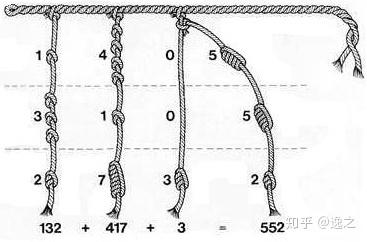

  *印加文明的记事绳结：奇普 (khipu)*

  

---

### 自然数

* 古埃及和巴比伦、古中国、古印度文明逐步出现 **书写符号** 来计数，包括阿拉伯数字

  

  

  *古埃及的数字符号 (一划，马蹄，绳索，睡莲，弯曲的手指，青蛙，Heh)*
  

---

### 自然数

* 现代社会发展出「正」字计数法

  

  

    
    
  

  

---

### 整数

* 整数 (integers, "whole" in Latin)，$\mathbb{Z}$
  $$
  \ldots, -5, -4, -3, -2, -1, 0, 1, 2,3,4,5 , \ldots
  $$

  

  
  

---

### 整数

* 出现在一些早期文明中：古中国、古印度、古希腊
  

  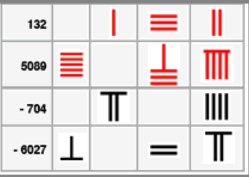 
  

* 比较明确地提出整数的概念：毕达哥拉斯学派、欧几里得等学者

---

### 有理数

* 有理数 (rational numbers)，$\mathbb{Q}$
  $$
  - \frac{3}{4}, \quad \frac{2021}{2022}, \quad \frac{2333}{666}, \quad - 3.1415926, \quad 4 , \quad \ldots \ .
  $$
* 古希腊和印度科学家对有理数进行研究

---

### 无理数

* 无理数 (irrational numbers)
  $$
  e, \qquad \pi, \qquad \sqrt{2}, \qquad \sqrt{3}, \qquad \ldots
  $$

---

### 无理数

* 毕达哥拉斯学派的数学家 Hippasus 提出 **<red>$\sqrt{2}$** 是一种之前没有研究过的数：**无理数**。
  毕达哥拉斯认为"*<purple>数是绝对的、万物皆数 (all is number)*"，拒绝接受无理数的存在，对 Hippasus 处以 **<red>死刑** (推海里淹死)。

  

  
  
  

* 公元前一世纪左右，《九章算术》记载了开方运算中出现的无理数

---

### 无理数

* 在 16 世纪的欧洲，人们逐渐接受 **负数**、**分数**，到 18、19 世纪人们以 **<green>代数数** 和 **<green>超越数** 两种角度思考和研究无理数。

  

  **代数数**

  即**整系数**多项式的根；超越数即为 **<green>非代数数**
  

* 18, 19世纪数学家 Lambert、Legendre、Weierstrass、Cantor、Dedekind 等都对无理数进行深入的研究

---

### 实数

* 实数 (real numbers), $\mathbb{R}$：有理数与无理数的并集
* 中世纪时，阿拉伯数学家提出实数的概念
* "实 (real)"来自 17 世纪的笛卡尔

  

  **实根与虚根**

  17 世纪的数学家已经在研究代数方程根，分为实根 (real roots) 和虚根 (imaginary roots)
  

---

### 实数

* 有理数和无理数密密麻麻 **无缝** 形成实数轴 (real line)

  

  
  
  

  

  **拓扑**

  "密密麻麻、无缝"是一种**拓扑**概念
  

---

### 实数

* 实数及其加、乘运算满足基本**代数性质**：对任意 $a, b \in \mathbb{R}$
  * 加法 **交换** 律 $a + b = b + a$，**结合** 律 $(a + b) + c = a + (b + c)$
  * 乘法 **交换** 律 $a \cdot b = b a$，**结合** 律 $(a \cdot b) \cdot c = a \cdot (b \cdot c)$
  * 加乘 **分配** 律：$a \cdot (b + c) = a \cdot b + a \cdot c$
  * 加法有 **<green>单位元** $0 \in \mathbb{R}$：$0 + a = 0 + a = a$
  * 乘法有 **<green>单位元** $1 \in \mathbb{R}$：$1 \cdot a = a \cdot 1 = a$
  * 乘法有 **零** 元 $0$：$a \cdot 0 = 0 \cdot a = 0$
  * 加法有 **<green>逆元** $- a$：$(-a) + a = 0$
  * 当 $a \ne 0$，乘法有 **<green>逆元** $a^{-1}$：$a^{-1} \cdot a = 1$

---

# 复数

---

### 复数

* 问题一：非常简单的实 (整) 系数代数方程 $x^2 + 1 = 0$ 是否有解？
  > 为什么有的方程“有解”，有的方程“无解”
* 问题二：是否有别的**非实数**的东西满足上面这些**代数性质**？
* 目标：扩充实数，使得
  * A: 使得实方程 $x^2 + 1 = 0$ 有解
  * B: 维持实数的代数性质

---

### 复数

* 定义 **<green>虚数单位 (imaginary unit) $i$**，实现目标 A

  $$
  \boxed{ \ i^2 + 1 = 0 \ }
  $$

  

  **虚数单位**

  有的文献和编程语言使用 $\operatorname{i}$, $\iota$, $j$ 或者 `I` 或者 `1j` 代替 $i$
  

---

### 复数

* **<green>定义**：**<green>复数 (complex numbers)** 为所有形如 $a + bi$ 的物体，其中 $a, b \in \mathbb{R}$
  

  
  最初，$i$ 只是用来构建复数的 **<red>工具**

  

  
  
  

  

---
### 复数
* 对任意复数 $z = a + b i$，定义 
  * **<green>实部 (real part) $\operatorname{Re}z \coloneqq a$**
  * **<green>虚部 (imaginary part) $\operatorname{Im}z \coloneqq b$**
* 全体复数组成的集合称为 **<green>复数集 (the set of all complex numbers) $\mathbb{C}$**

---

### 复数的例子

* **虚部为零** 的复数 $a + 0 i \in \mathbb{C}$ ($a \in \mathbb{R}$)，**简写** 为 $a \coloneqq a + 0 i$。
  

  **子集关系**

  实数集可以看成复数集的**子集**，$\mathbb{R} \subset \mathbb{C}$
  

* **实部为零** 的复数 $0 + a i$ ($a \in \mathbb{R}$) 的数称为 **<green>纯虚 (pure imaginary) 数**，**简写**为 $ai$

---
### 复数的例子

* **虚数单位** $i$ 对应 $0 + 1 i = i \in \mathbb{C}$
  

  $i$ 也被看成 **<green>复数大家庭的重要成员**  
  

  
  
  

  

* $0 - 1 i = - i \in \mathbb{C}$
* 纯虚数 **简写** $0 + a i = a i \in \mathbb{C}$, $\forall a \in \mathbb{R}$

---

### 复数的例子

* **<green>定义**：对任意 $z = a + b i$ ($a, b \in \mathbb{R}$)，定义其 **<green>复共轭 (complex conjugate)**
  $$
  \bar z = z^* = (a + bi)^* \coloneqq a - b i \ .
  $$
  

  
  读作 z bar 或者 z star。
  

---

### 复数的四则运算

* 数的最大价值在于**运算**
* **<green>加法**：
  $$
  (a_1 + b_1 i) + (a_2 + b_2 i) \coloneqq (a_1 + a_2) + (b_1 + b_2)i
  $$
* **<green>减法**：
  $$
  (a_1 + b_1 i) - (a_2 + b_2 i) \coloneqq (a_1 - a_2) + (b_1 - b_2)i
  $$

---

### 复数的四则运算

* **<green>乘法**：
  $$
  (a_1 + b_1 i) \cdot (a_2 + b_2 i) \coloneqq (a_1 a_2 - b_1 b_2) + (a_1 b_2 + a_2 b_1)i \ .
  $$
  

  **减号**

  注意结果的实部有个 **<red>减号**
  

* **<green>除法**：
  $$
  \frac{a_1 + b_1 i}{a_2 + b_2 i} \coloneqq \frac{a_1 a_2 + b_1 b_2}{a_2^2 + b_2^2} + \frac{- a_1 b_2 + a_2 b_1}{a_2^2 + b_2^2} i \ .
  $$ 
---

### 复数的四则运算：例子

* 考虑两个 **虚部为零** 的复数 $z_a \coloneqq a + 0 i$，$z_b \coloneqq b + 0 i$，其中 $a, b \in \mathbb{R}$
  $$
  z_a + z_b = (a + b) + (0 + 0) i = a + b \in \mathbb{R} \ .
  $$
  

  **实数与复数的加法**

  由此可见，虚部为零的复数加法跟实数加法是一模一样的。
  

---

### 复数的四则运算：例子

* 考虑一个虚部为零的复数 (其实就是 **<purple>实数**) $z_a \coloneqq a + 0 i$，一个 **<purple>纯虚数** $z_b \coloneqq 0 + bi$，则它们的和
  $$
  z_a + z_b = (a + 0) + (0 + b)i = a + b i \in \mathbb{C}\ .
  $$
  

  **复数的分解**

  任何一个复数都可以分解为一个 **实数** 和一个 **纯虚数** 的和。
  

---
### 复数的四则运算：例子

* 考虑 $b + 0i$，则
  $$
  (b + 0i)(0 + i) = b i, \qquad (0 + i)(b + 0i) = 0 + bi
  $$
  即
  $$
  (b + 0i)(0 + i) = (0 + i)(b + 0i) = 0 + bi
  $$
  时常**简写**为
  $$
  b i = i b
  $$
  

  
  复数的写法 $a + bi = a + ib$
  

---

### 复数的代数运算

* 理解这些四则运算有两种思路。
* (1) 把这些 **具体的式子** 作为加减乘除运算的 **<green>定义**，可以验证它们满足之前列举的所有性质 (交换律、结合律、分配律等)
* (2) 把运算应满足的 **规律** (交换律、结合律等) 作为出发点、**<green>定义**，则上面这些具体的运算规则可以被推导出来，从而获得复数及其运算。

---

### 复数的代数运算

**定义对象的新思路**

"It is **<red>not** who I am underneath, but **<green>what I do**，that **<green>defines** me."

——著名慈善家、企业家 Bruce Wayne

---

### 复数的代数运算

* 复数乘法定义实际上就是 **分配律**、**交换律**、**结合律** 的结果：把 $a_{1,2} + b_{1,2} i$ 均看成是 **实数** **加** **纯虚数**，
  $$
  \begin{align*}
    (a_1 + b_1 i) (a_2 + b_2 i)
    =&\ a_1 a_2 + b_1 i b_2 i + a_1 b_2 i + b_1 i a_2 \\
    =&\ a_1 a_2 + b_1 b_2 \orange{i^2} + (a_1 b_2 + b_1 a_2) i \\
    =&\ (a_1 a_2 \ \orange{-} \ b_1 b_2) + (a_1 b_2 + b_1 a_2) i
  \end{align*}
  $$

---
### 复数的代数运算

* 复数的除法就是 **分配律**、**交换律**、**结合律**、**单位元** 的结果：设 $a_{1,2} + b_{1,2}i$ 非零
  $$
  \begin{align*}
    \frac{a_1 + b_1 i}{a_2 + b_2 i}
  = & \ \frac{a_1 + b_1 i}{a_2 + b_2 i} \cdot \frac{a_2 - b_2 i}{a_2 - b_2 i}\\
  = & \ \frac{(a_1 + b_1 i)(a_2 - b_2 i)}{(a_2 + b_2 i)(a_2 - b_2 i)}  \\
  = & \ \frac{(a_1 a_2 + b_1 b_2) + (- a_1 b_2 + b_1 a_2 )i}{a_2^2 + b_2^2}  \\
  = & \ \frac{a_1 a_2 + b_1 b_2}{a_2^2 + b_2^2} + \frac{- a_1 b_2 + b_1 a_2}{a_2^2 + b_2^2} i
  \end{align*}
  $$

---

### 复数的代数运算

* **<green>$z$ 的模方 (modular-square)**
  $$
  z \bar z = z z^* = (x + i y)(x - i y) = x^2 + y^2 \ .
  $$
  

  **做不可能的事**

  $x^2 + y^2$ 可以在复数范围内作**因式分解**：在实数范围内 **<red>不可能** 的事情，在复数范围内称为 **<green>可能**，甚至**必然**
  

---
### 复数的代数运算
* **<green>幂次运算**：对于 $n = 0, 1,2, 3, \dots$，
  $$
  z^n = z \cdot z \cdot ... \cdot z \ .
  $$
* 常用结果：$i^{2k} = (-1)^k$，$i^{4k} = 1$, $k \in \mathbb{N}$

---

### 复数的表示

* **代数式表示/定义**：对任意 $z \in \mathbb{C}$，存在 $x, y \in \mathbb{R}$ 使得
  $$
  z = x + y i \ .
  $$

---

### 复数的表示

* **矢量表示**：对任意 $z = x + yi \in \mathbb{C}$，可以在 $\mathbb{R}^2$ 上找到一个点/矢量 $(x,y)$ 对应

  允许矢量平移，矢量加减法 $=$ 复数加减法

  

  <iframe src='animation/Vector_rep.html' frameborder='0' style='width:768px;height:440px'></iframe>
  

---

### 复数的表示

* **三角表示法**：用极坐标来标记矢量表示法中的 $x,y$，
  $$
  x = r \cos \theta, \quad y = r \sin \theta \qquad \Rightarrow
  z = r \cos \theta + i r \sin \theta = r(\cos\theta + i \sin \theta)
  $$
  角度 $\theta \in \mathbb{R}$ 称为 **<green>辐角 $\operatorname{arg} z$**，长度 $r$ 称为 **<green>模 (modulus) $|z|$**，也称为绝对值。
  $$
  r = |z| = \sqrt{x^2 + y^2}
  $$
  

  
  **模的平方**

  就是模方：$|z|^2 = zz^* = x^2 + y^2 = r^2$
  

---
### 复数的表示

  
<iframe src='animation/Trigonometric_Rep.html' frameborder='0' style='width:768px;height:440px'></iframe>

---

### 复数的表示

* **指数表示法**：强行 **<green>定义** **<green>$e^{i\theta} \coloneqq \cos \theta + i \sin \theta$**，从而
  $$
  z = r e^{i \theta} = r \exp \left[i \theta\right]
  $$

  

  <iframe src='animation/Exponential_Rep.html' frameborder='0' style='width:768px;height:440px'></iframe>
  

---

### 复数的表示

**纯虚数的指数的理解**

注意 $\theta$ 是 **实数**，$i \theta$ 是 **纯虚数**。$i\theta$ 的指数做 **形式 (formal) Taylor 展开**，

$$
\begin{align*}
  e^{i \theta} = \sum_{n = 0}^{+\infty} \frac{1}{n!} (i \theta)^n
  = & \ \sum_{k = 0}^{+\infty} \frac{1}{(2k)!} (i \theta)^{2k}
  + \sum_{k = 0}^{+\infty} \frac{1}{(2k + 1)!} (i \theta)^{2k + 1} \\
  = & \ \sum_{k = 0}^{+\infty} \frac{1}{(2k)!} i^{2k} \theta^{2k}
  + \sum_{k = 0}^{+\infty} \frac{1}{(2k + 1)!} i^{2k + 1} \theta^{2k + 1} \\
  = & \ \sum_{k = 0}^{+\infty} \frac{1}{(2k)!} (-1)^k  \theta^{2k} 
  + i \sum_{k = 0}^{+\infty} \frac{1}{(2k + 1)!} (-1)^k \theta^{2k + 1} \\
  = & \ \cos \theta + i \sin \theta
\end{align*}
$$

---

### 复数的表示：辐角多值性

* 三角表示和指数表示中都涉及 **辐角**。
* 给定一个非零 $z$，其辐角 **<red>不唯一**。对任意 **<green>整数 $k$**，都有
  $$
  z = r (\cos \theta + i \sin \theta)
  = r (\cos (\theta + 2\pi k) + i \sin (\theta + 2\pi k))
  $$
  因此，指数表达式也 **<red>不唯一**，
  $$
  z = re^{i \theta} = r e^{i (\theta + 2\pi k)}
  $$
* 有时候，人们会 **人为限制** $\theta$ 的一个取值范围，如 $\theta \in [0, 2\pi)$，称为一个**主值分支**

---

### 复数的表示：例子

* $z = 3 + 4 i$，则利用 $r = \sqrt{3^2 + 4^2} = 5$, $\tan \theta = 4/3$
  $$
  z = 5 \cos \left(\operatorname{arctan}\frac{4}{3}\right)
  + 5 \sin \left(\operatorname{arctan}\frac{4}{3}\right) i
  = 5 \exp \left(i \arctan \frac{4}{3}\right)
  $$

---

### 复数的表示：例子

* $z = 0 + 3i$，则
  $$
  z = 3 \cos \frac{\pi}{2} + 3 i \sin \frac{\pi}{2} = 3 e^{i \frac{\pi}{2}}
  $$

---

### 复数的表示：特殊值

* $-1$ 的四种写法
  $$
  -1 = - 1 + 0 i  =  \cos \pi + i \sin \pi = e^{\pi i}
  $$
  移项：**欧拉公式**
  $$
  e^{\pi i} + 1 = 0
  $$
* $+1$
  $$
  e^{2\pi i} = \cos 2\pi + i \sin 2\pi = 1 + 0 i = 1
  $$

---

### 复数的表示：特殊值

* 虚数单位 $i$，
  $$
  i = 0 + i = \cos \frac{\pi}{2} + \sin \frac{\pi}{2} i = e^{ i \frac{\pi}{2}}
  $$
* 负虚数单位 $- i$，
  $$
  - i = 0 - i = \cos ( - \frac{\pi}{2}) + \sin (-\frac{\pi}{2}) i = e^{ - i \frac{\pi}{2}}
  $$ 
---

### 指数表示下的乘除运算

* 在代数式表示法中，乘法和除法的表达式都非常复杂。
* **定理**：考虑 $z_1 = r_1 e^{i \theta_1}$，$z_2 = r_2 e^{i \theta_2}$。则
  $$
  z_1 z_2 = r_1 r_2 e^{i (\theta_1 + \theta_2)}, \qquad
  \frac{z_1}{z_2} = \frac{r_1}{r_2} e^{i (\theta_1 - \theta_2)} \ .
  $$
  

  **证明**

  利用三角表示法：$z_{1,2} = r_1 (\cos\theta_{1,2} + i \sin \theta_{1,2})$，得到
  $$
  \begin{align*}
    z_1 z_2
    = & \ r_1 r_2 (\cos \theta_1 + i \sin \theta_1)(\cos \theta_2 + i \sin \theta_2) \\
    = & \  r_1 r_2 (\purple{\cos \theta_1 \cos\theta_2 - \sin \theta_1 \sin\theta_2
    + i \sin \theta_1 \cos \theta_2 + i \cos \theta_1 \sin \theta_2})
  \end{align*}
  $$
  
  

---

### 指数表示下的乘除运算

**证明**

利用三角函数的积化和差，得到
$$
\begin{align*}
  z_1 z_2 
= & \ r_1 r_2 [\purple{\cos (\theta_1 + \theta_2) + i \sin (\theta_1 + \theta_2)}]\\
= &\ r_1 r_2 e^{i (\theta_1 + \theta_2)}
\end{align*}
$$

---

### 指数表示下的乘除运算

**证明**

对于除法，
$$
\begin{align*}
  \frac{z_1}{z_2}
  = & \ \frac{r_1 \cos \theta_1 + i r_1 \sin \theta_1}{r_2 \cos \theta_2 + i r_2 \sin \theta_2} \\
  = & \ \frac{r_1 r_2 \cos\theta_1 \cos \theta_2 + r_1 r_2 \sin\theta_1 \sin \theta_2}{r_2^2\cos^2\theta_2 + r_2^2\sin^2\theta_2} \\
  & \ + \frac{- r_1 r_2 \cos\theta_1 \sin \theta_2 + r_1 r_2 \sin\theta_1 \cos \theta_2}{r_2^2\cos^2\theta_2 + r_2^2\sin^2\theta_2} i\\
  = & \ \frac{r_1 r_2 \cos(\theta_1 - \theta_2)}{r_2^2}
  + \frac{r_1 r_2 \sin (\theta_1 - \theta_2)}{r_2^2} i
  = \frac{r_1}{r_2} e^{i (\theta_1 - \theta_2)}
\end{align*}
$$

---

### 总结

* 三种常用表示：代数表示、三角表示、指数表示
  $$
  z = x + i y = r \cos\theta + i r \sin \theta = r e^{i \theta} \ .
  $$
* **<green>模长 $|z|$**
  $$
  |z| \coloneqq r = \sqrt{(r \cos\theta)^2 + (r \sin \theta)^2} = \sqrt{x^2 + y^2}
  = \sqrt{ z \bar z}
  $$
  **<green>模方 (modulus squared)**
  $$
  |z|^2 \coloneqq z \bar z \ .
  $$

---

### 总结

* $| - z| = |z|$
* $|e^{i \theta}| = 1$，其中 $\theta \in \mathbb{R}$
* $|z_1 z_2| = |z_1| |z_2|$

---

### 代数基本定理

* **代数基本定理**：任何一个 $n$-次复系数多项式都有 $n$ 个复数根
  

  **重根**

  这 $n$ 个复数根可能有 **重复**。
  

  ####
  

  **因式分解**

  $n$-次复系数多项式 $\purple{a_n} x^n + a_{n - 1}z^{n - 1} + ... + a_0$ 一定可以分解为
  $$
  P(z) = \purple{a_n}(z - z_1) (z - z_2) \cdots (z - z_n)
  $$
  其中 $z_i$ 为根。
  

---

### 代数基本定理

* **韦达定理**：对任意复多项式 $P(z) = a_n z^n + a_{n - 1}z^{n - 1} + \cdots + a_0$ 的根 $z_1, \cdots, z_n$ 满足
  $$
  (-1)^n a_n \prod_{k = 1}^{n}z_k = a_0, \qquad 
  a_n\sum_{k = 1}^{n}z_k = - a_{n - 1}
  $$

---
### 复平面

* 复数的几何表示法、三角表示法等指定了一个**特殊的点：$0 \in \mathbb{C}$**
  

  
  复数加减、数乘、平移 $=$ 矢量加减、数乘、平移
  

* 消除原点特殊性，平面上点点平等：**<green>仿射复平面 (affine plane)**
  

  
  可以讨论**点间位移**
  

---

### 无穷远点

* $\mathbb{R}$ 与无穷远点

  

  <iframe src="animation/ExtendedR1.html" frameborder="0" style="width:768px;height:440px"></iframe>
  

---
### 无穷远点

$\mathbb{R} \cup \infty$ 实际上就是**圆圈**，也称为 **<green>一维球面 (sphere) $S^1$**

---

### 无穷远点

* $\mathbb{C}$ 与无穷远点 $\infty$ 合并为 **<green>扩充的复平面**
* $\mathbb{C} \cup \{\infty\}$ 实际上就是二维球面 $S^2$。

---

### 无穷远点

  

---

# 点集基础

---

### 点集基础

* 复变函数的定义域是 $\mathbb{C}$ 中的点集
* 需要清楚 $\mathbb{C}$ 中点集的性质
* 常用符号

  - s.t. = 「使得」
  - $\forall$ (Any) = 「任意」
  - $\exists$ (Exists) = 「存在」
  - $\in$ = 「属于」，$\subset$ = 是子集
  - $\epsilon$ = 「希腊字母 epsilon」

---

### 邻域

* **<green>定义**：以 $z_0$ 为中心，半径为 $r$ 的 **<green>邻域 (neighborhood)**
  $$
  N(z_0, r) \coloneqq \{z \in \mathbb{C} \ | \ |z - z_0| < r\}
  $$
  

  
  要求 $r>0$ 才是非空集合
  

---
### 邻域

* 直观上是以 $z_0$ 为中心 $r$ 为半径的 **开** 圆盘

  

  
  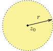
  

* 也可以用其他 **多边形** 的 **内部** 作为定义：$\triangle$, $\blacksquare$, ...
* 是下面所有讨论的基础

---

### 点与点集的相对关系：内点

* 下面讨论点与点集的 **相对关系**

---

### 点与点集的相对关系：内点

* **<green>定义**：考虑集合 $S \subset \mathbb{C}$，以及点 $z_0 \in \mathbb{C}$。倘若 **存在** $\epsilon > 0$ 使得 $N(z_0, \epsilon) \subset S$，则称 $z_0$ 为 $S$ 的一个 **<green>内点**

  

   
  

---

### 点与点集的相对关系：内点

* **<green>定义**：考虑集合 $S \subset \mathbb{C}$，以及点 $z_0 \in \mathbb{C}$。倘若 **存在** $\epsilon > 0$ 使得 $N(z_0, \epsilon) \subset S$，则称 $z_0$ 为 $S$ 的一个 **<green>内点**

  

  **$z_0 \in S$**

  由于 $z_0$ 必然属于 $N(z_0, \epsilon)$，因此，当 $z_0$ 是 $S$ 的内点时，必然有 $z_0 \in S$。
  

  

  **包含与包围**

  内点大致刻画一个点被一个点集 **包含** 且 **紧密包围**
  

---

### 点与点集的相对关系：内点

**内点例子**

若 $z \in N(z_0, r)$，则 $z$ 是 $N(z_0, r)$ 的内点。

**内点判断**

考虑点集 $S \coloneqq \{z \in \mathbb{C} \ | \ |z| \le 1\}$。考虑

(1) $z_0 = 0.9999 \ldots 9$ (有限个 9) **<orange><reveal>是</reveal>**

(2) $z_0 = 0.9999 \ldots$ (无限个 9) **<orange><reveal>非</reveal>**

---
### 点与点集的相对关系：内点

**内点判断**

考虑点集 $S \coloneqq \{z \in \mathbb{C} \ | \ 0 < |z| < 1\}$。考虑

(1) $z_0 = 0$ **<orange><reveal>否</reveal>** $~~~$ (2) $z_0 = 1$ **<orange><reveal>否</reveal>** $~~~$ (3) $z_0 = e^{\pi i /3}$ **<orange><reveal>否</reveal>**

---

### 点与点集的相对关系：边界点

* **<green>定义**：考虑点集 $S \subset \mathbb{C}$，$z_0 \in \mathbb{C}$。若对 $\forall \epsilon > 0$，均有
  $$
  N(z_0, \epsilon) \cap S \ne \emptyset \ (\text{有交}) \ , \qquad
  N(z_0, \epsilon) \not\subset S \ (\text{不被包围}) \ ,
  $$
  则称 $z_0$ 为 $S$ 的 **<green>边界点**。

* **<green>定义**：一个点集 $S$ 的全体边界点所构成的集合称为 $S$ 的 **<green>边界**，记作 **<green>$\partial S$**。

---

### 点与点集的相对关系：边界点

**边界点的从属关系**

若 $z_0$ 是 $S$ 的边界点，则 $z_0$ 可能 **属于** 也可能 **不属于** $S$。这跟 **内点** 是 **<red>不一样** 的。

---
### 点与点集的相对关系：边界点

**形象理解**

点集 $S$ 的边界点 $z_0$ 与点集 $S$ **若即若离**：$z_0$

---

### 点与点集的相对关系：边界点

**边界点例子**

考虑点集 $S \coloneqq \{z \in \mathbb{C} \ | \ 0 < |z| < 1\}$。原点 $z = 0$ 是 $S$ 的边界点，不是 **<red>内点**

---

### 点与点集的相对关系：边界点

**曲线的边界**

考虑一条连续的曲线 $C \subset \mathbb{C}$，则其边界是其自身 $\partial C = C$。

---

### 点与点集的相对关系：边界点

**孤立点的边界**

任何一个点 $z$ 可以构成一个点集 $S = \{z\}$。其边界为 $\partial S = \{z\}$。

####

---

### 点与点集的相对关系：例子

* 设 $S \coloneqq \{|z| \le 1\}$。
  - (1) 则 $z = 1$ 是 **边界点**
  - (2) 则 $z = 0$ 是 **内点**
* 设 $S \coloneqq \{|z| \le 1\}$。则 $\partial S =$
  $$
  \{|z| = 1\}, \qquad \text{or} \qquad
  \{e^{i \theta} \ | \ \theta \in \mathbb{R}\} 
  $$
* 设 $S \coloneqq \{|z| < 1\}$。则 $\partial S =$
  $$
  \{|z| = 1\}, \qquad \text{or} \qquad
  \{e^{i \theta} \ | \ \theta \in \mathbb{R}\} 
  $$

---

### 点与点集的相对关系：聚点

* **<green>定义**：设 $S \subset \mathbb{C}$，$z_0 \in \mathbb{C}$。若对 $\forall \epsilon > 0$ 始终有
  $$
  \text{相交非空} ~ N(z_0, \epsilon) \cap S \ne \emptyset \\
  N(z_0, \epsilon) \cap S \ \text{包含 「$z_0$ \red{以外} 的点」} 
  $$
  则称 $z_0$ 为 $S$ 的一个 **<green>聚点**。
  

  **从属关系**

  聚点 $z_0$ 可能 **属于** 也可能 **不属于** $S$。
  

---

### 点与点集的相对关系：聚点

**无限逼近**

说明 $z_0$ 能够被 **$S$ 的点** **无限逼近**。

---

### 点与点集的相对关系：聚点

**无限逼近**

说明 $z_0$ 能够被 $S$ 的点 **无限逼近**，在 $z_0$ 任意近的地方都有 $S$ 的人 (下图的 $z$)。

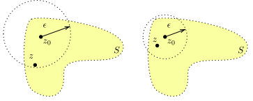

---

### 点与点集的相对关系：例子

* 设 $z \in N(0,1)$，**$z \ne 0$**。
  - (1) $z$ 是 $N(0,1)$ 的什么点？**<orange><reveal>内点，也是聚点</reveal>**
  - (2) 设 $S \coloneqq \{z^n \ | \ n \in \mathbb{N}\}$。则原点 $z = 0$ 是 $S$ 的什么点？**<orange><reveal>聚点</reveal>**

  

  **证明**

  由题目知道 $0 < |z| < 1$。因此随着 $n \to +\infty$，$|z|^n \to 0$。

  

---
### 点与点集的相对关系：例子

- 设 $z \in N(0,1)$，**$z \ne 0$**。
  - (2) 设 $S \coloneqq \{z^n \ | \ n \in \mathbb{N}\}$。则原点 $z = 0$ 是 $S$ 的**聚点**
  

  
  - 换言之，对 $\forall \epsilon > 0$，可以选择一个**足够大的 $n$** 使得 $|z^n| = |z|^n < \epsilon$，
    $$
    \Rightarrow n > \frac{\ln \epsilon}{\ln |z|}
    $$
  - 于是 $|z^n - 0| < \epsilon$，$z^n \in N(0, \epsilon)$，因此 **$N(0, \epsilon) \cap S$ 非空**。且该交集必然 **<red>有 $0$ 外的点** (比如 $z^n$)。得证。
  

---

### 点与点集的相对关系：例子

* 设 $z \in \partial N(0, 1)$。考虑 $S = \{\frac{1}{n}z^n \ | \ n \in \mathbb{N}\}$。原点是否 $S$ 的聚点？**<orange><reveal>是</reveal>**
* 设 $z \in \partial N(0,1)$。考虑 $S = \{z^n \ | \ n \in \mathbb{N}\}$。原点是否 $S$ 的聚点？**<orange><reveal>非</reveal>**
* 设 $z \in \partial N(0, \frac{1}{2})$。考虑 $S = \{z^n \ | \ n \in \mathbb{N}\}$。原点是否 $S$ 的聚点？**<orange><reveal>是</reveal>**
* 考虑点集 $S = \{\frac{1}{n}e^{\frac{\pi i}{n}} \ | \ n \in \mathbb{N}\}$。则原点是否 $S$ 的聚点？ **<orange><reveal>是</reveal>**

---

### 点与点集的相对关系：总结

* 内点、边界点、聚点均刻画点与点集的相对关系
* 三种点的关系如下

  

  
  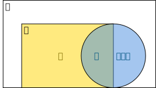
  

---

### 点与点集的相对关系：例子

* 下面 A, B, C, D 是点集 $S$ 的什么点？

  

  
  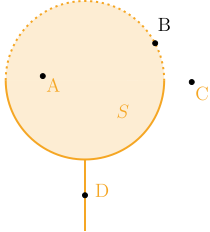
  

---

### 特殊点集

* **<green>定义**：设 $S\subset \mathbb{C}$，若 $\forall z \in S$ 均为 $S$ 的 **内点**，则称 $S$ 为 **开集**

  

  **开集的意义**

  开集用于刻画、标记 **邻近关系**。

  

  
  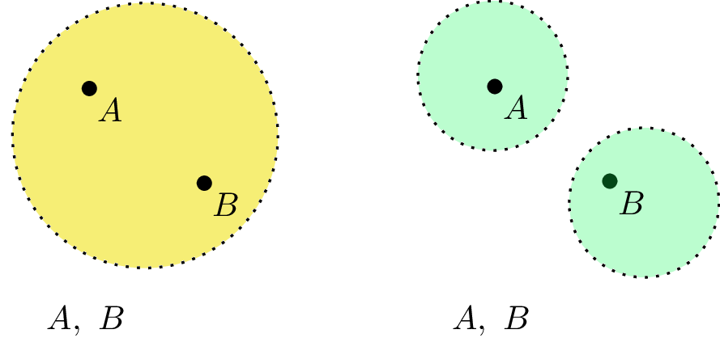
  

  

---

### 特殊点集

* 邻域是特殊的开集
* 开集的具体定义依赖 **邻域** 本身：倘若邻域使用别的形状定义，则开集的具体概念也会跟着改变
* 开集公理 $\Rightarrow$ **拓扑结构**
  - 有限或无限个开集的 **并** 还是 **开集**
  - 有限个开集的 **交** 还是 **开集**
  - $\mathbb{C}$ 与 $\emptyset$ 是 **开集**

---

### 特殊点集

* 存在其他满足开集公理的"开集概念" (拓扑结构)

  

  **离散拓扑**

  当前的开集概念：任何一个点 $z$ 的任意邻域中都有无数个邻居——非孤立性。

  离散拓扑：任何一个点 $z$ 都存在一个最小邻域，该邻域只包含它自己——孤立性
  

---

### 特殊点集

* **<green>定义**：若开集 $U$ 内任何两点都可以用一条完全属于该集合的曲线连接，则称该开集 $U$ 是 **<green>连通** 的。
* **<green>定义**：非空、**连通** 的开集称为 **<green>区域 (domain)**

  

  
  
  

---

### 特殊点集

* **<green>定义**：区域 $D$ 及其边界 $\partial D$ 的并集称为一个 **<green>闭域** 或 **<green>$D$ 的闭包**，记作 $\bar D$。
* **<green>定义**：若区域 $D$ 内任何简单闭曲线的内部均属于 $D$，则称 $D$ 是 **<green>单连通** 的，否则称为 **<green>复连通**

  

  
  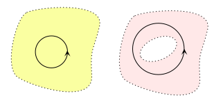
  

---

# 解析函数
> 函数、极限、连续、导数、解析

---

### 复变函数定义

* 设 $S \subset \mathbb{C}$。若对 $\forall z \in S$，按照某个规则 $f$ 有唯一的复数 $w$ 与之对应，则 $f$ 定义了一个**单值复变函数**，定义域为 $S$。
* 设 $S \subset \mathbb{C}$。若对 $\forall z \in S$，按照某个规则 $f$ 有一个或多个的复数 $w$ 与之对应，则 $f$ 定义了一个**多值复变函数**，定义域为 $S$。
* 不管是单值还是多值复变函数，都简记为

  $$
  w = f(z) \qquad \text{or} \qquad f(z)
  $$

---

### 复变函数定义

* 记 $w = u + i v$，$z = x + i y$，则

  $$
  w = f(z) = u(z) + i v(z) = u(x, y) + i v(x, y)
  $$

  换言之，一个复变函数相当于两个二元实函数，分别称为 $f$ 的实部 $\operatorname{Re} f$ 和虚部 $\operatorname{Im} f$。

---

### 极限

* **<green>定义**：设 $w = f(z)$ 的定义域是 $S$，设某点 $z_0$ 为 $S$ 的**聚点**。

  若能够找到某个 **<green>$w_0 \in \mathbb{C}$**，使得任选 $\epsilon > 0$，都 $\exists \delta > 0$，对 $\forall z \in (N(z_0, \delta) \cap S) - \{z_0\}$ 总是满足 **<red>$|f(z) - w_0| < \epsilon$**，则称 $f$ 在 $z_0$ 处的 **<green>极限存在**，并称 $w_0$ 是 $f(z)$ 在 $z_0$ 处的 **<green>极限**，记作 $w_0 = \lim_{z \to z_0} f(z)$。
  

   
  

---

### 极限

**翻译翻译**

极限存在就是，对于甲方给出的 **<green>任意小精度要求 $\epsilon$**，我们总能在**定义域 $S$** 中找到一个**足够小的距离 $\delta$**，使得距离以内的所有函数值与目标值 $w_0$ 的差别小于精度要求 $\epsilon$。

---

### 极限

**什么™叫极限**

极限存在就是，定义域中的点 $z$ 从**所有可能方向**逼近聚点 $z_0$ 时，$f(z)$ 均趋于**相同值** $w_0$

---

### 极限

**$f$ 在 $z_0$ 可以没有定义**

根据设定 $z_0$ 是 $S$ 的聚点，而 $S$ 的聚点可以**属于**也可能 **<red>不属于** $S$。因此 $z_0$ **<red>可能不属于** $f$ 的定义域，$f$ 在 $z_0$ 处可能 **<red>无定义**

**$z$ 的地位**

条件 $\forall z \in (N(z_0, \delta) \cap S) - \{z_0\}$ 强调**两件事**：

- $z$ 应该在 $f$ 的定义域中，且应该与 $z_0$ 靠得很近 (距离小于 $\delta$)
- $z \ne z_0$

---

### 极限

**逼近的方向**

若 $S$ 可以从多个方向逼近 $z_0$，则极限存在要求 $f$ 在所有逼近方向都存在且趋于同一个值 $w_0$：四面八方极限存在，且四面八方极限相等。这比一元函数的极限存在要苛刻得多。

---

### 连续性

* **<green>定义**：设复变函数 $f$ 的定义域是 $S$。考虑 **$z_0\in S$**，且是 $S$ 的**聚点**。

  若

  

  
  $\lim_{z \to z_0}f(z)$ **存在**，且 $\lim_{z \to z_0}f(z) \ \green{= f(z_0)}$
  

  则称 $f$ 在 $z_0$ 处 **<green>连续 (continuous)**。

---
### 连续性

**$f(z_0)$ 有定义**

由设定 $z_0 \in S$，$f$ 在 $z_0$ 是**有定义的**。连续性要求函数值 $f(z_0)$ 恰好等于 $f(z)$ 趋于 $z_0$ 的**极限**。

* **<green>定义**：若 $f$ 在 $S$ 中**每一点**都连续，则称 $f$ 在 **<green>$S$ 上连续**。

---

### 可导性

* **<green>定义**：设 $f$ 定义在区域 $D$ 上。$z_0 \in D$。若

  

  
  $\displaystyle\lim_{\Delta z \to 0} \frac{f(z_0 + \Delta z) - f(z_0)}{\Delta z}$  **存在且有限**
  
  

  则称 $f$ 在 $z_0$ 处 **<green>可导** 或 **<green>可微**，而该极限称为 $f$ 在 $z_0$ 处的 **<green>导数**或者 **<green>微商**，记作

  $$
  [f'(z)]_{z = z_0}, \qquad f'(z_0), \qquad \frac{df(z)}{dz}\bigg|_{z = z_0}, \qquad \frac{d}{dz}\bigg|_{z = z_0}f(z)
  $$

  

  **区域**

  定义域是个区域，因此当 $|\Delta z|$ **足够小**的话可以保证 $z + \Delta z \in D$，从而 $f(z + \Delta z)$ 有定义。
  
 
---

### 解析函数

* **<green>定义**：倘若函数 $f$ 在 **区域 $D$** 内处处可导，则称 $f$ 是 $D$ 上的 **<green>解析 (analytic) 函数**，或者 **<green>全纯 (holomorphic) 函数**，或者称 $f$ 在 $D$ 内 **<green>解析**。

  

  **解析**

  严格说来，解析这个形容词是针对**一个区域**的概念，是对函数在一定范围内的行为进行约束，**<red>并非一点处**的概念，没有「在一点处解析」的说法。

  # 

  但也经常会**偷懒**说「在一点处解析」，但实际意思是指在点的**某个邻域内**解析。
  

---

### 可导性：例

* $f(z) = z^n$，$n \in \mathbb{N}$，则可以直接计算得到

  $$
  \lim_{\Delta z \to 0} \frac{f(z + \Delta z) - f(z)}{\Delta z} = n z^{n - 1}
  $$

  因此这个 $f$ 在 $\mathbb{C}$ 上**处处可导**。

---

### 可导性：例

* $f(z) = \bar{z}$。因此 $f(z = x + i y) = x - i y$

  $$
  \lim_{\Delta z \to 0} \frac{f(z + \Delta z) - f(z)}{\Delta z} = \lim_{\substack{\Delta x \to 0 \\ \Delta y \to 0}} \frac{x + \Delta x - i (y + \Delta y) - (x - i y)}{\Delta x + i \Delta y}
  $$

---

### 可导性：例

* 若 $\Delta z$ 沿着**实轴**逼近 $0$，则 $\Delta y = 0$，

  $$
  \lim_{\Delta z \to 0} \frac{f(z + \Delta z) - f(z)}{\Delta z} = \lim_{\substack{\Delta x \to 0 \\ \Delta y \to 0}} \frac{\Delta x }{\Delta x} = 1
  $$

* 若 $\Delta z$ 沿着**虚轴**逼近 $0$，则 $\Delta x = 0$，

  $$
  \lim_{\Delta z \to 0} \frac{f(z + \Delta z) - f(z)}{\Delta z} = \lim_{\substack{\Delta x \to 0 \\ \Delta y \to 0}} \frac{ - i \Delta y }{i \Delta y} = -1
  $$
* 极限不存在，因此 $f(z) \coloneqq \bar z$ **<red>处处不可导**。

---

### 解析函数

* **<green>定义**：倘若 $f$ 在 $z_0$ 处 **<red>不解析** (包括没有定义)，但是 $f$ 在 $z_0$ 的任意邻域内都有解析点，则称 $z_0$ 为 $f$ 的**奇点 (singularity)**。

  

  **奇点的含义**

  不同领域对奇点的定义和理解会有所不同。这里是复分析中比较常用的一种理解。
  

---

### 求导法则

* 求导法则
  - 线性性：$[f(z) + g(z)]' = f'(z) + g'(z)$
  - 莱布尼兹 (Leibniz) 律：$[f(z)g(z)]' = f'(z)g(z) + f(z) g'(z)$
  - 链式法则 (chain rule)：$f(g(z))' = \frac{df}{dg} \frac{dg}{dz}$
* 常见复解析函数导数与实光滑函数的导数在形式上是一样的。

---

### Cauchy-Riemann 条件

* **复可导性** 是很**强**的条件，比之前学的实变可导性要**强得多**：要求极限与 $\Delta z \to 0$ 的**方向无关**

  

  
  

---

### Cauchy-Riemann 条件

* 求导：$f(z = x + i y) = u(x, y) + i v(x, y)$

  $$
  \begin{align*}
    f'(z) = \lim_{\substack{\Delta x \to 0\\\Delta y \to 0}}\bigg[ & \ \frac{u(x + \Delta x, y + \Delta y) + i v(x + \Delta x, y + \Delta y)}{\Delta x + i \Delta y} \\
    & \ \qquad\qquad\qquad\qquad\qquad - \frac{u(x, y ) + i v(x, y )}{\Delta x + i \Delta y} \bigg]
  \end{align*}
  $$

* 考虑实轴和虚轴方向

---

### Cauchy-Riemann 条件

* 考虑 $\Delta z$ 从**实轴**趋近零：$\Delta y = 0$

  $$
  f'(z) = \frac{\partial u}{\partial x} + i \frac{\partial v}{\partial x}
  $$

* 考虑 $\Delta z$ 从**虚轴**趋近零：$\Delta x = 0$

  $$
  f'(z) = \frac{\partial v}{\partial y} - i \frac{\partial u}{\partial y}
  $$

---
### Cauchy-Riemann 条件 

* 二者应该相等 (方向无关)：**Cauchy-Riemann 条件**

  $$
  \frac{\partial u}{\partial x} + i \frac{\partial v}{\partial x} = \frac{\partial v}{\partial y} - i \frac{\partial u}{\partial y}
  $$

  即

  $$
  \frac{\partial u}{\partial x} = \frac{\partial v}{\partial y}, \qquad \frac{\partial u}{\partial y} = - \frac{\partial v}{\partial x}
  $$

---

### Cauchy-Riemann 条件的复坐标表示

- CR 条件本身是复可导性的**必要条件**
* **定理**：实可微性 + CR 条件 $\Leftrightarrow$ 复可导性
* **定理**：实连续一阶偏导 + CR 条件 $\Leftrightarrow$ 复可导性
* 通常，物理中的函数都至少具有上述**实**可导性质。以后统称为**足够光滑、性质良好**的函数。

---

### Cauchy-Riemann 条件的复坐标表示

**实可微性**

二元函数 $f(x,y)$ 在 $(x_0, y_0)$ **<green>实可微** 指的是

$$
\lim_{\substack{\Delta x \to 0 \\ \Delta y \to 0}} \frac{[f(x_0 + \Delta x, y_0 + \Delta y) - f(x_0, y_0) -  \partial_x f \Delta x - \partial_y f \Delta y]_{(x_0, y_0)}}{\sqrt{\Delta x^2 + \Delta y^2}} = 0
$$

偏导数存在但不可微的例子 (上述极限非零，或与方向有关)

$$
\sqrt{xy}, \qquad \left\{\begin{array}{cc}
0 & (0,0)\\
\frac{y^3}{x^2 + y^2} & (x, y) \neq (0,0)
\end{array}\right.
$$

---

### Cauchy-Riemann 条件的复坐标表示

- $z = x + i y$，$\bar z = x - i y$
* 反解

  $$
  x = \frac{1}{2}(z + \bar z), \qquad y = \frac{1}{2i}(z - \bar z)
  $$

* 任何关于 $z, \bar z$ 的函数都可以重新表达为 $x, y$ 的函数，反之亦然，

  $$
  f(z, \bar z) = f(x + i y, x - i y),\\
  f(x, y) = f\left(\frac{1}{2}(z + \bar z), \frac{1}{2i}(z - \bar z)\right)
  $$

---

### Cauchy-Riemann 条件的复坐标表示

* **<green>定义** 复偏导符号 $\frac{\partial}{\partial z}, \frac{\partial}{\partial \bar z}$

  $$
  \green{\frac{\partial f}{\partial z} = \partial_z f} \coloneqq \frac{1}{2} \left(\frac{\partial f}{\partial x} - i \frac{\partial f}{\partial y}\right)
  $$
  $$
  \green{\frac{\partial f}{\partial \bar z} = \partial_{\bar z} f} \coloneqq \frac{1}{2} \left(\frac{\partial f}{\partial x} + i \frac{\partial f}{\partial y}\right)
  $$

---

**链式法则**

上述求导算符可以通过「链式法则」帮助理解 (不是证明)，

$$
\frac{\partial f}{\partial z} = \frac{\partial f}{\partial x} \frac{\partial x}{\partial z} + \frac{\partial f}{\partial y} \frac{\partial y}{\partial z} = \frac{1}{2} \frac{\partial f}{\partial x} - \frac{i}{2} \frac{\partial f}{\partial y}
$$
$$
\frac{\partial f}{\partial \bar z} = \frac{\partial f}{\partial x} \frac{\partial x}{\partial \bar z} + \frac{\partial f}{\partial y} \frac{\partial y}{\partial \bar z} = \frac{1}{2} \frac{\partial f}{\partial x} + \frac{i}{2} \frac{\partial f}{\partial y}
$$

---

### Cauchy-Riemann 条件的复坐标表示

- Cauchy-Riemann 条件可以重新组合

  $$
  \frac{\partial u}{\partial x} - \frac{\partial v}{\partial y} = 0, \qquad \frac{\partial u}{\partial y} + \frac{\partial v}{\partial x} = 0
  $$
  $$
  \Leftrightarrow\left(\frac{\partial u}{\partial x} - \frac{\partial v}{\partial y}\right) + i \left(\frac{\partial u}{\partial y} + \frac{\partial v}{\partial x}\right) = 0
  $$
  $$
  \Leftrightarrow\frac{\partial (u + i v)}{\partial x} + i \frac{\partial (u + i v)}{\partial y} = 0\\
  \Leftrightarrow\partial_{\bar z} f = 0
  $$
* CR 条件 $\Leftrightarrow$ $\partial_{\bar z} f = 0$

---

### 复导数

- 实变函数的偏导数建基于自变量 $\Delta x, \Delta y$ 的**独立性**

  $$
  \frac{\partial u}{\partial x} = \lim_{\Delta x \to 0} \frac{u(x + \Delta x, y) - u(x,y)}{\Delta x}
  $$

* 特别地，

  $$
  \frac{\partial x}{\partial y} = \frac{\partial y}{\partial x} = 0, \qquad \frac{\partial x}{\partial x} = \frac{\partial y}{\partial y} = 1
  $$ 
---

### 复导数

- $z$ 与 $\bar z$ **不独立**：$z \to z + \Delta \Rightarrow \bar z \to \bar z + \overline{\Delta z}$。
* 但是，偏导算符呈现**形式上独立性 (formal independence)**，

  $$
  \frac{\partial \bar z}{\partial z} = \frac{\partial z}{\partial \bar z} = 0, \qquad \frac{\partial z}{\partial z} = \frac{\partial \bar z}{\partial \bar z} = 1
  $$

  

  **证明**

  直接计算。比如，结合 $z = x + iy$, $\bar z = x - i y$，

  $$
  \frac{\partial \bar z}{\partial z} = \frac{1}{2} [1 - i (-i)] = 0, \qquad
  \frac{\partial z}{\partial z} = \frac{1}{2} [1 - i (+i)] = 1
  $$
  

---

### 复导数

- $z$ 与 $\bar z$ **不独立**：$z \to z + \Delta \Rightarrow \bar z \to \bar z + \overline{\Delta z}$。
- 但是，偏导算符呈现**形式上独立性 (formal independence)**，

  $$
  \frac{\partial \bar z}{\partial z} = \frac{\partial z}{\partial \bar z} = 0, \qquad \frac{\partial z}{\partial z} = \frac{\partial \bar z}{\partial \bar z} = 1
  $$

- **形式上**，$\partial_z, \partial_{\bar z}$ 跟「偏导数」**<green>完全一样**：接受它们作为偏导存在，$z, \bar z$ **形式上独立**
* 通常：$f$ 满足 CR 条件/解析性/全纯性 $\Leftrightarrow$ $f$ **<red>不含** $\bar z$ $\Leftrightarrow$ $\partial_{\bar z} f = 0$

  

  **奇点**

  在**奇点**处，$f$ 只依赖 $z$ **<red>$~ \not\Rightarrow ~$** $\partial_{\bar z} f = 0$。
  

---

### 复导数

- 若 $f$ 解析/全纯，则其**复共轭** $\overline{f(z)}$ 满足

  $$
  \partial_z \overline{f(z)} = 0
  $$

  这样的函数称为 **<green>反全纯 (anti-holomorphic) 函数**。
* 一般的复变函数既不是全纯也不是反全纯函数。可以用 $f(z, \bar z)$ 来标明/强调。

---

### 共轭调和函数

- 区域 $D$ 上解析的函数 $f = u + i v$ 的实部和虚部满足 CR 条件

  $$
  \frac{\partial u}{\partial x} = \frac{\partial v}{\partial y}, \qquad \frac{\partial u}{\partial y} = - \frac{\partial v}{\partial x}
  $$

* 对这些方程两边作 $\partial_x$ 和 $\partial_y$

  $$
  \partial_x: \frac{\partial^2 u}{\partial x^2} = \purple{\frac{\partial^2 v}{\partial x\partial y}}, \qquad \orange{\frac{\partial^2 u}{\partial x\partial y}} = - \frac{\partial^2 v}{\partial x^2}
  $$
  $$
  \partial_y: \orange{\frac{\partial^2 u}{\partial y\partial x}} = \frac{\partial^2 v}{\partial y^2}, \qquad \frac{\partial^2 u}{\partial y^2} = - \purple{\frac{\partial^2 v}{\partial y\partial x}}
  $$

---

### 共轭调和函数

- 稍作比较可得两条 **<green>调和 (harmonic) 方程**

  $$
  \frac{\partial^2 u}{\partial x^2} + \frac{\partial^2 u}{\partial y^2} = 0, \qquad \frac{\partial^2 v}{\partial x^2} + \frac{\partial^2 v}{\partial y^2} = 0
  $$

---

### 共轭调和函数

- 解析函数的实部和虚部均为**调和函数**，而且二者由 CR 条件相互锁定，形成一对**共轭调和函数**。
* 从一个调和函数 $u$ (或 $v$) 出发，可以**通过 CR 条件**解出与之共轭的调和同伴 $v$ (或 $u$)，并由此获得**解析函数**。

---

### 共轭调和函数：例子

- 设 $u(x,y) = x^2 - y^2$。若 $v(x,y)$ 是与之共轭的调和函数，则必然有

  $$
  dv = \frac{\partial v}{\partial x}dx + \frac{\partial v}{\partial y} dy = - \frac{\partial u}{\partial y}dx + \frac{\partial u}{\partial x} dy = + 2y dx + 2x dy = d(2 xy)
  $$

* 于是 $v = \purple{2 xy + C}$，而 $C$ 是**任意实常数**。
* 从而 $f(z) = x^2 - y^2 + \purple{2} \orange{i} \purple{xy} + \purple{C}\orange{i} = (\green{x + i y})^2 + \purple{C} \orange{i}$ 是**解析函数**：

  $$
  f = \green{z}^2 + C i
  $$
  

  
  不要漏了 $i$
  

---

### 共轭调和函数

- 区域 $D$ 中共轭调和函数的**线积分**求解法：

  $$
  v = \int_{(x_0, y_0)}^{(x,y)} dv + C = \int_{(x_0, y_0)}^{(x,y)}  \left[- \frac{\partial u}{\partial y}dx + \frac{\partial u}{\partial x} dy\right] + C
  $$

  

  **<red>路径怎么选？</red>**

  上述积分只指定了初始点 $(x_0, y_0)$ 和终末点 $(x, y)$。
  

---
### 共轭调和函数

- 区域 $D$ 中共轭调和函数的**线积分**求解法：

  $$
  v = \int_{(x_0, y_0)}^{(x,y)} dv + C = \int_{(x_0, y_0)}^{(x,y)}  \left[- \frac{\partial u}{\partial y}dx + \frac{\partial u}{\partial x} dy\right] + C
  $$

  

  **<red>路径怎么选？</red>**

  

  
  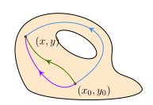
  

  

---

### 共轭调和函数

- 区域 $D$ 中共轭调和函数的**线积分**求解法：

  $$
  v = \int_{(x_0, y_0)}^{(x,y)} dv + C = \int_{(x_0, y_0)}^{(x,y)}  \left[- \frac{\partial u}{\partial y}dx + \frac{\partial u}{\partial x} dy\right] + C
  $$

  

  **路径无关性**

  绿色积分 $-$ 紫色积分 $=$ 闭合路径 $\gamma$ 积分：

  $$
  \oint_\gamma \left[- \frac{\partial u}{\partial y}dx + \frac{\partial u}{\partial x}dy\right] = \iint \left[\frac{\partial^2 u}{\partial x^2} + \frac{\partial^2 u}{\partial y^2}\right]dx dy = 0
  $$
  

---

### 共轭调和函数

- 区域 $D$ 中共轭调和函数的**线积分**求解法：

  $$
  v = \int_{(x_0, y_0)}^{(x,y)} dv + C = \int_{(x_0, y_0)}^{(x,y)}  \left[- \frac{\partial u}{\partial y}dx + \frac{\partial u}{\partial x} dy\right] + C
  $$

  

  **路径无关性**

  蓝色积分 $-$ 绿色积分 $=$ 与 $(x, y), (x_0, y_0)$ 无关的常数 $C$：不要紧。

  结论：随便选一条连接 $(x_0, y_0)$ 和 $(x,y)$ 的路径，只要**完全在解析区内**。
  

<!--
---

### 共轭调和函数

- 调和方程

  $$
  \frac{\partial^2 u}{\partial x^2} + \frac{\partial^2 u}{\partial y^2} = \left[\frac{\partial^2}{\partial x^2} + \frac{\partial^2}{\partial y^2}\right] u = 0
  $$

* **定理**：当 $u$ 足够光滑，

  $$
  \partial_z \partial_{\bar z} u = \frac{1}{4} \left[\frac{\partial^2}{\partial x^2} + \frac{\partial^2}{\partial y^2}\right]u
  $$

  

  **证明**

  直接利用复导数的定义，以及 $\partial_x \partial_y = \partial_y \partial_x$。
  

---

### 共轭调和函数

* $\partial_z \partial_{\bar z} u = 0$ 的**实**解：

  $$
  u = \frac{1}{2} (f(z) + \overline{f(z)})$$

  

  **解**

  显然

  $$
  \partial_z [\partial_{\bar z} f(z)] = 0 , \qquad \partial_z \partial_{\bar z} \overline{f(z)} = \partial_{\bar z}[\partial_z \overline{f(z)}] = 0
  $$
  

---
### 共轭调和函数

* 与 $u$ 共轭的调和函数：$v = \frac{1}{2i} (f(z) - \overline{f(z)}) + C$.

  

  **重新组合**

  把 $u$ 和 $v$ 重新组合

  $$
  u + i v = f(z)$$
  
 -->

---

### 共轭调和函数与静电场

* 解析函数 $f$ 或者共轭调和函数 $(u, v)$ 可以用于描述**静电场**
* $u, v$ 的**梯度**

  $$
  \nabla u = \left(\frac{\partial u}{\partial x}, \frac{\partial u}{\partial y}\right), \qquad \nabla v = \left(\frac{\partial v}{\partial x}, \frac{\partial v}{\partial y}\right)
  $$

* $\nabla u \perp$ $u$ 等值线, $\nabla v \perp$ $v$ 等值线。

---

### 共轭调和函数与静电场

* **定理**：共轭调和条件 $\Rightarrow$ 正交梯度 $\nabla u \cdot \nabla v = 0$

  

  **正交梯度**

  直接计算

  $$
  \nabla u \cdot \nabla v = \frac{\partial u}{\partial x}\frac{\partial v}{\partial x} + \frac{\partial u}{\partial y} \frac{\partial v}{\partial y} = - \frac{\partial u}{\partial x}\frac{\partial u}{\partial y} + \frac{\partial u}{\partial y}\frac{\partial u}{\partial x} = 0
  $$
  

* **推论**：等 $u$ 线 $\perp$ 等 $v$ 线。

---

### 共轭调和函数与静电场

* 在无电荷分布二维静电场中，电势是平面空间的**调和函数**

  

  **二维电势**

  二维无电荷麦克斯韦方程

  $$
  \nabla \cdot \vec E(x,y) = 0
  $$

  然而电势与电场强度的关系是 $\vec E = - \nabla \varphi$，

  $$
  \Rightarrow \nabla \cdot \nabla \varphi = \frac{\partial^2 \varphi}{\partial x^2} + \frac{\partial^2 \varphi}{\partial y^2} = 0
  $$
  
 

---

### 共轭调和函数与静电场

**平面电场**

**<red>如何形成二维电场？**

---

### 共轭调和函数与静电场

**平面电场**

**<red>如何形成二维电场？**

可以使用无穷长直均匀带电直线

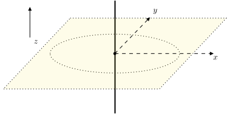

---

### 初等函数

* **初等函数**：常数、幂函数、指数函数、对数函数、三角函数、反三角函数，及其有限次加减乘除、复合所构成的函数。
* 导数公式与大一的内容一样

---

### 初等函数：整幂函数

* **<green>整幂** 复函数是全 $\mathbb{C}$ 解析的函数，定义为

  $$
  z^{n = 0, 1,2,3, \ldots} = \underbrace{z \cdot z \cdot \ldots \cdot z}_{n\text{ 个}} \ , \qquad z^{n = -1, -2, \ldots} = \frac{1}{z^{|n|}} \ .
  $$

  

  **确定性**

  给定一个 $z \in \mathbb{C}$，则 $z^n$ 是唯一**确定** (单值) 的。
  

---

### 初等函数：整幂函数

* 若 $z = re^{i \theta}$，则 $z^n = r^n e^{i n \theta}$。
* 满足整幂实函数的性质，

  $$
  (z_1 z_2)^n = z_1^n z_2^n \ , \qquad (z_1 + z_2)^n = \sum_{k = 0}^{n}C_n^k z_1^k z_2^{n - k} \ .
  $$

---

### 初等函数：多项式

* 整幂函数通过复系数可以组合成 $n$-次 多项式，

  $$
  P(z) = \sum_{k = 0}^{n} a_k z^k \ , \qquad a_k \in \mathbb{C} \ , \quad a_n \ne 0\ .
  $$

* 比如 $P(z) = z^2 - 1$，$P(z) = z^3 - 3 z^2 + 4 + 3 i$.

---

### 初等函数：次方根函数

* **<green>定义**：给定一个 $z \in \mathbb{C}$ 以及 $n \in \mathbb{N}_{\ge 1}$，若 $z_0 \in \mathbb{C}$ 满足 $z_0^n = z$，则称 $z_0$ 为 $z$ 的一个 **<green>$n$-次方根**，记作 $z^{\frac{1}{n}}$。
* **定理**：若 $z = re^{i \theta}$，则 $z_0 = r^{\frac{1}{n}}e^{i \frac{\theta}{n}}$ 是 $z$ 的一个 $n$-次方根。
  

  
  **次方根存在性**

  次方根**总是存在**，包括负数的偶次方根，如 $(-1)^{1/2}$
  

---

### 初等函数：次方根函数

* **多值性定理**：给定 $z \ne 0$ 之后，$n$-次方根 $z_0$ 有 **$n$ 个** 可能值。

  

  **多值性**

  设 $z_0$ 是 $z\ne0$ 的一个 $n$-次方根，即 $z_0^n = z$。则必然有

  $$
  z_0, \qquad e^{\frac{2\pi i}{n}}z_0, \qquad e^{\frac{2\pi i}{n}\cdot 2} z_0, \qquad \cdots, \qquad e^{\frac{2\pi i}{n}(n - 1)}z_0
  $$

  都是 $n$-次方根，因为 $(e^{\frac{2 \pi i}{n} k })^n = e^{2\pi i k} = 1$，$k = 0, 1, \dots, n - 1$。
  

---

### 初等函数：次方根函数

* $n$-次方根的多值性来源于 **$z$ 的辐角** 的多值性
  $$
  \begin{align*}
    & \ z = re^{i \theta} = r e^{i (\theta + 2\pi k)} \\
  \Rightarrow & \ z^{\frac{1}{n}} = r^{\frac{1}{n}} e^{i \frac{\theta}{n}},\qquad \text{或者}, \qquad r^{\frac{1}{n}} e^{i (\frac{\theta}{n} + \frac{2\pi k}{n})} \ .
  \end{align*}
  $$

---

### 初等函数：次方根函数

* $1$ 的 3 次方根

  $$
  \begin{align*}
    & \ 1 = e^{0\pi i} = e^{2\pi i} = e^{4 \pi i}\\
  \Rightarrow & \ 1^{\frac{1}{3}} = 1, e^{\frac{2\pi i}{3}}, e^{\frac{4\pi i}{3}} \ .
  \end{align*}
  $$

* 多项式方程 $x^3 - 1 = 0$ 的解即为 $1$ 的 3 次方根。
* $1$ 的 $n$ 次方根

  $$
  \begin{align*}
    & \ 1 = e^{0\pi i} = e^{2\pi i} = \cdots = e^{2 \pi i (n - 1)}\\
  \Rightarrow & \ 1^{\frac{1}{n}} = 1, e^{\frac{2\pi i}{n}}, \cdots, e^{\frac{2\pi i (n - 1)}{n}} \ .
  \end{align*}
  $$

---

### 初等函数：次方根函数

- $1$ 的 $6$ 次方根图像分布

  

  
  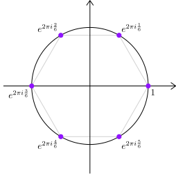
  

---

### 初等函数：指数函数

- **<green>复指数函数 $e^z$** 的定义是

  $$
  e^z = e^{x + i y} \coloneqq e^x e^{i y} = e^x (\cos y + i \sin y) \ .
  $$

* 满足实指数函数的许多性质：

  $$
  \frac{d}{dz}e^z = e^z, \qquad e^{z_1} e^{z_2} = e^{z_1 + z_2} \ .
  $$

* 全 $\mathbb{C}$ 解析的函数

---

### 初等函数：三角函数

- **<green>复三角函数** 利用指数函数来定义

  $$
  \cos z \coloneqq \frac{1}{2}(e^{iz} + e^{-i z}), \qquad \sin z \coloneqq \frac{1}{2i}(e^{i z} - e^{- i z}) \ .
  $$

---
### 初等函数：三角函数

- 同样满足熟知的各种性质：和差化积、积化和差等

  

  **平方和**

  计算 $\cos^2 z + \sin^2 z$，

  $$
  \begin{align*}
    = & \ \frac{1}{4}(e^{iz} + e^{- i z})^2 - \frac{1}{4}(e^{iz} - e^{- i z})^2\\
    = & \ \frac{1}{4}(e^{2iz} + e^{- 2i z} + 2) - \frac{1}{4}(e^{2iz} + e^{- 2i z} - 2) \\
    = & \ \frac{1}{4}2 - \frac{1}{4}(-2) = 1 \ .
  \end{align*}
  $$
  

---

### 初等函数：双曲函数

- **<green>复双曲正弦余弦函数** 利用指数函数来定义

  $$
  \cosh z \coloneqq \frac{1}{2}(e^{z} + e^{- z}), \qquad \sinh z \coloneqq \frac{1}{2}(e^{z} - e^{- z}) \ .
  $$

* 是全 $\mathbb{C}$ 解析的函数
* 比值为 **<green>双曲正切余切 $\tanh z$、$\coth z$**

---

### 初等函数：双曲函数

* 同样满足熟知的各种性质：

  $$
  \cosh^2 z - \sinh^2 z = 1, \quad \frac{d}{dz}\cosh z = \sinh z, \quad \frac{d}{dz}\sinh z = \cosh z \ .
  $$

* 双曲正弦余弦函数与三角函数的关系

  $$
  \cosh z = \cos (iz), \qquad \sinh z = - i \sin (iz)
  $$ 
---

### 初等函数：对数函数

* **<green>定义**：若复数 $w$ 满足 $e^w = z$，则称 $w = \ln z$ 是 $z$ 的**对数**。
* 作为 $z$ 的函数，对数函数 $\ln z$ 是**多值**的：若 $e^w = z$，则 $e^{w + 2\pi i n} = z$
  
  

  
  所有 $w + 2\pi i n$ 都是 $z$ 的对数，$n \in \mathbb{Z}$
  

  

---

### 多值函数

* 下面讨论具有一定解析性的函数的多值现象。

  

  **解析区域**

  未说明解析区域的解析函数，就默认**存在**某个区域使得函数在上面解析。至于这个区域是什么，不需明说。
  

---

### 多值函数

* 根式函数 $w = \sqrt{z}$ 是最简单的**多值函数**

  $$
  z \xRightarrow{\sqrt{\boldsymbol{\cdot}}} w = \sqrt{z}:\qquad w^2, (-w)^2 = z \ .
  $$

* 也可以理解为来源于 $z$ 的辐角的多值性

  $$
  z = \purple{r e^{i \theta}} = \orange{r e^{i (\theta + 2\pi)}} \quad \to \quad w = \purple{r^{\frac{1}{2}} e^{i \frac{\theta}{2}}}, \quad  \orange{r^{\frac{1}{2}} e^{i \frac{\theta}{2}} e^{\pi i}} = - r^{\frac{1}{2}} e^{i \frac{\theta}{2}} \ .
  $$

  

  **多值性**

  只要 $z \ne 0$，则其平方根有 **<red>两个**不同值。当 $z = 0$，则平方根是**唯一**的。
  

---

### 多值函数

**多值现象**

多值函数的函数值不能唯一确定，并不是说**完全无法得知函数值**，仅仅是有好几个确定的选项，不知道挑哪一个好而已。

比如，$f(z) = z^{1/2}$ 在 $z = 1$ 的函数值是**非常明确**的两个选项：$1, -1$；其它的数如 $250, 66666666, 2333$ 肯定 **<red>不是合理** 的 $f(1)$ 函数值。

---
### 多值函数

* **<red>能否选一个，忘掉其他选项？**
* **<purple>不能：连续性强迫全部都要**
  

  
  
  

---

### 多值函数

<iframe src='./animation/SquareRoot.html' frameborder='0' style='width:768px;height:440px'></iframe>

---

### 支点

* **<green>定义**：对于 $w = \sqrt{z}$，当自变量 $z$ 绕原点周围**任意小**的闭曲线一圈，$w$**都**会发生**多值现象** (具体体现为符号改变)。因此，称原点 $z = 0$ 为 $w = \sqrt{z}$ 的**支/分枝点 (branch point)**。

  

  
  

---

### 支点

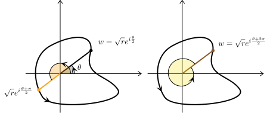

---

### 支点

<iframe src='./animation/SquareRoot.html' frameborder='0' style='width:768px;height:440px'></iframe>

---

### 支点

* 再考虑根式函数 $w = \sqrt{z - a}$，$a \in \mathbb{C}$
* 记 $z - a \coloneqq r e^{i \theta}$，则

  $$
  w = \sqrt{r}e^{i \frac{\theta}{2}}, \qquad - \sqrt{r}e^{i \frac{\theta}{2}} \ , \qquad \theta \text{ 是 $z - a$ 的辐角}
  $$

* 当 $z$ 绕 $a$ 任意小闭曲线一圈，$w$ 发生**多值现象** (变号)。因此，称 $a$ 为函数 $w$ 的**支点**
* 根式函数 $w = \sqrt{z - a}$ 在支点 $z = a$ 处**有定义**：$w(z = a) = 0$。

---

### 支点

<iframe src='./animation/SquareRootZminusA.html' frameborder='0' style='width:768px;height:440px'></iframe>

---

### 支点

---

### 支点

* 当 $a \ne 0$，原点 $z = 0$**不再是**支点：绕原点转小圈，$\sqrt{z -a}$ 不出现多值现象

  

  
  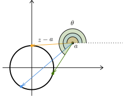
  

---

### 支点

<iframe src='animation/SquareRootZminusA2.html' frameborder='0' style='width:768px;height:440px'></iframe>

---

### 支点

* 对于 $w = \sqrt{z - a}$，$\infty$ 也是支点

  

  **绕 $\infty$**

  「绕 $\infty$ 的 **任意小**闭曲线」 $=$ 「绕 $z = a$ **任意大**的闭曲线」
  

---

### 支点

- **<green>定义**：对 $w = \sqrt{z - a}$，绕 $a$ 或者 $\infty$ 2 周之后 $w$ 变回原值。因此，定义 $a$, $\infty$ 为 $w = \sqrt{z - a}$ 的 **<green>一阶支点**。
* **<green>定义**：对 $w = (z - a)^{\frac{1}{3}}$，绕 $a$ 或者 $\infty$ 3 周之后 $w$ 变回原值。因此，定义 $a$, $\infty$ 为 $w = (z - a)^{\frac{1}{3}}$ 的 **<green>二阶支点**。

  

  **$2\pi/3$**

  由于 $w$ 是开三次方，所以当 $z - a$ 的辐角增加 $2\pi, 4\pi$ 时，$w$ 感应到

  $$
  w \to e^{\frac{i 2\pi}{3}} w \ ,\qquad w \to e^{\frac{i 4\pi}{3}} w \ .
  $$
  

---
### 支点

- **<green>定义**：对 $w(z)$ 的支点 $a$，若绕 $a$ 至少 $k + 1$ 周之后 $w$ 变回原值，则称 $a$ 为 $w(z)$ 的 **<green>$k$ 阶支点**。

---

### 支点：例

* 考虑 $w(z) = \sqrt{(z - a)(z - b)}$。
* 记 $z - a = r_a e^{i \theta_a}$，$z - b = r_b e^{i \theta_b}$

  

  
  
  

---

### 支点：例

- 当 $z$ 沿绕着 $b$ 无穷小的闭曲线一圈，出现多值现象：

  $$
  \left \{
  \begin{array}{cc}
    \theta_a \to \theta_a, \\
    \theta_b \to \theta_b + 2\pi
  \end{array}
  \right.\
  \Rightarrow \quad
  w = \sqrt{r_a r_b}e^{\frac{i\theta_a}{2}}e^{\frac{i \theta_b}{2}}
  \to \orange{-} \sqrt{r_a r_b}e^{\frac{i\theta_a}{2}}e^{\frac{i \theta_b}{2}} \ .\nonumber
  $$

  

  
  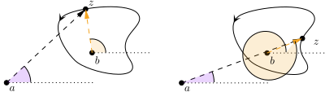
  

---

### 支点：例

- 当 $z$ 沿绕着 $a$ 无穷小的闭曲线一圈，出现多值现象：

  $$
  \theta_a \to \theta_a + 2\pi, \quad \theta_b \to \theta_b  \ \Rightarrow
  w = \sqrt{r_a r_b}e^{\frac{i\theta_a}{2}}e^{\frac{i \theta_b}{2}}
  \to \orange{-} \sqrt{r_a r_b}e^{\frac{i\theta_a}{2}}e^{\frac{i \theta_b}{2}} \ .\nonumber
  $$
  

  
  
  

---

### 支点：例

- 当 $z$ 沿绕着 $a, b$ 任意 **大** 的闭曲线一圈 **<red>没有** 出现多值现象：

  $$
  \theta_{a,b} \to \theta_{a,b} + 2\pi, \Rightarrow
  w = \sqrt{r_a r_b}e^{\frac{i\theta_a}{2}}e^{\frac{i \theta_b}{2}}
  \to \green{(-)^2} \sqrt{r_a r_b}e^{\frac{i\theta_a}{2}}e^{\frac{i \theta_b}{2}} \ .\nonumber
  $$

  

  
  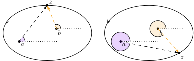
  

---

### 支点：例

- 总结：

  1. $b$ 是 $w = \sqrt{(z - a)(z - b)}$ 的一阶支点
  2. $a$ 是 $w = \sqrt{(z - a)(z - b)}$ 的一阶支点
  3. $\infty$ **<red>不是** 支点

---

### 支点：例

- 考虑 $w(z) = \sqrt{(z - a)(z - b)(z - c)}$，$a,b,c$ 互异

  一阶支点：$\infty, a, b, c$

- 考虑 $w(z) = \sqrt{1 - \frac{1}{z}}$

  $w(z) = \sqrt{1 - \frac{1}{z}} = \sqrt{\frac{z - 1}{z}}$，一阶支点：$0, 1$。$\infty$ **<red>不是** 支点

- 考虑 $w(z) = (z^3 - 1)^{\frac{1}{3}}$

  $w(z) = [(z - 1)(z - e^{\frac{2\pi i }{3}})(z - e^{\frac{4\pi i }{3}})]^{\frac{1}{3}}$，二阶支点：$1$, $e^{\frac{2\pi i}{3}}$, $e^{\frac{4\pi i}{3}}$。$\infty$ **<red>不是** 支点

---

### 支点：例

- 考虑 $w = z^a (z - 1)^b$，$a, b \in \mathbb{Q}$

  1. 若 $a \not\in \mathbb{Z}$，则 $z = 0$ 是支点
  2. 若 $b \not\in \mathbb{Z}$，则 $z = 1$ 是支点
  3. 若 $a + b \not\in \mathbb{Z}$，则 $z = \infty$ 是支点

---

### 支点：例

- 考虑 $w = \ln z$
- 给定 $z$，所对应的对数 $w$ 不唯一：可以相差任意的 $2\pi i n$。
- 支点：$z = 0, \infty$
- **<green>超越 (transcendental) 支点**
- $\ln z$ 在 $z = 0$ **无定义**：与根式函数 $w = \sqrt{z}$ 不一样

---

<!-- slide: 支点 -->

### 支点

- 对于解析函数，支点可能是 **连续点**
- 通常认为支点是 **奇点**：支点处 **导数** **<red>无法定义**。

  

  

  
  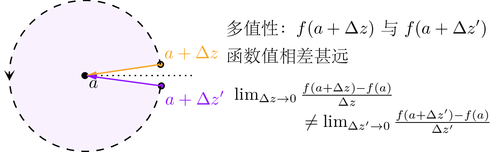
  

  

---

<!-- slide: 割线 -->

### 割线

- 为了 **禁止** 多值现象，可以从支点出发画一条曲线把 $\mathbb{C}$ 割破，称为 **<green>割线**，并 **<red>明令禁止** $z$ 穿过割线。同时，**人为** **选** 定割线外 **一点** 的函数值作为 **基准**。

  $\Rightarrow$ **唯一确定** 整个连通解析区的函数值，完全 **杜绝** 多值现象

  

  **多个支点**

  当函数有 **多个支点** 的时候，需要 **每个** 支点都连上割线。若有支点无割线，则出现 **多值漏洞**
  

---

<!-- slide: 割线：例 -->

### 割线：例

- 考虑 $w = \sqrt{z - a}$，支点是 $a, \infty$

  

  
  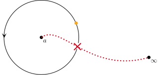
  

---

<!-- slide: 割线：例 -->

### 割线：例

- 考虑 $w = \sqrt{(z - a)(z - b)}$，支点是 $a, b$

  

  
  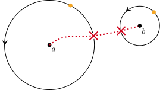
  

---

<!-- slide: 割线 -->

### 割线

**非局域算符**

在未来的物理学习中，会碰到 **准局域算符** 和连接准局域算符的 **拓扑线算符**：这些东西跟跟支点、割线非常相似。

关键词：狄拉克磁单极与狄拉克弦，伊辛模型、disorder 算符和 non-invertible defect line

---

<!-- slide: 割线：例 -->

### 割线：例

- 割线不唯一
- 再次考虑 $w = \sqrt{(z - a)(z - b)}$，$a \ne b$，支点为 $a,b$

  

  
  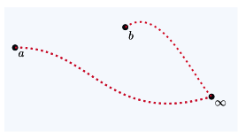
  

---

<!-- slide: 割线：例 -->

### 割线：例

- 割线不唯一
- 考虑 $w = {(z - a)^{\frac{1}{2}}(z - b)^{\frac{1}{3}}}$，$a \ne b$，支点为 $a,b, \infty$

  

  
  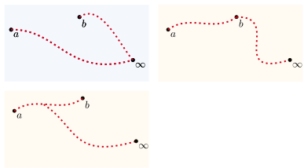
  

---

<!-- slide: 割线与基准值 -->

### 割线与基准值

**选定基准值**

在设置割线时，需要人为 **选** 定割线外某点的函数值作为基准。一旦选好了，割线外的所有点函数值均可以通过 **连续性** **唯一** 确定。

 

---

### 割线与基准值：例

- 考虑 $f(z) = \sqrt{z}$。支点 $0, \infty$。选割线为 $(-\infty, 0]$
- 选择 $f(z = 1) = +1$

  

  
  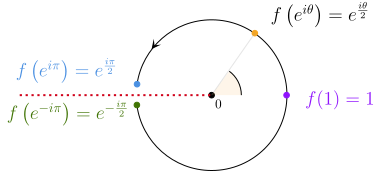
  

- 得到 $f(-1 + i \epsilon) = + i$，$f(- 1 - i \epsilon) = - i$，$\epsilon \to 0+$

---

### 割线：例

- 更一般地，对 $x < 0$，割线的上岸和下岸的值已被确定，

  $$
  f(x + i \epsilon) = i |x|^{\frac{1}{2}}, \qquad
  f(x - i \epsilon) = - i |x|^{\frac{1}{2}} \ .
  $$

  

  **割线**

  割线上的点已经被 **<red>舍弃**，$f(x < 0)$ **无定义**。
  

---

### 其它常见多值函数

- 多值函数无处不在，除了根式函数，还有
  - 一般幂次函数 $z^\alpha$，$\alpha \in \mathbb{C}$
  - 对数函数：$\ln (z - a)$
  - 反三角函数 $\arcsin z$, $\arccos$, $\arctan$ 等
  - 单值函数、多值函数的各种复合，如

  $$
  \left(\frac{z - a}{z - b}\right)^\alpha, \qquad
  \ln \left(z^\alpha + (1 - z^2)^\beta\right) \ , \qquad \cdots \ .
  $$

---

### 其他空间上的复分析

- 除了割线，还有别的方法治理多值性问题：多叶黎曼面 (Riemann surface)
- 以 $f(z) = \sqrt{z}$ 为例：原点是一个 **支点**，绕原点一圈会有多值现象

  $$
  f(e^{2\pi i}z) = - f(z) \ .
  $$

- 杜绝多值性的老方法：画割线，禁止穿越
- 杜绝多值性的新方法：**扩展定义域**，把 $e^{2\pi i}z$ 与 $z$ 看成两个 **不同的点**，但同时尊重 **连续性**

---

### 其它空间上的复分析

- 先只关注单位圆，把单位圆所有点**复制一遍**

  

  
  
  

---

### 其它空间上的复分析

- 利用函数的**连续性**，把两个单位圆 **<purple>连接起来**

  

  
  
  

---

### 动画：双圆

<iframe src='./animation/DoubleCircle.html' frameborder='0' style='width:768px;height:440px'></iframe>

---

### 其它空间上的复分析

- 两个**原点合同**，因为 $f(z)$ 在**原点没有多值性**
  

  **极简主义**

  数学家崇尚 **极简主义**，不引入非必要的东西。$f(z)$ 在原点处本身 $f(0) = 0$，**<red>没有多值** 现象，**<red>不需要** 复制多一份原点。
  

---

### 其它空间上的复分析

- 为了保持连续性，把两个单位圆连接起来，并共享原点

  

  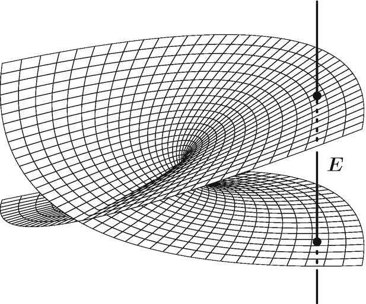

  

  

  **一阶支点**

  注意原点是一阶支点，**转两圈**，多值性消失。
  

---

# 其他空间上的复分析

- $\sqrt{z}$ 对应的 Riemann surface

  

  
  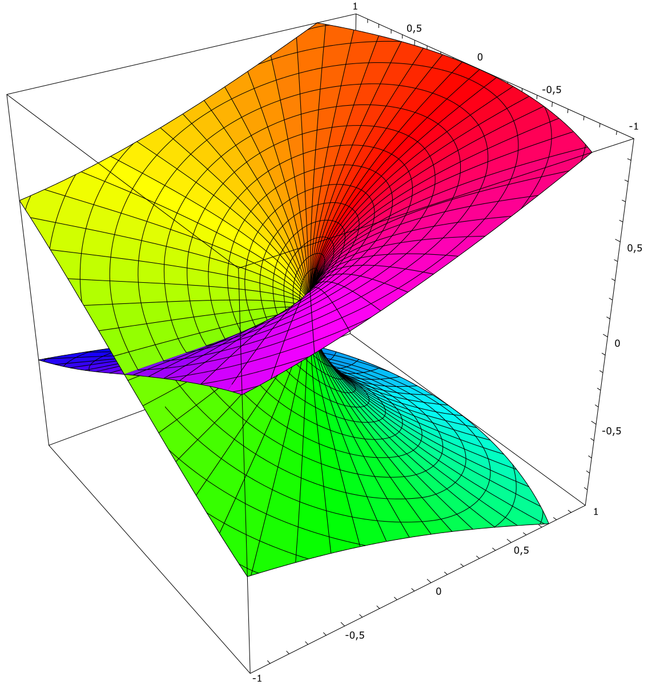
  双叶黎曼曲面

  

---

# 其他空间上的复分析

- $\sqrt{z}$ 对应的 Riemann surface
  

  **虚假的交汇**

  双叶黎曼面实际 **<red>并没自相交**，图中的交线来源于三维绘图空间的束缚。可以在高维空间中绘制不自交的双叶黎曼面。
  

---

# 其他空间上的复分析

- $z^{1/3}$ 对应的 Riemann surface

  

  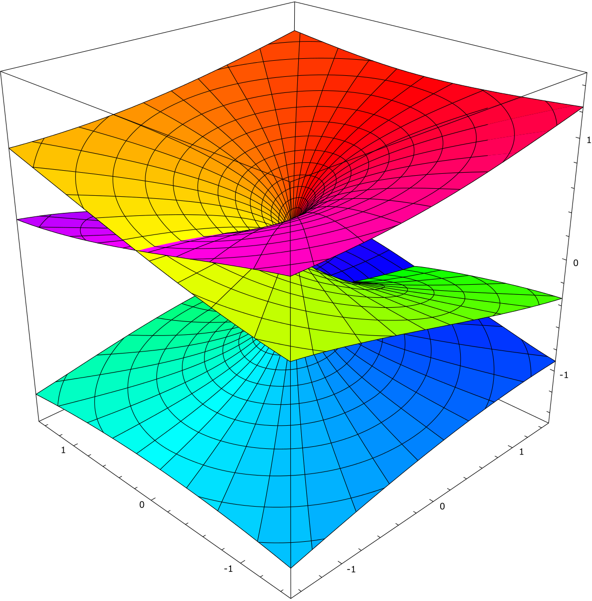
  三叶黎曼曲面

  

---

# 其他空间上的复分析

- $z^{1/4}$ 对应的 Riemann surface

  

  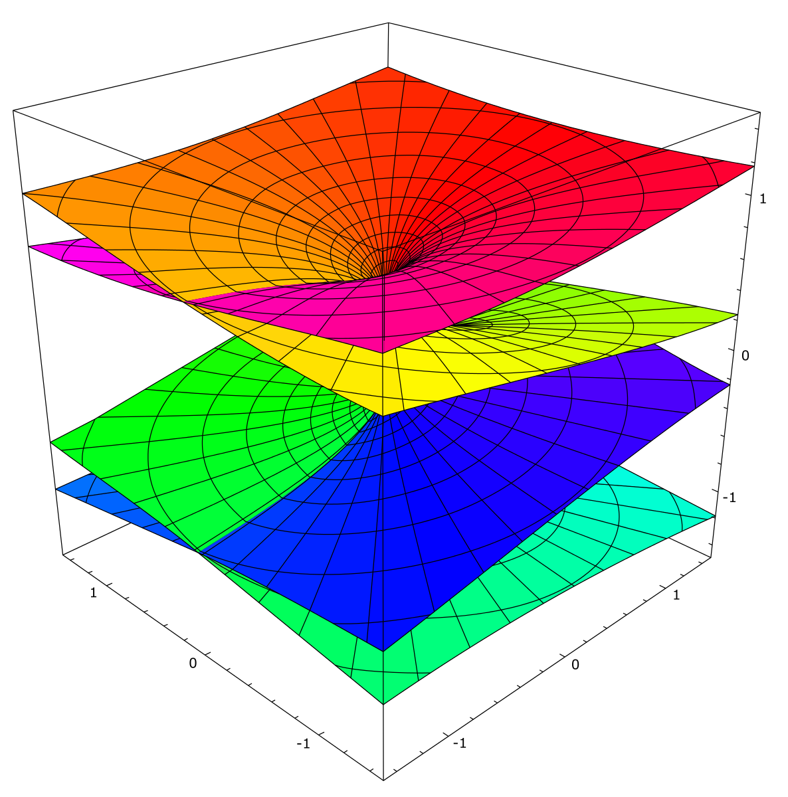

  四叶黎曼曲面

  

---

# 其他空间上的复分析

- $\ln z$ 对应的 Riemann surface

  

  
  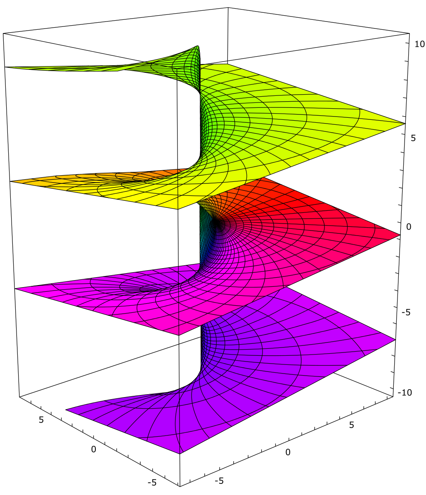
  无穷叶黎曼曲面
  
  

---

### 其他空间上的复分析

- 把无穷远点也加进来：闭合黎曼曲面
- 最简单的例子：$\mathbb{C} \cup \{\infty\} = \mathbb{C}P^1$ 上的复变函数实际上就是我们课程的内容
- $z^{1/n}$ 对应的 **<purple>$n$ 叶黎曼曲面** 补上无穷远点：依然是 $\mathbb{C}P^1 = S^2$
- 如果有多于两个支点，粘合形成其他闭合黎曼曲面

---

### 其他空间上的复分析

- 例子：二维环面 $T^2$， 可以通过 $\mathbb{C}$ 上区域来构造
- 考虑 $\mathbb{C}$ 中平行四边形

  

  
  <iframe src='animation/Torus.html' frameborder='0' style='width:768px;height:440px'></iframe>
  

---

### 其他空间上的复分析

- 环面上的任何一点都可以用 $\mathbb{C}$ 中平行四边形的点代表。
- 环面上继承 $\mathbb{C}$ 的坐标 $z, \bar z$：可以研究二维环面上的函数、极限、可导性等问题
- 还可以考虑更加复杂的二维曲面，比如

  

  
  

- 在这些曲面上均可研究解析函数

---

### 其他空间上的复分析

- 还可以考虑高维空间上的复分析：复几何 (complex geometry), 代数几何 (algebraic geometry) 