# 复积分

$$
\gdef\red#1{{\color{cb8680}{#1}}} 
\gdef\green#1{{\color{4f8d63}{#1}}} 
\gdef\gray#1{{\color{aaaaaa}{#1}}} 
\gdef\purple#1{{\color{B189C6}{#1}}} 
\gdef\orange#1{{\color{dfa04b}{#1}}}
\gdef\white#1{{\color{white}{#1}}}
\gdef\blue#1{{\color[rgb]{0.20, 0.43, 0.75}{#1}}}
\gdef\yellow#1{{\color[rgb]{0.984375, 0.9140625, 0.62109375}{#1}}}
$$

---

# 纲要

- 复积分

  <gray>复积分的定义、常用计算方法、例子、基本性质</gray>

- Cauchy 积分定理与 Cauchy 积分公式

  <gray>Cauchy 积分定理、一致连续性、Cauchy 积分定理证明、路径无关性、Cauchy 积分公式、高阶导数</gray>

---

# 复积分定义

---
<!-- header: 一、复积分定义 -->
### 曲线

* 定义和计算积分需要指定积分曲线。曲线有许多种类。
* **<green>光滑** 曲线：曲线方程 $y = f(x)$ 中 $f'(x)$ 连续，或者 $(x(t), y(t))$ 中 $x'(t), y'(t)$ 连续
* **<green>逐段光滑** 曲线：有限条光滑曲线衔接而成的曲线
* **<green>简单** 开放曲线：没有自相交开放曲线，可以明确地 **人为指定** 从起点到终点的 **<green>方向**
* **<green>围线**：仅首尾相交的简单闭合曲线，通常要求逐段光滑
* 正向 **约定**：使所围区域的内部在 **左边**，差不多就是逆时针

---
### 曲线

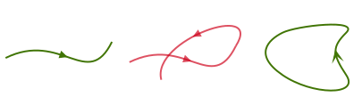

---

### 复积分

- 复积分的核心思想：**黎曼积分**
* 复数可加性：**复数之和还是复数** $\Rightarrow$ 小复数累积成大复数
* 黎曼积分基本要求：分割不变性、插值不变性
* 考虑曲线 $C$，函数 $f(z)$ 在 $C$ 上有定义

  

  

  

---
### 复积分分割

- 把 $C$ 分割成 $n$ 小段，$z_0 = z(\alpha)$，$z_1, \cdots, z_n = z(\beta)$

  

  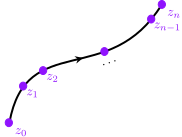

  

---
### 复积分插值

- 在 $n$ 小段中引入插值点 $\zeta_k$

  

  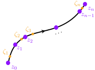

  

---
### 复积分插值

- 求和 $S_n$ 的大 $n$ 极限定义为 $f(z)$ 沿 $C$ 的 **<green>复积分**
  $$
  S_n = \sum_{k = 1}^{n} f(\zeta_k) (z_k - z_{k - 1}) \, , \quad
  \mathcal{I} = \int_C f(z) dz \coloneqq \lim_{n \to \infty}S_n
  $$

---
### 无穷多分割

**无穷多分割**

给定 $C$，用 $\{z_k\}$ 分割的方法有无穷多种。我们希望随着 $n \to \infty$，所有分段的长度都逐渐趋于 **无穷小**，即
$$
\lim_{n \to \infty}\max_{1 \le k \le n - 1} |z_k - z_{k - 1}| = 0 \, .
$$

有一些分割法不满足这个要求，我们 **<red>不考虑**。

---
### 不可取的分割法

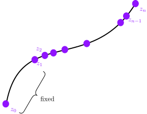

---
### 分割与插值不变性

**分割与插值不变性**

给定 $C$，有无穷多种用 $\{z_k\}$ 分割和 $\{\zeta_k\}$ 插值的方法。我们希望 $\lim_n S_n$ 与这些具体的分割和插值的方法无关，从而给出唯一的确定的复积分 $\mathcal{I}$。

有时，$f(z)$ 的性质过于恶劣，使得 $\lim_{n \to \infty}$ 依赖具体的分割和插值，此时我们说 $\mathcal{I}$ **<red>无法定义/不存在**。

---
### 逆向积分

- 给定一条曲线 $C$，并确定方向。以此可以定义其 **<green>逆方向曲线**，记作 $C^-$、$-C$，并给出逆向积分，
  $$
  \int_{C^-}f(z) dz = \int_{- C} f(z) dz \coloneqq - \int_C f(z) dz \, .
  $$

---
### 复积分存在性定理

- 在日常生活中，$\mathcal{I}$ 都是存在的。
* **可积性定理**：若函数 $f(z) = u(z) + i v(z)$ 沿 $C$ **连续**，则它沿着 $C$ 的复积分 **存在**，而且可以转化为实积分之和，
  $$
  \int_C f(z) dz = \int_C (udx - v dy) + i\int_C (vdx + udy)
  $$

---
### 复积分与实积分

**复积分与实积分**

复积分与实积分本质是一样的，因为复数加法与实数加法是兼容的，
$$
z_1 + z_2 = (x_1 + x_2) + i(y_1 + y_2) \, .
$$
此外，
$$
\begin{align*}
f(\zeta_k) (z_k - z_{k - 1}) = & \, \Big[u(\zeta_k) (x_k - x_{k - 1})  - v(\zeta_k)(y_k - y_{k - 1}) \Big] \\
& \, + i \Big[u(\zeta_k) (y_k - y_{k - 1}) + v(\zeta_k) (x_k - x_{k - 1}) \Big]
\end{align*}
$$

---

### 复积分基本性质

- 设 $f(z), g(z)$ 沿曲线 $C$ **连续**。则相应的复积分具有如下的几个性质。
* 线性性
  $$
  \int_C [a f(z) + b g(z)] = a \int_C f(z) dz + b \int_C g(z) dz, \qquad
  \forall a, b \in \mathbb{C} \, .
  $$
* 路径可加性
  $$
  \int_{C_1 + C_2} f(z) dz = \int_{C_1} f(z) dz + \int_{C_2} f(z) dz \, .
  $$

---
### 复积分基本性质

* 路径反向
  $$
  \int_{-C} f(z) dz = - \int_C f(z) dz \, .
  $$
* 积分微元平移不变性 $dz = d(z + a)$, $\forall a \in \mathbb{C}$
* 积分微元线性性 $d(\lambda z) = \lambda dz$，$\forall \lambda \in \mathbb{C}$

---
### 复积分基本性质

* 三角不等式
  $$
  \bigg| \int_C f(z) dz \bigg|
  \le \int_C \Big|f(z) \Big| \Big|dz\Big| = \int_C \Big|f(z)\Big| ds \, .
  $$
  $$
  \bigg| \int_C f(z) dz + \int_{C'}f(z) dz \bigg|
  \le \int_C \Big|f(z) \Big| \Big|dz\Big| + \int_{C'} \Big|f(z) \Big| \Big|dz\Big| \, . 
  $$

---
### 计算复积分的常用方法

- 复积分可以用定义直接计算，也可以转化为实积分。实积分的各种技巧都可以一展身手，包括参数方程、变量替换

---
### 计算复积分的常用方法
- 例：设 $C$ 是一条简单光滑开放曲线，起于 $a$ 终于 $b$。计算 $\int_C dz$

  

  **计算**

  积分函数是常数函数 **$f(z) = 1$**。可以用 **定义** 直接求解。对 $C$ 进行分割，分割点 $z_1, z_2, \cdots$。任选插值点 $\zeta_k$，必然有
  $$
  \int_C dz = \lim_{n \to \infty}S_n = \lim_{n \to \infty} \sum_{k = 1}^n (1) (z_k - z_{k - 1})
  $$

  

---
### 计算复积分的常用方法

- 例：设 $C$ 是一条简单光滑开放曲线，起于 $a$ 终于 $b$。计算 $\int_C dz$

  

  **计算**

  把 $n$ 项求和展开可以看到
  $$
  \begin{align*}
  & \, \sum_{k = 1}^{n}(z_k - z_{k - 1})
  = z_1 - z_0 + z_2 - z_1 + \cdots + z_{n - 1} - z_{n - 2} + z_n - z_{n - 1}\\
  = & \, z_n - z_0 = z(\beta) - z(\alpha) = b - a \xrightarrow{n \to +\infty} b - a \, .
  \end{align*}
  $$

  

---
### 闭合曲线积分

**闭合曲线**

倘若 $C$ 是 **简单闭合曲线/简单围线**，则 $b = a$，此时
$$
\oint_C dz = b - a = 0 \, .
$$

---
### $z$ 的积分

* 例：设 $C$ 是任意一条始于 $a$ 终于 $b$ 的简单光滑开放曲线。计算积分 $\int_C z dz$。

  

  **计算**

  利用实虚分解
  $$
  \begin{align*}
  \int_C z dz = & \, \int_C (x + iy) (dx + i dy) = \int_C (xdx - ydy) + i \int_C (xdy + ydx) \\
  = & \, \int d\Bigg[\frac{1}{2}(x^2 - y^2)\Bigg] + i \int d(xy) \\ 
  = & \, \frac{1}{2}(x + iy)^2 \bigg|_{a}^{b} = \frac{1}{2}z^2 \bigg|_a^b = \frac{1}{2}(b^2 - a^2) \, .
  \end{align*}
  $$

  

---
### $z$ 的围道积分

- 推论：设 $C$ 是任意一条简单围线，则
  $$
  \oint_C z dz = 0 \, .
  $$

  

  **首尾相同**

  用上面一个例子的结果，令 $b = a$ 即可。

  

---
### $z^n$ 的圆周积分

- 例：设 $C =\{z \in \mathbb{C} \, | \, |z| = \rho \}$ 是半径为 $\rho > 0$ 的圆周。按通常约定，正方向是逆时针。求
  $$
  \mathcal{I} = \oint_C z^n dz \, , \qquad n + 1 \ne 0 \, ,
  $$

---
### $z^n$ 的圆周积分

**计算**

曲线是一个以原点为中心的圆周，因此可以考虑使用参数方程
$$
z(\theta) = \rho e^{i\theta} \, , \qquad \theta \in [0, 2\pi] \, .
$$
从而，$dz = d (\rho e^{i \theta}) = \rho i e^{i \theta} d\theta$。于是积分可以计算
$$
\mathcal{I} = \int_0^{2\pi} \rho^n e^{n i \theta} \rho i e^{i \theta} d\theta
= \int_0^{2\pi} \rho^{n + 1} e^{(n + 1)i \theta} d i \theta \, .
$$

---
### $z^n$ 的圆周积分

**计算**

利用实积分的技巧，
$$
\begin{align*}
\mathcal{I} = & \, \frac{\rho^{n + 1}}{n + 1} \int_0^{2\pi i(n + 1)} e^{(n + 1)i\theta} d[i(n + 1)\theta]\\
= & \, \frac{\rho^{n + 1}}{n+1} \int_0^{2\pi i (n + 1)} e^x dx  = \frac{\rho^{n + 1}}{n + 1} e^x \bigg|_{0}^{2\pi i(n + 1)} \\
= & \, \frac{\rho^{n + 1}}{n + 1}(e^{2\pi i (n + 1)} - e^0) = 0 \, .
\end{align*}
$$

---
### $z^n$ 的圆周积分

**半径无关性**

这个积分值与积分曲线的半径 $\rho$ **<red>无关**，都是零。后面我们会了解这个无关性的由来。

---
### $(z-a)^{-1}$ 的积分

* 例：考虑一个圆周 $C =\{z \in \mathbb{C} \, | \, |z - a| = \rho\}$，以 $a$ 为中心 $\rho > 0$ 为半径。计算积分
  $$
  \mathcal{I} = \oint_C \frac{1}{z - a} dz \, .
  $$
---

### $(z-a)^{-1}$ 的积分

**计算**

由于曲线仍然是圆周 (**<purple>以 $a$ 为中心**)，因此可以采用参数化
$$
z(\theta) = \purple{a} + \rho e^{i \theta}, \qquad \theta \in [0, 2\pi] \, .
$$

从而，$dz = d(a + \rho e^{i \theta}) = \rho i e^{i \theta} d\theta$。代入到积分中，
$$
\mathcal{I} = \int_0^{2\pi} \frac{1}{\rho e^{i \theta}} \rho i e^{i \theta} d\theta = i \int_0^{2\pi} d\theta = 2\pi i\, .
$$

---
### 重要结论

**半径无关性**

这个积分结果同样与圆周的半径 $\rho$ **<red>无关**。总结起来，
$$
\frac{1}{2\pi i} \oint_{|z-a|=\rho} \frac{1}{z - a} dz = 1 \, ,
$$
这是一个后面经常用的重要结论。

---
### $\bar{z}$ 的积分

- 设 $C = \{ z \in \mathbb{C} \, | \, |z| = \rho\}$ 是一个半径 $\rho > 0$ 的圆周，考虑积分
  $$
  \mathcal{I} = \oint_C \bar z dz \, .
  $$

  

  **计算**

  同样利用参数方程 $z(\theta) = \rho e^{i \theta}$。此时积分
  $$
  \oint \rho e^{- i \theta} \rho i e^{i \theta} d\theta = \int_0^{2\pi} \rho^2 i d\theta = \rho^2 2\pi i\, .
  $$

  

---
### $\bar{z}$ 的积分

**半径依赖**

这一次的积分与 $\rho$ 有明显关系。对比之前的结果，**<red>差别在哪里**？

---
### $\bar{z}^n$ 的积分

- 设 $C = \{ z \in \mathbb{C} \, | \, |z| = \rho\}$ 是一个半径 $\rho > 0$ 的圆周，考虑积分
  $$
  \mathcal{I} = \oint_C \bar z^n dz \, , \qquad n \ne 1\, .
  $$

  

  **计算**

  同样利用参数方程 $z(\theta) = \rho e^{i \theta}$。此时积分
  $$
  \oint \rho^n e^{- n i \theta} \rho i e^{i \theta}d\theta  = \int_0^{2\pi} \rho^n e^{-i (n - 1) \theta} i d\theta = 0\, .
  $$

  

---
### 变量替换

- 设 $C =\{ z \in \mathbb{C} \mid |z| = 1 \}$ 是一个单位逆时针圆周。计算
  $$
  \mathcal{I} = \oint_C \frac{dz}{z^2} \, .
  $$

  

  **计算**

  利用巧妙的 **变量替换** 计算，$u= 1/z$，$z^{-2} = u^2$
  $$
  dz = d(1/u) = - \frac{1}{u^2} du \, .
  $$
  $$
  \mathcal{I}
  = \oint_{(|u| = 1)^-} u^2 \bigg(-\frac{1}{u^2}\bigg) du
  = - \oint_{(|u| = 1)^-} du = 0 \, .
  $$

  

---

# 柯西的几个定理

---
### Cauchy 积分定理

- 根据上面的众多计算结果，我们发现许多简单函数的围道积分的值是 **零**。比如，多项式的圆围道积分
  $$
  \oint_{|z| = 1} dz \sum_{k = 0}^{n} a_n z^n = 0 \, .
  $$

---
### Cauchy 积分定理

- **Cauchy 积分定理**：设 $f(z)$ 在 **单连通** 区域 $D$ 内部 **解析**，以及任意围线 $C \subset D$，则
  $$
  \oint_C f(z) dz = 0 \, .
  $$

  

  
  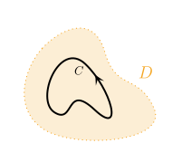
  

---
### Cauchy 积分定理的意义

- **Cauchy 积分定理有另一个版本**：若 $f(z)$ 在 **单连通** 区域 $D$ 的闭包 $\bar D = D \cup \partial D$ 上 **连续**，在 $D$ 内 **解析**，则
  $$
  \oint_{\partial D} f(z) dz = 0 \, .
  $$

---
### Cauchy 积分定理

- **Cauchy 积分定理的特殊情况**：设 $f(z)$ 在 **单连通** 区域 $D$ 内部 **解析**，且 $f'(z)$ 在  $D$ 内**连续**，以及任意简单围线 $C \subset D$，则
  $$
  \oint_C f(z) dz = 0 \, .
  $$

---

### Cauchy 积分定理

**特殊情况的证明**

- 可以用 **格林公式**。记 $D' \subset D$ 为 $C$ 所围的 **内部区域**，
  $$
  \begin{align*}
  \oint_C f(z) dz
  = & \, \oint_{C} (udx - vdy) + i\oint_C (udy + vdx) \\
  = & \, - \oint_{D'} \left(\frac{\partial v}{\partial x} + \frac{\partial u}{\partial y}\right) dx dy
  + i \int_{D'} \left(\frac{\partial u}{\partial x} - \frac{\partial v}{\partial y}\right) \orange{= 0} \, .
  \end{align*}
  $$

---
### Cauchy 积分定理

**单连通**

单连通是为了保证围道所围区域 $D'$ 内 $f$ 都是 **解析** 的。

---
### Cauchy 积分定理

- 一般情况下 Cauchy 积分定理的证明需要用到新的连续性：**一致连续性**。

---
### 一致连续

* 先来回顾 $f(z)$ 在 **一点** 处，以及在一个 **区域** 上的连续性。
* **<green>定义**：函数 $f(z)$ 在 **一点 $z_0$** 处 **<green>连续**：设 $f$ 在 $D$ 中定义，给定 $z_0 \in D$。若对 $\forall \epsilon > 0$ 都 $\exists \delta_\epsilon > 0$ 使得对 $\forall z \in N(z_0, \delta_\epsilon) \cap D$ 均有
  $$
  |f(z) - f(z_0)| < \epsilon \, .
  $$
* **<green>定义**：函数 $f(z)$ 在 **$D$ 中** **<green>连续**：设 $f$ 在 $D$ 中定义。若对 $\forall z_0 \in D$以及 $\forall \epsilon > 0$，都 $\exists \delta_{\epsilon, z_0} > 0$ 使得对 $\forall z \in N(z_0, \delta_{\epsilon, z_0}) \cap D$ 均有
  $$
  |f(z) - f(z_0)| < \epsilon \, .
  $$

---
### 连续性的概念回顾

**连续的直观理解**

只要 $z$ 与 $z_0$ 「足够接近」(以 $\delta_{\epsilon, z_0}$ 为标准)，则 $f(z)$ 值必然与 $f(z_0)$ 足够接近 (以 $\epsilon$ 为标准)。

关键：「足够接近」的标准 $\delta_{\epsilon, z_0}$ 与 $z_0$ **有关**，会随着 $z_0$ **变动**。

---
### 一致连续

* 对上述连续的定义进行些许修改，即得如下定义。
* **<green>定义**：$f(z)$ 在 **闭包 $\overline D$** 上 **<green>一致 (uniformly) 连续** ：设 $f$ 定义在 $\overline D$ 上，对于 $\forall z_0 \in \overline D$ 以及 $\forall \epsilon > 0$，都 $\exists \delta_{\epsilon} > 0$，使得对 $\forall z \in N(z_0, \delta_\epsilon) \cap \overline D$ 都有
  $$
  |f(z) - f(z_0)| < \epsilon \, .
  $$

  

  **一致连续的直观理解**

  只要 $z$ 距离 $z_0$ 「足够接近」(以 $\delta_{\epsilon}$ 为标准)，则 $f(z)$ 值必然与 $f(z_0)$ 足够接近 (以 $\epsilon$ 为标准)。

  关键点：「足够接近」的标准 $\delta_{\epsilon}$ **<red>与 $z_0$ 无关**，全 $\overline D$ **统一** 标准。

  

---
### 一致收敛

- **一致连续判断定理**：若 $f$ 在区域 $D$ 中 **连续**，则 $f$ 在 $D$ 中任何一个 **子闭域 $\overline {D'}$** 上 **一致连续**。

  

  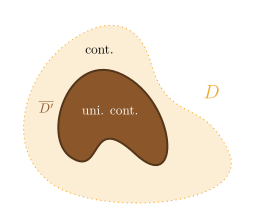
  

---
### Cauchy 积分定理证明的核心思路

* 用非常多分段的 **闭折线**/多边形 来近似 **围线**
* 用 **多项式** 近似 **一般解析函数**

  

  **多项式**

  多项式情况的 Cauchy 积分定理证明已经完成。

  

* 刻画上述近似的 **<red>误差**
* 利用积分的线性性和路径可加性，逐步简化问题
  $$
  \begin{bmatrix}
  \text{\small{曲线}} \\ f
  \end{bmatrix}
  \to 
  \begin{bmatrix}
  \text{\small{多边形}} \\ f
  \end{bmatrix}
  \to
  \begin{bmatrix}
  \text{\small{三角形}} \\ f
  \end{bmatrix}
  \to
  \begin{bmatrix}
  \text{\small{无穷小三角形}} \\ \text{\small{多项式}} \ P
  \end{bmatrix}
  $$

---
### Cauchy 积分定理的证明

* 任取子闭域 $\overline{D'} \subset D$，使其包含 $C \subset \overline{D'}$。
* 在 $C$ 取 **<green>分割点 $\{z_k\}$**，并用折线 $P = P_1 \cup P_2 \cup \cdots \cup P_n$ 连接。当 $n \to \infty$，$P \subset \overline{D'}$
* 由上述定理，$f(z)$ 在子闭域 $\overline{D'}$ 上 **一致连续**

---
### Cauchy 积分定理的证明

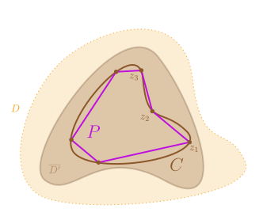

---
### Cauchy 积分定理的证明

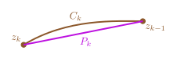

* 刻画误差 (恒等变换)
  $$
  \begin{align*}
  & \, \bigg| \oint_C f(z) dz - \oint_P f(z) dz \bigg|
  = \bigg| \sum_{k} \int_{C_k} f(z) dz - \sum_{k} \int_{P_k} f(z)dz \bigg| \\
  = & \, \Bigg| \, 
            \sum_{k} \left[\int_{C_k} f(z) dz - \red{\int_{C_k}f(z_k)dz}\right]
   - \sum_{k} \left[\int_{P_k} f(z)dz - \red{\int_{P_k}f(z_k)dz}\right] \,
  \Bigg|
  \end{align*}
  $$
  注意红色两项 **<red>抵消**，因为 $f(z_k)$ 是个 **常数**，可以拉出积分号外

---
### Cauchy 积分定理的证明

* 我们希望这个误差越小越好 (小于任意给的精度要求 $\epsilon$)，为此我们希望取足够 **密** 的分割点。
* 利用 $f$ 在 $\overline{D'}$ 上的一致连续性，可以确立「足够密」的标准。
* 由 **一致连续性**，对任意给定精度要求 $\forall \epsilon$，必然 $\exists \delta_\epsilon > 0$，使得只要 $|z - z_k| < \delta_\epsilon$，都有 $|f(z) - f(z_k)| < \epsilon$。
  

  **一致性**
  
  这个“工艺标准” $\delta_\epsilon$ **<red>与 $z$ 无关**，在整个 $\overline{D'}$ 上都适用。
  

---
### Cauchy 积分定理的证明
* **足够密集**：所有小段长 $L(P_k) < L(C_k) < \delta_\epsilon$ 即可。此时，任意点 $z \in C_k, P_k$，都自动满足不等式
  $$
  |f(z) - f(z_k)	| < \epsilon \, .
  $$

---
### Cauchy 积分定理的证明

* 基于这个密集分割，多边形近似的误差很小 (三角不等式)，
  $$
  \begin{align*}
  & \, \bigg| \oint_C f(z) dz - \oint_P f(z) dz \bigg| \\
  < & \, 
   \sum_{k} \left[\int_{C_k} \Big|f(z) - f(z_k)\Big| \Big|dz\Big|\right]
             + \sum_{k} \left[\int_{P_k} \Big|f(z) - f(z_k)\Big| \Big|dz\Big|\right] \\
  < & \, \sum_{k} \bigg[\epsilon \underbrace{\int_{C_k} \Big|dz\Big|}_{L(C_k)} + \epsilon \underbrace{\int_{P_k} \Big|dz\Big|}_{L(P_k) < L(C_k)} \bigg]
          < 2 L(C) \epsilon \, .
  \end{align*}
  $$
* $\Rightarrow$ 多边形近似可以做到无穷高精度。

---

### Cauchy 积分定理的证明

* 下面转而研究**多边形**积分
  $$
  \mathcal{I}_P \coloneqq \oint_P f(z) dz \ .
  $$

---

### Cauchy 积分定理的证明

* 路径可加性：**多边形**积分可以用 **三角形积分** 叠加而成
  $$
  \mathcal{I}_P = \sum_{k} \oint_{\Delta_k} f(z) dz \ .
  $$
  
  

  
  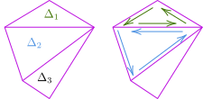
  

  

  **内部抵消**

  内部辅助线的积分总是会 **<red>抵消**。
  

---

### Cauchy 积分定理的证明

* 可惜，有限大三角形的 **任意 $f$** 积分还是 **<red>不会算**

  

  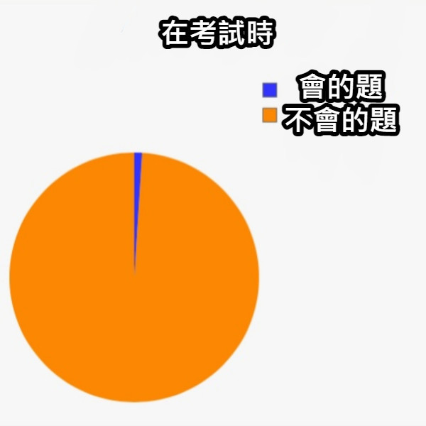
  

---

### Cauchy 积分定理的证明

**<purple>知之为知之，不知为不知，是知也。**

<right>

**<purple>——孔子《论语·为政》**

</right>

碰到不会的问题，要大大方方理直气壮地承认

然后想方设法把不会的问题**转化为会的问题**。

---

### Cauchy 积分定理的证明

* **<red>我们会算什么？**
* 我们会算 **多项式 $P(z)$** 在 **任意围道 $C$** 上的积分：其值为零
* 想办法把 $f(z)$ 搞成 $P(z)$："泰勒展开"
* 泰勒展开近似在 **小尺度** 的时候可以达到很高精度

---

### Cauchy 积分定理的证明

* 任何一个三角形 $\Delta$ 都可以细分为四个 **子三角形**
  $$
  \mathcal{I}_\Delta = \sum_{k = 1}^{4} \oint_{\Delta_k} f(z) dz \ .
  $$
  
  

  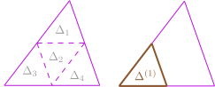
  

---
### Cauchy 积分定理的证明

* 积分三角不等式：筛选出 **积分绝对值最大** 的 **<green>子三角形 $\Delta^{(1)}$**
  $$
  \Big| \mathcal{I}_\Delta \Big| \le \sum_{k = 1}^4 \bigg| \oint_{\Delta_k}f(z) dz \bigg| \le \purple{4 \times} \bigg| \oint_{\Delta^{(1)}} f(z) dz \bigg| = 4 \Big|\mathcal{I}_{\Delta^{(1)}} \Big| \ .
  $$

---

### Cauchy 积分定理的证明

* 梅开二度：三角形 $\Delta^{(1)}$ 里面可以 **再取四个子三角形**，同样提取其中积分绝对值最大的那个 $\Delta^{(2)}$，从而
  $$
  \Big| \mathcal{I}_{\Delta^{(1)}} \Big| \le 4 \Big| \mathcal{I}_{\Delta^{(2)}} \Big| \ .
  $$
* 子子孙孙无穷匮也：同样的操作可以一直做下去
  $$
  \Big| \mathcal{I}_{\Delta^{(2)}} \Big| \le 4 \Big| \mathcal{I}_{\Delta^{(3)}} \Big|, \quad \cdots, \quad \Big|\mathcal{I}_{\Delta^{(n)}} \Big| \le 4 \Big|\mathcal{I}_{\Delta^{(n + 1)}} \Big| \ .
  $$
* 总结起来，
  $$
  \Big| \mathcal{I}_\Delta \Big| \le 4^n \Big| \mathcal{I}_{\Delta^{(n)}} \Big| \ .
  $$

---

### Cauchy 积分定理的证明

* 随着 $n \to \infty$，$\Delta^{(n)}$ 越来越小，逐渐逼近一个 **<green>点 $z_*$**
* 当 $n$ 足够大，$\Delta^{(n)}$ 是包含 $z_*$ 的一个 **<red>很小** 的三角形，$f(z)$ 在 $\Delta^{(n)}$ 上变化 **不显著**
* 在 $\Delta^{(n)}$ 范围内对 $f(z)$ 进行 **一阶近似**
  $$
  \purple{f(z) \sim f(z_*) + f'(z_*)(z - z_*)}
  $$
* **<red>一阶近似有多精确？**

---
### Cauchy 积分定理的证明

**一阶近似的误差**

- 函数 $f(z)$ 在整个 $C$ 内部，包括点 $z_*$ 处解析/可导，
  $$
  f'(z_*) = \lim_{z \to z_*} \frac{f(z) - f(z_*)}{z - z_*} \ .
  $$
- 可导性说明一阶近似是合理的

---

### Cauchy 积分定理的证明

**一阶近似的误差**

**可导** 说明对于 $\forall \epsilon > 0$，总是 **<green>存在 $\delta_{\epsilon} > 0$**，使得对任意 $z \in N(z_*, \delta_\epsilon)$，都有
$$
\bigg| \frac{f(z) - f(z_*)}{z - z_*} - f'(z_*) \bigg| \le \epsilon \ .
$$
将分母 $|z - z_*|$ 移到右边，得到非常小的误差，
$$
\bigg| \purple{f(z) - f(z_*) - f'(z_*)(z - z_*)} \bigg| \le \orange{\epsilon |z - z_*|} \ .
$$
注意，只要 $n$ **足够大**，必然有 $\Delta_n \subset N(z_*, \green{\delta_\epsilon})$。

---

### Cauchy 积分定理的证明

* 恒等变换 (其中第二行 **<red>红色** 项积分为零)
  $$
  \begin{align*}
    \orange{\Big| \mathcal{I}_{\Delta^{(n)}} \Big|}
    = & \ \bigg| \oint_{\Delta^{(n)}} f(z) dz\bigg| \\
    = & \ \bigg| \oint_{\Delta^{(n)}} \Big[f(z) - \red{(f(z_*) + f'(z_*) (z - z_*))}\Big] dz\bigg| \\
    \gray{\text{三角不等式}}\le & \ \oint_{\Delta^{(n)}} \Big|f(z) - (f(z_*) + f'(z_*) (z - z_*))\Big| \Big|dz \Big| \\
    \le & \ \oint_{\Delta^{(n)}} \Big|\orange{\epsilon (z - z_*)}\Big| \Big|dz \Big| \\
    \gray{|z - z_*| < L(\Delta^{(n)})\Rightarrow}\le & \ \epsilon \underbrace{L(\Delta^{(n)})}_{\orange{2^{-n} L(\Delta)}} L(\Delta^{(n)}) = \orange{\epsilon 2^{-2n}L(\Delta)^2} \ .
  \end{align*}
  $$

---
### Cauchy 积分定理的证明
* 综合前文，**任意** **有限大** 三角形积分 $\Delta$ **无穷小**，
  $$
  \Big| \mathcal{I}_\Delta \Big| \le
  4^n \orange{\Big| \mathcal{I}_{\Delta^{(n)}} \Big|}
  \le 4^{n} \orange{\epsilon 2^{-2n} L(\Delta)^2} = \epsilon L(\Delta)^2
  $$

---

### Cauchy 积分定理的证明

* 因此，任意有限大三角形积分实际上是 **零** 
* 因此，任意 **多边形** 的积分也是 **零**
  $$
  \bigg|\mathcal{I}_P \bigg| = 0 \ .
  $$
* 因此，任意曲线 $C$ 的积分也自然是 **零**，因为 $P$ 积分可以用于无穷近似 $C$ 积分，
  $$
  \bigg|\oint_C f(z) dz \bigg| = 0 \ .
  $$

---

### Cauchy 积分定理推论

* **定理**：若 $f(z)$ 在 **单连通** 区域 $D$ 内解析，任取 $z_1, z_2 \in D$，以及曲线 $C \subset D$ 连接 $z_1, z_2$，则积分
  $$
  \int_C f(z) dz
  $$
  与 $C$ 的具体选取 **<red>无关**，可以直接记做 $\int_{z_1}^{z_2} f(z) dz$。

  

  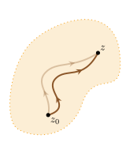

  

---

### Cauchy 积分定理推论

* **定理**：若 $f(z)$ 在 **单连通** 或 **复连通** 区域 $D$ 内解析。设积分路径 $C \subset D$ 端点 $z_1, z_2 \in D$，则在 **固定端点** 的前提下，路径 $C$ 在 **$D$ 内** 的 **连续变化** 不改变积分值
  $$
  \mathcal{I} \coloneqq \int_C f(z) dz \ .
  $$

---

### Cauchy 积分定理推论

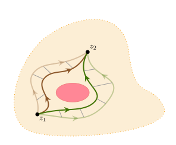

---

### 变上限积分

- **定理**：设 $f(z)$ 在 **单连通** 区域 $D$ 内解析，考虑任意 $z, z_0 \in D$ 以及从 $z_0$ 到 $z$ 的简单曲线 $C \purple{\subset D}$，可以定义在 $D$ 内解析的 **<green>变上限积分**
  $$
  \begin{align*}
    \Phi(z) \coloneqq \int_C f(w) dw \ , \qquad \text{s.t.}~\Phi'(z) = f(z)
  \end{align*}
  $$
  

  **路径无关性**
  
  变上限积分可以看成是以 **$z$ 为自变量** 的函数，与 $C$ 的具体选择 **<red>无关**，而且是 **解析函数**，$\Phi(z)' = f(z)$。这种情况下，以后我们直接把上述积分写成
  
  

  
  $\Phi(z) = \displaystyle\int_{z_0}^{z} f(z) dz$ **<red>不强调** 积分路径
  

  

---
### 变上限积分

  

  

  单连通区域里的变上限积分与路径 **<red>无关**
  

---

### 原函数

- 变上限复积分实际上是大一所学的 **原函数** 的复变推广
* **<green>定义**：设函数 $f(z)$ 在 **单连通** 或 **复连通** 区域 $D$ 中解析，若函数 $\Phi(z)$ 满足
  $$\Phi'(z) = f(z)$$
  则称 $\Phi(z)$ 为 $f(z)$ 的 **<green>不定积分/原函数**。

  

  **变上限积分**
  
  显然，**单连通**解析区域中定义的变上限积分作为 $z$ 的函数，是一个原函数
  

---
### 原函数

**单连通复连通**

**原函数**在单连通和复连通区域都可以定义。

---
### 原函数

**不唯一性**

与实变函数的原函数类似，给定 $f(z)$，其原函数并 **<red>不唯一**；任何两个原函数必然相差 **某个复常数**，于是任意原函数必然是变上限积分 $+$ 任意常数

  

**解析性与原函数存在性**

后面会介绍，若 $f(z)$ 本身不解析，则 $f(z)$ **<red>没有原函数**。

一个实变函数 **<purple>就算不是处处可导**，它也依然 **可以** 具有原函数。但是，复变函数中，原函数的存在性 **<red>更加苛刻**，需要 $f(z)$ 本身具有**解析性**。

---

### 原函数

- **定理**：若 $D$ 是 $f(z)$ 的 **单连通** 解析区域，则 $\Phi(z)$ 必然在 $D$ 内 **单值**。
* 与实变函数类似，现在也有牛顿-莱布尼兹公式。
* **定理**：考虑 **单连通** 区域 $D$ 是 $f(z)$ 的解析区域。若 $\Phi(z)$ 是 $f(z)$ 的 **某一个原函数**，则必然有牛顿-莱布尼兹公式
  $$
  \int_{z_0}^z f(z) dz = \Phi(z) - \Phi(z_0) \ .
  $$

---

### 多值原函数

- **定理**：若 $D$ 是 $f(z)$ 的 **复连通** 解析区域，则 **<green>原函数 $\Phi(z)$** 有 **可能** 在 $D$ 内 **多值**。
* 若 **复连通** $D$ 是 $f(z)$ 解析区域，则 **<green>变上限积分**
  

  
  $\displaystyle \int_{z_0}^z f(z) dz$ **可能**是 $z$ 的 **<purple>多值** 原函数
  

  该值可能 **<red>依赖** 具体的 $z_0 \to z$ 的路径 $C$。

---
### 多值原函数
  
- 对于复连通解析区上的 **原函数** $\Phi$，以及“变上限积分”，可以通过设置**原函数的** **<red>割线** 来使用牛顿-莱布尼兹公式，
  $$
  \int_{z_0}^z f(z) dz = \Phi(z) - \Phi(z_0) \ .
  $$
  

  
  **不同割线**

  $\Phi$ 的割线设置不唯一，且割线的选择与 $z_0 \to z$ 的合法路径 **<purple>相互锁定**。
  
  割线变动，会导致左边发生改变，右边也同时发生改变，从而保证等式**总是**成立。
  

---

### 多值原函数例子

- 例子：$f(z) = z^{-1}$ 的解析区是 **复连通** 的 $D = \mathbb{C} - \{0\}$。在 $D$ 中 $f(z)$ 有原函数 $\Phi(z) = \ln z + \text{const}$。显然 $\ln z$ 是 **多值** 函数。考虑积分
  $$
  \int_{z_0}^{z} \frac{1}{z} dz \ .
  $$
  积分路径可以有不同选择，分别从左边到右边过去。

  

  
  
  

---

### 多值原函数例子

- 积分从 **<purple>左侧** 过去，走单位半圆路径，辐角逐渐 **减小**，
  $$
  \int_{C_L} \frac{1}{z} dz = \int_{2\pi k + \frac{3\pi}{2}}^{2\pi k + \frac{\pi}{2}} e^{-i \theta} de^{i \theta}
  = i \int_{2\pi k + \frac{3\pi}{2}}^{2\pi k+\frac{\pi}{2}} d\theta = - \pi i \ .
  $$
  

  
  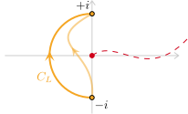
  

---
### 多值原函数例子

- 多值原函数 $\Phi(z) = \ln z + \text{const}$ 的割线应当从右侧平面走 (避开积分路径 $C_L$)，从而有牛顿-莱布尼兹律
  $$
  \int_{C_L}\frac{1}{z}dz = \Phi(+i) - \Phi(-i) = \ln(i) - \ln(-i) = - \pi i \ .
  $$
  

  
  
  

---

### 多值原函数例子

- (2) 积分从 **<purple>右侧** 过去，走单位半圆路径，辐角逐渐 **增加**，
  $$
  \int_{C_R} \frac{1}{z} dz
  = \pi i\ .
  $$
  

  
  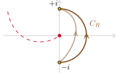
  

---
### 多值原函数例子
- 多值原函数 $\Phi(z) = \ln z + \text{const}$ 的割线应当从左侧平面走 (避开积分路径 $C_R$)，从而有牛顿-莱布尼兹律
  $$
  \int_{C_R}\frac{1}{z}dz = \Phi(+i) - \Phi(-i) = \ln(i) - \ln(-i) = + \pi i \ .
  $$
  

  
  
  

  

---

### 复连通区域 Cauchy 积分定理

- 考虑复连通区域 $D$，记边界 **<green>$\partial D = C_0 - C_1 - C_2 \cdots$**，其中 $C_i$ 且 $C_{1, 2, \cdots}$ 位于在 $C_0$ 内部

  

  
  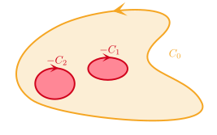
  

  

  
  注意内边界的方向：区域内部在前进方向的“左侧”
  

---

### 复连通区域 Cauchy 积分定理

- 考虑复连通区域 $D$，且 $\partial D = C_0 - C_1 - C_2 \cdots$，其中 $C_i$ 且 $C_{1, 2, \cdots}$ 位于在 $C_0$ 内部
* **复连通 Cauchy 积分定理**：设 $f(z)$ 在 **复连通** $D$ 内 **解析**，在 $\overline{D}$ 上 **连续**，则
  $$
  \oint_{\partial D} f(z) dz
  = \left(\oint_{C_0} - \oint_{C_1} - \oint_{C_2} - \cdots\right) f(z) dz = 0 \ .
  $$

  

  **闭包上解析**

  「在 $D$ 内解析，在 $\overline{D}$ 上连续」也简称为 **<green>在 $\overline{D}$ 上解析**。
  

---

### 复连通区域 Cauchy 积分定理

**证明**

复连通 Cauchy 积分定理的证明可以通过对 $D$ 切割来完成。通过切割，可以把 $D$ 分为几个单连通区域的并。

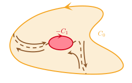

---

### 拓扑不变性

- **推论**：积分围道在 **解析区内** 连续变化不改变积分。
* 后面的讨论会反复涉及这个结论
* $C_1 \sim C \sim C_0$
  

  
  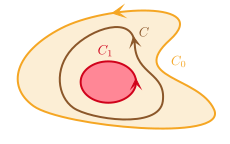
  

---

### 拓扑不变性

- $C_0 \sim C \sim C_1 + C_2$
  

  
  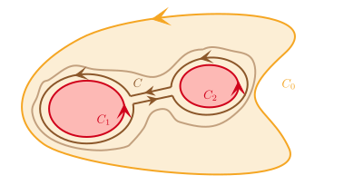
  

---

### 拓扑不变性

- $C_1 \sim C_0 - C_2$
  

  
  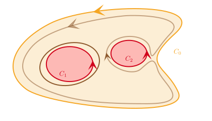
  

---

### Cauchy 积分公式

- **Cauchy 积分公式**：设 $f(z)$ 在 **单** 连通或 **复** 连通区域 $D$ 中解析且在 $\overline{D}$ 上连续，则对 $\forall z \in D$ 有
  $$
  f(z) = \frac{1}{2\pi i} \oint_{\partial D}\frac{f(\zeta)}{\zeta - z} d\zeta \ .
  $$

  

  
  

---

### Cauchy 积分公式

- **Cauchy 积分公式**：设 $f(z)$ 在 **单** 连通或 **复** 连通区域 $D$ 中解析且在 $\overline{D}$ 上连续，则对 $\forall z \in D$ 有
  $$
  f(z) = \frac{1}{2\pi i} \oint_{\partial D}\frac{f(\zeta)}{\zeta - z} d\zeta \ .
  $$

---
### Cauchy 积分公式

  **两个点**

  Cauchy 积分公式涉及**两个点**，$z$ 与 $\zeta$。其中 **$z \in D$** 而 **$\zeta \in \partial D$**。

# 

**复连通边界**

若 $D$ 是**复连通**，这个 Cauchy 积分公式依然成立，但是注意 $\partial D$ 由 **几段** 不交围道组成。

---

### Cauchy 积分公式

**Cauchy 积分定理与公式**

尽管表述有差别，Cauchy 积分公式等价于之前的 Cauchy 积分定理。

#

**刚性**

Cauchy 积分公式说明，解析区 **内部** 的函数值 $f(z)$ 完全由 $f$ 在解析区 **边界** $\partial D$ 的值确定。与之对比，**实** 光滑函数在确定端点值后，定义域内的函数值是 **非常自由** 的，体现了复解析性的相对 **刚性**。

  

---

### Cauchy 积分公式：例子

- 计算如下积分，其中 $C = \{z \in \mathbb{C} \ | \ |z - a| = 1, \ a \in \mathbb{R} - \{0, \pm 2\}\}$,
  $$
  \mathcal{I} = \oint_C \frac{1}{z^2 - 1} dz \ .
  $$

  

  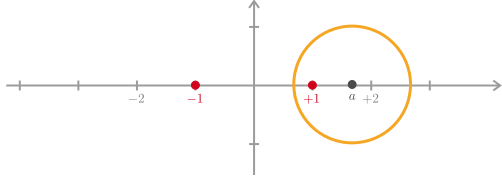
  

---

### Cauchy 积分公式：例子

- 计算如下积分，其中 $C = \{z \in \mathbb{C} \ | \ |z - a| = 1, \ a \in \mathbb{R} - \{0, \pm 2\}\}$,
  $$
  \mathcal{I} = \oint_C \frac{1}{z^2 - 1} dz \ .
  $$

  

  **计算**

  参数 $a$ 的值未定，要**分类讨论**。显然被积函数的奇点为 $z = \pm 1$。注意有因式分解
  $$
  \frac{1}{z^2 - 1} = \frac{1}{z + 1} \cdot \frac{1}{z - 1} = \frac{1/(z - 1)}{z + 1} = \frac{1/(z + 1)}{z - 1}\ .
  $$

  

---

### Cauchy 积分公式：例子

- 计算如下积分，其中 $C = \{z \in \mathbb{C} \ | \ |z - a| = 1, \ a \in \mathbb{R} - \{0, \pm 2\}\}$,
  $$
  \mathcal{I} = \oint_C \frac{1}{z^2 - 1} dz \ .
  $$

  

  **计算**

  (1) 当 $a > 2$, 显然整个被积函数在 $C$ 内解析，利用 Cauchy 积分 **定理**，可以得到 $\mathcal{I} = 0$。
  

---

### Cauchy 积分公式：例子

- 计算如下积分，其中 $C = \{z \in \mathbb{Z} \ | \ |z - a| = 1, \ a \in \mathbb{R} - \{0, \pm 2\}\}$,
  $$
  \mathcal{I} = \oint_C \frac{1}{z^2 - 1} dz \ .
  $$

  

  **计算**

  (2) 当 $0 < a < 2$，此时函数 $(z + 1)^{-1}$ 在 $C$ 内解析，可以用 Cauchy 积分**公式**，
  $$
  \mathcal{I} = \oint_C \frac{(z + 1)^{-1}}{z - 1} dz
  = (2\pi i) \left[\frac{1}{z + 1}\right]_{z = 1} = \pi i\ .
  $$
  

---

### Cauchy 积分公式：例子

- 计算如下积分，其中 $C = \{z \in \mathbb{Z} \ | \ |z - a| = 1, \ a \in \mathbb{R} - \{0, \pm 2\}\}$,
  $$
  \mathcal{I} = \oint_C \frac{1}{z^2 - 1} dz \ .
  $$

  

  **计算**

  (3) 当 $-2 < a < 0$，此时函数 $(z - 1)^{-1}$ 在 $C$ 内解析，可以用 Cauchy 积分**公式**，
  $$
  \mathcal{I} = \oint_C \frac{(z - 1)^{-1}}{z + 1} dz
  = (2\pi i) \left[\frac{1}{z - 1}\right]_{z = - 1} = - \pi i\ .
  $$
  (4) 最后 $a < -2$ 时的讨论与 $a > 2$ 基本一样。
  

---

### Cauchy 积分公式的推论

* **推论**：设围线 $C$ 的 **外部** 区域为 $D$，$f(z)$ 在 $D$ 内解析 $\overline{D}$ 上连续，且在 $z \to \infty$ 时**衰减得足够快**，则
  $$
  f(z) = \frac{1}{2\pi i} \oint_{-C} \frac{f(\zeta)}{\zeta - z} d\zeta \ .
  $$

---
### Cauchy 积分公式的推论

**衰减**

$f$ 衰减得足够快的标准是，对 $\forall \epsilon > 0$ 都 $\exists R_\epsilon > 0$，使得 **只要** $|z| > R_\epsilon$ 就有 $|f(z)| < \epsilon$。

**符号**

注意此时围线选择是 **$-C$**，即沿 **顺时针** 方向积分。

---

### 高阶导数积分公式

* Cauchy 积分公式有如下的推广
* **高阶导数积分公式**：设 $f$ 在 **单连通** 或 **复连通** 区域 $D$ 内解析、$\overline{D}$ 上连续，则对 $\forall z \in D$，都有
  $$
  f^{(n)}(z) = \frac{n!}{2\pi i} \oint_{\partial D} \frac{f(\zeta)}{(\zeta - z)^{n + 1}} d\zeta \ ,  \quad n = 1, 2, \cdots .
  $$

  

  **可导与无穷阶可导**

  函数 $f$ 在 $\overline{D}$ 上解析，则 $f$ 在 $\partial D$ 的值就确定了，由上述公式可以得到 $D$ 内任意阶导数 $f^{(n)}(z)$，因此 $f$ 的解析性实际上暗示 $f$ 在 $D$ 内 **无穷阶可导**。
  

---

### Liouville 定理

* **<green>定义**：全 $\mathbb{C}$ 解析的函数称为 **<green>整函数**
* **Liouville 定理**：**有界** 整函数必然 **常** 函数。

  

  **有界性**

  如果**去掉有界性**限制，则存在 **<red>非常 (non-constant) 数整函数**，比如 $\sin z$，$e^z$
    
  这些函数必然 **无界**，在某个方向值逐渐趋于无穷大。
  

  

  **调和函数**

  在一般维度有类似结论：$\mathbb{R}^n$ 上的 **有界** **调和** 函数必然为 **常数**。
  

---

### Liouville 定理：例子

* 设 $f(z)$ 是 $\mathbb{C}$ 上解析函数，且满足如下**周期性条件**，
  $$
  f(z + 1) = f(z + i) = f(z) \ , \qquad \forall z \in \mathbb{C} \ .
  $$
  则 $f(z)$ 必然是常数。

  

  **环面**

  周期性条件说明 $f$ 是环面上的解析函数。	
  

---

### 整函数

* 无界性：**<red>非常** 整函数的函数值分布必然无限延展
  
  

  
  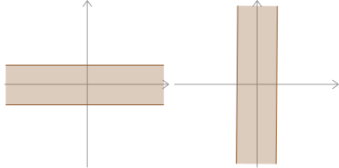
  

---
### 整函数

* 无界性：**<red>非常** 整函数的函数值分布必然无限延展
  

  
  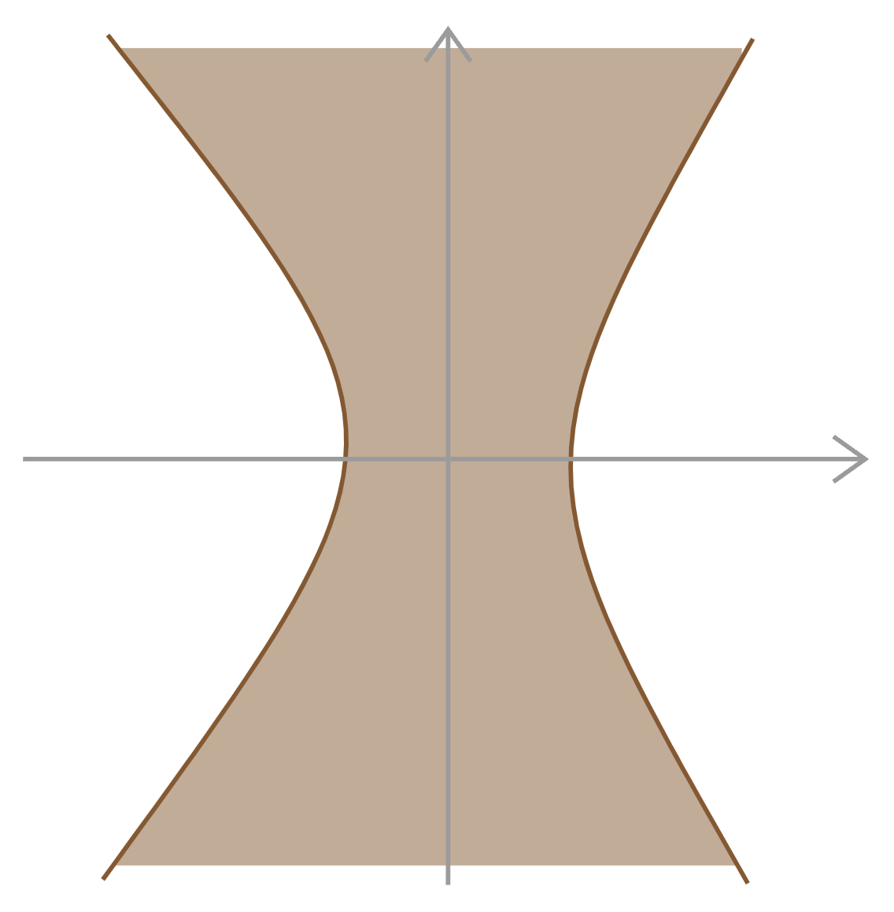
  

---

### 整函数

* **Picard 小定理**：设 $f: \mathbb{C} \to \mathbb{C}$ 是 **整函数**，且 **<red>非** 常函数。则 $f$ 的像集 $\{f(z) \ | \ z \in \mathbb{C}\}$ 要么是 $\mathbb{C}$，要么是 $\mathbb{C}$ 减去 1 个点。要是像集 **<red>缺少** 2 个或以上点，则 $f$ 必然是 **常函数**。

  

  **例子**

  例子：$e^z$ 的像集是 $\mathbb{C} - \{0\}$；$\sin z$ 的像集是 $\mathbb{C}$。
  
