# 复级数
$$
\gdef\red#1{{\color{cb8680}{#1}}} 
\gdef\green#1{{\color{4f8d63}{#1}}} 
\gdef\gray#1{{\color{gray}{#1}}} 
\gdef\purple#1{{\color{B189C6}{#1}}} 
\gdef\orange#1{{\color{dfa04b}{#1}}}
\gdef\white#1{{\color{white}{#1}}}
$$

---

### 纲要

* 复级数

  > 复常数项、函数项级数、收敛性与判别法
* 幂级数与 Taylor 级数

  > 收敛圆、解析性、Taylor 级数
* 双边幂级数与 Laurent 级数

  > 收敛环、Laurent 展开
* 零点与奇点

  > 零点、零点孤立性、孤立奇点、可去奇点、极点、本性奇点

---

# 一、复级数

---

### 复常数项级数

* **<green>定义</green>**：无穷求和 $S \coloneqq \sum_{k = 1}^{+\infty}c_k$ 称为 **<green>复常数项级数</green>**，其中 $c_k \in \mathbb{C}$，有时简写为 $\sum_k c_k$
* **<green>定义</green>**：考虑级数 $\sum_k c_k$，以及其 **<green>部分和</green>**
  $$
    S_n \coloneqq \sum_{k = 1}^n c_k
  $$
  若 $\lim_{n \to +\infty} S_n$ **存在** 且为 **有限** 值 $s$，则称该级数 **<green>收敛</green>** 到 $s$；否则称该级数 **<green>发散</green>**。

---
### 复常数项级数

**发散**

发散的可能情况：
- 部分和趋于无穷大，$\lim_{n \to +\infty}S_n = \infty$
- 部分和震荡

---
### 复常数项级数

* 判断一个复常数项级数是否收敛有的基本方法
* 复常数项级数跟实常数项级数的收敛 **相容**。记每一项的实虚分解 $c_k = a_k + i b_k$，则 $\sum_k c_k$ 收敛等价于两个实常数项级数 $\sum_k a_k$ 与 $\sum_kb_k$ **同时收敛**。
  

  
  **难点**

  复杂的复级数的实虚分解难以获得通项，且实级数本身的收敛性也不易判定。

  后面讨论解析函数项级数的收敛性，应当充分利用复数与复变函数的性质
  

---

### Cauchy 判别法

* **Cauchy 判别法/判敛准则**：复常数项级数 $S \coloneqq \sum_k c_k$ **收敛**，等价于说，对于 $\forall \epsilon > 0$，存在一个 $n_\epsilon \in \mathbb{N}$，使得对于 $\forall n > n_\epsilon$，$\forall p \in \mathbb{N}^+$ 都有
  $$
  \Big| S_{n + p} - S_n \Big| = \Bigg| \sum_{k = n + 1}^{n + p} c_k \Bigg| < \epsilon
  $$

  

  **直观理解**

  要想无穷级数收敛，「后段」的求和应当非常小，小于任意选定的精度 $\epsilon$，而这个「后段」由 $n_\epsilon$ 为标准确定。遗憾这个判别法比较难用。
  

---
### Cauchy 判别法

**必要条件**

选 $p = 1$，若级数 $\sum_k c_k$ 收敛，则 $\lim_{k \to +\infty} c_k = 0$。

**有限项**

在级数中更改有限项不会改变收敛性

---

### 绝对收敛

* **<green>定义</green>**：复常数项级数 $S = \sum_k c_k$ 所对应的正项级数 $\sum_k |c_k|$ 若收敛，则称原级数 **<green>绝对收敛</green>**；收敛但非绝对收敛则称为 **<green>条件收敛**
* **定理**：绝对收敛必然导致收敛
  

  因为 $|\sum_{k = 1}^{p} c_{n + k}| < \sum_{k = 1}^{p} |c_{n + k}|$
  

  

  **收敛强度排行榜**

  我们有如下收敛强度排行榜
  

    发散 $<$ 收敛 $<$ 绝对收敛
  

  

---

### 其它判别法

* 在日常生活中，我们往往需要根据实际情况运用 Cauchy 以外的判别法：**Abel 判别法** 与 **Dirichlet 判别法**
* **Abel 判别法**：倘若实数数列  $\{r_k\}$ **单调有界**，复级数 $\sum_k c_k$ **收敛**，则 $\sum_k r_k c_k$ 收敛。

---
### 其它判别法

**说明**

**实** 数数列 **单调有界**，因此必然有 **有限的渐近值**，$r_{k \gg 1} \sim r_\infty$。因此无穷求和可以分解为
$$
\sum_k r_k c_k \sim \sum_{k = 1}^{K \gg 1} r_k c_k + \sum_{k = K+1}^{+\infty} 
\purple{r_\infty} c_k
$$

---

### 其它判别法

* **Dirichlet 判别法**：若实数列 $\{r_k\}$ **单调趋零**，$\{c_k\}$ 的 **部分和有界**，则 $\sum_k r_k c_k$ 收敛。

  

  **说明**

  部分和 $\sum_{k = 1}^n c_k$ 有界，因此就算不收敛，也只是在做 **有限度的震荡**。引入 **衰减因子 $r_k$** 就迫使 $\sum_k r_k c_k$ 部分和震荡越来越小，因此收敛。
  

  

  
  Abel 判别法是 Dirichlet 判别法的推论：$\{r_k - r_\infty\}$ 单调趋零，$\sum_kc_k$ 收敛导致部分和有界
  

---
### 其它判别法

**总结**

Abel 与 Dirichlet 判别法适用于复合级数 $\sum_k r_k c_k$。

| | $r_k$ | $c_k$ |
|---|---|---|
| Abel | 单调有界 | **级数收敛** |
| Dirichlet | **单调趋零** | 部分和有界 |

---

### 级数判敛：例子

* **<green>调和级数</green>** $\sum_k \frac{1}{k}$：发散级数
* **<green>黎曼 $\zeta$ 级数</green>**
  $$
  \zeta(s) \coloneqq \sum_{k} \frac{1}{k^s} = \left \{ \begin{array}{cc}
    \text{发散，} & 0 < s \le 1 \\ \text{收敛，} & s > 1
  \end{array}\right.
  $$

  

  **特殊值**

  Riemann $\zeta$ 函数有一些有趣的特殊值，比如
  $$
  \sum_{k = 1}^{+\infty} \frac{1}{k^2} = \frac{\pi^2}{6}, \qquad
  \sum_{k = 1}^{+\infty} \frac{1}{k^4} = \frac{\pi^4}{90}, \qquad
  \sum_{k = 1}^{+\infty} \frac{1}{k^6} = \frac{\pi^6}{945}
  $$
  

---

### 级数判敛：例子

* 例：考虑级数
  $$
  \sum_k \frac{e^{i k \theta}}{k^s}, \qquad 0 < \theta < 2\pi, s > 0
  $$
  论证当 $s > 1$ 时，级数 **绝对收敛**，而 $0 < s \le 1$ 时级数 **收敛** 但 **<red>不绝对收敛</red>**。

---
### 级数判敛：例子

**证明**

$$
\sum_k \bigg| \frac{e^{i k \theta}}{k^s} \bigg| = \sum_k \frac{1}{k^s}
$$

利用前面 $\zeta$-函数的讨论，$s > 1$ 时，级数 **绝对收敛**，当 $0 < s \le 1$ 时级数 **<red>非绝对收敛</red>** 的。

---
### 级数判敛：例子

**证明**

要证明 $0 < s \le 1$ 时级数**收敛**，记 $r_k \coloneqq k^{-s}$，$c_k \coloneqq e^{i k \theta}$。显然，$r_k$ **单调趋零** (因 $s > 0$)。而 $c$ 级数部分和可以用等比数列求和公式，
$$
\bigg|\sum_{k = 1}^n c_k \bigg|
=  \bigg| \frac{e^{i \theta}(1 - e^{i n \theta})}{1 - e^{i\theta}} \bigg|
=  \bigg| e^{\frac{i\theta}{2}} e^{\frac{i}{2} n \theta}
\times
\frac{e^{- \frac{i}{2} n \theta} - e^{+ \frac{i}{2} n \theta}}{e^{- \frac{i}{2} \theta} - e^{+ \frac{i}{2} \theta}} \bigg|
$$

$$
\bigg|\sum_{k = 1}^n c_k \bigg|
= \bigg| \frac{\sin \frac{n \theta}{2}}{\sin \frac{\theta}{2}} \bigg| < \frac{1}{|\sin \theta/2|}
$$

因此 **$c$ 部分和有界**。于是由 **Dirichlet 判别法**，原级数收敛。

---

### 复函数项级数

**等比级数求和**

即使是复数，依然有等比数列 **有限项** 求和公式，即对于任意 $z \in \mathbb{C}$，
$$
\sum_{k = 1}^{N} z^k = z \frac{1 - z^N}{1 - z}, \qquad N \in \mathbb{N}
$$

这是因为代数恒等式 (可以通过数学归纳法证明)
$$
\begin{align*}
1 - z^2 = & \ (1 - z) (1 + z), \quad
1 - z^3 = (1 - z)(1 + z + z^2), \\
\cdots, \quad
1 - z^N = & \ (1 - z)(1 + z + z^2 + \cdots + z^{N - 1})
\end{align*}
$$

---

### 复函数项级数

**正弦余弦求和**

上述等比级数可以得到实部和虚部求和公式，
$$
\sum_{k = 1}^{N} \cos (k \theta) = \cos \left({\frac{(N + 1)\theta}{2}}\right) \sin \left({\frac{N\theta}{2}}\right) \frac{1}{\sin (\theta/2)}
$$
$$
\sum_{k = 1}^{N} \sin (k \theta) = \sin \left({\frac{(N + 1)\theta}{2}}\right) \sin \left({\frac{N\theta}{2}}\right) \frac{1}{\sin (\theta/2)}
$$
  
* 利用 $z = e^{i \theta}$
  $$
  z\frac{1 - z^N}{1 - z} = z\frac{z^{N/2}}{z^{1/2}} \frac{z^{-N/2} - z^{N/2}}{z^{-1/2} - z^{1/2}} = e^{\frac{i}{2}(N + 1)\theta} \frac{\sin \frac{N\theta}{2}}{\sin \frac{\theta}{2}}
  $$

---

### 复函数项级数

* **<green>定义</green>**：无穷求和 $S(z) = \sum_k f_k(z)$ 中若所有 $f_k(z)$ 在相同定义域 $E$ 上有定义，则称为一个 **<green>复函数项级数</green>**，其 **<green>部分和</green>** $S_n(z) \coloneqq \sum_{k = 1}^n f_k(z)$。

---

### 复函数项级数的收敛性

* 复函数项级数具有几种不同的收敛性
* **<green>定义</green>**：对于上述复函数项级数以及一个 **<red>给定** 的点 $z \in E$，若极限 $\lim_{n \to \infty} S_n(z)$ 存在且为 **<green>有限值 $s(z)$**，则称该级数在 **<green>$z$ 点处</green>** **<green>收敛</green>** 到 $s(z)$。
* **<green>定义</green>**：对于上述复函数项级数，若对 **<red>任意** $z \in E$，极限 $\lim_{n \to \infty} S_n(z)$ 存在且为 **<green>有限值 $s(z)$**，则称该级数在 **<green>定义域上收敛</green>** 到 $s(z)$，而 $s(z)$ 称为该级数的 **<green>和函数</green>**。

  

  **和函数性质**

  尽管函数 $s(z)$ 存在且有限，但一般而言 **<red>不具有</red>** 良好的解析性质。
  

---

### 复函数项级数的收敛性

* 上述收敛性也可以改用 $\epsilon,n$ 语言重新表述。
* **<green>收敛性定义等价表述**：级数 $\sum_k f_k(z)$ 在 $D$ 内 **收敛到 $s(z)$** 等价于说，对 $\forall \epsilon > 0$ 以及 $\forall z \in D$，都 $\exists n_\epsilon(z) \in \mathbb{N}$，使得对 $\forall n > n_\epsilon(z)$ 都有
  $$
  \bigg| S_n(z) - s(z) \bigg| < \epsilon
  $$

  

  **足够多项**

  当级数收敛，则求和「足够多项」之后，部分和就会非常接近和函数 $s(z)$。给定目标精度 $\epsilon$，「足够多」的标准由 $n_\epsilon(z)$ 确定，这个标准 **与 $z$ 有关**。
  

---

### 一致收敛

* 对上述表述稍作改动，即可定义 **<green>定义域上一致收敛性</green>**
* **<green>定义</green>**：考虑级数 $\sum_k f_k(z)$ 在定义域 $E$ 上定义，若对 $\forall \epsilon > 0$ 以及 $\forall z \in E$，都 **$\exists n_\epsilon \in \mathbb{N}$**，使得对 $\forall n > n_\epsilon$ 都有 $\big| S_n(z) - s(z) \big| < \epsilon$，则称该级数在 **<green>$E$ 内一致收敛</green>**。

---
### 一致收敛

**一致收敛**

给定精度 $\epsilon$ 之后，「足够多项」的标准 $n_\epsilon$ **<red>与 $z$ 无关</red>**。

**收敛但非一致收敛**

* 从定义上看，**一致收敛** 强于 **收敛**

* 有很多 **收敛** 但 **<red>非</red>** 一致收敛的复函数项级数。

---

### 一致收敛

**收敛但不一致收敛**

若级数 $\sum_k f_k(z)$ 在 **区域 $D$** 内 **收敛**，但是 **<red>非一致收敛</red>**，说明当 $\epsilon$ 很小的时候，「足够多项」的标准 $n_\epsilon(z)$ 在 $D$ 内随 $z$ 变化且不断上涨 **<red>没有上限</red>**，无法约定同一的标准 $n_\epsilon$

$~$

由于 $n_\epsilon(z)$ 在 $D$ 内**没有上限**，说明 $z$ 趋于某一些点 $z_* \in \partial D$ 时，$n_\epsilon(z)$ 无限增大，收敛性 **<red>急剧恶化</red>**，并在 $z_*$ 处级数 **<red>不收敛</red>**

---
### 一致收敛

**缩小定义域**

若级数在定义域 $E$ 内 **收敛** 但 **<red>非</red>** 一致收敛，可以考虑 **缩小定义域** 到 $E' \subset E$，有可能在 $E'$ 内 **一致收敛**。

类比连续性与一致连续性

---

### Cauchy 一致判别法

* 一致收敛有一个最基本的 Cauchy 判别法
* **Cauchy 一致收敛判别法**：级数 $\sum_k f_k(z)$ 在定义域上 **一致收敛**，等价于说，对于 $\forall \epsilon > 0$，都 $\exists n_\epsilon \in \mathbb{N}$，使得对 $\forall n > n_\epsilon$，$\forall p \in \mathbb{N}$ 以及 $\forall z \in$ 定义域，都有
  $$
  \bigg| \sum_{k = n + 1}^{n + p} f_k(z) \bigg| < \epsilon
  $$

  

  **后段标准**

  大致意思是「后段」部分和总可以任意小，而「后段」的标准可以做到 **全定义域统一** $n_\epsilon$。
  

---

### 绝对 vs 一致

* **一致** 收敛与 **绝对** 收敛均强于普通收敛。**<red>谁更强？</red>**

  

  
  
  

---

### 绝对 vs 一致

* 例：证明下面级数在全 $\mathbb{C}$ **一致收敛**，但 **<red>非绝对收敛</red>**，
  $$
  \sum_{k} \frac{(-1)^{k - 1}}{k + g(z, \bar z)}, \qquad g(z, \bar z) \ge 0
  $$

  

  **证明**

  可以利用 **Cauchy 一致判别法**，主要是分析后半段部分和，
  $$
  \bigg| \sum_{k = n + 1}^{n + p} \frac{(-1)^{k - 1}}{k + g(z, \bar z)} \bigg|
  $$
  

---

### 绝对 vs 一致

**证明**

考虑两种情况。第一种是 $p = 2N$，此时
$$
\begin{align*}
= & \ \bigg| \frac{(-1)^n}{n + 1 + g} - \frac{(-1)^n}{n + 2 + g} + \cdots + \frac{(-1)^n}{n + 2N - 1 + g} - \frac{(-1)^n}{n + 2N + g} \bigg| \\
= & \ \bigg| \purple{\frac{1}{n + 1 + g} - \frac{1}{n + 2 + g}} +  \cdots + \purple{\frac{1}{n + 2N - 1 + g} - \frac{1}{n + 2N + g}} \bigg|
\end{align*}
$$

每块紫色都是 **<purple>大于零</purple>** 的表达式，因此可以 **<purple>去绝对值</purple>**。

---
### 绝对 vs 一致

**证明**

重组 CP，
$$
\begin{align*}
= & \ \frac{1}{n + 1 + g} \purple{ - \frac{1}{n + 2 + g} + \frac{1}{n + 3 + g}} + \cdots \\
& \ \cdots \purple{- \frac{1}{n + 2N - 2 + g}  + \frac{1}{n + 2N - 1 + g}} - \frac{1}{n + 2N + g}
\end{align*}
$$

---

### 绝对 vs 一致

**证明**

每个紫色的东西都是 **<purple>小于零</purple>** 的表达式，因此当 $p = 2N$ 时，
$$
\bigg| \sum_{k = n + 1}^{n + p} \frac{(-1)^{k - 1}}{k + g(z, \bar z)} \bigg| < (\text{首项}) \frac{1}{n + 1 + g(z, \bar z)}
$$

当 $p = 2N + 1$ 的时候，计算也类似，先 **<purple>去绝对值</purple>**，再作放缩法，
$$
\bigg| \sum_{k = n + 1}^{n + p} \frac{(-1)^{k - 1}}{k + g(z, \bar z)} \bigg| < (\text{首项}) \frac{1}{n + 1 + g(z, \bar z)}
$$

---
### 绝对 vs 一致

**证明**

两种情况综合，
$$
\bigg| \sum_{k = n + 1}^{n + p} \frac{(-1)^{k - 1}}{k + g(z, \bar z)} \bigg| < \frac{1}{n + 1 + g(z, \bar z)} < \frac{1}{n}
$$
于是，对 $\forall\epsilon > 0$，可以选任意足够大的自然数 $n_\epsilon > \frac{1}{\epsilon}$，自然导致 $\forall n > n_\epsilon > \frac{1}{\epsilon}$ 都有
$$
\bigg|\sum_{k = n + 1}^{n + p} \frac{(-1)^{k + 1}}{k + g(z, \bar z)} \bigg| < \frac{1}{n} < \frac{1}{n_\epsilon} < \epsilon
$$

---

### 绝对 vs 一致

**证明**

这个 $n_\epsilon$ 是 **统一** 的，使得上面不等式对所有的 $z, \bar z$ 都成立，因此级数 **一致收敛**。

但是，该级数 **<red>非绝对收敛</red>**，
$$
\sum_{k} \bigg| \frac{(-1)^{k - 1}}{k + g} \bigg|
= \sum_k \frac{1}{k + g} \sim \sum_k \frac{1}{k} \to \text{发散}
$$

---

### 绝对 vs 一致

- 例：证明 **<green>几何级数/等比级数** $\sum_{k = 1}^{+\infty} z^k$ 在 $N(0,1)$ 内 **绝对收敛**，但 **<red>非一致收敛</red>**

  

  **证明**

  * 先看绝对收敛。逐项取绝对值得到 **收敛** 的 **无穷等比数列求和**，
    $$
    \sum_{k = 1}^{+\infty} |z|^k = |z|\frac{1 - |z|^\infty}{1 - |z|} = \frac{|z|}{1 - |z|}, \qquad |z| < 1
    $$

  * 因此原级数 **绝对收敛**，因此原级数也 **收敛**，和函数为
    $$
    s(z) = \lim_{N \to +\infty} S_n(z) = \lim_{N \to +\infty} z\frac{1 - z^N}{1 - z} = \frac{z}{1 - z}
    $$
  

---

### 绝对 vs 一致

**证明**

- 下面利用 Cauchy 一致判别法看看是否 **一致收敛**。
* 考虑后段部分和，
  $$
  \bigg|\sum_{k = n + 1}^{n + p} z^k \bigg|
  $$

* 任取一个 $p \in \mathbb{N}$，比如 **$p = 1$**，则上述部分和为 $|z^{n+1}|$。若要
  $$
  |z|^{n + 1} < \epsilon \quad \Rightarrow \quad (n + 1)\ln|z| < \ln \epsilon \quad \Rightarrow \quad n + 1 > \frac{\ln \epsilon}{\ln |z|}
  $$

---

### 绝对 vs 一致

**证明**

$$
|z|^{n + 1} < \epsilon \quad \Rightarrow \quad (n + 1)\ln|z| < \ln \epsilon \quad \Rightarrow \quad n + 1 > \frac{\ln \epsilon}{\ln |z|}
$$

但是这个表达式随着 $z \to 1$ **无限增大**，因此 **<red>不存在</red>** 统一的 $n_\epsilon$ 使得
$$
\bigg|\sum_{k = n + 1}^{n + p} z^k \bigg| < \epsilon, \qquad \forall n > n_\epsilon, \forall p \in \mathbb{N}
$$

原级数 **<red>非一致收敛</red>**。

---
### 绝对 vs 一致

**和函数**

与实几何级数类似，
$$
\sum_{k = 1}^{+\infty} z^k = \frac{z}{1 - z}, \qquad |z| < 1 
$$
在 $z = 1$ 处，级数发散，体现为 $n_\epsilon(z) \to +\infty$

---

### 绝对 vs 一致

| | 绝对 | 一致 |
|---|---|---|
| $\sum_k \frac{(-1)^k}{k + g(z, \bar z)}$ | 否 | 是 |
| $\sum_k z^k$ | 是 | 否 |

---
### 绝对 vs 一致

- 一致收敛和绝对收敛均强于收敛，但二者之间 **打成平手**

  

  
  

---

### 绝对 vs 一致

- 一致收敛和绝对收敛均强于收敛，但二者之间 **打成平手**

  

  
  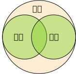
  

---

### 绝对一致

* 存在一些级数，**同时** 绝对和一致收敛
* 相应地，我们有一个简单的判别法。
* **Weierstrass-M 判别法**：考虑级数 $\sum_k f_k(z)$，若存在 $\{M_k\}$ 为 **正、常数数列** 使得 $\sum_k M_k$ **收敛**，且对 $\forall k$ 以及 $\forall z \in$ 定义域，都满足
  $$
  \bigg| f_k(z) \bigg| \le M_k
  $$
  则 $\sum_k f_k(z)$ 也在定义域内 **绝对和一致收敛**。

  

  简而言之，**逐项** 有常界，界级数 **收敛** $\Rightarrow$ 绝对 + 一致收敛。
  

---

### 绝对一致

* 例：级数 $\sum_k z^k$ 在 $N(0,1)$ **<red>非一致收敛</red>**。任选 $r \in (0,1)$，级数在闭域 $\overline{N(0, r < 1)}$ 上 **绝对一致收敛**。

  

  **证明**

  利用 Weierstrass-M 判别法，**逐项** 有 **常界** $r^k$
  $$
  |z^k| = |z|^k \le r^k
  $$

  且界级数 $\sum_k r^k$ 收敛 (因为 $0 < r < 1$)。因此，原级数在 $\overline{N(0, r)}$ 上 **绝对一致收敛**。
  

---

### 等比级数/几何级数总结

* 许多级数的收敛性可以通过与一些标准级数进行比较来感知
* 等比级数/几何级数 $\sum_k z^k$ 是很好的一个标准级数
* 记 $S(z) \coloneqq \sum_{k \in \mathbb{N}}z^k$
* 显然，当 $|z|< 1$，级数 **绝对收敛**，因此该级数在 $D = N(0, 1)$ 内 **收敛**
* 显然级数在 $z = 1$ 处发散，因为 $S(1) = 1 + 1 + 1 + \cdots \sim \infty$
* 因此，$\partial N(0,1)$ 上有发散点，级数 $S(z)$ 在 $N(0,1)$ 内 **<red>非一致收敛</red>**

---
### 抽奖

- $e^{ix}$ 可以写成
  
  

  
  A. $\sin x + \cos x$ $\quad$ B. $\sin x + i\cos x$ $\quad$ C. $i \sin x + \cos x$ $\quad$ $i\sin x + i \cos x$
  

* $\sqrt{1/z}$ 的支点有哪些？
* $1/i$ 等于 (多选)
  
  

  
  A. $i$ $\quad$ B. $-i$ $\quad$ C. $i^2$ $\quad$ D. $i^3$
  

* 下面哪个函数在 $\mathbb{C}$ 上处处解析？
  
  

  
  A. $\operatorname{Re}z$ $\quad$ B. $\operatorname{Im}z$ $\quad$ C. $\bar z$ $\quad$ D. $e^{i z}$
  

---

### 抽奖

- 考虑 $w = z^3$。$w, z$ 都是复数。随着 $z$ 发生移动，函数值 $w$ 也会随之在复平面上移动。倘若$z$ 绕着原点转一圈，请问 $w$ 绕转了原点几圈？
- $\ln z$ 是多值函数。**<red>$\operatorname{Re}\ln z$ 是否多值函数？**

---

### 绝对一致

* 例：证明下面级数作为 $\theta$ 的复函数项级数，在定义域 $\theta \in \mathbb{R}$ 上绝对一致收敛，
  $$
  \sum_k \frac{e^{i k \theta}}{k^s}, \qquad \orange{s > 1}, \qquad \theta \in \mathbb{R}
  $$

  

  **证明**

  由于 $\theta \in \mathbb{R}$，
  $$
  \bigg| \frac{e^{i k \theta}}{k^s} \bigg| = \frac{|e^{i k \theta}|}{k^s} = \frac{1}{k^s}
  $$

  利用 Weierstrass-M 判别法，**逐项** 有 **常界** $\frac{1}{k^s}$，且界级数 $\sum_k \frac{1}{k^s}$ 在 $s > 1$ 时收敛。因此，原级数在 $\theta \in \mathbb{R}$ 上 **绝对一致收敛**。
  

---

### 一致收敛的好处

* 一致收敛的级数有几大优良性质
* **和函数连续**：若级数 $S(z)$ 在定义域上 **逐项连续**，且在定义域上 **一致收敛** 到和函数 $s(z)$，则和函数 $s(z)$ 在定义域上也 **连续**。

  

  **一致收敛很重要**

  若缺少一致收敛性，和函数有 **<red>可能不连续</red>**。考虑下面这个级数
  $$
  S(x) \coloneqq x + \sum_{k = 2} (x^k - x^{k - 1})
  $$

  这个级数在 **定义域 $[0,1]$** 上 **收敛**，但 **<red>非一致收敛</red>**。
  

---

### 一致收敛的好处

**一致收敛很重要**

- 首先这级数是 **收敛** 的，和函数可以通过 **部分和** 求出来
  $$
  S_n(x) = x + \sum_{k = 2}^{n}(x^k - x^{k - 1}) = x^n
  $$

* 因此，和函数为
  $$
  s(x) = \lim_{n \to +\infty}S_n(x)
  = \lim_{n \to +\infty} x^n
  = \left \{\begin{array}{cc}
  0 & 0 \le x < 1\\
  1 & x = 1
  \end{array} \right.
  $$

* 显然和函数 **<red>不连续</red>**。

---

### 一致收敛的好处

**一致收敛很重要**

有了和函数，就可以检查 **一致收敛性**。考虑 $x \in (0,1) \subset [0, 1]$，
$$
\bigg|S_n(x) - s(x) \bigg| < \epsilon \quad
\Leftrightarrow \quad
\bigg| x^n - 0\bigg| < \epsilon
\quad
\Leftrightarrow \quad n \ln |x| < \ln \epsilon
$$

因此可以选正整数 $n_\epsilon(x) > \ln \epsilon/\ln |x|$，但显然 $n_\epsilon(x \to 1) \to \infty$，即越接近 $x = 1$，收敛性 **<red>越差</red>**，因此 **<red>不可能找到</red>** 全 $[0,1]$ 统一的 $n_\epsilon$，因此 **<red>非一致收敛</red>**。

$1$ 附近的非一致收敛性导致和函数失去连续性。

---

### 一致收敛的好处

**交换性**

该结论也可以表述成交换性
$$
\lim_{z \to z_0} \sum_k = \sum_k \lim_{z \to z_0}
$$

上面反例则对应
$$
0 = \lim_{x \to 1} (x + \sum_{k = 2}^{+\infty} x^k - x^{k - 1} )  \ne (\lim_{x \to 1} x + \sum_k \lim_{x \to 1} (x^k - x^{k - 1})) = 1
$$

---

### 一致收敛的好处

* **和函数可积**：若级数 $S(z) = \sum_k f_k(z)$ 在曲线 $C$ 上 **逐项连续**，且在 $C$ 上 **一致收敛** 到 $s(z)$，则和函数 $s(z)$ 沿 $C$ **可积**，且有等式
  $$
  \int_C \sum_{k = 1}^{+\infty}f_k(z) dz
  = \int_C s(z) dz = \sum_{k = 1}^{+\infty} \int_C f_k(z)dz
  $$

  

  **积分求和交换**

  对比上式左右两边，可以抽象地说是
  $$
  \sum_k \int_C = \int_C \sum_k
  $$

  即 **积分** 与 **求和** 可以 **交换**。这也是 **一致收敛** 的恩赐。
  

---

### 一致收敛的好处

* **Weierstrass 定理**：若 $S(z) = \sum_k f_k(z)$ 在区域 $D$ 内 **逐项解析**，且在 $D$ 内的任意 **有界子闭集** 中 **一致收敛** (简称 **<green>内闭一致收敛</green>**) 到 $s(z)$，则和函数 $s(z)$ 在 $D$ 内 **解析**，且逐项 $p$-阶求导所得级数 $\sum_k f^{(p)}_k(z)$ 在 $D$ 内同样 **内闭一致收敛** 到和函数的导数 $s^{(p)}(z)$。

  

  **求导求和交换**

  抽象地说，
  $$
  \frac{d}{dz}\sum_k = \sum_k \frac{d}{dz}
  $$
  

---
<!-- header: 二、泰勒级数 -->
# 二、泰勒级数

---

### 幂级数

- 下面介绍一种简单又好用的函数项级数
* **<green>定义</green>**：形如 $\sum_k \lambda_k (z - a)^k$ 的级数称为 **<green>幂级数</green>**，其中 $a, \lambda_k \in \mathbb{C}$ 均为复常数。其中 $a$ 称为幂级数的 **<green>中心</green>**。
* 我们关心幂级数的和函数的 **解析性质**，研究工具是一致收敛性、Weierstrass 定理

---

### 幂级数

* **Abel 定理**：设级数在 $z_0 \ne a$ 处 **收敛**，则它必然在 $N(a, |z_0 - a|)$ 里头 **绝对收敛** 且 **内闭一致收敛**。

  

  
  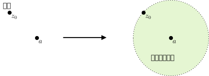
  

---

### 幂级数

**Abel 定理证明**

先证 $N(a, |z_0 - a|)$ 内绝对收敛，即证明 $\sum_k |\lambda_k (z - a)^k|$ 在 $|z - a| < |z_0 - a|$ 时收敛。

稍作改写
$$
|\lambda_k (z - a)^k| = \bigg| \frac{z - a}{z_0 - a} \bigg|^k |\lambda_k (z_0 - a)^k|
$$
其中第二个因子 $|\lambda_k(z_0 - a)^k|$ **有界** (记作 **<green>$M$</green>**)，因为原级数在 $z_0$ **收敛**。

---

### 幂级数

**Abel 定理证明**

于是，作为正级数，
$$
|\lambda_k(z - a)^k| < M \bigg| \frac{z - a}{z_0 - a} \bigg|^k
$$
从而根据 **正级数的比较判别法** 收敛，因此原级数 **绝对收敛**。

当 $|z - a| \le R < |z_0 - a|$ 时，可以用 Weierstrass-M 判别法确定原级数 **绝对一致收敛**。关键在于 **逐项有常界**
$$
\bigg|\lambda_k (z - a)^k \bigg| < M \bigg| \frac{z - a}{z_0 - a}^k \bigg| < M \bigg| \frac{R}{z_0 - a} \bigg|^k
$$

---

### 幂级数

- 逆反命题：若 $z_0$ 是 **<red>发散点</red>**，则在 $N(a, |z_0 - a|)$ 以外级数是 **<red>发散</red>** 的
* 通过不断调整 $z_0$，可以寻找幂级数 **最大** 的绝对内闭一致收敛区域

---

### 收敛圆周

- **定理**：以 $a$ 为中心的幂级数 $S(z)$ 必然存在一个半径 $R$，使得级数在 $N(a, R)$ 内 **绝对** 收敛且 **内闭一致收敛**，而在 $N(a, R)$ 的外面 **发散**，则
  - $R$ 称为 **<green>收敛半径</green>**
  - $|z - a| = R$ 为 **<green>收敛圆周</green>**
  - 邻域 $N(a, R)$ 称为 **<green>收敛圆 (盘)</green>**。

  

  **收敛半径**

  收敛半径可以取 **零** 或者 **无穷大**。
  

---

### 收敛圆周

* 考虑如下几个级数，计算它们的收敛半径
  $$
  \sum_k z^k, \qquad
  \sum_k \lambda^k z^k, \qquad
  \sum_k \lambda^{k - n} z^k, \qquad
  \sum_k \frac{\lambda^k}{k!}z^k
  $$

  

  **计算**

  - 第一个级数是几何级数，我们知道它在 $|z| < 1$ 时绝对收敛，且当 $|z| \le r < 1$ 时 **绝对一致收敛**，$|z| > 1$ **<red>发散</red>**。因此收敛半径 $R = 1$。

  * 第二个级数可以通过定义 $z' \coloneqq \lambda z$ 来分析。对于 $z'$，收敛半径是 $R' = 1$。而 $|\lambda| R = R' = 1$ 说明原级数的 **收敛半径** 为 $R = 1/|\lambda|$。
  

---

### 收敛圆周

* 考虑如下几个级数，计算它们的收敛半径
  $$
  \sum_k z^k, \qquad
  \sum_k \lambda^k z^k, \qquad
  \sum_k \lambda^{k - n} z^k, \qquad
  \sum_k \frac{\lambda^k}{k!}z^k
  $$

  

  **计算**

  第三个级数跟第二个级数类似，先把 $\lambda^{-n}$ 提出求和号外，重定义 $z' = \lambda z$，$R = 1/|\lambda|$。

  第四个级数考虑 $z \in \mathbb{R}$ 便得到 $e^{\lambda z}$，至少在 **全 $\mathbb{R}$** 收敛，因此原幂级数收敛半径是 $R = +\infty$。
  

---

### 收敛圆周

* 上述定理明确了收敛圆周 **内** 和 **外** 的行为：圆周内具有 **良好收敛性**，圆周外 **<red>发散</red>**
* **收敛圆周上** 级数的收敛性需要具体问题具体分析，**<red>并不确定</red>**
  - 例子：几何级数 $\sum_k z^k$ 在整个收敛圆周 $|z| = 1$ 都 **<red>发散</red>**
  - 例子：$\sum_k \frac{1}{k}z^k$ 的收敛圆周为 $|z| = 1$，在圆周上 **几乎处处收敛**，除了在 $z = 1$ 处 **<red>发散</red>**
  - 例子：$\sum_k \frac{1}{k^2}z^k$ 的收敛圆周为 $|z| = 1$，在圆周上处处 **绝对收敛**

---

### 收敛半径求解

**几何级数在收敛圆周上发散**

几何级数 $\sum_k z^k$ 在 **收敛圆周** 上 **<red>发散</red>**。

- 当 $z = 1$ 时，显然 $1 + 1 + \cdots$ 发散。

* 当 $z = -1$ 时，$1 - 1 + 1 - 1 + 1 - 1 + \cdots$ 部分和 $S_N$ 在 $1, 0$ 之间 **来回跳动**，**<red>没有极限</red>**，级数也 **<red>发散</red>**。

* 当 $z = e^{i\theta}$ 时，$\sum_k e^{ik\theta}$ 的部分和为 $\frac{e^{i\theta}(1-e^{iN\theta})}{1-e^{i\theta}}$，当 $\theta \neq 0, 2\pi$ 时，分母不为零，但分子的模长为 $|1-e^{iN\theta}| \le 2$，所以部分和有界但不收敛。

---
### 收敛半径求解

- 对于幂级数，收敛半径是非常重要的量

- **<red>如何求收敛半径？** Cauchy + d'Alembert

- **Cauchy 法**：对于幂级数 $\sum_k \lambda_k z^k$，取系数绝对值 $|\lambda_k|$，若
	$$
		\varlimsup_{k \to \infty} |\lambda_k|^{1/k} \green{= \ell} \in \mathbb{R} \cup \{\infty\} \ ,
  $$
	则**收敛半径 $R = 1/\ell$**
  

  
  **上极限**
	这里涉及 $\displaystyle\varlimsup_{k \to \infty}$ 称为 **<green>上极限**，即取所有收敛子序列的极限的最大值。
	
  

---
### 收敛半径的求解

- 基准例子：$\sum_k \lambda^k z^k$
	

  
  **计算**
  
	直接计算得到 $|\lambda_k|^{1/k} = |\lambda^k|^{1/k} = |\lambda|$，因此
	$$
  \ell = \varlimsup_{k \to +\infty} |\lambda_k|^{1/k} = |\lambda| \ .
  $$
	从而收敛半径为熟知的 $R = 1/\ell = 1/|\lambda|$。
	
  

---
### 收敛半径的求解

- 例子：$\sum_k (\lambda + (-1)^k)^k z^k$，其中 **$\lambda > 1$**
	

  
  **计算**
  
	记 $\lambda_k \coloneqq (\lambda + (-1)^k)^k$，则显然 $\{|\lambda_k|^{1/k}\}$ **<red>不收敛**。但是，这个数列包含 **收敛的子数列**，可以用 Cauchy，
	
  $$\{|\lambda_{2n}|^{\frac{1}{2n}}\} = \{\lambda + 1\}, \qquad
  \{|\lambda_{2n + 1}|^{\frac{1}{2n + 1}}\} = \{\lambda - 1\}$$

	由于 $\lambda > 1$，因此 $\lambda + 1$ 更大，从而 $\varlimsup_{k \to \infty}|\lambda_k|^{1/k} = \lambda + 1$，收敛半径为

  $$
    R = \frac{1}{\lambda + 1}
  $$
  

---
### 收敛半径的求解

**求解**

两个收敛 **子数列** 其实对应两个 **子级数**，原级数等于
$$
= \sum_{k = 0}^{+\infty} (\lambda + 1)^{2k} z^{2k} + \sum_{k = 0}^{+\infty}(\lambda - 1)^{2k + 1} z^{2k + 1} \ .
$$

这两个子级数的收敛半径都很容易求得，
$$
R = \frac{1}{\lambda + 1}, \qquad \frac{1}{\lambda - 1} \ .
$$

显然，应该取相对 **较小** 的收敛半径 $\frac{1}{\lambda + 1}$ 才能让两个子级数 **同时收敛**：这个 **较小** 的收敛半径对应 **较大** 子序列极限。

---
### 收敛半径的求解

- **d' Alembert 方法**：对于幂级数 $\sum_k \lambda_k z^k$，如果
	$$
		\lim_{n \to \infty} \bigg| \frac{\lambda_{k + 1}}{\lambda_k} \bigg| = \ell \in \mathbb{R} \cup \{\infty\} \ ,
	$$
	则收敛半径 $R = 1/\ell$。

  

  
  $|\lambda_{k + 1}/\lambda_k|$ 越大，说明系数 **<purple>增长越快**，收敛半径 **<red>越小**。
  

---
### 收敛半径的求解

- 基准例子：还是几何级数 $\sum_k \lambda^k z^k$。
	

  
  **求解**
  
	直接算，
	
  $$\bigg| \frac{\lambda_{k + 1}}{\lambda_k} \bigg| = |\lambda|,
  \qquad
  \ell = \lim_{k \to \infty}\bigg| \frac{\lambda_{k + 1}}{\lambda_k} \bigg|
  = |\lambda|\ ,$$
	
	从而 $R = 1/|\lambda|$。
	
  

---
### 收敛半径的求解

- 例子：假设 $\lim_{k \to \infty} \Big|\lambda_{k + 1}/\lambda_k \Big|$ 存在，比较 $\sum_k \lambda_k z^k$ 与 $\sum_k k \lambda_k z^k$ 的收敛半径。
	

  
  **求解**
  
	根据题设，可以使用 d' Alembert 方法，对于第二个级数，
	
  $$
  \frac{1}{R_2} = \lim_{k \to \infty} \bigg| \frac{(k + 1)\lambda_{k + 1}}{k \lambda_k} \bigg|
  = 
      \lim_{k \to \infty} \Bigg|\frac{k + 1}{k} \frac{\lambda_{k + 1}}{\lambda_k}\Bigg|
  = \lim_{k \to \infty} \Bigg|\frac{\lambda_{k + 1}}{\lambda_k}\Bigg| = \frac{1}{R_1}
  $$
	
	因此，两个级数的收敛半径 **相等**。
	
  

---
### 收敛半径的求解

- 例：求下面级数的收敛半径，
	
  $$
    \sum_k \frac{k!}{k^k} z^k
  $$
	
	

  
  **求解**
  
	用 d' Alembert 方法，
	$$
    \begin{align*}
      \ell = \lim_{k \to \infty} \frac{(k + 1)!}{(k + 1)^{k + 1}} \times \frac{k^k}{k!}
      = & \ \lim_{k \to \infty} \frac{(k + 1)k^k}{(k + 1)^{k + 1}}
      = \lim_{k \to \infty} \frac{k^k}{(k + 1)^k} \\
      = & \ \lim_{k \to \infty} \frac{1}{(1 + \frac{1}{k})^k} = \frac{1}{e} \ .
    \end{align*}
  $$	
  

---
### 收敛半径的求解

**Stirling 公式**

上面的极限说明，当 更严格地有 Stirling 公式
  
$$\frac{k!}{k^k} \sim \sqrt{2\pi k} \left(\frac{1}{e}\right)^k$$
  

不管是 Cauchy 还是 d' Alembert 方法，其实暗中都是在与标准几何级数 $\sum_k \ell^k z^k$ 进行比较，寻找一个系数增长行为相近的几何级数。

	

---
### 和函数

- 幂级数在收敛圆内有 **内闭一致收敛性**，和函数具有一些优良性质

- **定理**：**<purple>在收敛圆内**，幂级数的和函数 **解析**，求导、积分均与无穷求和 **交换**，且交换后 **收敛半径不变**。

---

### Taylor 级数

* 实变函数可以在可导点进行 Taylor 展开，展开到一定阶可以作为原函数的近似
* 复解析函数也可以在解析点附近做 Taylor 展开

---

### Taylor 级数

* **定理**：考虑在 $N(a, R)$ 内的解析函数 $f(z)$。对 $\forall z \in N(a, R)$，必然有 **<green>Taylor 展开式</green>** ($C \subset N(a,R)$)
  $$
  f( z) = \sum _{n=0}^{+\infty } \orange{\left[\oint _{C}\frac{d\zeta }{2\pi i}\frac{f( \zeta )}{( \zeta -a)^{n+1}}\right]}( z-a)^{n}
  = \sum_{n = 0}^{+\infty} \orange{\frac{1}{n!} f^{(n)}(a)}(z - a)^n
  $$

  

  **Taylor 级数**

  级数在 $N(a, R)$ 内 **内闭一致收敛** 到 $f(z)$，系数是 $f$ 在 $a$ 处的 **各阶导数**
  $$
  \left[\oint _{C}\frac{d\zeta }{2\pi i}\frac{f( \zeta )}{( \zeta -a)^{n+1}}\right] = \frac{1}{n!}f^{(n)}(a)
  $$
  

---

### Taylor 级数

* 解析函数 $f$ 的 Taylor 展开式包含如下要素
  - 展开中心 $a \in N(a, R)$ 
  - 采样点 **<green>$z \in N(a, R)$**
  - 围道 $C = \partial N(a, \rho)$，$\rho < R$
  - 围道积分变量 $\zeta$

  

  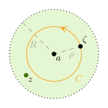
  

---
### Taylor 级数

**唯一性**

给定解析函数以及 **展开中心**，Taylor 展开是 **唯一** 的

**采样点的位置**

**<green>采样点 $z$** 和 **积分路径 $C$** 都在解析区 $N(a, R)$ **内**，二者相对位置可以 **随意**。

---

### Taylor 级数

**Taylor 级数的证明**

Taylor 级数源于 **Cauchy 积分公式**。由于 $f$ 在 $N(a, R)$ 内解析，先假设 $z$ 位于 $C$ 的 **内部**，有
$$
\begin{align*}
f(z) = & \ \oint_C \frac{d\zeta}{2\pi i} \frac{f(\zeta)}{\zeta - z}
= \oint_C \frac{d\zeta}{2\pi i} \frac{f(\zeta)}{(\zeta - a) - (z - a)} \\
= & \ \oint_C \frac{d\zeta}{2\pi i} \frac{1}{\zeta - a} \frac{f(\zeta)}{1 - \purple{\frac{z - a}{\zeta - a}}}
= \oint_C \frac{d\zeta}{2\pi i} \frac{1}{\zeta - a}f(\zeta)
\sum_{n = 0}^{+\infty} \left(\purple{\frac{z - a}{\zeta - a}}\right)^n \\
= & \ \sum_{n = 0}^{+\infty} \left[\oint_C \frac{d\zeta}{2\pi i} \frac{f(\zeta)}{(\zeta - a)^{n + 1}}\right]
(z - a)^n
\end{align*}
$$

---
### Tayler 级数

证明最后用到求和与积分**交换**，应事先验证 **一致收敛性**，此处省略。

---

### Taylor 级数

**Taylor 级数的证明**

基于 $z$ 在 $C$ **内部** 的假设，我们得到了
$$
f(z) = \sum_{n = 0}^{+\infty} \left[\oint_C \frac{d\zeta}{2\pi i} \frac{f(\zeta)}{(\zeta - a)^{n + 1}}\right]
(\red{z} - a)^n
$$

至此，$C$ 与 $\red{z}$ 的 **相对位置** 就 **可以变动** 了，因为系数 
$$
\oint_C \frac{d \zeta}{2\pi i} \frac{f(\zeta)}{(\zeta - a)^{n + 1}}
$$
与 $C$ 的具体大小无关，只要 $C$ 位于 **解析区内**，且包围 $a$。

---

### Taylor 级数

**收敛半径**

Taylor 展开系数通式通常 **<red>难以获得</red>**，因此难以直接从展开表达式求 **收敛半径**

通常，收敛半径为中心 $a$ 到 **最近** 的 $f(z)$ 奇点的距离。

#

一个最简单的例子是 $(z - 1)^{-1}$。以 $0$ 为展开中心，其最近的奇点为 $1$，二者距离为 $1$。相对应地，其 Taylor 展开为 $\sum^{+\infty}_{n = 0}z^n$，收敛半径的确就是 $1$。

---

### 常见函数的Taylor 级数

* **单值** 解析函数跟实变函数的 Taylor 展开式一样的，比如下面这些例子
  $$
  \begin{align*}
  e^z = & \ \sum_{k = 0}^{+\infty} \frac{1}{k!}z^k , 
  & \frac{1}{z-a} = & \ - \sum_{k = 0}^{+\infty} \frac{1}{a^{k + 1}}z^k, \\
  \sin z = & \ \sum_{k = 0}^{+\infty} \frac{(-1)^{k}}{(2k + 1)!} z^{2k + 1} ,
  & \cos z = & \ \sum_{k = 0}^{+\infty} \frac{(-1)^{k}}{(2k)!} z^{2k}
  \end{align*}
  $$
* **多值** 解析函数的 Taylor 展开需要先指定单值分支，即确定割线以及割线外一点处的函数值。

---

### 实光滑函数与复解析函数

- 复解析函数必然 **无穷阶** 复可导
  

  
  导数 $=$ 积分
  

* 复解析函数的 Taylor 展开与对应的实光滑 (无穷阶可导) 函数长相一样
* **<red>幻觉</red>**：在泰勒展开问题上 **实光滑** 跟 **复解析** 没任何区别
* 实际上：实光滑函数的 Taylor 展开性质要诡异得多

---

### 实光滑函数与复解析函数

- 考虑函数
  $$
  f(x) = \left \{\begin{array}{cc}
  e^{- 1/x^2}, & x \ne 0\\
  0 & x = 0
  \end{array}\right.
  $$
* 直接计算可得，**<purple>$x = 0$ 非常光滑，无穷阶可导**
  $$
  f(0) = 0, \quad f^{(1)}(0) = f^{(2)}(0) = f^{(3)}(0) = \cdots = 0
  $$
* 以 **原点** 为中心做 **实变函数** Taylor 展开
  $$
  \sum_{n = 0}^{+\infty}\frac{1}{n!}f^{(n)}(0)x^n = 0 + 0 + \cdots + 0 + \cdots = 0
  $$

---

### 实光滑函数与复解析函数

---
### 实光滑函数与复解析函数

- **<red>是否说明 $e^{-1/x^2}$ 是零函数？</red>**
  

  
  <iframe src='https://www.geogebra.org/calculator/dss9bapz' frameborder='0' style='width:840px;height:480px'></iframe>
  

---
### 实光滑函数与复解析函数
- 当然不是：
  $$
  \purple{f(x) \ne \sum_{n = 0}^{+\infty}\frac{1}{n!}f^{(n)}(0)x^n}
  $$

---

### 实光滑函数与复解析函数

- 该 **实** Taylor 级数收敛，但 **<red>不是</red>** 收敛到原本的 $f(x)$！

  

  **<purple>明明是 $f(x)$ 先做的 Taylor 展开，为什么会收敛到 别的函数 上？</purple>**

  $~$

  

  
  

  

---

### 实光滑函数与复解析函数

- **<red>但是，刚刚说复解析函数**
  $$
  \red{f(z) = \sum_{n = 0}^{+\infty} \frac{1}{n!}f^{(n)}(a)(z - a)^n}
  $$
* **<red>等号为什么不成立？</red>**

---

### 实光滑函数与复解析函数

* 在 **复变函数** 范畴：
  - $\exp(-1/z^2)$ 在原点处根本 **<red>不连续、不可导</red>**
  - $\exp(-1/z^2)$ **<red>根本不可以</red>** 在 $z$ 处做 Taylor 展开

  

  **不连续**

  直接计算
  $$
  \lim_{\substack{x = 0 \\ y \to 0}} \exp \left[- \frac{1}{x^2 - y^2 + 2i xy}\right] = \lim_{y \to 0}e^{+ 1/y^2} = \infty
  $$
  

---

### 实光滑函数与复解析函数

- 在物理系统中
  - $x \sim$ 某种参数
  - $f(x) \sim$ 某种物理现象
* 人们希望通过 **微扰** 的方法研究物理现象：限制 $x \ll 1$，用 Taylor 展开近似 $f(x)$
* 但如果真实物理现象 $f(x) \sim e^{- 1/x^2}$，则 **<red>不可能</red>** 通过小 $x$ 级数展开来研究：**非微扰物理效应**

---

# 三、洛朗级数

---

### 双边幂级数

- Taylor 展开的一个特征：采样点 $z$ 与展开中心 $a$ **同属** 一个完整的 **开圆盘** 解析区
* 现实：**电灯泡无处不在**：展开中心 $a$ 与采样点 $z$ 之间有奇点

  

  
  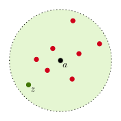
  

---

### 双边幂级数

- 解决方案：双边幂级数和 Laurent 级数
* 考虑
  $$
  S(z) = \underbrace{\sum_{k = 0}^{+\infty}c_k (z - a)^k}_{S_1(z)} + \underbrace{\sum_{k = 1}^{+\infty} c_{-k}(z - a)^{-k}}_{S_2(z)}
  $$
* 设 $S_1(z)$ 的收敛区是 $N(a, R_1)$，和函数 $s_1(z)$
* $S_2(z)$ 中涉及 $(z - a)$ 的 **负幂次项**：**<red>没学过，不知咋办</red>**

---
### 双边幂级数

- 尝试化成 **幂级数**：对 $S_2(z)$，重定义 $\tilde z = (z - a)^{-1}$
  $$
  S_2(z) = \tilde S_2(\tilde z) = \sum_{k = 1}^{+\infty}c_{-k}\tilde z^k
  $$

---

### 双边幂级数

- $S_2$ 作为 $\tilde z$ 的 **幂级数**，求得收敛区 $N(a, \tilde R)$，和函数 $\tilde s_2(\tilde z)$
* $|\tilde z| < \tilde R$ 能使得 $S_2$ 收敛，因此对 $z$ 变量而言，收敛区为
  $$
  |\tilde z| = \bigg|\frac{1}{z - a} \bigg| < \tilde R \quad \Rightarrow \qquad \orange{|z - a| > \frac{1}{\tilde R} \coloneqq R_2}
  $$
  收敛区域内，和函数为 **$s_2(z) = \tilde s_2(\tilde z = 1/z)$**。

  

  **圈里圈外**

  对于 $S_2$，作为 $z$ 的幂级数，收敛区在圈外，$|z - a| > R_2$。
  

---

### 双边幂级数

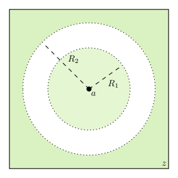

---

### 双边幂级数

- $S(z)$ 是 $S_1$ 与 $S_2$ 的和：只有当 $S_1$ 和 $S_2$ 都收敛，$S$ 才会收敛
* $S_1$ 和 $S_2$ 的 **同时收敛**：绿色部分需要重叠 $\Rightarrow$ 比较 $R_1$，$R_2$ 的相对大小

---

### 双边幂级数

- $R_2 > R_1$：没有重叠，$S$ **<red>不收敛</red>**

  

  
  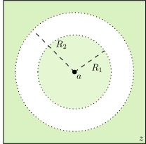
  

---

### 双边幂级数

- $R_1 > R_2$：有重叠，$S(z)$ 在重叠区 $R_2 < |z - a|< R_1$ 中收敛

  

  
  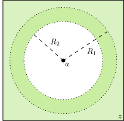
  

---

### 双边幂级数

- 刚好 $R_1 = R_2$：**可能** 在圆 $|z - a| = R_1 = R_2$ 上有收敛点，**<red>不保证有</red>**
* 总结：$R_1 > R_2$ 时，$S(z)$ 在环状区域 $R_2 < |z - a| < R_1$ 内 **绝对收敛**，且 **内闭一致收敛** 到和函数 $s_1(z) + s_2(z)$，该区域称为 $S(z)$ 的 **<green>收敛环</green>**。和函数在收敛环内 **解析**，可以逐项积分和求导。

---

### 双边幂级数

- 例：考察级数 $S(z) = \sum_{k = -\infty}^{+\infty} z^k$ 的收敛性质

**求解**

- 展开中心为原点。

* 稍作分解，$S_1(z) = \sum_{k = 0}^{+\infty}z^k$，$S_2(z) = \sum_{k = 1}^{+\infty} z^{-k}$。通过 $\tilde z = 1/z$ 处理 $S_2(z)$。

* 显然 $R_1 = R_2 = 1$，因此 **<red>没有收敛环</red>**。

* 此外，此级数单位圆周上 **<red>处处不收敛**

---

### 双边幂级数

- 例：考察级数 $S(z) = \sum_{k = 1}^\infty \left(\frac{\lambda}{z}\right)^k + \sum_{k = 0}^{\infty} z^k$ 的收敛性质
	
  

  **求解**
  
  
	令 $\tilde z = 1/z$，则可以快速求得 $\tilde R = \frac{1}{|\lambda|}$，因此 $R_2 = |\lambda|$。另外，$R_1 = 1$。因此，当 $|\lambda| < 1$ 的时候，有收敛环
  $$
  |\lambda| < |z| < 1
  $$
	其它情况处处不收敛。
	
  

---

### 双边幂级数

- 例：考察下面双边幂级数的收敛性。
	$$
  \sum_{n = 1}^{+\infty} \frac{1}{n^2} z^n + \sum_{n = 1}^{+\infty} \frac{1}{n^2 z^n}
  $$
  

  
  **求解**
  
  - 记
    $$
    S_1 = \sum_{n = 1}^{+\infty}\frac{1}{n^2}z^n,
    \qquad
    S_2 = \sum_{n = 1}^{+\infty} \frac{1}{n^2} z^{-n} = \sum_{n = 1}^{+\infty}\frac{1}{n^2}\tilde z^n
    $$
  
  

---

**求解**
  
  
- 利用 Cauchy 或者 'd Alembert 方法可以求得 $R_1 = \tilde R = R_2 = 1$，**<red>没有收敛环**。

* 在圆周上，可以发现 **绝对收敛** 性，
  $$
  \sum_{n = 1}^{+\infty} \frac{1}{n^2}|z^n|
  = \sum_{n = 1}^{+\infty} \frac{1}{n^2}|z^{-n}| = \sum_{n = 1}^{+\infty} \frac{1}{n^2} = \frac{\pi^2}{6}
  $$

---

### Laurent 级数
- **定理**：在环状区域 **<green>$H = \{z \ | \ R_2 < |z - a| < R_1\}$** 的解析函数 $f(z)$ 都可以以 $a$ 为 **<green>中心** 展开为双边幂级数，称为 **<green>Laurent 展开**，
	$$
  f(z) = \sum_{n = -\infty}^{+\infty} \purple{c_n} (z - a)^n \ , \qquad
		\forall z \in \green{H}
  $$
	其中
	$$
  \purple{c_n = \oint_C \frac{d \zeta}{2\pi i} \frac{f(\zeta)}{(\zeta - a)^{n + 1}}}, \qquad C \subset \green{H}
  $$

---
### Laurent 级数

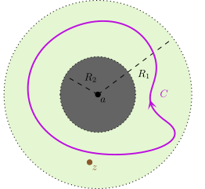

---
### Laurent 展开的要素

- Laurent 展开的要素：$a$，$H$，$z$，$C$，$\sum_{-\infty}^{+\infty}$
- 展开中心 $a$ **<red>不属于** 环状解析区 $H$：函数在 $a$ 处 **可能** **<red>不可导**
  

  **展开中心**
  
	相对地，Taylor 展开的展开中心 $a$ **一定** 是 $f$ 的 **解析** 点。
	
  

- 采样点 $z$ **一定** $\in H$，且围道 $C \subset H$。
  

  **Taylor 展开**
  
	这点与 Taylor 展开的情况是一样的。
	
  

---

### Laurent 展开的要素

- 正幂项系数 $c_{n \ge 0}$ 通常 **<red>不等于** Taylor 展开系数 $\frac{1}{n!}f^{(n)}(a)$
	
  

  **Taylor 展开系数**
  
  
  * 要想相等，
    $$
    \oint_{C}\frac{d\zeta}{2\pi i} \frac{f(\zeta)}{(\zeta - a)^{n + 1}} = \frac{f^{(n)}(a)}{n! }
    $$
    $f$ 应该要在 $C$ 内部解析。

  * 但这 **<red>并不一定** 能实现，因为 $N(a, R_2)$ 内可能有 **<red>不解析点**。极端情况中，$a$ 甚至可能是 **<red>奇点**，此时 $f^{(n)}(a)$ 根本不存在。
  
  

---

### Laurent 级数的要点

- 倘若有 **某个** $c_{-n} \ne 0$，$n \in \mathbb{N}_{>0}$，则必然在 **闭域 $\overline{N(a, R_2)}$** 上 **有奇点**；反之亦然。

  

  **$a$ 不一定是奇点**

  即使 $\overline{N(a, R_2)}$ 上有奇点，中心 $a$ 本身也并 **<red>不一定</red>** 是奇点：可能是，也可能不是。
  

---
### Laurent 级数的要点

### **<purple>负幂项</purple>** 的存在与否，决定了 **<purple>闭域 $\overline{N(a, R_2)}$ 上是否有奇点</purple>**

<gray>但具体在哪里，有多少个奇点，无法从 Laurent 展开式中看出</gray>

---

### Laurent 级数：例

- 例子：考虑 $f(z) = \frac{1}{z - a}$。该函数在环状区域 $0 < |z - a| < \infty$ 内解析，环内有 Laurent 展开
  $$
  \begin{align*}
  \frac{1}{z - a} = & \ \sum_{k = -\infty}^{+\infty}c_k (z - a)^k\\
  = & \ \cdots + 0 + 0 + \underbrace{1}_{c_{-1}} \times (z - a)^{-1} + 0 + \cdots
  \end{align*}
  $$
  展开中心 $a$ 的确是函数 $f(z)$ 的 **奇点**

---

### Laurent 级数：例

- 例子：继续考虑 $f(z) = \frac{1}{z - a}$。考虑 **新的中心** $b \ne a$。函数显然在环状区域 $0 < |a - b| < |z - b| < +\infty$ 内解析。
* **<red>如何在该区域内展开 $f(z)$？</red>**

  

  
  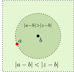
  

---

### Laurent 级数：例

- 技巧：该区可以重新写为
  $$
  0 < |u| < 1, \qquad u \coloneqq \frac{a - b}{z - b}
  $$

  

  
  
  

---

### Laurent 级数：例

- 重写为 $u$ 的函数，在 $0 < |u| < 1 \subset N(0, 1)_u$ 内展开，
  $$
  \begin{align*}
  \frac{1}{z - a} = & \ \frac{1}{(z - b) - (a - b)}
  = \frac{1}{z - b} \cdot \frac{1}{1 - \green{\frac{a - b}{z - b}}}
  = \frac{1}{z - b} \cdot \frac{1}{1 - \green{u}} \\
  = & \ \frac{1}{z - b} \cdot (1 + u + u^2 + \cdots)\\
  = & \ \cdots + \frac{(a - b)^3}{(z - b)^4} + \frac{(a - b)^2}{(z - b)^3} + \frac{a - b}{(z - b)^2}
  + \frac{1}{z - b}
  \end{align*}
  $$
* **无穷多** 奇异项 $(z - b)^{-1}, (z-b)^{-2}, \cdots$，$c_{-n} \ne 0$

  

  
  **<red>展开中心 $b$ 是否 $f$ 的奇点？</red>**
  

---

### Laurent 级数：例

- $b$ **<red>不是</red>** 奇点

  

  **展开的成立区域**

  上述几何级数展开只在 $|u| < 1$ 时成立，即
  $$
  \frac{|a - b|}{|z - b|} < 1 \qquad \Leftrightarrow 
  \qquad
  \underbrace{|a - b|}_{R_2} < |z - b| < +\infty
  $$

  可见，$z$ 与 $b$ 的距离 **<red>不能太小</red>**，因此 $z - b$ 的负幂次项 **<red>并没有</red>** 真正产生奇性。
  

* 真正的奇点依然是 $a$：它刚好在闭域 $\overline{N(b, R_2 = |a - b|)}$ 的边界上

---

### Laurent 级数的要点

- 如果 $\overline{N(a, R_2)}$ **确实没有奇点**，则下面两个事情**同时发生**
  - **负幂** 项系数 $c_{-1}, c_{-2}, c_{-3}, \cdots = 0$
  - **非负幂** 项系数 $c_0, c_1, c_2, \cdots$ 等自动等于高阶导数
    $$
    c_{n} = \frac{1}{n!}f^{(n)}(a)
    $$
    即退化为 **Taylor 展开**

---

### Laurent 级数的要点
- 给定函数、展开中心、**环状解析区**：Laurent 展开式 **<green>唯一确定**
- 给定函数、展开中心，**<red>不同** **环状解析区**的 Laurent 展开式 **<red>可能不同**

---

### Laurent 级数：计算例子

* 例：考虑函数 $f(z) = \frac{1}{z(z - 1)}$。选择展开中心为 $z = 0$

  

  **解**

  

  
  $H_1$ (去心邻域)：$0 < |z| < 1$$\qquad$$H_2$：$1 < |z| < +\infty$

  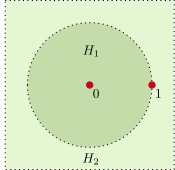
  

  

---

### Laurent 级数：计算例子

**解**

- $0 < |z| < 1$，对 $\frac{1}{z-1}$ 在 $z=0$ 附近展开：
  $$
  \frac{1}{z-1} = -\frac{1}{1-z} = -\sum_{n=0}^{\infty} z^n = -1 - z - z^2 - \cdots
  $$

  因此：
  $$
  f(z) = \frac{1}{z}\frac{1}{z - 1} = - \frac{1}{z} -1 - z - z^2 - \cdots
  $$

---

### Laurent 级数：计算例子

**解**

- $1 < |z| < \infty$，从而 $|1/z|<1$
  $$
  \frac{1}{z-1} = \frac{1}{z} \cdot \purple{\frac{1}{1-\frac{1}{z}}} = \frac{1}{z} \purple{\sum_{n=0}^{\infty} \left(\frac{1}{z}\right)^n} = \frac{1}{z} + \frac{1}{z^2} + \frac{1}{z^3} + \cdots
  $$

  因此：
  $$
  f(z) = \frac{1}{z}\frac{1}{z - 1} 
  = \frac{1}{z^2} + \frac{1}{z^3} + \cdots
  $$

---
<!-- header: 四、零点与奇点 -->
# 四、零点与奇点

---

### 解析函数的零点

- **<green>定义**：设非恒零函数 $f(z)$ 在 $a$ 的一个邻域内 **解析**，若存在正整数 $m$ 使得
  $$
  f(a) = f^{(1)}(a) = \cdots  = f^{(m - 1)}(a) = 0, \qquad
		\red{f^{(m)}(a) \ne 0} \ ,
  $$
	则称 $a$ 为 $f(z)$ 的一个 **<green>$m$-阶零点 (zero)**。$1$-阶零点又称 **<green>单 (simple) 零点**
	
  

  **$m$ 的存在性**
  
  
  由解析性，$f(z)$ 可以在 $a$ 的邻域内做 **泰勒展开**。**<purple>除非 $f(z)$ 恒零**，否则肯定得有某个正整数 $m$ 使得 $f^{(m)}(a) \ne 0$。
		
  

---

### 解析函数的零点：例

- 例：考虑 $f(z) = \sin z$。显然，$f(k \pi) = \sin k\pi = 0$。另外，$f^{(1)}(k\pi) = \cos k\pi \ne 0$，因此 $k\pi$ 均为 $\sin z$ 的 **单零点**。

---
### 解析函数的零点：例
- 例：考虑 $f(z) = (z - a)^m$，$m \in \{1, 2, \cdots\}$。
  显然，$f(a) = 0$。此外，$f^{(k)}(a) = m(m - 1)\cdots (m - k + 1)(z - a)^{m - k}$，因此
  $$
  f^{(1)}(a) = \cdots = f^{(m - 1)}(a) = 0 \ .
  $$
	但是，**<red>$f^{(m)}(a) = m! \ne 0$**。因此，$a$ 是 **$m$-阶零点**。
* 多项式 $(z - a)^m$ 给出了 $m$-阶零点的一个近似描述，更加完整的描述由下面定理给出

---

### 零点孤立性
- **定理**：设 $f$ 在 $N(a, R)$ 中解析，**<purple>且不恒为零**。则
	

  
  $a$ 是 $m$-阶零点 $\Leftrightarrow$ $f(z) = (z - a)^m \varphi(z)$

  

	其中 $\varphi(z)$ 在 $N(a, R)$ 内 **解析** **<red>且 $\varphi(a) \ne 0$**
	
  

  
  **说明**
  
	证明要点在于泰勒展开。由 $m$-阶零点定义可知
	$$\begin{align*}
		f(z) = & \ \sum_{k = 0}^{+\infty}\frac{1}{k!}f^{(k)}(a)(z - a)^k \\
		= & \ \frac{1}{m!}f^{(m)}(a)(z - a)^m + \frac{1}{(m + 1)!}f^{(m+1)}(a)(z - a)^{m + 1} + \cdots \nonumber
 	\end{align*}$$
	
  

---

### 零点孤立性

    
**说明**

提取公因子 $(z - a)^m$，可以得到
$$\begin{align*}
  f(z) = & \ (z - a)^m\left[
  \orange{\frac{1}{m!}f^{(m)}(a) + \frac{1}{(m + 1)!}f^{(m + 1)}(a)(z - a)
        + \cdots}
  \right] \nonumber\\
  = & \ (z - a)^m \orange{\varphi(z)} \nonumber
\end{align*}$$
橙色幂级数在 $N(a, R)$ 绝对内闭一致收敛到 $\varphi(z)$ 且 **<red>$\varphi(a) \ne 0$**，

**<orange><reveal>$\displaystyle\varphi(a) = \frac{1}{m!}f^{(m)}(a)$</reveal>**

---

### 零点孤立性

- **零点孤立性定理**：若 $f$ 在 $N(a, R)$ 内 **解析** 且非恒为零，$a$ 是 $f$ 的一个零点，则必然存在 $\epsilon > 0$，使得 $N(a, \epsilon)$ 内 **<red>只有** $a$ 一个零点

  

  
  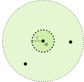
  

---

### 零点孤立性

- **零点孤立性定理**：若 $f$ 在 $N(a, R)$ 内 **解析** 且非恒为零，$a$ 是 $f$ 的一个零点，则必然存在 $\epsilon > 0$，使得 $N(a, \epsilon)$ 内 **<red>只有** $a$ 一个零点

  

  **证明**

  - 核心原因是解析函数在零点附近的行为完全由上一个定理刻画了：$f(z) = (z - a)^m \varphi(z)$，$\varphi(a) \ne 0$。其中，只要 $z \ne a$，**<purple>因子 $(z - a)^m \ne 0$**。
  * 此外，由于 $\varphi(a) \ne 0$，根据 **连续性** $\varphi(z)$ 在 $a$ 近旁处 **<red>也不可能为零</red>**，因此 $f(z)$ 在 $a$ 近旁也不会为零。
  

---

### 零点孤立性

- **零点孤立性定理**：若 $f$ 在 $N(a, R)$ 内 **解析** 且非恒为零，使得 $a$ 是一个零点，则必然存在 $\epsilon > 0$，使得 $N(a, \epsilon)$ 内 **只有** $a$ 一个零点

  

  **圆盘内孤立性**

  圆盘状解析区内的零点 **<red>只有</red>** 两种分布形态：铺满整个圆盘 (恒零函数，**非孤立零点** 的 **唯一** 形态)，或者 **孤立**。
  

* 下面有几个推论反复从不同侧面体现零点的孤立性

---

### 零点孤立性

- **定理**：考虑 $f$ 在区域 $D$ 内解析，考虑 $a \in D$ 及其小邻域 $N(a, R) \subset D$。若 $f$ 在 **$N(a, R)$ 内** 处处为零，则 $f$ 在 **整个 $D$ 内** **全是零**。

  

  
  
  

---

### 零点孤立性

- **定理**：考虑 $f$ 在区域 $D$ 内解析，考虑 $a \in D$ 及其小邻域 $N(a, R) \subset D$。若 $f$ 在 **$N(a, R)$ 内** 处处为零，则 $f$ 在 **整个 $D$ 内** **全是零**。

  

  
  
  

---

### 零点孤立性

- **定理**：设 $f$ 在区域 $D$ 内解析，在 $D$ 内有 **非平凡** 收敛点列 $\{z_n\}_{n = 1}^{+\infty}$，且点列收敛到 $\lim_{n \to +\infty}z_n = a \orange{\in D}$，则
  $$
  f(\text{all} \ z_n) = 0 \qquad \Rightarrow \qquad \text{在整个 $D$ 内 $f$ 恒为零}
  $$

  

  **证明**

  关键点是利用零点的 **孤立性**。

  由于 $a \in D$ 是解析点，函数在该处具有相当好的 **连续性**，导致 $f(a) = \lim_{n \to +\infty} f(z_n) = 0$，间接把 $a$ 打造成 **非孤立零点**，这反过来迫使 $f$ 在 $a$ 的邻域恒为零，最终也迫使 $f$ 在整个 $D$ 内恒为零。
  

---

### 零点孤立性：例

* 考虑函数 $f(z) \coloneqq \prod_{n = 0}^{+\infty}(1 - \frac{1}{z}q^n)$，其中 $|q| < 1$。读出 **零点**
  $$
  1 - \frac{1}{z}q^n = 0 \ \Rightarrow \ z_n = q^n, \qquad n = 0, 1, 2, 3, \cdots
  $$

  **零点** 序列 $z_n$ 有 **极限点** $\lim_{n \to +\infty} z_n = 0$，即原点。**<red>问题：原点是否 $f$ 的零点？</red>**

  

  **零点序列的极限**

  * 原点 **<red>不可能</red>** 是 $f(z)$ 的零点，**<red>否则</red>** 就形成一个 **非孤立零点** 并暗示 $f$ 应该是恒零函数：这显然不符合该函数的定义。
  * 事实上，原点是该函数的 **<red>奇点</red>**，因为 $\frac{1}{z}$ 因子。
  

---

### 零点孤立性

**零点与奇点**

**<purple>零点不喜欢拥挤**。过分拥挤的零点序列只有两种命运：产生/来自 **恒零函数**，或者把极限点/聚点 **挤出** 解析区，变成一个 **<red>奇点**。

---

### 零点孤立性

* **定理**：若 $f_1, f_2$ 是两个在 $D$ 内解析的函数，且 $f_1, f_2$ 在 $D$ **内** 的收敛点列上 **等值**，则在 $D$ 内 $f_1 = f_2$
* **推论**：若两个解析函数在包含实轴的区域内解析，并在实轴上 **等值**，则在整个解析区内 **等值**

---

### 实解析与复解析

* 复解析函数的零点孤立性：源自 Taylor 级数对解析函数的 **完美逼近**
* 实解析 (无穷阶可导) 函数的行为极端复杂，**<red>并不</red>** 总能用 Taylor 级数进行完美逼近
* 例子：分段函数
  $$
  f(x) = \left \{\begin{array}{cc}
  0 & x < 0\\
  e^{- \frac{1}{x^2}} & x \ge 0
  \end{array}
  \right.
  $$
  该函数在全 $\mathbb{R}$ 无穷阶可导，但是存在无穷多 **非孤立零点** $x < 0$。

---

### 孤立奇点

* **<green>定义</green>**：若 $a$ 是 $f$ 的奇点，但是 $f$ 在 $N(a, R) - \{a\}$ 中解析，则称 $a$ 为 $f$ 的一个 **<green>孤立奇点</green>**

  

  **人为要求**

  - 解析函数 **非平凡零点** 的**孤立性**是与生俱来的，是无法避免的客观规律。

  * 奇点的孤立性是 **人为要求**：存在 **<red>非孤立</red>**、非平凡奇点。
  

---

### 孤立奇点：例子

* 考虑函数 $f(z) = 1/\sin(\pi/z)$。分母为零的点是
  $$
  \frac{\pi}{z} = n \pi \Rightarrow z_n = \frac{1}{n} \ , \qquad n \in \mathbb{Z}
  $$
  这些 $z_n$ 都是 $f$ 的 **孤立** 奇点。

  

  **$n = 0$**

  $n = 0$ 对应 $z_0 = 1/0 = \infty$：**无穷远点** 也是一个孤立奇点。
  

* $\{z_n\}$ 形成奇点序列，极限存在 $\lim_{n \to \infty} z_n = 0$：原点是一个 **<red>非孤立</red>** 奇点。

---

### 孤立奇点的分类

* 为了深入了解孤立奇点的性质：考虑 **近旁** Laurent 展开
* 定义：在 $N(a, R) - \{a\}$ 中，
  $$
  f(z) = \underbrace{\sum_{n = 1}^{+\infty} c_{-n} (z - a)^{-n}}_{\green{\text{主要部分}}} + \underbrace{\sum_{n = 0}^{+\infty} c_n (z - a)^n}_{\green{\text{正则部分}}}
  $$

  

  **环状邻域**

  注意环状解析区要 **<red>紧挨** 着孤立奇点 $a$，即一个 **去心邻域** $N(a, R) - \{a\}$。
  

---

### 孤立奇点的分类

- 例：考虑函数 $f(z) = \frac{1}{z(z - 1)}$。两个孤立奇点：$1, 0$，导致 4 个环状解析区：下面两个 **可以** 用于判断 $0, 1$ 的奇性
  

  
  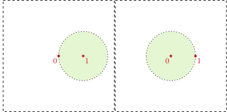
  

---
### 孤立奇点的分类

- 例：考虑函数 $f(z) = \frac{1}{z(z - 1)}$。两个孤立奇点：$1, 0$，导致 4 个环状解析区：下面两个 **<red>不能** 用于判断 $0, 1$ 的奇性
  

  
  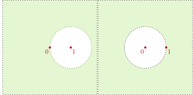
  

---

### 孤立奇点的分类

- 孤立奇点可以分成三类
* **<green>定义</green>**：函数 $f$ 的孤立奇点 $a$ 近旁的 Laurent 展开 $\Rightarrow$ 主要部分、正则部分
  - 若主要部分为零，则 $a$ 称为 $f$ 的 **<green>可去 (removable) 奇点</green>**
  - 若主要部分有 **有限** 项非零，其中最负幂次项是 $c_{-m}(z - a)^{-m}$，则称 $a$ 为 $f$ 的 **<green>$m$-阶极点 (pole)</green>**
  - 若主要部分有 **无穷** 项非零，则称 $a$ 为 $f$ 的 **<green>本性 (essential) 奇点</green>**

---

### 可去奇点的判定

* **定理**：设 $a$ 为 $f$ 的孤立奇点。则下面几个说法是 **等价** 的
  - $a$ 是可去奇点
  - $\lim_{z \to a}f(z)$ **存在** 且 **有限**
  - $f(z)$ 在 $a$ 的 **某个** 去心邻域内 **有界**

  

  **说明**

  * 可去奇点说明 $f$ 的 Laurent 展开 **<red>没有</red>** 负幂次项，因此可以对级数直接取 $\lim_{z \to a}$ 极限，这个极限等于级数 **零次幂项**，**存在** 且 **有限**。

  * **极限存在且有限**也说明 $f(z)$ 在 $a$ 附近有 **有界**，以此结合 Laurent 级数系数的积分定义，可以证明负幂次项系数为零。
  

---

### 可去奇点的判定：例子

* 例：考虑 $f(z) = \frac{1}{z}\sin z$。显然 $z = 0$ 是一个孤立奇点。考虑原点去心邻域，作 Laurent 展开
  $$
  f(z) = \frac{1}{z} \left(z - \frac{1}{3!} z^3 + \frac{1}{5!} z^5 + \cdots\right)
  = 1 - \frac{1}{3!}z^2 + \frac{1}{5!}z^4 + \cdots
  $$
  显然主要部分为 **<red>零</red>**：**可去奇点**

  

  
  也可以考虑
  $$
  \lim_{z \to 0} \frac{1}{z} \sin z = 1 \Rightarrow \text{可去奇点}
  $$
  或者论证 $\frac{1}{z}\sin z$ 在 $N(0,1)$ 内 **有界**。
  

---

### 可去奇点的判定：例子

* 例：考虑 $f(z) = \frac{z - a}{(z - a)(z - b)}$，$a \ne b$。显然有两个孤立奇点 $a, b$。其中
  $$
  \lim_{z \to a} = \frac{1}{a - b} \in \mathbb{C}
  $$
  因此 $a$ 是 **可去** 奇点。

* 但是，$b$ **<red>不是</red>** 可去奇点，
  $$
  \lim_{z \to b} \frac{z - a}{(z - a)(z - b)} = \infty
  $$

---

### 可去奇点的判定：例子

* 例：考虑
  $$
  f(z) = \left\{\begin{array}{cc}
  1/z, & z \ne 1\\
  2025 & z = 1
  \end{array}\right.
  $$
  显然，$1$ 是函数的孤立奇点。计算极限 $\lim_{z \to 1}\frac{1}{z} = 1$，因此是一个 **可去奇点**。

---

### 可去奇点的判定

* 例：考虑
  $$
  f(z) = \left\{\begin{array}{cc}
  1/z, & z \ne 1\\
  2025 & z = 1
  \end{array}\right.
  $$
  **<red>问题</red>**：如果在 $1 < |z - 1| < +\infty$ 环状解析域作 Laurent 展开，**<red>会得到什么结论？</red>**

  

  
  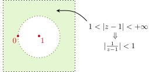
  

---

### 可去奇点的判定

- 远方 ($1 < |z-1| < +\infty$) Laurent 展开 (注意 $|\frac{1}{1 - z}| < 1$)
  $$
  \frac{1}{z} = \frac{1}{(\purple{z - 1}) + 1} = \frac{1}{\purple{z - 1}} \frac{1}{1 \ \red{-} \ \frac{1}{1 - z}}
  = \frac{1}{z - 1} \sum_{k = 0}^{+\infty} \left(\frac{1}{1 - z}\right)^k
  $$
  「主要部分」有 **<red>无穷项非零</red>**！但这个展开 **<red>不反映</red>** $1$ 的奇性。

---
### 可去奇点的判定

**去心邻域**

判断奇性时，只有 **近旁/去心邻域内** Laurent 展开才有资格说话。

---

### 极点的判定

* **定理**：若 $a$ 是 $f$ 的孤立奇点。则 $a$ 是某阶**极点**的 **充要条件** 是 $\lim_{z \to a}f(z) = \infty$

  

  **极限存在**

  $\lim = \infty$ 要求 **不同的逼近方向** 都要给出 **$\infty$**。
  

  

  **极点的阶数**

  本定理 **<red>不能</red>** 给出极点的**阶数**。
  

---

### 极点的判定

* **定理**：设 $a$ 是 $f$ 的孤立奇点，则下面几个陈述等价：
  - $a$ 是 **$m$-阶极点**
  - $f$ 在 $a$ 的某个去心邻域可以写成 $\varphi(z)(z - a)^{-m}$，其中 $\varphi$ 在 $a$ 附近**解析**且 **<red>$\varphi(a) \ne 0$**
  - $a$ 是 $1/f(z)$ 的 $m$-阶 **零点**

---

### 极点的判定：例子

* 例：考虑 $f(z) = \frac{1}{(\sin z)^n}$，$n \in \mathbb{N}_{>0}$。则原点是孤立奇点。

* 显然 $1/f(z) = (\sin z)^n$。在原点处做 Taylor 展开
  $$
  (\sin z)^n = z^n + \cdots
  $$
  说明原点是 $1/f(z)$ 的 $n$-阶 **零点**，因此是 $f(z)$ 的 $m$-阶 **极点**。

---

### 极点的判定：例子

* 例：考虑 $f(z) = 1/(z - \sinh z)$。原点是孤立奇点。

* 利用 $1/f(z) = z - \sinh z$
  $$
  z - \sinh z = - \frac{z^3}{6} + \cdots
  $$
  可见原点是 $1/f(z)$ 的 **三阶零点**，因此是 $f(z)$ 的 **三阶极点**。

---

### 本性奇点的判定

* **定理**：设 $a$ 是 $f$ 的孤立奇点，则 $a$ 是本性奇点的充要条件是 $\lim_{z \to a}f(z)$ 极限 **不存在** (即与 **逼近方向有关**)。
* 例：考虑之前介绍的函数 $f(z) = e^{- \frac{1}{z^2}}$。原点是它的 **本性奇点**：
  $$
  \lim_{\substack{y = 0 \\ x \to 0}} f(z) = 0, \qquad
  \lim_{\substack{x = 0 \\ y \to 0}} f(z) = \infty
  $$
  也可以计算它在原点近旁的 Laurent 展开：主要部分无穷多项，
  $$
  f(z) = \sum_{n = 0}^{+\infty} \frac{1}{n!} \left(- \frac{1}{z^2}\right)^n
  $$

---

### 本性奇点的性质

* **Casorati-Weierstrass 定理**：若 $a$ 是 $f(z)$ 的本性奇点，则对 $\forall A \in \mathbb{C} \cup \{\infty\}$，存在以本性奇点 **<green>$a$ 为聚点的点列 $\{z_n\}$**，
  $$
  \lim_{n \to \infty} z_n = a, \quad \lim_{n \to \infty} f(z_n) = A
  $$
  即本性奇点附近的 $f$ 函数值可以**无限接近** **任意有限** 或者 **无限复数**。

---

### 本性奇点的性质

* 例：原点 $\purple{z = 0}$ 是 $e^{1/z}$ 的本性奇点。对 $\forall A \in \mathbb{C}_{\ne 0}$，则 $z_n = \frac{1}{\log A + 2\pi i n}$，有
  $$
  \lim_{n \to \infty} z_n = \purple{0}, \quad
  \lim_{n \to \infty} e^{1/z_n} = \lim_{n \to \infty} e^{\log A + 2\pi i n} = A
  $$
  另外考虑 $z_n = - 1/n$，显然
  $$
  \lim_{n \to \infty} z_n = \purple{0}, \quad
  \lim_{n \to \infty} e^{1/z_n} = \lim_{n \to \infty} e^{-n} = 0
  $$
  另外考虑 $z_n = 1/n$，显然
  $$
  \lim_{n \to \infty} z_n = \purple{0}, \quad
  \lim_{n \to \infty} e^{1/z_n} = \lim_{n \to \infty} e^n = \infty
  $$

---

### 本性奇点的性质

* **Picard 定理**：若 $a$ 是 $f(z)$ 的本性奇点，则在 $a$ 的邻域内，$f(z)$ 的值可以**取遍** **<red>除了某个</red>** 复数 $A$ 之外的 所有**有限**复数值，且可以重复取 **无穷次**。

  

  **Casorati-Weierstrass 定理**

  Picard 定理是 Casorati-Weierstrass 定理的加强版。后者只是说明在本性奇点附近可以「逼近」任意复数，而 Picard 定理说明可以确切「取到」**<red>几乎</red>** 所有复数。
  

---

### 本性奇点的性质

* 例：原点是 $f(z) = e^{1/z}$ 的本性奇点。**<red>$0$ 是无法取到的值**。此外任意有限复数都可以取到：
  $$
  f(\frac{1}{\log A + 2\pi i n}) = A, \qquad \forall n \in \mathbb{N}
  $$

---

### 级数与物理

* 第一类应用：把解析函数在合适的区域展开成 **级数**。可以取有限项做近似，简化物理问题
* 第二类应用：物理量的原始定义就是级数

---

### 级数与物理

* 例：考虑一个系统有许多粒子，不同粒子携带不同电荷。你想知道电荷的分布状况。

  | 电荷 $n$ | 粒子数 $N(n)$ |
  |---------|-------------|
  | $0$ | $3$ |
  | $1$ | $5$ |
  | $2$ | $9$ |
  | $3$ | $17$ |
  | $\vdots$ | $\vdots$ |

---

### 级数与物理

* 更加先进的办法：定义多项式/级数
  $$
  Z(q) \coloneqq \sum_{n = 0}^{n_\text{max}} N(n)q^n, \quad \Rightarrow \quad N = N(q \to 1) = \sum_{n = 0}^{n_\text{max}} N(n)
  $$
  其中 $q$ 是一个本身没啥含义的 **辅助变量**，称为电荷 $n$ 对应的 **<green>计数参数 (counting parameter)</green>**，或者 **<green>逸度 (fugacity)</green>**。级数 $Z(q)$ 常称为 **<green>配分函数 (partition function)</green>**
* **<green>热力学极限</green>**：粒子数趋于无穷，可能携带很大的电荷，$n_\text{max} \to \infty$

---

### 级数与物理

* 热力学系统：包含一些微观粒子，整个系统可以处于许多不同的 **微观状态**。每个状态 $s$ 有一个 **能量** $E(s)$
* 想了解系统能量的分布情况
* 定义 **<green>热力学配分函数</green>**：对所有态 $s$ 进行求和，
  $$
  Z(\beta) \coloneqq \sum_{s} e^{- \beta E(s)} 
  = \sum_{E} \orange{N(E)} e^{- \beta E} 
  $$
  其中 $e^{-\beta E}$ 称为 **<green>玻尔兹曼因子</green>** (相对概率)，$\beta$ 是温度的倒数，
  $$
  \beta \coloneqq \frac{1}{k_B T}
  $$

---

### 级数与物理

* 定义 **<green>逸度 (fugacity) $q \coloneqq e^{-\beta}$**，当能量 **取离散整数值** 时，配分函数可以写成级数形式
  $$
  Z(q) = \sum_{E} N(E) q^E
  $$
* 从 $\ln Z(q)$ 可以算出许多有趣的物理量 (内能 $\mu$，自由能 $F$ 等)
  $$
  \mu = - \frac{\partial}{\partial \beta} \ln Z = \frac{1}{Z} \sum_{E}^{n} E N(E) e^{-\beta E} , \qquad F = - \frac{1}{\beta} \ln Z
  $$

---

### 级数与物理

- 更一般的热力学系统：**正系数** 多变量多项式/级数
  $$
  Z(q, x_1, x_2) = \sum_{E, n_1, n_2} N(E, n_1, n_2) q^E x_1^{n_1} x_2^{n_2}
  $$
* **$\ln Z$ 的可导性**很重要：$Z = 0$ **<red>不是</red>** 解析点
* 不可导的点称为 **相变点**：在这些点附近物理量可能会发生 **突变**

---

### 级数与物理

* 多项式的零点长什么样子？
* Lee-Yang 圆定理：对于一大类统计模型的配分函数，其零点分布在 **单位圆** 上。热力学极限下，若零点弧的聚点落在正实轴上，则系统存在 **相变**。
