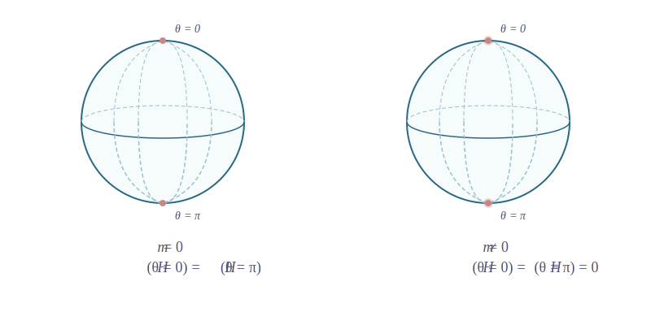
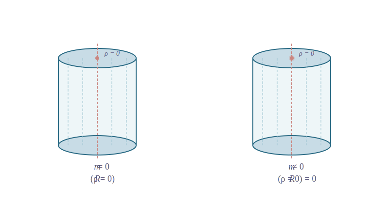

$$
\gdef\red#1{{\color{cb8680}{#1}}} 
\gdef\green#1{{\color{4f8d63}{#1}}} 
\gdef\gray#1{{\color{aaaaaa}{#1}}} 
\gdef\purple#1{{\color{B189C6}{#1}}} 
\gdef\orange#1{{\color{dfa04b}{#1}}}
\gdef\white#1{{\color{white}{#1}}}
$$

# 数理方程总结

---

### 数理方程

- 空间背景：$\mathbb{R}^n$
- 波动方程
  - 弦振动
  - 杆振动
- 热传导方程、扩散方程

---
### 稳定场方程
- 齐次方程时空分离变量 $\Rightarrow$ 亥姆赫兹 (Helmholtz) 方程
  $$
  \nabla^2 u(\mathbf{r}) + k^2 u(\mathbf{r}) = f(\mathbf{r})
  $$
- 时间无关非齐次方程 $\Rightarrow$ 稳定场方程
  - 泊松 (Poisson，**<red>不是 poison**) 方程
    $$
    \nabla^2 u(\mathbf{r}) = f(\mathbf{r})
    $$
  - 拉普拉斯 (Laplace) 方程
    $$
    \nabla^2 u(\mathbf{r}) = 0
    $$

---

### $\nabla^2$

- 主角
  $$
  \nabla^2 = \frac{\partial^2}{\partial x_1^2} + \cdots + \frac{\partial^2 }{\partial x_n^2}
  $$
  

  
  这个表达式只适用于 **<green>直角/笛卡尔坐标系** $(x_1, \cdots, x_n)$
  

---
### 整体图景

$~$

仔细分析 $\nabla^2$ 本身 $\to$ PDE 求解方法 1：分离变量 $\to$ 二阶线性常微分方程

$\to$ 常点和正则奇点的级数解 $\to$ Sturm-Liouville 理论

$\to$ 特殊函数 ($P_\ell, ~ P_\ell^m, ~ Y_{\ell m}; ~ J_\nu, ~ N_\nu$) 及其性质

PDE 求解方法 2：格林函数

PDE 求解方法 3：傅里叶变换

---
### $\nabla^2$ (第 9 章)

- 在不同维度、不同坐标系中表达 $\nabla^2$
- 直角坐标、极坐标、球坐标、柱坐标
  

  
  $\nabla^2$ 不是简单的坐标二阶导数的和，必须要考虑坐标系的 **<green>度量系数**
  $$
  h_i = \bigg|\frac{\partial \mathbf{r}}{\partial q_i} \bigg|
  $$
  - $h_r = 1$，$h_\theta = r$，$h_\varphi = r \sin\theta$
  - $h_\rho = 1$，$h_\varphi = \rho$，$h_z = 1$
  

---
### $\nabla^2$ (第 9 章)

- 极坐标 $(\rho, \varphi)$
  $$
  \nabla^2 = \frac{1}{\rho}\frac{\partial}{\partial \rho}\left(\rho \frac{\partial}{\partial \rho}\right)
  + \frac{1}{\rho^2} \frac{\partial^2}{\partial \varphi^2}
  $$
- 球坐标 $(r, \theta, \varphi)$
  $$
  \nabla^2 = \frac{1}{r^2}\frac{\partial}{\partial r}\left(r^2 \frac{\partial}{\partial r}\right)
  + \frac{1}{r^2 \sin\theta} \frac{\partial}{\partial \theta} \left( \sin\theta \frac{\partial}{\partial \theta} \right)
  + \frac{1}{r^2 \sin^2\theta} \frac{\partial^2}{\partial \varphi^2}
  $$
- 柱坐标 $(\rho, \varphi, z)$
  $$
  \nabla^2 = \frac{1}{\rho}\frac{\partial}{\partial \rho}\left(\rho \frac{\partial}{\partial \rho}\right)
  + \frac{1}{\rho^2} \frac{\partial^2}{\partial \varphi^2}
  + \frac{\partial^2}{\partial z^2}
  $$

---
### 分离变量法 (第 7 章，第 9 章)

- 重点关注 (齐次) 稳定场方程与亥姆赫兹方程
- 在不同坐标系下，假设解的形式
  - 直角坐标系 $(x,y)$：$u(x,y) = X(x) Y(y)$，$u(x,t) = T(t) X(x)$
  - 极坐标系 $(\rho, \varphi)$：$u(\rho, \varphi) = R(\rho) \Phi(\varphi)$
  - 球坐标系 $(r, \theta, \varphi)$：$u(r, \theta, \varphi) = R(r) H(\theta) \Phi(\varphi)$
  - 柱坐标系 $(\rho, \varphi, z)$：$u(\rho, \varphi, z) = R(\rho) Z(z) \Phi(\varphi)$
- 三维空间做两次分离变量 $\Rightarrow$ 两个分离常数
  

  
  分离常数的物理取值范围由各种边界条件约束
  

---
### 分离变量法 (第 7 章，第 9 章)

- 产物：各个方向的**二阶线性常微分方程**
  $$
  y'' + P(x)y'(x) + Q(x) y(x) = 0
  $$
- 有的方程容易：
  $$
  X''(x) + \lambda X(x) = 0
  $$
  
  $$
    \Phi''(\varphi) + \mu \Phi(\varphi) = 0
  $$

  $$
    Z''(z) - \lambda Z(z) = 0
  $$

---
### 分离变量法 (第 7 章，第 9 章)
- 有的方程比较复杂
  - 极坐标 $R(\rho)$：欧拉方程
  - 球坐标 $H(\theta)$：勒让德方程
  - 球坐标 $R(r)$：欧拉方程 (拉普拉斯)或者球贝塞尔方程 (亥姆赫兹)
  - 柱坐标 $R(\rho)$：贝塞尔方程

---
### 分离变量法 (第 7 章，第 9 章)

- 物理边界条件：刻画系统与外界的耦合方式和强度
  

  
  如指定弦端点自由或者固定，指定边界上的热流密度，指定 $D$ 区域的边界电势 $u|_{\partial D} = \varphi_0$
  

- 自然边界条件：来自物理可观测量的“单值性”，“良定性”，“有限性”
  - 要求 $H(\theta = 0)$ 和 $H(\theta = \pi)$ 为零或者有限
  - 要求 (极坐标) $R(\rho = 0)$、(球坐标) $R(r = 0)$ 为零或者有限

---
### 分离变量法 (第 7 章，第 9 章)

---
### 分离变量法 (第 7 章，第 9 章)

---
### 求解二阶线性常微分方程 (第 7 章，第 10 章)

- 直接求解很难：寻找级数解
- 两类关键点：展开中心 $x_0$ 与求解区域边界 $a, b$
  

  
  **展开中心**有可能与**边界**重合：Bessel 方程的正则奇点 $x_0 = 0$ 恰好为求解区域 $[0, +\infty]$ 的左侧边界
  

- 两种中心：**常点**与**正则奇点**
  

  
  常点：$P(x), Q(x)$ 在 $x_0$ 处解析
  正则奇点：$P(x), Q(x)$ 在 $x_0$ 处的**极点**阶数 **<red>分别不超过** 1 和 2
  

---
### 求解二阶线性常微分方程 (第 7 章，第 10 章)

- 常点邻域级数解：总是存在两个线性独立**幂级数**解
  

  
  **在常点处的初始条件**可以唯一确定一个解
  
  也可以用自然边界条件确定一个**线性独立**解
  

- 正则奇点邻域级数解 (Fuch's 定理)：总是存在两个线性独立的**级数解** (第一解 $y_{(1)}$ 和第二解 $y_{(2)}$)，第二解可能包含对数项
  

  
  “级数解”不一定是“幂级数解”
  
  通过**边界条件**定解
  

---
### 求解二阶线性常微分方程 (第 7 章，第 10 章)

- 常点和正则奇点邻域的级数解
  $$
  \sum_{n \ge 0} y_n(x - x_0)^n, \qquad
  \sum_{n \ge 0} y_n(x - x_0)^{n + s} + \gray{(\small{\text{对数项}})}
  $$
- 展开系数 $y_n$：通过代入微分方程得到**递推关系**，确定两个线性独立解

---
### 正则奇点处的级数解 (第 10 章)
- 正则奇点处的级数解的**额外结构**：指标 $s_1, s_2$
  $$
  y(x) = (x - x_0)^{s} + \cdots
  $$
  需要使得**方程领头阶项系数为零**
  $$
  \big(s(s - 1)+ p_{-1} s + q_{-2}\big) x^{s - 2} + O(x^{s-1}) = 0
  $$
  得到 **<green>特征方程 (indicial equation)**
  $$
    s(s - 1)+ p_{-1} s + q_{-2} = 0 \qquad \Rightarrow \qquad s_1, s_2
  $$

---
### 正则奇点处的级数解 (第 10 章)

<video width='1000' src='animations/media/videos/scenes/2160p60/Scene01.mp4' controls></video>

---
### 正则奇点处的级数解 (第 10 章)

- 高阶项系数也要为零，得到 $y_n$ **递推关系**
  

  
  方程各阶各司其职：领头阶负责指标 $s$，高阶负责系数 $y_n$
  

- 两个指标 $s_1, s_2$ 分别负责第一解和第二解

---
### 正则奇点处的级数解 (第 10 章)

- **定理 (Fuchs)**：在极点 $x_0$ 有**正则解**的**充要条件**是 $p, q$ 在 $x_0$ 处的极点阶数**分别** **<red>不高于** 1 阶和 2 阶 (也称为 **<green>正则 (regular) 奇点 (singular point)**)，有两个 **<green>正则解**
  $$
  \small{\text{第一解：}}\purple{\boldsymbol{y_{(1)}(x)}} = \sum_{n = 0}^{+\infty} y_n (x - x_0)^{n + s_1} 
  $$
  $$
  \small{\text{第二解：}}y_{(2)}(x) = \sum_{n = 0}^{+\infty} \red{y'_n} (x - x_0)^{n + s_2} + \beta \purple{\boldsymbol{y_{(1)}(x)}} \ln(x - x_0)
  $$
  其中 $s_1, s_2 \in \mathbb{C}$ 称为 **<green>正则解的指标** 或者 **<green>indicial roots**，满足 $\operatorname{Re}s_1 \ge \operatorname{Re}s_2$。

---
### Legendre 方程 (第 10 章，第 11 章)

- Legendre 方程 (球坐标 + 轴对称)
  $$
  y''(x) - \frac{2x}{1-x^2} y' + \frac{\lambda}{1 - x^2}y = 0
  $$
- Legendre 方程在常点 $x_0 = 0$ 邻域的级数解有两个：$y_\text{even}$，$y_\text{odd}$
- **自然边界条件**要求两个解中的一个截断为多项式
  - 约束 $\lambda = \ell(\ell+1)$，$\ell = 0, 1, 2, \cdots$；$\lambda$ 为 Legendre 方程的 **<green>本征值**
  - $\ell = \text{even}/\text{odd}$ 时，$y_\text{even}/y_\text{odd}$ 截断，归一化，**<green>重命名为 Legendre 多项式 $P_\ell$**
  - $\ell = \text{even}/\text{odd}$ 时，$y_\text{odd}/y_\text{even}$ 不截断，**<green>重命名为 $Q_\ell$**

---
### Legendre 方程 (第 10 章，第 11 章)

- Legendre 多项式具有
  - 正交归一性
    $$
    (P_\ell, P_{\ell'})
    = \int_{-1}^{1} P_\ell(x) \overline{P_{\ell'}(x)} dx 
    = \frac{2}{2\ell + 1} \ \delta_{\ell, \ell'} 
    $$
    

    
    注意**复共轭**，虽然当前 $P_\ell$
    

  - 完备性
    $$
    f(x) = \sum_{\ell = 0}^{+\infty} f_\ell P_\ell(x), \qquad
    f_\ell = \frac{2\ell + 1}{2} \int_{-1}^{1} f(x) P_\ell(x) dx
    $$

---
### Legendre 方程 (第 10 章，第 11 章)

- 奇偶性
- 微分表达式 (Rodrigues 公式)
  $$
  P_\ell(x) = \frac{1}{2^\ell \ell!} \frac{d^\ell}{dx^\ell} (x^2 - 1)^\ell
  $$
- 生成函数
  $$
  \frac{1}{\sqrt{1 - 2xr + r^2}}
  = \sum_{\ell = 0}^{+\infty} P_\ell(x) r^\ell, \qquad |r| < 1
  $$

---
### Bessel 方程 (第 10 章，第 12 章)

- 连带 Legendre 方程 (球坐标 + 非轴对称)
  $$
  \frac{d}{dx}\bigg[(1 - x^2)\frac{d\mathscr{P}}{dx}\bigg] + \bigg(\lambda - \frac{m^2}{1 - x^2}\bigg)\mathscr{P} = 0
  $$
- 没有直接求解：构建 $\mathscr{P}(x)$ 与 Legendre 方程解 $P(x)$ 的关系，得到 **<green>连带 Legendre 函数**
  $$
  P_\ell^m(x) = (1 - x^2)^{\frac{m}{2}} P^{(m)}_\ell(x), \qquad
  m = 0, 1, 2, \cdots, \quad \ell \ge m 
  $$
- 连带 Legendre 函数具有类似性质：正交归一性、完备性

---
### Bessel 方程 (第 10 章，第 12 章)

- Bessel 方程
  $$
  y'' + \frac{1}{x} y' + (1 - \frac{\nu^2}{x^2}) y = 0, \qquad
  \operatorname{Re}\nu \ge 0
  $$
- 原点 $x_0 = 0$ 是正则奇点，同时也是求解区域 $[0, +\infty)$ 的边界
- $x_0$ 邻域的线性独立级数解有两个：$y_{(1)}$ 和 $y_{(2)}$
* **<red>$\nu$ 的取值是否受 Bessel 方程自然边界条件的约束？** 
  <answer>不受约束，$\nu$ 不是这个问题的本征值</answer>
* **<red>$\nu$ 的取值受什么约束？**
  <answer>由具体问题决定：在球坐标分离变量问题中，由 $\varphi$ 方向自然边界条件约束</answer>

---
### Bessel 方程 (第 10 章，第 12 章)

- $\nu$ 高度自由：分情况讨论
- 指标：$s_1 = \nu$，$s_2 = -\nu$，$s_1 - s_2 = 2\nu$
  - Generic $\nu$ $\Rightarrow$ generic $s_1 - s_2$：Fuch 说必定 **<green>没有对数项**
  - 半奇数 $\nu$ $\Rightarrow$ $s_1 - s_2 = 1,3,5, \cdots$：Fuch 说**可能有对数项**
  - $\nu=1,2,3, \cdots$ $\Rightarrow$ $s_1 - s_2 = 2,4,6, \cdots$：Fuch 说**可能有对数项**
  - $\nu=0$ $\Rightarrow$ $s_1 - s_2 = 0$：Fuch 说 **<red>必定有对数项**

---
### Bessel 方程 (第 10 章，第 12 章)

  
- **<green>generic**: $\nu \not \in \frac{1}{2} \mathbb{N}$
  

  最简单

  无对数项
  

- 半奇数：$\nu = \frac{1}{2}, \frac{3}{2}, \frac{5}{2}, \cdots$
  

  
  次简单
  
  无对数项

  $\nu = \frac{1}{2}$ 最特殊
  

- 自然数：$\nu = 0, 1, 2, \cdots$
  

  最复杂
  
  有对数项
  

---
### Bessel 方程 (第 10 章，第 12 章)

- 不管 $\nu$ 是何值：都有两个线性独立解
  

  
  暂时不管满不满足自然边界条件
  

* 关键问题：**<red>哪两个相互线性独立**
  $$
  J_\nu, \qquad
  J_{-\nu}, \qquad
  N_\nu
  $$
  

  
  * 其实还可以考虑 $N_{-\nu}$
  

---
### Bessel 方程 (第 10 章，第 12 章)

---
### Bessel 方程 (第 10 章，第 12 章)

- 自然边界条件：$R(\rho = 0)=0$ 或者 
  - $\nu^2 = m^2 = 0$：$y(\rho = 0)$ 有限
  - $\nu^2 = m^2 \ne 0$：$y(\rho = 0) = 0$
* **<red>$J_\nu(x)$ 是否满足这些要求？** (第 12 章)

---
### Sturm-Liouville 理论 (第 10 章)

- 课上碰到的各种二阶线性常微分方程都可以看成是 Sturm-Liouville 型方程
  $$
  \frac{d}{dx} \left[ k(x) \frac{dy}{dx} \right] \ \underbrace{- \ q(x)}_{\red{\le 0}} y  + \lambda \underbrace{\rho(x)}_{\ge 0}y = 0
  $$
  

  
  $q(x)$ 和 $\lambda \rho(x)$ 项的核心差别：$q(x)$ 系数是 **<red>非正** 的
  

- Sturm-Liouville 型方程 + 合适的边界条件 $\Rightarrow$ Sturm-Liouville 本征问题
  

  系数 $\lambda$ 称为 **<green>本征值 (eigenvalue)**，解 $y(x)$ 称为 **<green>本征函数 (eigenfunction)**
  

---

### Sturm-Liouville 理论 (第 10 章)

- 由于边界条件：不是随便的 $\lambda$ 都使得 $y(x)$ 有非零解
- 本征值受到强烈约束：只能取**非负离散值**
  $$
  0 \le \lambda_1 < \lambda_2 < \lambda_3 < \cdots \to +\infty
  $$
- (**<red>周期性边界条件除外**) 每个本征值对应**唯一、无简并**的本征函数
  $$
  y_1(x), \qquad y_2(x), \qquad y_3(x), \qquad \cdots
  $$
- 不同本征值本征函数**带权正交** ($\rho$ 为权函数，注意**复共轭**)，在求解区间上**完备**
  $$
  (y_m, y_n) = \int_a^b \overline{y_m(x)}y_n(x) \rho(x) dx = 0, \qquad
  m \ne n
  $$

---
### 合成拉普拉斯方程一般解 (第 9 章)

- 讲义里提到亥姆赫兹和拉普拉斯方程，但只详细介绍了较为简单的拉普拉斯方程
  $$
  \nabla^2 u = 0
  $$

- 球坐标 + 轴对称：$R(r)H(\theta)\Phi(\varphi)$
  * $R(r)$：$r^\ell, r^{-(\ell + 1)}$ (第 11 章开头，求解欧拉方程)
    $$
    r^2R ''(r) + 2r R' - \ell(\ell+1)R = 0
    $$
  * $H(\theta)$：$P_\ell(\cos \theta)$ (第 9 章，第 11 章)
  * $\Phi(\varphi)$： 常数

---
### 合成拉普拉斯方程一般解 (第 11 章，第 9 章)
- 球坐标 + 非轴对称：$R(r)H(\theta)\Phi(\varphi)$
  * $R(r)$：$r^\ell, r^{-(\ell + 1)}$，$\ell = 0, 1, 2, \cdots$
  * $H(\theta)$：$P^m_\ell(\cos \theta)$ (连带 Legendre 函数，第 11 章)
    

    
    $m = - \ell, - \ell + 1, \cdots, \ell - 1, \ell$
    

  * $\Phi(\varphi)$ $e^{i m \varphi}$
    

    
    $m$ 可正可负
    

  * $Y_{\ell m} \sim P_{\ell}^{m}(\cos \theta)e^{+ i m \varphi}$
    

---
### 合成拉普拉斯方程一般解 (第 7 章)

- 极坐标：$R(\rho) \Phi(\varphi)$
  * $R(\rho)$：$\rho^m, \rho^{-m}$ ($m = 1, 2, \cdots$)，**<red>以及 $\rho^0, \ln \rho$**，求解
    $$
    \rho^2 R'' + \rho R' - m^2 R = 0
    $$
    

    
    极坐标看起来比球坐标简单，没有 $\theta$ 方向，但 $\rho$ 方向多了两个解：$\rho^0$ 以及 $\ln \rho$
    

  * $\Phi(\varphi)$： $e^{\pm i m \varphi}$ 或者 $\sin m \varphi, \cos m \varphi$

---
### 合成拉普拉斯方程一般解 (第 9 章，第 12 章)

- 柱坐标：$R(\rho)\Phi(\varphi)Z(z)$
  - $R(\rho)$：**贝塞尔方程** (第 12 章)或者**欧拉方程**解 (第 9 章，$\rho^m, \rho^{-m}, \rho^0, \ln \rho$)
    

    
    - 是极坐标结果的升级版
    - 当 $z$ 方向有非平凡的行为，则需要考虑 $m$-阶贝塞尔方程
    

  - $\Phi(\varphi)$： $e^{\pm i m \varphi}$ 或者 $\sin m \varphi, \cos m \varphi$
  - $Z(z)$：$e^{\pm \sqrt{\lambda} z}$

---
### 傅里叶变换法

- 将 PDE 转化为 ODE，或者把 PDE 转化为代数方程
- 适用于**无限空间**的齐次、非齐次微分方程
  

  
  时间通常在 $(0, +\infty)$ 取值，不方便做傅里叶变换
  

---
### 傅里叶变换法
- 核心方法：未知函数 $u$、初始条件 $\varphi$ 对所有空间变量做傅里叶变换
  $$
  u(\mathbf{r}) = \frac{1}{(2\pi)^{n/2}} \int_{\mathbb{R}^n} U(\mathbf{k}) e^{+i \mathbf{k} \cdot \mathbf{r}} d^n \mathbf{k}
  $$
  $$
  \varphi(\mathbf{r}) = \frac{1}{(2\pi)^{n/2}} \int_{\mathbb{R}^n} \Phi(\mathbf{k}) e^{+i \mathbf{k} \cdot \mathbf{r}} d^n \mathbf{k}
  $$
- 获得 $U(\mathbf{k})$ 的代数方程或者 ODE + 初始条件，解出 $U(\mathbf{k})$ 后反变换得到 $u(\mathbf{r})$
- 难度的转化：计算傅里叶反变换积分