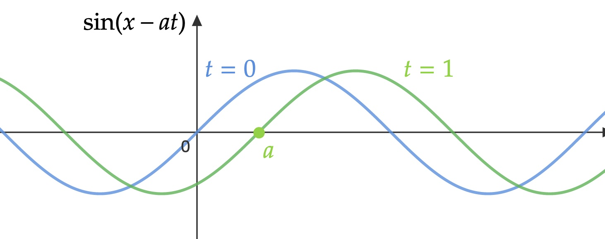
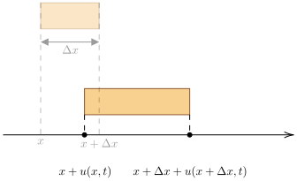
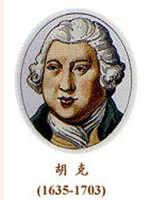
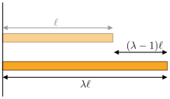
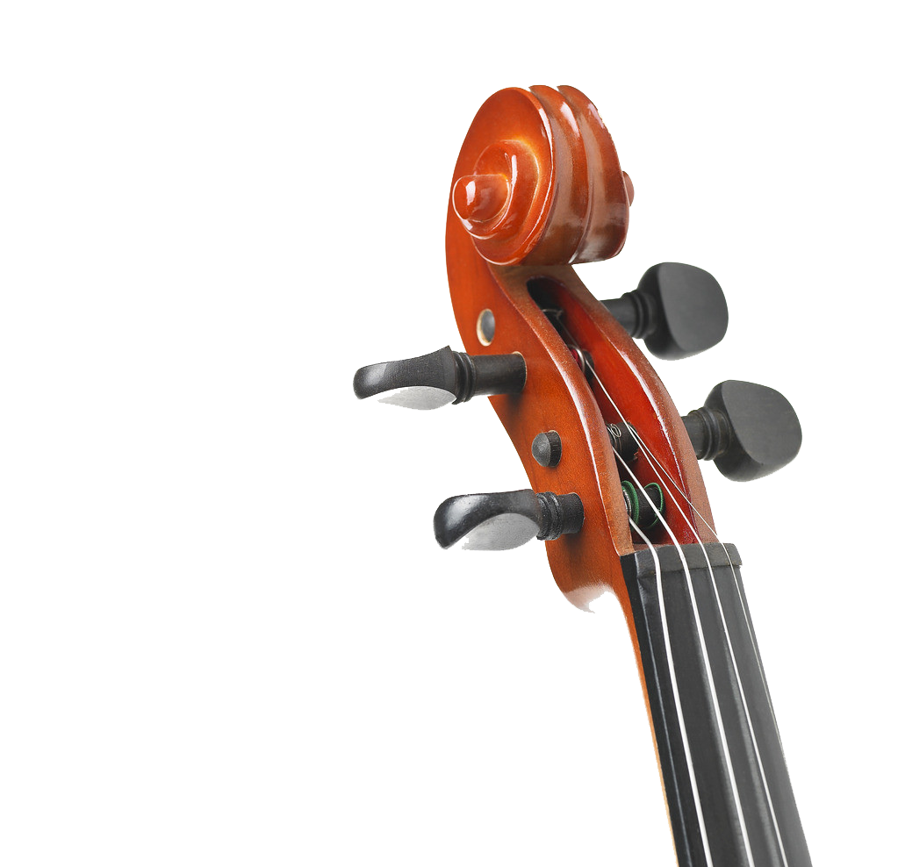
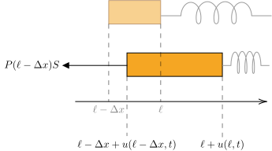
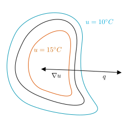
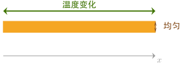

# 数学方程的物理起源
$$
\gdef\red#1{{\color{cb8680}{#1}}} 
\gdef\green#1{{\color{4f8d63}{#1}}} 
\gdef\gray#1{{\color{gray}{#1}}} 
\gdef\purple#1{{\color{B189C6}{#1}}} 
\gdef\orange#1{{\color{dfa04b}{#1}}}
\gdef\white#1{{\color{white}{#1}}}
$$
---

# 偏微分方程
---

### 偏微分方程

- 含有 **未知函数** 及其 **偏导数** 的方程称为 **<green>偏微分方程 (partial differential equation)**
- 方程中偏导数最高阶数称为方程的 **<green>阶**

---

### 偏微分方程

- **线性、非线性**偏微分方程在物理中无处不在
  - 弦、杆、膜振动、电磁波：波动方程
  - 物质扩散、热传导：扩散方程
  - 稳定场分布：稳场方程
  - 流体运动：Navier-Stokes 方程
  - 时空的演化：爱因斯坦场方程，$R_{\mu \nu} - \frac{1}{2}g_{\mu \nu}\mathcal{R} = T_{\mu \nu}$
  - 量子态的演化：薛定谔方程，$i \hbar\frac{\partial \psi}{\partial t} = H \psi$
  - 杨-米尔斯规范场经典运动：Yang-Mills 方程 (1954)，
    $$
    D^\mu F_{\mu \nu} = 0, \qquad \epsilon^{\mu \nu \lambda \rho}D_{\lambda} F_{\mu \nu} = 0
    $$

---

### 偏微分方程

- 本章节主要研究 **二元二阶线性** 偏微分方程
  $$
  \sum_{i,j = 1}^2 a_{ij}(x) \frac{\partial^2 u}{\partial x_i \partial x_j}
  + \sum_{i = 1}^{2} b_i(x) \frac{\partial u}{\partial x_i}
  + c(x) u + f(x) = 0
  $$
  其中 $a_{ij}, b, c, f$ 均可以是 $x_1, x_2$ 的**函数**，$a_{12} = a_{21}$，$a_{ij}$ 不全为零。
  - 若 $f = 0$，则称为 **<green>齐次 (homogenous) 方程**
  - 若 $f \ne 0$，则称为 **<green>非齐次 (inhomogenous) 方程**
- 根据 $a, b, c$ 简单分类：**<green>椭圆、双曲、抛物型方程**。

---

# 弦、杆振动

---

### 弦振动

- 弦振动在工程、物理中广泛出现
- 斜拉索桥

---

### 弦振动

- 弦乐器原理

---

### 弦振动

- 弦论

---

### 弦的自由横向振动

- 考虑 **<green>理想弦 (string)**：
  - 材质 **均匀**，质量线密度 $\rho$
  - 松弛时 **柔软**，可以沿法方向/横向弯曲但 **<red>不产生** 内部张力
  - 绷直时张力只沿 **切线** 方向
  - 张力大小只与该处局部微小形变程度有关
- 令弦绷紧 (微小形变产生内部张力)，沿水平 $x$ 轴放置，两端固定 $x$ 值 **$x = 0, \ell$**
- **平面内法向/横向** 瞬时扰动：弦在 **横向** 振动
- **自由振动**：振动过程 **<red>不** 对 **弦体** 施加外力

---

### 弦的自由横向振动

- 弦振动时，原本位于 $x$ 处的弦体点沿**横向**发生偏离，横向位移量记为 **<green>$u(x, t)$** (设向上为 **正**)

  

  **没有纵向位移**

  按照假设 **<red>没有** 沿弦体方向 (纵向) 的位移。
  

---

### 小振动假设

- 假设弦的振动幅度 **非常小**：
  $$
  \Big|u(x, t) \Big| \ll \ell, \qquad \Bigg|\frac{\partial u(x, t)}{\partial x} \Bigg| \ll 1
  $$

  

  
  

- 推论：$|\theta(x,t)| \ll 1$
  $$
  \cos \theta(x, t) = 1 + O(\theta^2), \quad
  \sin \theta(x, t) \simeq \theta + O(\theta^3) \simeq \green{\tan \theta(x, t)}
  $$

---

### 弦的自由横向振动

- 受力分析：考虑弦体内部 $[x, x + \Delta x]$ 段

---

### 弦的自由横向振动

- 分析弦段 **局部伸长** 情况：利用小振动假设
  $$
  \Delta s \approx  \ \sqrt{\Delta x^2 + \left(\frac{\partial u}{\partial x} \Big|_{x+\frac{\Delta x}{2}} \Delta x \right)^2} 
  \approx  \ \left(1 + \Bigg|\frac{\partial u}{\partial x}\Big|_{x + \frac{\Delta x}{2}}\Bigg|\right) \Delta x \approx \Delta x
  $$
  $\Rightarrow$ 弦基本不伸长，张力 **大小** $T(x, t)$ **近似** 与 $x, t$ 无关
- **纵向 (弦体方向)** 方向受力平衡
  $$
  T(x + \Delta x)\cos\theta(x + \Delta x, t) = T(x)\cos\theta(x)
  $$
  $$
  \Rightarrow  T(x + \Delta x, t) = T(x, t)
  $$
---
### 弦的自由横向振动

- **横向** 受力分析：牛顿第二定律（注意弦基本不伸长，$T$ 大小处处相等）
  $$
  \begin{align*}
    T(x + \Delta x)\sin\theta(x + \Delta x, t) - T(x)\sin\theta(x)
  \approx  \ \rho \Delta x \frac{\partial^2 u}{\partial t^2} \Big|_{x + \frac{\Delta x}{2}} \\
  T(x + \Delta x)\frac{\partial u}{\partial x}\Big|_{x + \Delta x} - T(x)\frac{\partial u}{\partial x}\Big|_{x}
  \approx  \ \rho \Delta x \frac{\partial^2 u}{\partial t^2} \Big|_{x + \frac{\Delta x}{2}} \\
  \frac{1}{\Delta x}\left[T(x + \Delta x)\frac{\partial u}{\partial x}\Big|_{x + \Delta x} - T(x)\frac{\partial u}{\partial x}\Big|_{x}\right]
  \approx  \ \rho \frac{\partial^2 u}{\partial t^2} \Big|_{x + \frac{\Delta x}{2}}
  \end{align*}
  $$
- 取 $\Delta x \to 0$，横向方程
  $$
  \frac{\partial}{\partial x}\left( T \frac{\partial u}{\partial x}\right) = \rho \frac{\partial^2 u}{\partial t^2}
  $$

---

### 弦的自由横向振动

- 移项得到 **<green>一维波动方程**
  $$
  \frac{\partial^2 u}{\partial t^2} - a^2 \frac{\partial^2 u}{\partial x^2} = 0\ , \qquad a^2 = \frac{T}{\rho}
  $$
  描述弦体 **内部** 运动，**<red>不描述弦两端点**

---

### 弦的自由横向振动

- 特别的波动解
- 考虑
  $$
  u(x, t) = \sin(x - at)
  $$

---

### 弦的自由横向振动

- 在 $\Delta t = 1$ 的时间内，波形向右移动了 $a$
- 可以看到波形的向右移动速度
  $$
  v = \frac{\Delta x}{\Delta t} = a
  $$
- 因此 $a = \sqrt{\frac{T}{\rho}}$ 的物理意义是 **<green>波速**

---

### 弦的自由横向振动

- 类似地，$u(x, t) = \sin(x + at)$ 也是解，但是向 **左** 移动
- 任意下述形式的函数也是解，
  $$
  u(x, t) = u_+(x + at) + u_-(x - at)
  $$

  

  **因式分解**

  因为有 **因式分解**
  $$
  \frac{\partial^2}{\partial t^2} - a^2 \frac{\partial^2}{\partial x^2}
  = \left(\frac{\partial}{\partial t} + a \frac{\partial}{\partial x}\right)
  \left(\frac{\partial}{\partial t} - a \frac{\partial}{\partial x}\right)
  $$
  

---

### 弦的自由横向振动

- 有时在振动过程中，**弦体** 沿 **横向** 受外力作用。
- 比如
  - 弦体较粗，受重力影响显著
  - 弦体带电，放置在强电场中

---

### 弦受迫振动

- 有时在振动过程中，**弦体** 沿 **横向** 受外力作用。

  

  
  

- 力 **密度** $f(x,t)$

---

### 弦受迫振动

- 弦段 $[x, x+\Delta x]$ 受横向 **合力**（小振动、恒张力、小角度）
  $$
  \begin{align*}
    T \sin \theta(x + \Delta x, t)
  - T \sin \theta(x, t) + f(x, t) \Delta x\\
  \gray{(\sin\theta \sim \tan\theta)}\qquad\to \purple{T \frac{\partial u}{\partial x}\Big|_{x + \Delta x}
  - T \frac{\partial u}{\partial x}\Big|_{x} }+ \orange{f(x, t) \Delta x}
  \end{align*}
  $$
- 牛顿第二定律
  $$
  \rho \Delta x \frac{\partial^2 u}{\partial t^2} = \purple{\frac{\partial}{\partial x}\left(T \frac{\partial u}{\partial x}\right) \Delta x} + f(x, t)\Delta x \\
  \gray{\times\frac{1}{\rho\Delta x}}\qquad\Rightarrow  \frac{\partial^2 u}{\partial t^2} - a^2 \frac{\partial^2 u}{\partial x^2} = \frac{f(x,t)}{\rho}
  $$

---

### d'Alembert 算符

- 令 $a = c$ (真空光速)
- **<green>d'Alembert 算符**
  $$
  \square = \frac{\partial^2}{\partial t^2} - c^2\frac{\partial^2}{\partial x^2}
  $$

---

### d'Alembert 算符

- 洛伦兹变换
  $$
  x' = \gamma(x - v t), \quad
  t' = \gamma(t - \frac{v}{c^2} x), \quad \gamma = \frac{1}{\sqrt{1 - v^2/c^2}}
  $$
- 达朗贝尔算符 **不变**，
  $$
  \frac{\partial^2}{\partial t'^2} - c^2\frac{\partial^2}{\partial x'^2}
  = \frac{\partial^2}{\partial t^2} - c^2\frac{\partial^2}{\partial x^2}
  $$

---

### 杆的纵向振动

- 波动方程不仅可以描述弦的小振动
- 也可以描述杆体的小振动

---

### 杆的纵向振动

- 考虑均匀细杆，质量体密度 $\rho$
- 静止杆长为 $\ell$
- 静止时杆上 **任意一点** 可以用坐标 $0 \le x \le \ell$ 标记
- 考虑沿杆体方向（纵向）施加扰动，使其在 **纵向** 发生 **微小** 振动

---

### 杆的纵向振动

---

### 杆的纵向振动

- 由于振动和局部拉伸，杆体内产生 **张力强度** $P (x, t)$

---

### 杆的纵向振动

- 纵向牛顿第二定律
  $$
  \rho S \Delta x \frac{\partial^2 u}{\partial t^2}
  = SP(x + \Delta x, t) - SP(x, t) \\
  \xrightarrow{\Delta x \to 0}  \rho \frac{\partial^2 u}{\partial t^2} = \frac{\partial P}{\partial x}
  $$
- 上述方程有两个 **未知函数** $u, P$，**<red>无法完全求解**。

---

### 杆的纵向振动

- **<green>胡克 (Hooke) 定律**：杆在小振动时的内部 **张力强度** $\propto$ 局部 **相对** 伸长量
  $$
  \frac{u(x + \Delta x) - u(x)}{\Delta x} Y \approx P(x + \frac{\Delta x}{2})
  \xrightarrow{\Delta x \to 0} \orange{Y \frac{\partial u}{\partial x} = P(x)}
  $$
  其中**正值**系数 $Y$ 称为 **<green>杨氏模量**

  

  **绝对 vs 相对**

  小段 $\Delta x$ 的绝对伸长量为 $u(x + \Delta x) - u(x)$，相对伸长量为
  $$
  \frac{u(x + \Delta x) - u(x)}{\Delta x}
  $$
  

---

### 杆的纵向振动

**方向**

这里的小段受的压强 $P$ 的 **正向** 约定为小段界面法向 **向外**。

**局部收缩** 时，$\partial u/\partial x < 0 \Rightarrow P(x, t) < 0$，即 $P$ 是对杆体内界面的挤压力。
  $~$

---

### 杆的纵向振动

**胡克，不只胡克定律**

胡克在许多领域都有卓越的贡献：引力的平方反比律，设计真空泵、显微镜和望远镜等影响后世的设备，提出术语“cell (细胞)”。

牛顿~~戏~~称胡克为“巨人”，而牛顿本人则“站在巨人肩膀上”。后来牛顿成为皇家学会会长，~~不小心~~把胡克的所有肖像和许多手稿仪器弄丢了。

*罗伯特·胡克的示意图（迄今未有经过验证的胡克像）*

---

### 杆的纵向振动

**静止杆的拉伸**

考虑一个静止无拉伸时的均匀杆长 $\ell$。施外力使其 **均匀拉长**（或收缩）到 $\lambda \ell$。

杆上任意质点可以用 $0 \le x \le \ell$ 来标记

---

### 杆的纵向振动

**静止杆的拉伸与张力的正负**

- 求杆形变后各点 **<green>位移 $u(x)$**。则原 $[x_1, x_2]$ 段均匀拉伸后的长度
  $$
  [x_2 + u(x_2)] - [x_1 + u(x_1)] = \lambda(x_2 - x_1) \\
  \Rightarrow  u(x_2) - u(x_1) = (\lambda-1)(x_2 - x_1)
  $$
- 于是
  $$
  \frac{u(x_2) - u(x_1)}{x_2 - x_1} = \lambda - 1 \qquad \Rightarrow \qquad\frac{d u}{dx} = \lambda - 1
  $$

---

### 杆的纵向振动

**静止杆的拉伸与张力的正负**

- 求得 $u(x) = (\lambda - 1) x$
- 张力
  $$
  P = Y \frac{d u}{dx} = Y(\lambda - 1)
  $$
  (1) 当 $0 < \lambda < 1$，杆被压缩，$P = Y(\lambda - 1) \orange{< 0}$，杆体受 **挤压力**

  (2) 当 $\lambda > 1$，杆被拉伸，$P = Y(\lambda - 1) \orange{> 0}$，杆体受 **拉力**。

---

### 杆的纵向振动

- Hooke 定律与杆体方程联立 $\Rightarrow$ 一维波动方程
  $$
  \rho \frac{\partial^2 u}{\partial t^2} = \frac{\partial P}{\partial x}, \qquad
  Y \frac{\partial u}{\partial x} = P\\
  ~\\
  \Rightarrow  \rho \frac{\partial^2 u}{\partial t^2} - Y\frac{\partial^2 u}{\partial x^2} = 0 \qquad \Rightarrow \qquad
  \frac{\partial^2 u}{\partial t^2} - a^2 \frac{\partial^2 u}{\partial x^2} = 0
  $$
  其中 **波速参数**
  $$
  a = \frac{Y}{\rho}
  $$

---

### 杆的纵向振动

- 倘若杆体在振动过程中受 **纵向外力** 作用，相对体积力密度 $F(x, t)$，则
  $$
  \frac{\partial^2 u}{\partial t^2} - a^2 \frac{\partial^2 u}{\partial x^2} = \frac{F(x, t)}{\rho} \coloneqq f(x, t)
  $$

---

### 定解条件

- $n$-阶 **线性** **常** 微分方程
  $$
  \frac{d^n u}{dt^n} + a_{n - 1} \frac{d^{n - 1}u}{dt^{n - 1}}
  + \ldots + a_0 u = 0
  $$
- $n$ 个初始条件才可 **确定一个解**（"定解"）
  $$
  u(0) = \ldots, \quad u^{(1)}(0) = \ldots
  , \qquad \ldots
  \quad
  u^{(n - 1)}(0) = \ldots
  $$
- 原因：方程本身有 **无穷多解**，构成一个 $n$-维 **线性空间**

---

### 定解条件

- 对于线性偏微分方程：全体解构成 **无穷维** 线性空间
- 需要更强的定解条件。

---

### 定解条件

- 波动方程描述弦体、杆体 **内部** 的运动
- **端点** 的运动由别的信息控制：**边界条件**
- **<green>第一类 (Dirichlet)** 边界条件：
  $$
  \text{齐次}:  u(x = 0, t) = 0, \qquad
  u(x = \ell, t) = 0\\
  \text{非齐次}:  u(x = 0, t) = \red{u_0(t)}, \qquad
  u(x = \ell, t) = \red{u_\ell(t)}
  $$
  - 齐次条件：相应边界/端点被 **固定**，不振动
  - 非齐次条件：相应端点按照 **既定** 的方式（$u_0, u_\ell$）运动
  - 端点 **完全** **<red>不自由**

---

### 定解条件

- **<green>第一类 (Dirichlet)** 边界条件：

  

  **第一类边界条件**

  把弦端点连接到（横向）**振荡发生器**，可以模拟 **非齐次** 第一类边界条件。

  通过把弦端点上紧、钉死，可以形成 **齐次** 第一类边界条件。

  

  
  

  

---

### 定解条件

- **<green>第二类 (Neumann)** 边界条件：给定端点处 $\partial u/\partial x$ 的值
- 考虑 $x = \ell$ **端点附近** 的小杆段

---

### 定解条件

- 牛顿第二定律
  $$
  \red{\rho S \Delta x \frac{\partial^2  u}{\partial t^2}}
  = F(t) - \orange{P(\ell - \Delta x, t) S} \\
  \orange{\text{胡克定律}}\Rightarrow  \red{\rho S \Delta x \frac{\partial^2  u}{\partial t^2}} = F(t) - \orange{Y \frac{\partial u}{\partial x}\Big|_{x = \ell - \Delta x} S}
  $$
- 让 $\Delta x \to 0$，左边变成 **<red>零**，得到 **第二类** **非齐次** 边界条件，
  $$
  \frac{\partial u}{\partial x}\Big|_{x = \ell} = \frac{1}{YS} F(t)
  $$

  

  **第二类边界条件**

  边界所施加的力直接控制边界的局部形变量。
  

---

### 定解条件

- 类似地，可以在 $x = 0$ 端施加（向左）力 $F(t)$，
  $$
  \frac{\partial u}{\partial x}\Big|_{x = 0} = \orange{-} \frac{1}{YS}F(t)
  $$
- 倘若一端 (如 $x = \ell$ 端) 受外力为 **零**，则有第二类 **齐次** 边界条件，
  $$
  \frac{\partial u}{\partial x} \Big|_{x = \ell} = 0
  $$

  

  **完全自由**

  第二类齐次边界条件描述端点不受力，**完全自由** 的情况。
  

---

### 定解条件

- 把第一类和第二类边界条件结合起来，形成第三类边界条件
- 比如，轻杆的 $x = \ell$ 端点连接一根弹性系数为 $k$ 的弹簧，静止不振动时弹簧平衡，
  $$
  \frac{\partial u}{\partial x} + \frac{1}{YS} \purple{( - F(t))} = \frac{\partial u}{\partial x} + \frac{1}{YS} \purple{k u \bigg|_{x = \ell}} = 0
  $$

  

  **弹簧力**

  相当于推导第二类边界条件时设 $F = - k u$。
  

---

### 定解条件

---

### 定解条件

- 波动方程是一类最简单的 **<green>运动方程 (equation of motion, EOM)**
- **运动方程** 与 **边界条件** 共同确定一个 **经典物理系统 (classical system)**

  

  **物理系统**

  运动方程描述系统的**内部运动**，边界条件控制系统边界的运动。
  

  

  
  与经典相对的是量子
  

---

### 定解条件

- 确定一个物理系统后，要确定系统的一个演化历史，还需要定下 **<green>初始条件**
- 波动方程关于时间求导是二阶的，因此需要两个初始条件
  $$
  u(x, t = 0) = \varphi(x), \qquad \frac{\partial u}{\partial t}\Big|_{t = 0} = \psi(x)
  $$
  控制初始（$t = 0$）时形态和速度

---

### 定解条件

- 完整的定解问题（例）
  $$
  \frac{\partial^2 u}{\partial t^2} - a^2 \frac{\partial^2 u}{\partial x^2} = f, \qquad 0 < x < \ell, \quad t > 0 \\
  u(x = 0, t) = u_0(t), \quad u(x = \ell, t) = u_\ell(t), \quad t > 0 \\
  u(x, t = 0) = \varphi(x), \quad
  \frac{\partial u}{\partial t}\Big|_{t = 0} = \psi(x), \quad 0 \le x \le \ell
  $$

  

  **初始 vs 边界**

  有时，**初始条件** 在 $x = 0, x = \ell$ 的值与 **边界条件** 有 **<red>矛盾**，产生边界处的 **<red>不连续性**。通常忽略这种小问题，下一章会有例子。
  

---

### 热传导与扩散

- 考虑一坨热介质，质量密度为 $\rho$，比热容 $c$
- 热介质可能与 **外界热源**（空调房、岩浆池）有接触
- 自身也可能在以某种方式产热（生物化学反应、核反应、~~超能力~~）：**体热源**
- 热量在热介质的内部与界面流动：**<green>热流密度/能流密度 $\vec q$**
  

  
  **<green>能流密度**

  **单位时间**内通过**单位界面**面积的能量
  

- 关心：温度 $u$ 的空间时间分布 $u(\vec r,t)$

---

### 热传导与扩散

---

### 热传导与扩散

- 考虑一个介质的 **<green>任意子区域 $V$**。设 **<green>体热源强度** 为 $F(\vec r, t)$

  

  **<green>体热源强度**

  就是 **单位时间** 内 **单位体积** 所产生/分泌的能量 (若为负值，则代表吸收)
  

- 该子区域会与热介质其余部位进行热交换。
- 在体热源、热交换共同作用下，区域 $V$ 在 $\Delta t$ 时间内发生 **温度变化** $\Delta u(\vec r, t)$

---

### 热传导与扩散

- 局域 **能量守恒** 要求（$d\vec S = \vec n dS$ 沿表面法向向 **外**）
  $$
  \int_V F \Delta t  dV - \oint_{\partial V}  \Delta t  \vec q\cdot d\vec{S} =  \int_V \rho c  \purple{\Delta u}  dV \\
  \frac{1}{\Delta t}: \quad \int_V F   dV - \orange{\oint_{\partial V} \vec q\cdot d\vec{S}} =  \int_V \rho c  \purple{\frac{\partial u}{\partial t}}  dV \\
  	\text{高斯公式}\quad
  \int_V F   dV - \orange{\int_V \nabla \cdot \vec q  dV}  =  \int_V \rho c  \frac{\partial u}{\partial t}  dV
  $$
- 每一项都是 $V$ 的积分

---

### 热传导与扩散

- 此方程对 **任意小** 的 $V$ 都成立：移除积分，得到 $u, \vec q$ 的方程
  $$
  F - \nabla \cdot \vec q =  \rho c  \frac{\partial u}{\partial t}
  $$
- **傅里叶定律**：**<green>能流密度** 与 **<green>温度梯度** 成正比（$k > 0$ 是常数），
  $$
  \vec q = - k \nabla u, \qquad
  \nabla = \left(\frac{\partial}{\partial x}, \frac{\partial}{\partial y}\right)
  $$
- 利用傅里叶定律以及**常数 $k$**，
  $$
  F + k  \orange{\nabla \cdot \nabla u} =  \rho c  \frac{\partial u}{\partial t}
  \quad \Rightarrow \quad \frac{\partial u}{\partial t} - \frac{k}{\rho c}  \orange{\nabla^2 u} = \frac{F}{\rho c}
  $$

---

### 热传导与扩散

- 热传导方程
  $$
  \frac{\partial u}{\partial t} - a^2  \nabla^2 u = f, \qquad
  a^2 = \frac{k}{\rho c}
  $$
- 倘若没有体热源，则 $f = 0$
  $$
  \frac{\partial u}{\partial t} - a^2  \nabla^2 u = 0
  $$

---

### 热传导与扩散

- 例子：**一维** 均匀细杆的热传导模型。设细杆侧面绝热，横截面很小，假设横截面方向的温度近似均匀分布，温度只沿杆长方向变化。

---

### 热传导与扩散

- 有时，热介质在长时间演化后会进入 **宏观稳定状态**
- 此时，介质各点温度不再变化，从而获得 **<green>稳定场方程**
  $$
  \frac{\partial u}{\partial t} = 0 \qquad \Rightarrow \qquad
  \nabla^2 u = - \frac{f}{a^2}
  $$

  

  **宏观稳定**

  宏观稳定 **<red>不代表** 微观完全静止。

  即便温度不再变化，依然潜藏 **暗流涌动**：能量持续地从 **<red>高温区** 流向 **低温区**。
  

---

### 热传导与扩散

- 相同的分析也可以应用到 **物质扩散** 现象。

  | 热传导 | 物质扩散 |
  |--------|----------|
  | 温度 $u$ | 物质浓度 $u$ |
  | 热导体区域 $\Omega$ | 物质容器所限区域 $\Omega$ |
  | 体热源强度 $F$ | 体物质源强度 $F$ |
  | 能量守恒定律 | 物质守恒定律 |
  | 傅里叶 $\vec q = - k \nabla u$ | Fick $\vec q = - D \nabla u$ |

---
### 热传导与扩散

- 扩散方程
  $$
  \frac{\partial u}{\partial t} - D  \nabla^2 u = F
  $$

---

### 热传导与扩散定解

- 第一类边界条件（$\varphi = 0$ 时为齐次边界条件）
  $$
  u|_{\partial \Omega} = \varphi(\vec r, t), \qquad
  \vec r \in \partial \Omega
  $$
  其中 $\varphi$ 是 **已知的、给定的** 函数

**第一类边界条件**

描述系统与外界受控热源有 **极好的热接触**，使得边界与外界时刻保持热平衡（等温）。因此，系统完全 **不绝热**。

为了随时保持边界热平衡，任意时刻可能有 **任意强度** 的能流进出介质边界。

---
### 热传导与扩散定解

- 第二类边界条件：
  $$
  \green{-k \vec n \cdot \nabla u\Big|_{\partial \Omega}
  = -k \frac{\partial u}{\partial \vec n}\Big|_{\partial \Omega}}
  = Q(\vec r, t)
  $$

**方向导数**

$\vec n \cdot \nabla u$ 描述 $\nabla u$ 沿着边界 $\partial \Omega$ 法向 **向外** 的分量，即温度 $u$ 在边界处 **法向向外** 的 **变化率**。有时，会记作
$$
\green{\frac{\partial u}{\partial \vec n} \coloneqq \vec n \cdot \nabla u}
$$

---

### 热传导与扩散定解

- 第二类边界条件：
  $$
  -k \vec n \cdot \nabla u\Big|_{\partial \Omega}
  = -k \frac{\partial u}{\partial \vec n}\Big|_{\partial \Omega}
  = Q(\vec r, t)
  $$

**受控热交换**

当 $Q \ne 0$，即为 **非齐次** 第二类边界条件。此时系统与外界有 **受控热交换**，沿界面瞬时流入的能量密度由 $Q$ 指定。

当 $Q = 0$，则为 **齐次** 第二类边界条件。此时，系统为 **<green>绝热系统**。

---

### 热传导与扩散定解

- 第三类边界条件：边界流出能流与边界温度成正比，如牛顿冷却定律
  $$
  - k \frac{\partial u}{\partial \vec n} = Q = b \left(u(\vec r, t)\Big|_{\partial \Omega} - \underbrace{u_0(\vec r, t)}_\text{外界温度}\right)
  $$
  其中 $b$ 称为 **<green>热交换系数**

---

### 热传导与扩散定解

- 初始条件：由于热传导方程对时间的导数最高是 1 阶，因此只需要一个初始条件
  $$
  u(\vec r, t = 0) = u_0(\vec r)
  $$
- 对于稳定场问题，就不需要初始条件了，因为系统已经不再随时间演化。
