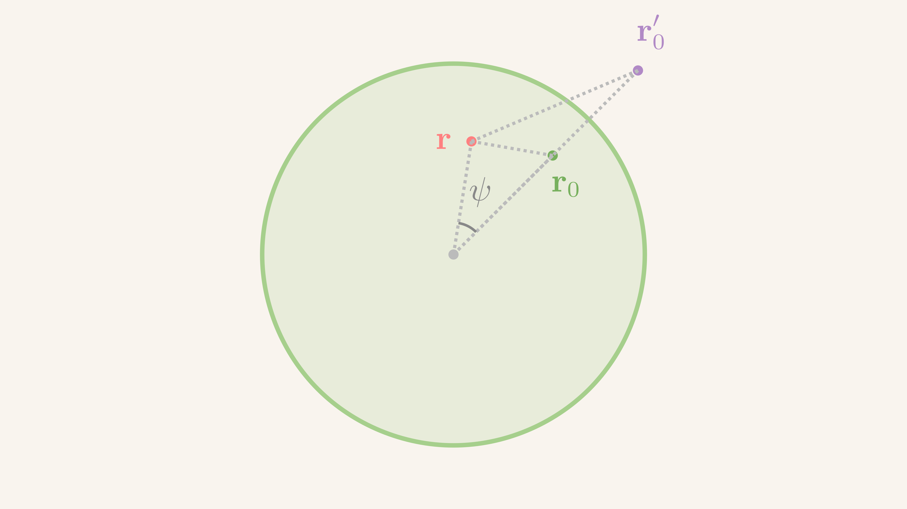
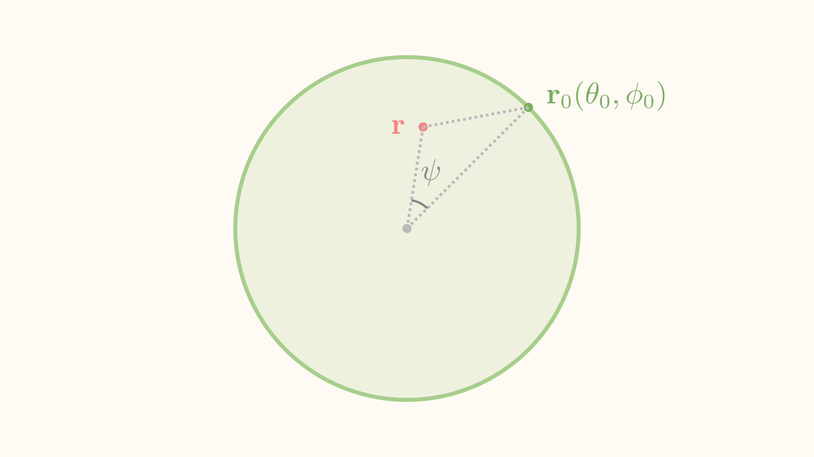
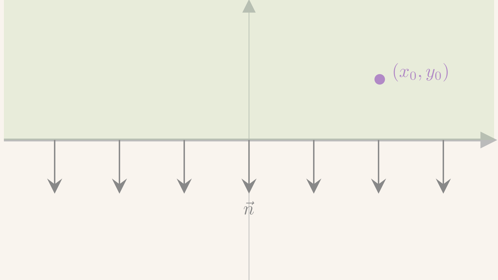
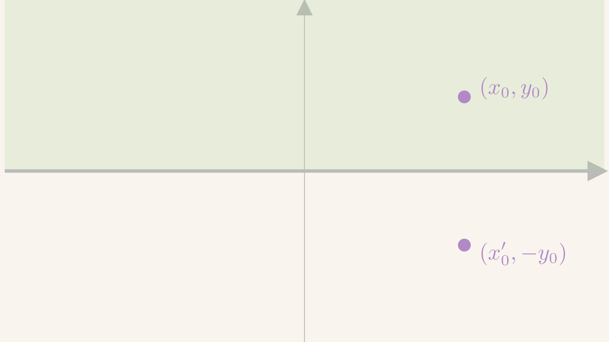
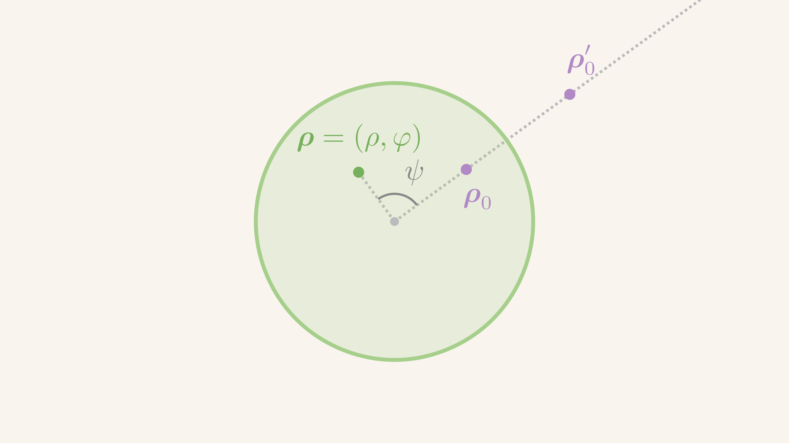
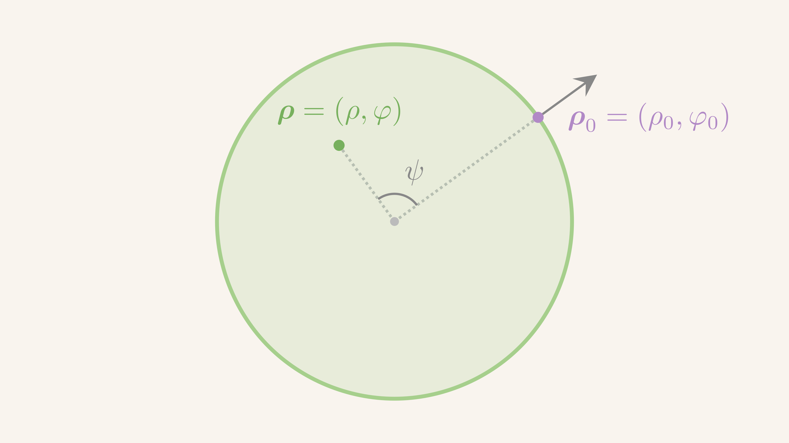
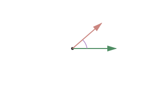

$$
\gdef\red#1{{\color{cb8680}{#1}}} 
\gdef\green#1{{\color{4f8d63}{#1}}} 
\gdef\gray#1{{\color{gray}{#1}}} 
\gdef\purple#1{{\color{B189C6}{#1}}} 
\gdef\orange#1{{\color{dfa04b}{#1}}}
\gdef\white#1{{\color{white}{#1}}}
$$

<!-- footer: 格林函数 -->

# 纲要

- 格林函数的一般概念
- 稳定场方程的格林函数法
- 特殊区域上的格林函数

---
<!-- header: 格林函数的一般概念 -->
# 格林函数的一般概念

---
### 线性微分算符
- 线性偏微分方程的抽象形式
  $$
  L u(\mathbf{r}, \dots) = f(\mathbf{r}, \dots)
  $$
  * $u$ 是未知、待求函数
  * $f$ 是已知函数
  * $L$ 是一个 **线性** **<green>微分算符**：通过对 **<red>坐标 $\mathbf{r}$** **求导**的方式作用到函数上

---
### 线性微分算符
- 已经见过的方程
  $$
    \begin{align*}
      L_\text{波动} = & \ \frac{\partial^2}{\partial t^2}- a^2 \nabla^2\\
      L_\text{输运} = & \ \frac{\partial}{\partial t}- a^2 \nabla^2\\
      L_\text{拉普拉斯} = & \ - \nabla^2\\
      L_\text{Helmholtz} = & \ - \nabla^2 - k^2
    \end{align*}
  $$

---
### 线性微分算符
- $L$ 是个**线性**算符
  $$
  L(u_1 + u_2) = Lu_1 + Lu_2, \qquad
  L(\lambda u_1) = \lambda L u_1
  $$
  其中 $\lambda$ 是任意**实数** (其实复数也可以)
- **<red>哪里见过类似的结构？**
- 线性映射 $A: V \to V$
  $$
  A(v_1 + v_2) = A v_1 + A v_2, \qquad
    A(\lambda v_1) = \lambda A v_1
  $$

---
### 线性微分算符
- <gray>(满足一定条件的)</gray> 函数形成无穷维的 **<green>线性空间 $\mathscr{F}$**
- 线性微分算符 $L$ 其实是一个**线性映射**：
  $$
  L: \mathscr{F} \to \mathscr{F}
  $$

---
### 线性微分算符
- 给 $\mathscr{F}$ 提供一套**完备基底**：
  

  **基底的构造**

  直角坐标、正交曲线坐标的分离变量法本质就是通过本征问题构造**基底**
  

  * 每个函数 $u$ 可以表达成无穷行**列矢量**
  * 每个 $L$ 可以表达成无穷阶**方阵**

---
### 线性微分算符

- **<red>大一线性代数：$A$ 是方阵，怎么求解 $Au = f$?**
- **<green>逆矩阵 $A^{-1}$**
  $$
  \green{A^{-1}} A u = \green{A^{-1}} f \quad \Rightarrow \quad u = \green{A^{-1}} f
  $$
  

  **逆矩阵的存在性**

  假设 $A^{-1}$ **<green>存在**；$A^{-1}$ **<red>并不总是存在**

  **<red>什么时候 $A^{-1}$ 存在？** <answer>行列式非零</answer>
  

- **逆矩阵**的核心性质：$A^{-1} A = A A^{-1} = I$

---
### 格林函数

- 把 $L$ 看成线性映射
- **<red>什么是 $L^{-1}$？**
- **<green>定义**：微分算符 $L$ 的**逆**称为 **<green>$L$-格林函数 $G(\mathbf{r}, \mathbf{r}_0)$**，满足 **<green>格林函数方程**
  $$
  L_\green{\mathbf{r}}G(\mathbf{r}, \mathbf{r}_0) = \delta(\mathbf{r} - \mathbf{r}_0)
  $$
  

  **格林函数方程的注意事项**

  * **<green>下标 $\mathbf{r}$** 强调求导操作是对 $\mathbf{r}$ 进行的；$\mathbf{r}_0$ 是一个**固定点**

  * 方程右边 $\delta$ 关于 $\mathbf{r}, \mathbf{r}_0$ 对称，但 $G(\mathbf{r}, \mathbf{r}_0)$ **<red>不一定** 关于 $\mathbf{r}, \mathbf{r}_0$ 对称
  

---
### 格林函数

**格林函数的唯一性**

在**没有指定边界条件**的情况下，格林函数 **<red>不唯一**。
若 $G(\mathbf{r}, \mathbf{r}_0)$ 是 $L$ 的格林函数，考虑任意 $L$-**<green>调和函数** $\Phi$ 使得 **<green>$L\Phi(\mathbf{r}) = 0$**，则
$$
G(\mathbf{r}, \mathbf{r}_0) + \Phi(\mathbf{r})
$$
也是 $L$ 的格林函数。

要确定一个格林函数，需要**边界条件**。

---

### 格林函数

**Delta 函数与单位矩阵的类比**

$\delta(\mathbf{r} - \mathbf{r}_0)$ 相当于**无穷维单位矩阵**。它对任意函数的「矩阵乘法」为

<iframe src='animations/Scene01.html' frameborder='0' style='width:768px;height:440px'></iframe>

---

### 格林函数

**Delta 函数与单位矩阵的类比**

$\delta(\mathbf{r} - \mathbf{r}_0)$ 相当于**无穷维单位矩阵**。它对任意函数的「矩阵乘法」为
$$
  \begin{align*}
    \int d\mathbf{r} \delta(\mathbf{r} - \mathbf{r}_0) u(\mathbf{r}) = u(\mathbf{r}_0)
    \ \stackrel{\purple{\text{类比}}}{\sim} \ \sum_{\mathbf{r}}  \delta_{\mathbf{r}_0, \mathbf{r}} u_\mathbf{r} = u_{\mathbf{r}_0}
    \ \stackrel{\purple{\text{类比}}}{\sim} \ \delta u = u
  \end{align*}
$$
- $\mathbf{r}$ 相当于 $u(\mathbf{r})$ 的**行**指标

- $\mathbf{r}_0, \mathbf{r}$ 相当于方阵 $\delta$ 的**行、列**指标: $\delta(\mathbf{r} - \mathbf{r}_0) = \delta(\mathbf{r}_0 - \mathbf{r})$，$\delta_{\mathbf{r}_0, \mathbf{r}} = \delta_{\mathbf{r}, \mathbf{r}_0}$ 是**对称**矩阵
- 对 $\mathbf{r}$ 积分相当于对**行列指标求和**

---
### 格林函数

**积分测度**

- 上述积分中的 $d\mathbf{r}$ 是**积分测度 (integration measure)**，表示对 $\mathbf{r}$ 的每个分量分别积分，实际上就是 $d^n \mathbf{r}$ 的缩写

---
### 基本解

- 在**无界空间**上求得的格林函数 $G(\mathbf{r}, \mathbf{r}_0)$ 也称为 **<green>基本解 (fundamental solution)**
  

  **基本解的选择**

  基本解 **<red>不唯一**，通常选一个**最简单、对称性最高**的作为基本解
  

  

  
  格林函数和基本解这两个单词经常换着用
  

---
### 基本解

- 设 $G$ 是 $L$ 在无界空间上的基本解
- **定理**：设 $u$ 满足方程 $Lu = f$，则 $u$ 可以用 $f$ 与 $G$ 构造出来，
  $$
  u(\mathbf{r}) = \int d\mathbf{r}_0 G(\mathbf{r}, \mathbf{r}_0) f(\mathbf{r}_0)
  $$
  

  从左方作用 $L$，进入积分内部，
  $$
  Lu = \int d\purple{\mathbf{r}_0} \orange{L G(\mathbf{r}, \purple{\mathbf{r}_0})} f(\purple{\mathbf{r}_0})
  = \int d\purple{\mathbf{r}_0} \orange{\delta(\mathbf{r} - \purple{\mathbf{r}_0})} f(\purple{\mathbf{r}_0}) = f(\mathbf{r})
  $$
  

---
### 基本解

**积分变量的注意事项**

积分是对 **<red>$\mathbf{r}_0$** 做的，$\mathbf{r}$ 要留作自由变量被求导

---
### 例子：三维空间的静电势问题

- 三维空间中的电势满足泊松方程：$u$ 是**电势**，$\rho$ 是**电荷密度**
  $$
    - \nabla^2 u(\mathbf{r}) = \rho(\mathbf{r})
  $$
- 对应的格林函数方程
  $$
    - \nabla^2 G(\mathbf{r}, \mathbf{r}_0) = \delta(\mathbf{r} - \mathbf{r}_0)
  $$
  

  
  右边 $\rho(\mathbf{r}) = \delta(\mathbf{r} - \mathbf{r}_0)$ 描述 $\mathbf{r}_0$ 处一个**单位**点电荷的电荷密度
  

---
### 例子：三维空间的静电势问题

- 基本解
  $$
    G(\mathbf{r}, \mathbf{r}_0) = \frac{1}{4\pi |\mathbf{r} - \mathbf{r}_0|} 
  $$
  

  
  就是 $\mathbf{r}_0$ 处**单位**点电荷在 $\mathbf{r}$ 处产生的电势。

  格林函数又称为**点源影响函数**
  

---
### 例子：三维空间的静电势问题

- 泊松方程的解
  $$
  u(\mathbf{r})
  = \int d\mathbf{r}_0 G(\mathbf{r}, \mathbf{r}_0) \rho(\mathbf{r}_0)
  = \int d\mathbf{r}_0 \frac{1}{4\pi |\mathbf{r} - \mathbf{r}_0|} \rho(\mathbf{r}_0)
  $$
  

  
  电势叠加原理
  

  

  
  $G(\mathbf{r}, \mathbf{r}_0)$ 第二个自变量控制“源”位置，第一个自变量控制“势能测量点”位置。

  对源点位置 $\mathbf{r}_0$ 求积分：把所有点电荷的贡献叠加起来
  

---
### 格林函数

<video width='800' src='media/videos/scenes/2160p15/GreenFunctionElectrostatics.mp4' controls></video>

---
<!-- header: 稳定场方程的格林函数法 -->
# 稳定场方程的格林函数法

---
### Laplace 算符格林函数

- 考虑**无界**空间中的泊松方程 (注意 **<red>符号**)
  $$
    - \nabla^2 u(\mathbf{r}) = f(\mathbf{r})
  $$
  

  **解的非唯一性**

  - 如果不指定边界条件，上述方程的解有 **<red>无穷多个**
  - 若 $u$ 是一个解，则可以考虑任意**调和函数 $u_0$**，使得 $\nabla^2 u_0 = 0$，那么 $u + u_0$ 也是一个解。调和函数有 **<red>无穷多个**
  

---
### Laplace 算符格林函数
- 考虑无界空间中 **<green>$(-\nabla^2)$-格林函数**，满足如下微分方程
  $$
    \nabla^2_\mathbf{r} G(\mathbf{r}, \mathbf{r}_0) = - \delta(\mathbf{r} - \mathbf{r}_0)
  $$
  

  
  - 注意求导是对 $G$ 的**第一变量**做的。一般来说，
    $$
      \nabla_\mathbf{r}G(\mathbf{r}, \mathbf{r}_0) \ne \nabla_{\mathbf{r}_0}G(\mathbf{r}, \mathbf{r}_0) \ne \nabla_\mathbf{r}G(\mathbf{r}_0, \mathbf{r})
    $$
    因此，
    $$
    \nabla_{\mathbf{r}_0}^2G(\mathbf{r}, \mathbf{r}_0) \ne - \delta(\mathbf{r} - \mathbf{r}_0)
    $$
  - 但是肯定有 **<green>$\nabla_{\mathbf{r}_0}^2 G(\mathbf{r}_0, \mathbf{r}) = \delta(\mathbf{r}_0 - \mathbf{r}) = \nabla_{\mathbf{r}}^2G(\mathbf{r}, \mathbf{r}_0)$**
  

---
### Laplace 算符格林函数

- 不同空间维度的格林函数具有截然不同的形式
- **定理**：三维无界空间中 $(-\nabla^2)$ 的满足自然边界条件 $G(\mathbf{r} \to \infty, \mathbf{r_0})=0$ 的基本解为
  $$
    G(\mathbf{r}, \mathbf{r}_0) = \frac{1}{4\pi |\mathbf{r} - \mathbf{r}_0|}
  $$

---
### Laplace 算符格林函数

**三维基本解的物理意义**

- 其实就是三维空间中孤立的一个 $\mathbf{r}_0$ 处 **电量 $1$** 的点电荷在周围产生的**电势函数**：周围没有 **<red>任何其它自由电荷或感应电荷**，并要求电势在无穷远处为零。
- 该基本解具有 绕 $\mathbf{r}_0$ 的 **空间旋转对称性**。

---
### Laplace 算符格林函数

**三维基本解的证明**

- 直接求导，
  $$
  \nabla^2 G = \nabla^2 \left({\frac{1}{4\pi |\mathbf{r} - \mathbf{r}_0|}}\right)
  $$
- 重新定义 **<green>$\mathbf{R} \coloneqq \mathbf{r} - \mathbf{r}_0$**，$|\mathbf{R}| = \green{R}$，则 $\nabla_\mathbf{R} = \nabla_\mathbf{r}$
  $$
  \nabla^2_\mathbf{r} G = \nabla^2_\mathbf{R} \left({\frac{1}{4\pi \green{R}}}\right)
  = \frac{1}{R^2} \frac{d}{d R} \left(R^2 \frac{d}{d R} \left({\frac{1}{4\pi R}}\right)\right) + 0
  $$
- 当 **<red>$\mathbf{R} \ne 0$**，上式**为零**，与定理一致，因 $\delta(\mathbf{R} \ne 0) = 0$

---
### Laplace 算符格林函数

**三维基本解的证明**
- 但是在 $\mathbf{R} = 0$，即 $\mathbf{r} = \mathbf{r}_0$ 的地方，上面的计算有问题，因为有奇性。

- 把 $G$ 看成点电荷产生的电势，则 $\nabla u \sim \mathbf{E}$，$\nabla^2 u \sim \nabla \cdot \mathbf{E}$。

---
### Laplace 算符格林函数

**三维基本解的证明**

- 仿照静电学计算电通量、高斯公式，在 $\mathbf{r}_0$ 处、半径为 $\epsilon$ 的球体 $B_\epsilon^3$ 上积分
  $$
  \begin{align*}
    \int_{B_\epsilon^3}\nabla^2_\mathbf{r} \orange{G(\mathbf{r}, \mathbf{r}_0)}d\mathbf{r}
      = & \ \int_{B_\epsilon^3} \nabla_\mathbf{R} \cdot \left(\nabla_\mathbf{R} \orange{\frac{1}{4\pi R}}\right) d\mathbf{R}
      = \int_{S_\epsilon^2} \nabla_\mathbf{R} \left({\frac{1}{4\pi R}}\right) \cdot d\mathbf{S}\\
      = & \ - \int_{S_\epsilon^2} \frac{\mathbf{e}_R}{4\pi R^2} \cdot d\mathbf{S}
      = -1
  \end{align*}
  $$
  结果与半径 $\epsilon$ **<red>无关**，与定理也一致。

---
### Laplace 算符格林函数

- **定理**：二维**无界**空间中 $(-\nabla^2)$ 、满足边界 $G(\mathbf{r}, \mathbf{r}_0)\Big|_{|\mathbf{r} - \mathbf{r}_0| = 1} = 0$ 的基本解为
  $$
    G(\mathbf{r}, \mathbf{r}_0) = - \frac{1}{2\pi} \ln |\mathbf{r} - \mathbf{r}_0|
  $$
  

  **二维基本解的性质**

  * $- \frac{1}{2\pi}\ln |\mathbf{r} - \mathbf{r}_0|$ 具有平面内绕 $\mathbf{r}_0$ 的 **旋转对称性**
  * 二维泊松方程格林函数的 $\mathbf{r} \to \mathbf{r}_0$ **奇性** 比三维泊松方程格林函数要 **<red>弱**
  

- **<red>什么静电场系统具有这样的电势？** <answer>无限长均匀带电直线</answer>

---
### Laplace 算符格林函数

- 定义 $\mathbf{R} = \mathbf{r} - \mathbf{r}_0$，$R = |\mathbf{R}|$
- 对于 $\mathbf{R} \ne 0$
  $$
  \nabla^2 G = \nabla^2 \left({- \frac{1}{2\pi} \ln R}\right)
  = - \frac{1}{2\pi} \frac{1}{R} \frac{d}{dR} \left({R \frac{d}{dR} \ln R}\right) = 0
  $$
- 对于 $\mathbf{R} = 0$，仿照二维静电学，在 $\mathbf{r}_0$ 处半径为 $\epsilon$ 的小圆盘 $B^2_\epsilon$ 上积分，
  $$
  \begin{align*}
    \int_{B_\epsilon^2} \nabla^2 \orange{G} d\mathbf{r}
      = & \ \int_{B_\epsilon^2} \nabla_\mathbf{R} \cdot \nabla_\mathbf{R} \left(\orange{\frac{-1}{2\pi}\ln R}\right) d\mathbf{R}
      = \int_{S_\epsilon^1} \nabla_\mathbf{R} \left({\frac{-1}{2\pi}\ln R}\right) \cdot d\mathbf{l}\\
      = & \ - \int_{S_\epsilon^1} \frac{\mathbf{e}_R}{2\pi R} \cdot d\mathbf{l}
      = -1
  \end{align*}
  $$

---

### Laplace 算符格林函数

- **定理** 一维无界空间中 $(-\nabla^2)$ 的格林函数为
  $$
    G(x, x_0) = - (x - x_0)\theta(x - x_0) - C (x - x_0) - C'
  $$
  

  **一维格林函数的性质**

  * 一维空间中的格林函数是一个**分段线性函数**，其中 $C, C'$ 是**常数**

  * 常用的**基本解**选择 $C = - \frac{1}{2}$
    $$
      G(x, x_0) = - \frac{1}{2} |x - x_0| + C'
    $$
    关于 $x_0$ 对称
  

---

### Laplace 算符格林函数

**求一维 $\nabla^2$-格林函数。**

- 一维 $\nabla^2 = \frac{d^2}{dx^2}$。因此寻找函数 $G(x, x_0)$ 满足
  $$
  \frac{d^2}{dx^2} G(x, x_0) = - \delta(x - x_0)
  $$
- 显然，Heaviside 函数 $\theta(x - x_0)$ 是 $\delta(x - x_0)$ 的一个**原函数**。因此，
  $$
  - \frac{d}{dx}G(x, x_0) = \theta(x - x_0) + C
  $$

---
### Laplace 算符格林函数

**证明**

- 进一步积分
  $$
  - G(x, x_0) = C(x - x_0) + \int \theta(x - x_0) dx + C'
  $$
- **<red>$\theta$ 的原函数是什么？**
- 原函数是
  $$
  \int \theta(x) dx = x \theta(x)
  $$

---

### Laplace 算符格林函数

- 利用 $x \delta(x) = 0$，可以得到
  $$
  - G(x - x_0) = (x - x_0)\theta(x - x_0) + C (x - x_0) + C'
  $$
- 当 $C = -1/2$，
  $$
  G(x - x_0) = - \frac{1}{2} |x - x_0| + C'
  $$
- 没有满足自然边界条件的解

---
### Laplace 算符格林函数

<video width='1000' src='media/videos/scenes/1080p60/GreenFunction1D.mp4' controls></video>

---
### 第一格林公式

- **第一格林公式**：考虑**二维平面上**的区域 $D$ 上的函数 $u, v$ 在 $\overline{D}$ 上有连续一阶偏导，则
  $$
    \int_D \bigg(\frac{\partial Q}{\partial x} - \frac{\partial P}{\partial y}\bigg) d\mathbf{r} = \oint_{\partial D} (Pdx + Q dy)
  $$
  

---
### 第二格林公式

- 格林公式有一个推广
- **第二格林公式**：考虑 **$n$ 维空间** 中区域 $D$ 上的函数 $u, v$，若二阶偏导数存在且连续，在 $\overline{D}$ 上有连续一阶偏导，则
  $$
    \int_D d\mathbf{r} \left({u \nabla^2 v - v \nabla^2 u}\right)
    = \oint_{\partial D} \orange{d \mathbf{S}} \cdot \left({u \nabla v - v \nabla u}\right)
    = \oint_{\partial D} dS \left({u\frac{\partial v}{\partial \mathbf{n}}- v\frac{\partial u}{\partial \mathbf{n}} }\right)
  $$
  其中 $\purple{\mathbf{n}}$ 是 **<green>边界 $S \coloneqq \partial D$** 的**法向量**，$\orange{d \mathbf{S}} = \purple{\mathbf{n}} dS$ 是无穷小的有向体积 (面积) 元，并简记
  $$
  \green{\frac{\partial f}{\partial \mathbf{n}} \coloneqq \nabla f \cdot \mathbf{n}}
  $$

---
### 第二格林公式

  
**证明第二格林公式**

- 梯度、散度的定义，
  $$
  \nabla \cdot (u \nabla v) = \red{\nabla u \cdot \nabla v} + \orange{u \nabla^2 v}, \qquad
  \nabla \cdot (v \nabla u) = \red{\nabla v \cdot \nabla u} + \orange{v \nabla^2 u}
  $$
- 作差
  $$
    \orange{u \nabla^2 v} - \orange{v \nabla^2 u} = \nabla \cdot (\purple{u \nabla v - v \nabla u})
  $$
- 结合 **高斯定理** 即可，
  $$
  \int_D (u \nabla^2 v - v \nabla^2 u) d\mathbf{r} = \oint_{S} (\purple{u \nabla v - v \nabla u}) \cdot \mathbf{n} dS
  = \oint_{S} \left({u \frac{\partial v}{\partial \mathbf{n}} - v \frac{\partial u}{\partial \mathbf{n}}}\right) dS
  $$

---
### 第二格林公式

- 第二格林公式相当于针对整个微分算符 $\nabla^2$ 的**分部积分**
  $$
  \int_D d \mathbf{r} u (\nabla^2 v) = \int_D d \mathbf{r} (\nabla^2 u)v + \oint_{\partial D} d \mathbf{S} \cdot (u \nabla v - (\nabla u) v)
  $$
  

  **与一维分部积分的对比**

  对比
  $$
    \int_{x_1}^{x_2} u \frac{dv}{dx} dx = \int_{x_1}^{x_2} \frac{du}{dx} v dx + (u v)\bigg|_{x_1}^{x_2}
  $$
  

---
### 泊松方程第一边值问题

- 考虑有界区域 $D$ 上泊松方程 + **第一类**边界条件问题
  $$
  - \nabla^2 u(\mathbf{r}) =f(\mathbf{r}), \quad \mathbf{r} \in D, \qquad
  u(\mathbf{r})\big|_{\mathbf{r} \in S} = \varphi(\mathbf{r}) \ .
  $$
- 方程**非齐次**，边界条件**非齐次**
---
### 泊松方程第一边值问题
- 利用线性性：分拆成两个**更简单**的问题
- 非齐次方程 + 齐次边界
  $$
  - \nabla^2 u_1(\mathbf{r}) = f(\mathbf{r}), \quad \mathbf{r} \in D, \qquad
    u_1(\mathbf{r})\big|_{S} = 0
  $$
- 齐次方程 + 非齐次边界
  $$
  - \nabla^2 u_2(\mathbf{r}) = 0, \quad \mathbf{r} \in D, \qquad
    u_2(\mathbf{r})\big|_{\mathbf{r} \in S} = \varphi(\mathbf{r})
  $$
- 显然，$u = u_1 + u_2$ 满足**非齐次**方程和**非齐次**边界条件

---

### 泊松方程第一边值问题

- 求解**非齐次**方程 + 齐次边界
  $$
  - \nabla^2 u_1(\mathbf{r}) = f(\mathbf{r}), \ \mathbf{r} \in D, \qquad
    u_1(\mathbf{r})\big|_{S} = 0
  $$
- 考虑满足**第一类** **<red>齐次** 边界条件的**格林函数** $G(\mathbf{r}, \mathbf{r}_0)$
  $$
  \nabla^2 G(\mathbf{r}, \mathbf{r}_0) = - \delta(\mathbf{r} - \mathbf{r}_0), \quad \mathbf{r}, \red{\mathbf{r}_0} \in D, \qquad
  G(\mathbf{r}, \mathbf{r}_0)\big|_{\mathbf{r} \in S} = 0 \ .
  $$
  

  * **<red>满足第一类齐次边界条件的格林函数在物理上怎么理解？**
  * 相当于在 $\mathbf{r}_0 \in D$ 处有一个**单位点源**，同时**边界 $\partial D$ 接地** (电势为零) 共同作用下，在 $\mathbf{r} \in D$ 处诱发的电势分布
  

---
### 泊松方程第一边值问题

- 获得**同时**满足方程和边界条件的解
  $$
  u_1(\mathbf{r}) = \int_D d\mathbf{r}_0 G(\mathbf{r}, \mathbf{r}_0) f(\mathbf{r}_0)
  $$
  

  **积分变量**

  注意，积分是对 $\mathbf{r}_0$ 做的。$\mathbf{r}_0$ 既出现在 $G$ 中，也出现在 $f$ 中。
  

---
### 泊松方程第一边值问题的格林函数解法

- 求解齐次方程 + **非齐次**边界条件
  $$
  \nabla^2 u_2(\mathbf{r}) = 0, \ \mathbf{r} \in D, \qquad
  u_2(\mathbf{r})\big|_{S} = \red{\varphi(\mathbf{r})}
  $$
- **<red>非齐次边界的分离变量问题，第一步是什么？**

---
### 泊松方程第一边值问题的格林函数解法
- 把边界条件**齐次化**：选择 **<green>函数 $v(\mathbf{r})$**
  $$
  \begin{align*}
    u'_2(\mathbf{r}) = u_2(\mathbf{r}) - v(\mathbf{r}), \qquad
    \green{v(\mathbf{r})|_{\partial D} = \varphi(\mathbf{r})} \\
    \\
    \Rightarrow\qquad
    - \nabla^2 u'_2(\mathbf{r}) = \purple{\nabla^2 v(\mathbf{r})}, \ \mathbf{r}\in D ,\qquad
    \orange{u'_2(\mathbf{r})|_{\partial D} = 0}
  \end{align*}
  $$
- 利用上述**第一类齐次**边界的格林函数 $G$，得到 $G(\mathbf{r}, \mathbf{r}_0)|_{\mathbf{r} \in S} = 0$ 以及
  $$
  u'_2(\mathbf{r}) = \int_D d\mathbf{r}_0 G(\mathbf{r}, \mathbf{r}_0) \purple{\nabla_{\mathbf{r}_0}^2 v(\mathbf{r}_0)}, \qquad
  u_2(\mathbf{r}) = u_2'(\mathbf{r}) + v(\mathbf{r})
  $$

---
### 泊松方程第一边值问题的格林函数解法

- **<red>求解并没有结束**
- $v$ 不是题设中已知的函数：我们希望用题设已知的边界值 $\varphi$ 来表示 $u_2$
- 结果 **<red>显式依赖 $v$**：但预期最终解 $u_2$ 不依赖于 $v$ 的具体选择
- 进一步加工

---
### 泊松方程第一边值问题的格林函数解法

- 利用**第二格林公式** 将 $\nabla_{\mathbf{r}_0}^2$ 移动到 $G$ 上，得到三项
  $$
  \begin{align*}
    u_2'(\mathbf{r})
  = & \ \int_D d\mathbf{r}_0 v(\mathbf{r}_0)\nabla_{\mathbf{r}_0}^2 G(\mathbf{r}, \mathbf{r}_0)\\
   & \ + \oint_{\partial D} dS_0 \Big({G(\mathbf{r}, \mathbf{r}_0) \nabla_{\mathbf{r}_0} v(\mathbf{r}_0) - \purple{v(\mathbf{r}_0)} \nabla_{\mathbf{r}_0} G(\mathbf{r}, \mathbf{r}_0)}\Big) \cdot \mathbf{n}
  \end{align*}
  $$
  

  
  体积分里，是对 $G$ 的**第二个变量** $\mathbf{r}_0$ 求导
  

---
### 泊松方程第一边值问题的格林函数解法

- 好像更复杂了
- 转机：本情况下，格林函数 $G$ 具有**对称性**
  $$
  G(\mathbf{r}, \mathbf{r}_0) = G(\mathbf{r}_0, \mathbf{r})
  $$
  

  
  稍后证明
  

---
### 泊松方程第一边值问题的格林函数解法
- 体积分项: **对称性** $G(\mathbf{r}, \mathbf{r}_0) = \purple{ G(\mathbf{r}_0, \mathbf{r})}$ 以及格林函数方程，
  $$
  \int_D d\mathbf{r}_0 v(\mathbf{r}_0)\nabla_{\mathbf{r}_0}^2 \purple{G(\mathbf{r}_0, \mathbf{r})}
  = - \int_D d\mathbf{r}_0 v(\mathbf{r}_0) \delta(\mathbf{r}_0 - \mathbf{r})
  = \red{- v(\mathbf{r})}
  $$
- 第一个边界项为: **对称性** $G(\mathbf{r}, \mathbf{r}_0) = G(\mathbf{r}_0, \mathbf{r})$，以及 $G(\mathbf{r}, \mathbf{r}_0)|_{\mathbf{r}\in S} = 0$，得到
  $$
  G(\mathbf{r}_0, \mathbf{r})|_{\mathbf{r}_0 \in S} = 0 \quad\Rightarrow\quad
  \oint_{\partial D} dS_0 G(\mathbf{r}, \mathbf{r}_0) \nabla_{\mathbf{r}_0} v(\mathbf{r}_0)  \cdot \mathbf{n} = 0
  $$
- 第二个边界项积分内的因子 $\purple{v(\mathbf{r}_0 \in S)} = \varphi(\mathbf{r}_0)$

---
### 泊松方程第一边值问题的格林函数解法

- 得到
  $$
  u'_2(\mathbf{r}) = - v(\mathbf{r}) - \oint dS_0 \varphi(\mathbf{r}_0) \nabla_{\mathbf{r}_0} G(\mathbf{r}, \mathbf{r}_0)
  $$

---
### 泊松方程第一边值问题的格林函数解法

- 总结：齐次方程 + 非齐次边界条件的解为
  $$
  \begin{align*}
    u_2(\mathbf{r})
  = u'_2(\mathbf{r}) + \green{v(\mathbf{r})}
  = & \ \red{- v(\mathbf{r})} - \oint_{\partial D} \purple{v(\mathbf{r}_0)} \orange{\nabla_{\mathbf{r}_0}G(\mathbf{r}, \mathbf{r}_0) \cdot \mathbf{n} dS_0} + \green{v(\mathbf{r})}\\
  = & \ - \oint \purple{\varphi(\mathbf{r}_0)} \orange{\frac{\partial G(\mathbf{r}, \mathbf{r}_0)}{\partial \mathbf{n}_0}dS_0}
  \end{align*}
  $$
  
  

  **物理解释**

  边界势 $\varphi$ 在边界 $S$ 诱发 **表面电偶极矩** $D = \varphi$，并在 $\mathbf{r}$ 处诱发的响应函数 $\partial G(\mathbf{r}, \mathbf{r}_0)/\partial \mathbf{n}_0$ 的叠加
  

---
### 格林函数的对称性

- **对称性定理**：$-\nabla^2$ 的**齐次第一类**边界格林函数具有**对称性**
  $$
  G(\mathbf{r}, \mathbf{r}_0) = G(\mathbf{r}_0, \mathbf{r})
  $$
  

  - 对于其他微分算符、其他边界条件，**<red>不一定**具有对称性。
  - 类比：A 发出声音可以被 B 听到，但 B 发出声音不一定能被 A 听到

  

---
### 泊松方程第一边值问题的格林函数解法
- 两个子问题的解
  $$
  \begin{align*}
    \small{\text{齐次边界：}}u_1(\mathbf{r}) = & \ \int_D d\mathbf{r}_0 G(\mathbf{r}, \mathbf{r}_0) f(\mathbf{r}_0)\\
    \small{\text{非齐次边界：}}u_2(\mathbf{r}) = & \ - \oint_{\partial D} \varphi(\mathbf{r}_0) \frac{\partial G(\mathbf{r}, \mathbf{r}_0)}{\partial \mathbf{n}_0}dS_0
  \end{align*}
  $$
- 泊松方程第一边值问题的解
  $$
  \begin{align*}
    u(\mathbf{r}) = u_1(\mathbf{r}) + u_2(\mathbf{r})
  = \int_D d\mathbf{r}_0 G(\mathbf{r}, \mathbf{r}_0) f(\mathbf{r}_0)
  - \oint_{\partial D} \varphi(\mathbf{r}_0) \frac{\partial G(\mathbf{r}, \mathbf{r}_0)}{\partial \mathbf{n}_0}dS_0
  \end{align*}
  $$

---
### 格林函数的对称性

**证明对称性**

- 作差，针对**第一自变量**替换为 $\delta$ 函数积分，
  $$
  \begin{align*}
    & \ G(\purple{\mathbf{r}}, \mathbf{r}_0) - G(\purple{\mathbf{r}_0}, \mathbf{r}) \\
  = & \ \int_D d\mathbf{r}_1 G(\red{\mathbf{r}_1}, \mathbf{r}_0) \delta(\red{\mathbf{r}_1} - \purple{\mathbf{r}}) - \int_D d\mathbf{r}_1 G(\red{\mathbf{r}_1}, \mathbf{r}) \delta(\red{\mathbf{r}_1} - \purple{\mathbf{r}_0})\\
  \end{align*}
  $$
  > 第一项 $\mathbf{r} \leftrightarrow \mathbf{r}_0$ 就得到第二项

---
### 格林函数的对称性

**证明对称性**

- 利用格林函数微分方程 $\delta(\mathbf{r}_1 - \mathbf{r}) = - \nabla^2_{\mathbf{r}_1}G(\mathbf{r}_1, \mathbf{r})$，
  $$
    = - \left[{\int_D d\mathbf{r}_1 G(\mathbf{r}_1, \mathbf{r}_0) \nabla_{\red{\mathbf{r}_1}}^2G(\mathbf{r}_1, \mathbf{r}) - \int_D d\mathbf{r}_1 G(\mathbf{r}_1, \mathbf{r}) \nabla_{\red{\mathbf{r}_1}}^2 G(\mathbf{r}_1, \mathbf{r}_0)}\right]
  $$

---

### 格林函数的对称性

- 利用**第二格林公式**，
  $$
  = - \int_{\partial D} \purple{dS_1} \Big({\red{G(\mathbf{r}_1, \mathbf{r}_0)} \nabla_{\mathbf{r}_1} G(\mathbf{r}_1, \mathbf{r}) - \red{G(\mathbf{r}_1, \mathbf{r})} \nabla_{\mathbf{r}_1} {G(\mathbf{r}_1, \mathbf{r}_0)}}\Big) \cdot \mathbf{n}
  $$
  $\purple{dS_1}$ 强调的是 $\red{\mathbf{r}_1}$ 在 $S$ 上的积分
- $G$ 满足**齐次第一类边界条件**，当 $\mathbf{r}_1\in S$ 时候，$\red{G(\mathbf{r}_1, \mathbf{r}_0)} = \red{G(\mathbf{r}_1, \mathbf{r})} = 0$，
  $$
  G(\mathbf{r}, \mathbf{r}_0) - G(\mathbf{r}_0, \mathbf{r}) = 0
  $$
  对称性得证

---
### 泊松方程第一边值问题的格林函数解法

- 讲义上提供泊松方程第一边值问题另一种解法

  

  **第二解法**

  - 设 $G(\mathbf{r}, \mathbf{r}_0)$ 满足格林函数方程以及**第一类齐次边界条件**
    $$
    \orange{\nabla_\mathbf{r}^2 G(\mathbf{r}, \mathbf{r}_0)} = - \delta(\mathbf{r} - \mathbf{r}_0), \ \mathbf{r} \in D, \qquad
    G(\mathbf{r}, \mathbf{r}_0)\bigg|_{\mathbf{r} \in S} = 0
    $$
  - 结合 $u$ 所满足的泊松方程，可以得到
    $$
    \purple{G(\mathbf{r}, \mathbf{r}_0)\nabla^2_\mathbf{r}u(\mathbf{r})}
    - \orange{u(\mathbf{r})\nabla_\mathbf{r}^2 G(\mathbf{r}, \mathbf{r}_0)}
    = \purple{- G(\mathbf{r}, \mathbf{r}_0) f(\mathbf{r})} + \orange{u(\mathbf{r}) \delta(\mathbf{r} - \mathbf{r}_0) }
    $$
    两项涉及 $\mathbf{r}$ 的二阶导
  

---
### 泊松方程第一边值问题的格林函数解法

**第二解法**
- 对 $\red{\mathbf{r}}$ 在 $D$ 上积分，
  $$
  \int_D \left[{\purple{G(\mathbf{r}, \mathbf{r}_0)\nabla^2_\mathbf{r}u(\mathbf{r})} 
  - \orange{u(\mathbf{r})\nabla_\mathbf{r}^2 G(\mathbf{r}, \mathbf{r}_0)}}\right]d\mathbf{r}
  = - \int_D G(\mathbf{r},\mathbf{r}_0) f(\mathbf{r}) d\mathbf{r}
  + u(\mathbf{r}_0)
  $$
- 左边利用第二格林公式，
  $$
  \oint_{\partial D} d\mathbf{S} \cdot \Big[{G(\mathbf{r}, \mathbf{r}_0) \nabla_\mathbf{r} u(\mathbf{r}) - u(\mathbf{r}) \nabla_\mathbf{r} G(\mathbf{r}, \mathbf{r}_0)}\Big]
  + \int_D G(\mathbf{r}, \mathbf{r}_0) f(\mathbf{r})d\mathbf{r}  = u(\mathbf{r}_0)
  $$

---

### 泊松方程第一边值问题的格林函数解法

**第二解法**
- 重写 $\nabla_\mathbf{r} u(\mathbf{r})\cdot d\mathbf{S} = \partial u/\partial \mathbf{n}$
  $$
  u(\mathbf{r}_0)
  = \int_D \orange{G(\mathbf{r}, \mathbf{r}_0)} f(\mathbf{r})d\mathbf{r} + \oint_{\partial D} dS \Big[
    \red{G(\mathbf{r}, \mathbf{r}_0)} \frac{\partial u(\mathbf{r})}{\partial \mathbf{n}}
    - \purple{u(\mathbf{r})} \frac{\partial G(\mathbf{r}, \mathbf{r}_0)}{\partial \mathbf{n}}\Big]
  $$
- 利用 $G$ 的齐次边界条件 $\red{G(\mathbf{r}, \mathbf{r}_0)|_{\mathbf{r} \in S} = 0}$，以及 $u$ 的非齐次边界条件，
  $$
  u(\mathbf{r}_0)
  = \int_D \orange{G(\mathbf{r}, \mathbf{r}_0)} f(\mathbf{r})d\mathbf{r}
    + \oint_{\partial D} dS \Big[
      - \purple{\varphi(\mathbf{r})} \frac{\partial G(\mathbf{r}, \mathbf{r}_0)}{\partial \mathbf{n}}
    \Big]
  $$
  这里要注意：积分是对第一自变量 **“场点” $\mathbf{r}$** 进行的

---

### 泊松方程第一边值问题的格林函数解法

**第二解法**
- 由于 $G$ 满足**齐次第一类**边界条件，具有对称性 $\orange{G(\mathbf{r}, \mathbf{r}_0)} = \orange{G(\mathbf{r}_0, \mathbf{r})}$
  $$
  u(\mathbf{r}_0) = \int_D \orange{G(\mathbf{r}_0, \mathbf{r})} f(\mathbf{r})d\mathbf{r}
  - \oint_{\partial D}  \varphi(\mathbf{r}) \frac{\partial \orange{G(\mathbf{r}_0, \mathbf{r})}}{\partial \mathbf{n}}dS
  $$
- 最后交换 $\mathbf{r}_0$ 和 $\mathbf{r}$ 两个变量名，
  $$
  u(\mathbf{r}) = \int_D G(\mathbf{r}, \mathbf{r}_0) f(\mathbf{r}_0)d\mathbf{r}_0 - \oint_{\partial D} \varphi(\mathbf{r}_0) \frac{\partial G(\mathbf{r}, \mathbf{r}_0)}{\partial \mathbf{n}_0}dS_0
  $$

---
<!-- header: 特殊区域上的格林函数 -->

# 特殊区域上的格林函数

---
### 特殊区域上的格林函数

- 泊松方程的求解关键在于获取满足齐次第一类边界的**格林函数**
- 下面介绍几种简单区域内的格林函数的构造
- 球内
- 上半平面
- 圆内

---

### 球内 Laplace 方程第一边值问题的格林函数

- **半径 $a$** 的球 **<red>内** Laplace 方程第一边值问题
  $$
  \nabla^2 u(\mathbf{r}) = 0, \quad r < a, \qquad
  u(\mathbf{r})\big|_{r = a} = f(\theta, \varphi)
  $$
- 需要先求相应的格林函数
  $$
  \nabla^2 G(\mathbf{r}, \mathbf{r}_0) = - \delta(\mathbf{r} - \mathbf{r}_0), \quad r, r_0 < a, \qquad
  G(\mathbf{r}, \mathbf{r}_0)\big|_{r = a} = 0
  $$
* **<red>这个 $G(\mathbf{r}, \mathbf{r}_0)$ 会等于基本解 $1/4\pi|\mathbf{r} - \mathbf{r}_0|$ 吗？**

---
### 球内 Laplace 方程第一边值问题的格林函数

- 想象 $G$ 为某种电势
* **「基本解」刻画无界空间中 $\mathbf{r}_0$ 处单位点电荷在 $\mathbf{r}$ 处产生的电势**
* **<red>这里的 $G(\mathbf{r}, \mathbf{r}_0)$ 怎么理解？<red>第一类齐次边界条件如何用物理语言理解？**
  <answer>接地金属导体球壳</answer>
* **<red>球壳内部的电势有哪些贡献？**
  * $\mathbf{r}_0$ 处点电荷
  * <answer>导体球壳内表面的感应电荷</answer>

---
### 球内 Laplace 方程第一边值问题的格林函数

* **<red>感应电荷怎么求？**

---
### 球内 Laplace 方程第一边值问题的格林函数

- **<red>太难了，不知道怎么直接求</red>**
  
  

  
  知之为知之，不知为不知。是知也。

  

  **<purple>——孔子《论语·为政》**

  

  

  
  
  

  

---
### 球内 Laplace 方程第一边值问题的格林函数
- 通过**镜像法**构建 **<green>等效感应电荷**
- 在**球外**放置一个或多个假想的点电荷，与 $\mathbf{r}_0$ 物理电荷共同构建**满足接地边界条件**的电势
  

  

  **平替**
  镜像电荷是诱导电荷的**平替**，它在球内产生的电势与诱导电荷**一模一样**：用了镜像电荷就 **<red>不用再考虑** 诱导电荷
  
  

  
  
  

  

---
### 球内 Laplace 方程第一边值问题的格林函数
* **<red>为什么要在球外放置假想电荷，而不是球内？**
* 尝试单一像电荷 $q$：与物理点电荷位于球心**共线同侧**，位置为 $\mathbf{r}'_0$
  

  **像电荷位置的选择**

  对称性可以帮助推测**共线**，**同侧**是为了满足球面第一类齐次边界条件

  但是假想电荷大小 $q$ 和具体位置 $|\mathbf{r}_0'|$ 还需要通过边界条件来确定
  

---
### 球内 Laplace 方程第一边值问题的格林函数

- 真实电荷和假想电荷在球内 $\mathbf{r}$ 处的电势
  $$
  g(\mathbf{r}, \mathbf{r}_0) = \purple{\frac{1}{4\pi|\mathbf{r} - \mathbf{r}_0|}} + \frac{q}{4\pi|\mathbf{r} - \mathbf{r}'_0|}, \qquad |\mathbf{r}| \le a, \quad
  |\mathbf{r}_0'| > a
  $$
  

  
  第一项是 **<purple>基本解**，第二项是对基本解的修正：为了满足边界条件
  

- 该电势函数显然满足**球内**格林函数方程
  $$
  \nabla^2_\mathbf{r} g(\mathbf{r}, \mathbf{r}_0) = - \delta(\mathbf{r} - \mathbf{r}_0), \qquad
  |\mathbf{r}|< a
  $$
  **<red>why?**

---
### 球内 Laplace 方程第一边值问题的格林函数

---
### 球内 Laplace 方程第一边值问题的格林函数

- 写成三角函数的组合
  $$
  g(\mathbf{r}, \mathbf{r}_0) = \frac{1}{4\pi\sqrt{r^2 + r_0^2 - 2 \green{r r_0 \cos \psi}}} + \frac{q}{4\pi\sqrt{r^2 + (r'_0)^2 - 2 r r_0' \cos \psi}}
  $$
  

  距离可以写成矢量差的平方，
  $$
    |\mathbf{r} - \mathbf{r}_0| = \sqrt{(\mathbf{r} - \mathbf{r}_0)\cdot (\mathbf{r} - \mathbf{r}_0)}
    = \sqrt{\mathbf{r}^2 + \mathbf{r}_0^2 - 2 \mathbf{r} \cdot \mathbf{r}_0}
  $$
  结合 $\green{\mathbf{r} \cdot \mathbf{r}_0 = r r_0 \cos \psi}$，以及 $\mathbf{r} \cdot \mathbf{r}_0' = r r_0' \cos \psi$
  

---
### 球内 Laplace 方程第一边值问题的格林函数

- 边界电势 $r = a$
  $$
    g(\mathbf{r}, \mathbf{r}_0)\big|_{r = a}
  = \frac{1}{4\pi\sqrt{a^2 + r_0^2 - 2 a r_0 \cos \psi}} + \frac{q}{4\pi\sqrt{a^2 + (r'_0)^2 - 2 a r_0' \cos \psi}}\\
  $$
- 分别分离 $r_0$, $a$
  $$
  =
  \frac{1}{4\pi \red{r_0} \sqrt{\orange{1} + \green{a^2/r_0^2} - 2 (\green{a/r_0}) \orange{\cos \psi}}}
  + \frac{q}{4\pi \red{a} \sqrt{\orange{1} + \green{(r'_0)^2/a^2} - 2 (\green{r_0'/a}) \orange{\cos \psi}}}
  $$
- ~~<gray>并不</gray>~~ 显然下面条件能使得 $g(\mathbf{r} \in S^2, \mathbf{r}_0)=0$
  $$
  \frac{q}{\red{a}} = - \frac{1}{\red{r_0}}, \quad
  \green{\frac{a}{r_0}} = \green{\frac{r_0'}{a}}\quad \Rightarrow \quad g(\mathbf{r}, \mathbf{r}_0)\Big|_{r = a} = 0
  $$

---
### 球内 Laplace 方程第一边值问题的格林函数

**像电荷的性质**

- $|q| = a/r_0 > 1$，像电荷的**绝对值**大于单位物理电荷，才能在球面**远端**与物理电荷产生的电势抵消

- $\mathbf{r}_0'$ 称为 $\mathbf{r}_0$ 的**对称点**或者**反演点**

- 该格林函数只适用于**球内**：**静电屏蔽**，球外物理电势**为零**

---
### 球内 Laplace 方程第一边值问题的格林函数

- 球内满足齐次第一类边界的格林函数 $G(\mathbf{r}, \mathbf{r}_0) = g(\mathbf{r}, \mathbf{r}_0)$
  $$
  \begin{align*}
    G(\mathbf{r}, \mathbf{r}_0)
  = & \ \frac{1}{4\pi \sqrt{r^2 + r_0^2 - 2 r r_0 \cos \psi}}
  - \frac{a}{4\pi r_0 \sqrt{r^2 + (a^2/r_0)^2 - 2 r a^2/r_0 \cos \psi}}\\
  = & \ \frac{1}{4\pi \sqrt{r^2 + r_0^2 - 2 r r_0 \cos \psi}}
  - \frac{a}{4\pi  \sqrt{r^2r_0^2 + a^4 - 2 r r_0 a^2 \cos \psi}}\\
  \end{align*}
  $$
  

  
  验证 $G(\mathbf{r}, \mathbf{r}_0) = G(\mathbf{r}_0, \mathbf{r})$
  

---
### 球内 Laplace 方程第一边值问题的格林函数

<video width='800' src='media/videos/scene_green_Symmetry/2160p60/Scene01.mp4' controls></video>

---
### 球内 Laplace 方程第一边值问题的格林函数

**感应电荷分布**

- $\mathbf{r}_0$ 处的物理电荷在导体内表面诱导**感应电荷**：面密度
  $$
  \begin{align*}
    \sigma(\mathbf{r} \in S) = -  \frac{\partial g(\mathbf{r}, \mathbf{r}_0)}{\partial \mathbf{n}_\text{朝内}}\bigg|_{r = a}
  = & \ +  \frac{\partial g(\mathbf{r}, \mathbf{r}_0)}{\partial r}\bigg|_{r = a}\\
  = & \ \frac{r_0^2 - a^2}{4\pi a(a^2 + r_0^2 - 2ar_0 \cos \psi)^{3/2}}
  \end{align*}
  $$
- 总感应电荷量与**物理点源**大小相同符号相反
  $$
    \int dS \sigma = \int \sigma a^2 \sin \psi d\psi d\varphi = \red{-1} 
  $$

---
### 球内 Laplace 方程第一边值问题的格林函数

- 球内解，$\mathbf{r}_0 = \mathbf{r}_0(\theta_0, \phi_0)$
  $$
  \begin{align*}
    u(\mathbf{r}) = & \ (-) a^2 \oint \sin\theta_0 d\theta_0 d\phi_0 \red{\frac{\partial G(\mathbf{r}, \mathbf{r}_0)}{\partial \mathbf{n}_0}} f(\theta_0, \phi_0)\\
    = & \ \frac{a(a^2 - r^2)}{4\pi}
    \oint d\theta_0 d\phi_0 \sin\theta_0
    \frac{f(\theta_0, \phi_0) }{\purple{(a^2 + r^2 - 2 a r \cos \psi)^{3/2}}}
  \end{align*}
  $$
  其中 $\mathbf{n}_0$ 法向**向外** (指向球外)
  $$
  \red{\frac{\partial G(\mathbf{r}, \mathbf{r}_0)}{\partial \mathbf{n}_0}} 
  = \frac{\partial G(\mathbf{r}, \mathbf{r}_0)}{\partial r_0}\bigg|_{r_0 = a}
  = \frac{r^2 - a^2}{4\pi a\purple{ (a^2 + r^2 - 2 a r \cos \psi)^{3/2}}}
  $$

---
### 球内 Laplace 方程第一边值问题的格林函数

**对称性**

根据对称性 $G(\mathbf{r}, \mathbf{r}_0) = G(\mathbf{r}_0, \mathbf{r})$，法向导数
$$
\frac{\partial G(\mathbf{r}, \mathbf{r}_0)}{\partial n_0}\bigg|_{r_0 = a} \xleftrightarrow{\mathbf{r}  \leftrightarrow \mathbf{r}_0} \frac{\partial G(\mathbf{r}, \mathbf{r}_0)}{\partial n}\bigg|_{r = a}
$$
$$
  \frac{r^2 - a^2}{4\pi a\purple{ (a^2 + r^2 - 2 a r \cos \psi)^{3/2}}}

  \xrightarrow{\mathbf{r} \leftrightarrow \mathbf{r}_0}
  \frac{r_0^2 - a^2}{4\pi a(a^2 + r_0^2 - 2ar_0 \cos \psi)^{3/2}}
$$

---
### 球内 Laplace 方程第一边值问题的格林函数

**夹角的说明**

$\psi$ 是 $\mathbf{r}$ 与 $\mathbf{r}_0$ 的夹角：依赖积分变量 $\theta_0, \phi_0$ 以及外部变量 $r, \theta, \phi$ ($\mathbf{r}$ 的位置)

---
### 上半平面 Laplace 方程第一边值问题

- 考虑上半平面 Laplace 方程第一边值问题
  $$
  \begin{align*}
    & \ - \nabla^2 u(\boldsymbol{\rho}) = 0, \quad -\infty < x < \infty, \quad 0 < y < \infty\\
    & \ u(\boldsymbol{\rho})\big|_{y = 0} = \varphi(x)
  \end{align*}
  $$

---
### 上半平面 Laplace 方程第一边值问题
- 格林函数方程与第一类齐次边界条件
  $$
  \begin{align*}
    - \nabla^2 G(\boldsymbol{\rho}, \boldsymbol{\rho}_0) & \ = \delta(\boldsymbol{\rho} - \boldsymbol{\rho}_0), \quad -\infty < x, x_0 < \infty, \quad 0 < y, y_0 < \infty\\
    G(\boldsymbol{\rho}, \boldsymbol{\rho}_0)\big|_{y = 0}& \  = 0
  \end{align*}
  $$
  

  **物理背景**

  相当于在 $\boldsymbol{\rho}_0$ 处放置一个电量为 $Q = 1$ 的点电荷，$x$ 轴接地
  

---
### 上半平面 Laplace 方程第一边值问题

绿色区域是求解区域

---

### 上半平面 Laplace 方程第一边值问题

- 镜像法：在下半平面放置一个等效点电荷，电量为 $-q'$，与物理电荷共同构建满足边界条件的电势
  

  **像电荷电量**

  很快可以证明 $q' = 1$
  

- 物理电荷在 $\boldsymbol{\rho}_0 = (x_0, y_0)$：像电荷在 $\boldsymbol{\rho}'_0= (x'_0, y'_0)$
  

  **像电荷位置**

  很快可以证明 $(x'_0, y'_0) = (x_0, - y_0)$
  

---
### 上半平面 Laplace 方程第一边值问题

---
### 上半平面 Laplace 方程第一边值问题

- 在 $\boldsymbol{\rho}'_0 = (x'_0, y'_0)$ 放置电量为 $- q'$ 的点电荷，则上半平面总电势为
  $$
  \begin{align*}
    g(\boldsymbol{\rho}, \boldsymbol{\rho}_0)
    = & \ - \frac{1}{2\pi} \ln |\boldsymbol{\rho} - \boldsymbol{\rho}_0| + \frac{q'}{2\pi} \ln |\boldsymbol{\rho} - \boldsymbol{\rho}'_0| + c\\
    = & \ \frac{- 1}{4\pi} \ln 
    \left({\frac{|\boldsymbol{\rho} - \boldsymbol{\rho}_0|^2}{|\boldsymbol{\rho} - \boldsymbol{\rho}'_0|^{2q'}}}\right) + c
    = \frac{-1}{4\pi} \ln \left({\frac{(x - x_0)^2 + (y - y_0)^2}{((x - x'_0)^2 + (y - y'_0)^2)^{q'}}}\right) + c
  \end{align*}
  $$
- 当 $\boldsymbol{\rho} = (x, 0)$，左边应当给出零，
  $$
  g((x, 0), (x_0', y_0')) = - \frac{1}{4\pi} \ln \left({\frac{(x - x_0)^2 + y_0^2}{[(x - x'_0)^{2} + (y'_0)^2]^{q'}}}\right) + c = 0
  $$

---
### 上半平面 Laplace 方程第一边值问题

- 希望上式对任意 $x$ 成立，因此对 $x$ 求导任意次
  $$
  \frac{d^n}{dx^n} \purple{\bigg|_{x = 0}}g((x, 0), (x_0', y_0')) = 0, \qquad n = 0 , 1, 2, 3, \cdots
  $$
- 前三阶导数
  $$
  \begin{align*}
    - \frac{2x_0}{x_0^2 + y_0^2} + \frac{2q x'_0}{x_0'^2 + y_0'^2} = 0, \quad
  \frac{2 q (x_0'-y_0') (x_0'+y_0')}{\left(x_0'^2+y_0'^2\right)^2}-\frac{2 (x_0-y_0) (x_0+y_0)}{\left(x_0^2+y_0^2\right)^2} = & \ 0\\
  \frac{4 q x_0' \left(x_0'^2-3 y_0'^2\right)}{\left(x_0'^2+y_0'^2\right)^3}-\frac{4 x_0 \left(x_0^2-3 y_0^2\right)}{\left(x_0^2+y_0^2\right)^3} = & \ 0
  \end{align*}
  $$

---
### 上半平面 Laplace 方程第一边值问题

- 前三阶定出
  $$
  x_0' = x_0, \qquad y_0' = - y_0, \qquad q' = 1
  $$
- 最后，$g(x, 0) = 0$ 要求 **<red>常数 $c = 0$**

---
### 上半平面 Laplace 方程第一边值问题
- 在上半平面的电势给出满足齐次第一类边界的格林函数 $G(\boldsymbol{\rho}, \boldsymbol{\rho}_0)$
  $$
  G(\boldsymbol{\rho}, \boldsymbol{\rho}_0) = g(\boldsymbol{\rho}, \boldsymbol{\rho}_0)
  = \frac{1}{4\pi} \ln \left({\frac{(x - x_0)^2 + (y - y_0)^2}{(x - x_0)^2 + (y + y_0)^2}}\right)
  $$

---
### 上半平面 Laplace 方程第一边值问题

<video width='720' src='media/videos/figures/1080p60/ImageChargeOfxAxis3.mp4' controls></video>

---
### 上半平面 Laplace 方程第一边值问题

- 固定点电荷位置 $\boldsymbol{\rho}_0 = (x_0, y_0)$，$x$ 轴上的**感应电荷密度**
  $$
  \sigma(x) = - \frac{\partial G(\boldsymbol{\rho}, \boldsymbol{\rho}_0)}{\partial y}\bigg|_{y = 0}
  = - \frac{y_0}{\pi} \frac{1}{(x - x_0)^2 + y_0^2}
  $$

---

### 上半平面 Laplace 方程第一边值问题

<video width='720' src='media/videos/figures/1080p60/ImageChargeOfxAxis4.mp4' controls></video>
感应电荷密度函数

* **<red>随着 $y_0 \to 0$，感应电荷密度像什么函数？**

---
### 上半平面 Laplace 方程第一边值问题

- 求格林函数的方向导数
  

  **边界法向说明**

  边界法向 $\vec n$ 朝着 $-y$ 方向
  

  $$
  \frac{\partial G(\boldsymbol{\rho}, \boldsymbol{\rho}_0)}{\partial n_0}\bigg|_{y_0 = 0}
  = - \frac{\partial G(\boldsymbol{\rho}, \boldsymbol{\rho}_0)}{\partial y_0}\bigg|_{y_0 = 0}
  = - \frac{y}{\pi} \frac{1}{(x - x_0)^2 + y^2}
  $$

---
### 上半平面 Laplace 方程第一边值问题
- 上半平面的解，$\boldsymbol{\rho} = (x, y)$
  $$
  u(\boldsymbol{\rho}) = - \int_{\partial D} \varphi(\rho) \frac{\partial G(\rho, \rho_0)}{\partial n_0}dS_0
  =
  \int_{-\infty}^{+\infty} dx_0 \frac{y}{\pi} \frac{1}{(x - x_0)^2 + y^2} \varphi(x_0)
  $$
  

  **边界条件的验证**

  利用
  $$
  \lim_{y \to 0} \frac{y}{\pi((x - x_0)^2 + y^2)} = \delta(x - x_0)
  $$
  可以验证 $u(x, 0) = \varphi(x)$
  

---
### 圆内 Laplace 方程第一边值问题

- 平面上圆内 Laplace 方程第一边值问题
  $$
  \begin{align*}
    & \nabla^2 u(\boldsymbol{\rho}) = 0, \qquad \rho = |\boldsymbol{\rho}| < a, \qquad
    & u(\rho)|_{\rho = a} = f(\varphi)
  \end{align*}
  $$
- 格林函数方程与边界条件
  $$
  \begin{align*}
    & \nabla^2 G(\boldsymbol{\rho}, \boldsymbol{\rho}_0) = - \delta(\boldsymbol{\rho} - \boldsymbol{\rho}_0), \qquad \rho, \rho_0 < a,\\
    & G(\boldsymbol{\rho}, \boldsymbol{\rho}_0)|_{\rho = a} = 0
  \end{align*}
  $$
  

  **物理背景**

  圆内 $(\rho_0, \varphi_0)$ 放置一个电量为 $Q = 1$ 的点电荷，圆导体圈接地
  

---
### 圆内 Laplace 方程第一边值问题

- 在 $\boldsymbol{\rho}'_0$ 放置电量为 $- q'$ 的假想镜像电荷
  

  
  

---
### 圆内 Laplace 方程第一边值问题

- 在 $\boldsymbol{\rho}'_0$ 放置电量为 $\orange{- q'}$ 的点电荷，则**圆内**电势叠加
  $$
  \begin{align*}
    g(\boldsymbol{\rho})
    = & \ - \frac{1}{2\pi} \ln |\boldsymbol{\rho} - \boldsymbol{\rho}_0|
    - \frac{\orange{ - q'}}{2\pi} \ln |\boldsymbol{\rho} - \boldsymbol{\rho}'_0| + c
    = - \frac{1}{4\pi} \ln \frac{|\boldsymbol{\rho} - \boldsymbol{\rho}_0|^2}{|\boldsymbol{\rho} - \boldsymbol{\rho}'_0|^{2q}} + \purple{c}\\
    = & \ - \frac{1}{4\pi} \ln
    \left({\frac{\rho^2 + \rho_0^2 - 2 \rho \rho_0 \cos \psi}{(\rho^2 + \rho_0'^2 - 2 \rho \rho_0' \cos \psi)^{q'}}}\right) + c
  \end{align*}
  $$
  

  **常数项和对称性假设**

  **<purple>$c$ 是待定常数**。根据问题对称性，已经假设 **$\boldsymbol{\rho}_0 \parallel \boldsymbol{\rho}'_0$ 且同侧**
  

---
### 圆内 Laplace 方程第一边值问题
- 在圆上，齐次第一类边界条件
  $$
  g(\boldsymbol{\rho}, \boldsymbol{\rho}_0)\big|_{\rho = a}
  = \frac{1}{4\pi} \ln
  \left({\frac{a^2 + \rho_0^2 - 2 a \rho_0 \cos \psi}{(a^2 + \rho_0'^2 - 2 a \rho_0' \cos \psi)^{q'}}}\right) + c = 0
  $$

---
### 圆内 Laplace 方程第一边值问题

- 左边对数表达式应当与 **<red>$\psi$ 无关**。
  $$
  \frac{d^n}{d \varphi^n}\bigg|_{\varphi = 0}
  \ln \left({\frac{a^2 + \rho_0^2 - 2 a \rho_0 \cos \psi}{(a^2 + \rho_0'^2 - 2 a \rho_0' \cos \psi)^{q'}}}\right) = 0, \qquad n = 1, 2, \cdots, \infty
  $$
- 这无穷多个等式可以确定 $\rho_0'$ 与 $\rho_0$ 的关系
  $$
  \rho_0' = \frac{a^2}{\rho_0}, \qquad q' = 1, \qquad \Rightarrow \qquad
  \purple{\boldsymbol{\rho}_0' = \frac{a^2}{\rho_0^2} \boldsymbol{\rho}_0}
  $$
  

  **像电荷的位置和电量**

  在圆外反演点放置一个等效点电荷，电量为 $-1$
  

---
### 圆内 Laplace 方程第一边值问题

- $G(\boldsymbol{\rho}, \boldsymbol{\rho}_0)|_{\rho = a} = 0$
  $$
  - \frac{1}{4\pi}\ln \left({\frac{a^2 + \rho_0^2 - 2 a \rho_0 \cos \psi}{a^2 + (a^2/\rho_0)^2 - 2 a (a^2/\rho_0) \cos \psi}}\right) + c = \frac{1}{2\pi} \ln \frac{a}{\rho_0} + c = 0
  $$
  因此 $c = \orange{- \frac{1}{2\pi} \ln(a/\rho_0)}$
- 圆内格林函数
  $$
  G(\boldsymbol{\rho}, \boldsymbol{\rho}_0)
  = - \frac{1}{4\pi} \ln \left({\frac{|\boldsymbol{\rho} - \boldsymbol{\rho}_0|^2}{|\boldsymbol{\rho} - \purple{\boldsymbol{\rho}'_0}|^2} \orange{\frac{a^2}{\rho_0^2}}}\right), \qquad
  \purple{\boldsymbol{\rho}_0' = \frac{a^2}{\rho_0^2} \boldsymbol{\rho}_0}
  $$

---
### 圆内 Laplace 方程第一边值问题

<video width='720' src='media/videos/figures/2160p60/ImageChargeOfCircle3.mp4' controls></video>

等势线分布

---
### 圆内 Laplace 方程第一边值问题

- 检查对称性
  $$
  G(\boldsymbol{\rho}, \boldsymbol{\rho}_0)
  = \frac{1}{4\pi} \ln
  \left({\frac{a^2 + \rho_0^2 - 2 a \rho_0 \cos \psi}{a^2 + \frac{a^4}{\rho_0^2} - 2 a \frac{a^2}{\rho_0} \cos \psi}}\right) - \frac{1}{2\pi}\ln \frac{a}{\rho_0}\\
  = \frac{1}{4\pi} \ln \bigg(
    \frac{a^2(\rho^2 + \rho_0^2 - 2\rho \rho_0\cos \psi)}{a^4 + \rho^2 \rho_0^2 - 2 a^2 \rho \rho_0 \cos \psi}
    \bigg)
  $$
  确实关于 $\rho \leftrightarrow \rho_0$ 对称

---
### 圆内 Laplace 方程第一边值问题

- $u$ 的解需要用到 $\partial G(\mathbf{r}, \mathbf{r}_0)/\partial n_0|_{\rho = a}$
  $$
  \frac{\partial G(\boldsymbol{\rho}, \boldsymbol{\rho}_0)}{\partial n_0}\bigg|_{\rho_0 = a}
  = \frac{\partial G(\boldsymbol{\rho}, \boldsymbol{\rho}_0)}{\partial \rho_0}\bigg|_{\rho_0 = a}
  = \frac{\red{\rho^2 - a^2}}{2\pi \red{a} (a^2 + \rho^2 - 2 a \rho \cos \psi)}
  $$
- $\boldsymbol{\rho}_0$ 处的单位点电荷的**感应电荷密度**
  $$
  - \frac{\partial G(\boldsymbol{\rho}, \boldsymbol{\rho}_0)}{\partial n}\bigg|_{\rho = a}
  = - \frac{\partial G(\boldsymbol{\rho}, \boldsymbol{\rho}_0)}{\partial \rho}\bigg|_{\rho = a}
  = - \frac{\red{\rho_0^2 - a^2}}{2\pi \red{a} (a^2 + \rho_0^2 - 2 a \rho_0 \cos \psi)}
  $$

---
### 圆内 Laplace 方程第一边值问题

$\psi = \varphi - \varphi_0$

---
### 圆内 Laplace 方程第一边值问题

- 圆内解为 ($\boldsymbol{\rho} = (\rho, \varphi)$)
  $$
  \begin{align*}
    u(\boldsymbol{\rho})
    = & \ \red{\boldsymbol{-}} \int_{\partial D} f(\boldsymbol{\rho}_0) \frac{\partial G(\boldsymbol{\rho}, \boldsymbol{\rho}_0)}{\partial n_0} dS_0\\
  = & \  \int_0^{2\pi} d\varphi_0 \frac{\red{a^2 - \rho^2}}{2\pi}\frac{f(\varphi_0)}{a^2 + \rho^2 - 2 a \rho \cos(\green{\varphi - \varphi_0})}
  \end{align*}
  $$
  

  **积分变量说明**

  其中 $\psi = \green{\varphi - \varphi_0}$，$dS_0 = \red{a} d\varphi_0$，$a$ 跟 $G$ 导数分母抵消
  

---

# 格林函数法总结

---
### 总结

- 区域 $D$ 内 **泊松**方程或者**拉普拉斯方程**的第一边值问题
  $$
  \nabla^2_\mathbf{r} u(\mathbf{r}) = \green{f(\mathbf{r})}, \quad \mathbf{r} \in D, \qquad
  u(\mathbf{r})|_{\partial D} = \red{\varphi(\mathbf{r})}
  $$
- 不管 $u$ 的方程和边界是第一类**齐次**还是**非齐次**：工具都是**第一类齐次边值**的格林函数
  $$
  \nabla^2_\mathbf{r} G(\mathbf{r}, \mathbf{r}_0) = - \delta(\mathbf{r} - \mathbf{r}_0), \quad \mathbf{r}, \mathbf{r}_0 \in D, \qquad
  G(\mathbf{r}, \mathbf{r}_0)|_{\partial D} = 0
  $$

---
### 总结

- 泊松方程 + 第一边值问题最终解
  $$
  u(\mathbf{r}) = \int_D d\mathbf{r}_0 G(\mathbf{r}, \mathbf{r}_0) \green{f(\mathbf{r}_0)} - \oint_{\partial D} dS_0 \red{\varphi(\mathbf{r}_0)} \frac{\partial G(\mathbf{r}, \mathbf{r}_0)}{\partial n_0}
  $$
  

  
  两个积分分别负责一种非齐次性
  

---
### 物理图像

- 物理图像：静电学系统
- 非齐次方程：区域内有 **<green>体电荷密度** $\rho(\mathbf{r}) = f(\mathbf{r})$
- 非齐次边界条件：区域边界上有 **<green>表面电势** $\varphi(\mathbf{r})$

---
### 物理图像

- 系统可以拆分成两个子系统：总电势是子系统电势的直接叠加
- 子系统 1 可以进一步拆分成无穷多个点电荷的电势**叠加**
  

  
  每一个点电荷产生的电势分布恰好为 $G(\mathbf{r}, \mathbf{r}_0)$
  

  $$
  u_1(\mathbf{r})
  = \int d\mathbf{r}_0 f(\mathbf{r}_0) G(\mathbf{r}, \mathbf{r}_0)
  $$

---
### 物理图像

- 子系统 2：边界上设有表面电势 $\varphi(\mathbf{r})$
- 依然可以用第一类齐次边界条件的格林函数 $G(\mathbf{r}, \mathbf{r}_0)$ 来求解
  $$
  u_2(\mathbf{r})
  = - \oint_{\partial D} dS_0 \varphi(\mathbf{r}_0) \frac{\partial G(\mathbf{r}, \mathbf{r}_0)}{\partial n_0}
  $$
  

  
  物理图像复杂：涉及电偶极矩薄层 (dipole layer)，位置由 $\mathbf{r}_0 \in \partial D$ 标记
  

---
### 推论

- **推论**：泊松方程 + 第一类边界条件问题的解**存在**且**唯一**
  

  
  就由那两个积分给出。

  此事在第 7 章亦有记载。
  

---
### 推论

- **推论**：拉普拉斯方程 + 第一类齐次边界条件的解**存在**且 **<red>平凡**
  $$
  \nabla^2 u = 0, \quad u|_{\partial D} = 0 \qquad \Rightarrow \qquad u = 0
  $$
  

  
  因为 $f = 0$，$\varphi = 0$，
  $$
  u(\mathbf{r}) = \int_D d\mathbf{r}_0 G(\mathbf{r}, \mathbf{r}_0) \green{f(\mathbf{r}_0)} - \oint_{\partial D} dS_0 \red{\varphi(\mathbf{r}_0)} \frac{\partial G(\mathbf{r}, \mathbf{r}_0)}{\partial n_0}
  = 0
  $$

  此事在第 7 章亦有记载。
  

---
### 推论

- **推论**：拉普拉斯方程 + 第一类非齐次常数边界条件的解**存在**且 **<red>几乎平凡**
  $$
  \nabla^2 u = 0, \quad u|_{\partial D} = u_0 \qquad
  \Rightarrow \qquad u = u_0
  $$
  
  

  可以直接验证。电势整体平移不影响电场分布。

  

---
### 推论

- **推论**：第一类齐次边界的格林函数的法向导数边界积分恒为 $-1$
  $$
  \oint_{\partial D} \frac{\partial G(\mathbf{r}, \mathbf{r}_0)}{\partial n} dS = -1
  $$
* **<red>哪里见过类似的积分？**
* $u$ 的解中，取 $\varphi(\mathbf{r}_0) = 1$ 恒定
  $$
  u(\mathbf{r}) = - \oint_{\partial D} dS_0 \red{1} \frac{\partial G(\mathbf{r}, \mathbf{r}_0)}{\partial n_0} = 1
  $$

---
### 推论

**说明**

- 由拉普拉斯方程 ($f(\mathbf{r} = 0)$) + 第一类边界条件问题的唯一性
  $$
  \varphi(\mathbf{r}\in \partial D) = 1 \quad \Rightarrow \quad u(\mathbf{r} \in D) = 1
  $$
  $$
  \Rightarrow u(\mathbf{r}) = - \int_{\partial D} d\mathbf{r}_0 (1 \times) \frac{\partial G(\mathbf{r}, \mathbf{r}_0)}{\partial n_0} dS_0 = 1
  $$

---
### 推论

**说明**

- 根据对称性 $G(\mathbf{r}, \mathbf{r}_0) = G(\mathbf{r}_0, \mathbf{r})$
  $$
  \int_{\partial D} \frac{\partial G(\mathbf{r}, \mathbf{r}_0)}{\partial n_0}dS_0
  = \int_{\partial D} \frac{\partial G(\mathbf{r}_0, \mathbf{r})}{\partial n_0}dS_0 = -1
  $$
- 改一下名字 $\mathbf{r} \leftrightarrow \mathbf{r}_0$
  $$
  \int_{\partial D} \frac{\partial G(\mathbf{r}, \mathbf{r}_0)}{\partial n}dS = -1
  $$
* **<red>在物理上怎么理解？** <answer>单位点电荷诱导的感应电荷总量为 $-1$</answer>

---

### 法向导数

- 计算最终解 $u$ 的时候需要计算法向导数
  $$
  \frac{\partial G(\mathbf{r}, \mathbf{r}_0)}{\partial n_0}
  = \nabla_{\mathbf{r}_0}G(\mathbf{r}, \mathbf{r}_0) \cdot \mathbf{n}
  $$
  其中 $\mathbf{n}$ 是边界 $\partial D$ 在 $\mathbf{r}_0$ 处的 **<green>法向向外单位矢量**
- 在不同坐标系下，运用不同的 $\nabla_{\mathbf{r}_0}$ 表达式

---
### 梯度算符
- 直角坐标系下梯度**算符**
  $$
  \nabla = \mathbf{e}_x \frac{\partial}{\partial x}
  + \mathbf{e}_y \frac{\partial}{\partial y}
  + \mathbf{e}_z \frac{\partial}{\partial z}
  $$
- 柱坐标系下的梯度**算符** (扔掉 $z$ 方向就得到**二维极坐标系**)
  $$
  \nabla = \mathbf{e}_\rho\frac{\partial }{\partial \rho}
  + \mathbf{e}_\varphi\frac{1}{\rho}\frac{\partial }{\partial \varphi}
  + \mathbf{e}_z\frac{\partial }{\partial z}
  $$
- 球坐标系下的梯度**算符**
  $$
  \nabla = \mathbf{e}_r\frac{\partial}{\partial r}
  + \mathbf{e}_\theta \frac{1}{r}\frac{\partial}{\partial \theta}
  + \mathbf{e}_\varphi \frac{1}{r\sin\theta}\frac{\partial}{\partial \varphi}
  $$

---
### 法向导数

- 例如，在二维极坐标系 $(\rho_0, \varphi_0)$ 下
  $$
  \nabla_{\boldsymbol{\rho}_0} G(\boldsymbol{\rho}, \boldsymbol{\rho}_0)
  = \mathbf{e}_{\rho_0}\frac{\partial G(\boldsymbol{\rho}, \boldsymbol{\rho}_0)}{\partial \rho_0} 
  + \mathbf{e}_{\varphi_0}\frac{1}{\rho_0} \frac{\partial G(\boldsymbol{\rho}, \boldsymbol{\rho}_0)}{\partial \varphi_0} 
  $$
  $$
  \Rightarrow \frac{\partial G(\boldsymbol{\rho}, \boldsymbol{\rho}_0)}{\partial n_0} = \nabla_{\boldsymbol{\rho}_0} G(\boldsymbol{\rho}, \boldsymbol{\rho}_0) \cdot \mathbf{n}_0
  = \frac{\partial G(\boldsymbol{\rho}, \boldsymbol{\rho}_0)}{\partial \rho_0} \mathbf{e}_{\rho_0} \cdot \mathbf{e}_{\rho_0}
  = \frac{\partial G(\boldsymbol{\rho}, \boldsymbol{\rho}_0)}{\partial r_0}
  $$

---
### 镜像法

- 难度的流动
  

  
  泊松方程 + 第一类边界条件问题 $\to$ **第一类齐次边界条件** 的格林函数求解
  

- 镜像法

---
### 镜像法

- 镜像法具有~~读博~~猜测的成分
  

  
  可以根据对称性、直觉以及边界条件的基本要求来提高命中精度
  

- 像电荷必须位于求解区域 **<red>以外**
- 如果区域边界复杂，像电荷还会有自己的像电荷
  

  
  可能会因此产生**无穷多**像电荷
  

- 当代拉马努金：直接看出格林函数形式

---

# 无界欧式空间中的基本解与傅里叶变换

---
### 无界欧式空间中的基本解
- 考虑 $n$ 维无界欧式空间中的泊松方程
  $$
  \nabla^2 u(\mathbf{r}) = - f(\mathbf{r}), \quad \mathbf{r} = (x_1, \cdots, x_n) \in \mathbb{R}^n
  $$
- 其基本解满足格林函数方程
  $$
  \nabla^2_\mathbf{r} G(\mathbf{r}, \mathbf{r}_0) = - \delta(\mathbf{r} - \mathbf{r}_0)
  $$
  

  
  可以暂时不添加边界条件，等需要做决定再添加
  

---
### 傅里叶变换

- 未知函数 $G(\mathbf{r}, \mathbf{r}_0)$ **<purple>关于 $\mathbf{r}$** 的傅里叶 (逆) 变换/傅里叶展开
  $$
  \begin{align*}
    G(\mathbf{r}, \mathbf{r}_0) 
  = & \ \int \frac{d k_1 \cdots d k_n}{\sqrt{2\pi}^n} \widetilde{G}_{\mathbf{r}_0}( k_1,  k_2, \cdots,  k_n) e^{i ( k_1 {x}_1 +  k_2 {x}_2 + \cdots +  k_n {x}_n)} \\
  = & \ \int \frac{d^n \mathbf{k}}{(2\pi)^{n/2}} \widetilde{G}_{\mathbf{r}_0}(\mathbf{k}) e^{i \mathbf{k} \cdot \mathbf{r}}
  \end{align*}
  $$
  

  
  这里 $\mathbf{r}_0$ 看成一个固定的参数。用第 8 章的语言：
  $$
  G(\mathbf{r}, \mathbf{r}_0) \leftrightarrow \widetilde{G}_{\mathbf{r}_0}(\mathbf{k})
  $$
  

---
### 傅里叶变换
- $\delta$-函数的傅里叶 (逆) 变换/傅里叶展开
  $$
  \delta(\mathbf{r}) = \int \frac{d k_1 \cdots d k_n}{\sqrt{2\pi}^n} \frac{1}{\sqrt{2\pi}^n} e^{i ( k_1 {x}_1 +  k_2 {x}_2 + \cdots +  k_n {x}_n)}
  = \int \frac{d^n \mathbf{k}}{(2\pi)^{n/2}} \frac{1}{\sqrt{2\pi}^n} e^{i \mathbf{k} \cdot \mathbf{r}}
  $$
  

  - 用笛卡尔坐标书写 $\delta(\mathbf{r}) = \delta(x_1)\delta(x_2) \cdots \delta(x_n)$
  
  - 用第 8 章的符号
    $$
    \delta(\mathbf{r}) \leftrightarrow \Delta(\mathbf k) = \frac{1}{(2\pi)^{n/2}}
    $$
  

---
### 傅里叶变换

- 坐标平移
  $$
  \delta(\mathbf{r} - \mathbf{r}_0) = \int \frac{d^n \mathbf{k}}{(2\pi)^{n/2}} \frac{1}{\sqrt{2\pi}^n} e^{i \mathbf{k} \cdot (\mathbf{r} - \mathbf{r}_0)}
  $$
  

  
  $$
  \delta(\mathbf{r} - \mathbf{r}_0) \leftrightarrow \Delta(\mathbf{k})e^{ - i \mathbf{k} \cdot \mathbf{r}_0}
  $$
  

---
### 傅里叶变换

- 傅里叶变换将微分运算转化为代数运算
  $$
  \nabla^2_\mathbf{r}G(\mathbf{r}, \mathbf{r}_0)
  = \int \frac{d k_1 \cdots d k_n}{\sqrt{2\pi}^n} \widetilde{G}_{\mathbf{r}_0}(\mathbf{k})
  (- \mathbf k^2)
  e^{i  \mathbf{k} \cdot \mathbf{r}}
  $$
  

  
  因为
  $$
  \partial_{x_i} e^{- i k_i x_i} = - i k_i e^{- i k_i x_i} \quad \Rightarrow \quad
  \partial_{x_i}^2 e^{- i k_i x_i} = - k_i^2 e^{- i k_i x_i}
  $$
  从而
  $$
  \nabla^2_\mathbf{r} e^{- i \mathbf{k}\cdot \mathbf{r}} = - \sum_{i=1}^{n} k_i^2 e^{- i \mathbf{k}\cdot \mathbf{r}} = - \mathbf{k}^2 e^{- i \mathbf{k}\cdot \mathbf{r}}
  $$
  

---
### 傅里叶变换

- 傅里叶变换将微分方程转换为代数方程
  $$
  \nabla^2_\mathbf{r}G(\mathbf{r}, \mathbf{r}_0) = - \delta(\mathbf{r} - \mathbf{r}_0)
  $$
  $$
  \Rightarrow \quad - \mathbf{k}^2 \widetilde{G}_{\mathbf{r}_0}(\mathbf{k}) = - \Delta(\mathbf{k}) e^{- i \mathbf{k} \cdot \mathbf{r}_0} = - \frac{1}{(2\pi)^{n/2}} e^{- i \mathbf{k} \cdot \mathbf{r}_0}
  $$
- 即
  $$
  \widetilde{G}_{\mathbf{r}_0}(\mathbf{k}) = \frac{1}{\mathbf{k}^2 } \frac{1}{(2\pi)^{n/2}} e^{ - i \mathbf{k} \cdot \mathbf{r}_0}
  $$

---
### 格林函数

- 傅里叶逆变换
  $$
  G(\mathbf{r}, \mathbf{r}_0)
  = \int \frac{d^n \mathbf{k}}{(2\pi)^{n}} \frac{1}{\mathbf{k}^2} e^{i \mathbf{k} \cdot (\mathbf{r} - \mathbf{r}_0)}
  $$
* **<red>怎么求这个积分？**
* 傅里叶变换是难度的搬运工：求解微分方程的难度变成了求积分的难度

---
### 格林函数

- 先从简单的入手：$n = 1$
  $$
  G(x, x_0) = \int_{-\infty}^{+\infty} \frac{dk}{2\pi} \frac{1}{k^2} e^{i k (x - x_0)}
  $$
* **<red>能否用之前介绍的留数定理方法计算？** <answer>不能，因为在实轴上有二阶极点</answer>
* 这个积分的**主值**确实是 **<red>发散** 的
  

  
  称为**红外**发散，因为来自低能区 $k \to 0$ 的贡献
  

---
### 格林函数

- 物理学家的思路：对发散的程度进行「描述」、正规化
- 引入新参数 $m > 0$
  $$
  G_m(x, x_0) = \int_{-\infty}^{+\infty} \frac{dk}{2\pi} \frac{1}{k^2 + m^2} e^{i k (x - x_0)}
  $$
- 需要分 $x - x_0$ 的正负讨论

---
### 格林函数
- 当 $x - x_0 > 0$ 时，闭合上半圆，使用留数定理公式
- $k = \pm im$ 是单极点
  $$
  \int_{-\infty}^{+\infty} \frac{dk}{2\pi} \frac{1}{k^2 + m^2} e^{i k (x - x_0)}
  = \frac{2\pi i}{2\pi} \operatorname{Res}_{k = im} \left({\frac{e^{i k (x - x_0)}}{k^2 + m^2}}\right)
  = \frac{1}{2m} e^{- m (x - x_0 )}
  $$
- 当 $x - x_0 < 0$ 时，变量替换
  $$
  \int \frac{dk}{2\pi} \frac{1}{k^2 + m^2}e^{i k (x - x_0)}
  = \int \frac{dk}{2\pi} \frac{1}{(-k)^2 + m^2} e^{+ i (-k) (x - x_0)}
  = \frac{1}{2m} e^{- m (x_0 - x )}
  $$

---
### 格林函数

- 总结
  $$
  G_m(x, x_0) = \frac{1}{2m}e^{-m |x - x_0 |}
  $$
- 研究极限 $m \to 0^+$：发散
- 刻画发散行为
  $$
  G_m(x, x_0) = \frac{1}{2m} - \frac{m}{2m}|x - x_0| + O(m)
  $$

---
### 格林函数
- 去掉发散项，得到有限 (regular) 部分
  $$
  G(x, x_0) = \operatorname{Regular}_{m \to 0} G_m(x, x_0) = - \frac{1}{2} |x - x_0|
  $$
- 正是之前得到的**其中一个解**
* **<red>其它解哪里去了？**
  

  
  格林函数方程是二阶线性常微分方程：有两个积分常数
  

---
### 格林函数

- 问题出在
  $$
  k^2 \widetilde{G}_{x_0}(k) = \frac{1}{\sqrt{2\pi}} e^{ - ikx_0} \qquad \red{\not \Rightarrow \qquad \widetilde{G}_{x_0}(k) = \frac{1}{\sqrt{2\pi} k^2}e^{ - ikx_0}}
  $$
* **<red>中小学生：？？？**
  

    
  
  

---
### 格林函数

- 因为
  $$
  k^2 \delta(k) = 0, \qquad
  k^2 \delta'(k) = 0
  $$
- 因此，完整的 $\widetilde{G}_{x_0}(k) = \frac{1}{\sqrt{2\pi} k^2} e^{-ikx_0} + A \delta(k) + B \delta'(k)$

---
### 格林函数

- $n = 2$
  $$
  G(\mathbf{r}, \mathbf{r}_0) = \int \frac{d^2 \mathbf{k}}{(2\pi)^{2}} \frac{1}{\mathbf{k}^2} e^{i \mathbf{k} \cdot (\mathbf{r} - \mathbf{r}_0)}
  $$
- 改用极坐标计算
  

  
  $\purple{d^2\mathbf{k} = kdkd\varphi}$，$\mathbf{k} \cdot (\mathbf{r} - \mathbf{r}_0) = k |\mathbf{r} - \mathbf{r}_0| \cos \varphi$
  

  $$
  G(\mathbf{r}, \mathbf{r}_0) = \int_0^{+\infty} \purple{dk} \int_0^{2\pi} \purple{d\varphi} \frac{\purple{k}}{(2\pi)^2} \frac{1}{k^2} e^{i k |\mathbf{r} - \mathbf{r}_0| \cos \varphi}
  $$

  

    

    <!-- LaTeX 标签层 -->
    

    $\green{\mathbf{r} - \mathbf{r}_0}$
    

    

    $\red{\mathbf{k}}$
    

    

    $\purple{\varphi}$
    

  

---
### 格林函数

- 利用 Bessel 函数的积分表示 (下一章节的内容)
  $$
  \green{J_0}(x) = \frac{1}{2\pi} \int_0^{2\pi} d\varphi e^{i x \cos \varphi}
  $$
  得到
  $$
  G(\mathbf{r}, \mathbf{r}_0) = \int_0^{+\infty} dk \frac{1}{2\pi} \green{J_0}(k |\mathbf{r} - \mathbf{r}_0|)
  $$
  

  
  红外发散：$J_0(x \to 0) = 1$，呈现对数型发散
  

---
### 格林函数

- 同样需要引入 $m > 0$，利用 **<green>第二类修正贝塞尔函数 $K_0(x)$**
  积分表示
  $$
  G_m(\mathbf{r}, \mathbf{r}_0) = \int_0^{+\infty} dk \frac{1}{2\pi} \frac{k}{k^2 + m^2} \green{J_0}(k |\mathbf{r} - \mathbf{r}_0|)
  = - \frac{1}{2\pi} K_0(m |\mathbf{r} - \mathbf{r}_0|)
  $$
- $m \to 0^+$ 极限行为
  $$
  K_0(z \to 0) \sim - \ln \frac{z}{2} - \gamma + O(z^2)
  $$
  其中 **<green>$\gamma$ 是欧拉常数**

---
### 格林函数

- 代入 $z = m |\mathbf{r} - \mathbf{r}_0|$
  $$
  G_m(\mathbf{r}, \mathbf{r}_0)
  \sim
  + \frac{1}{2\pi} \ln \frac{m|\mathbf{r} - \mathbf{r}_0|}{2} + O(1)
  \sim \frac{1}{2\pi} \ln |\mathbf{r} - \mathbf{r}_0| + \frac{\ln m}{2\pi} + O(1)
  $$
  

  
  去掉发散的 $\ln m$ 以及调整常数：得到之前的结果
  

---
### 格林函数

- $n = 3$
  $$
  G(\mathbf{r}, \mathbf{r}_0) = \int \frac{d^3\mathbf{k}}{(2\pi)^3} \frac{1}{\mathbf{k^2}} e^{i \mathbf{k} \cdot (\mathbf{r} - \mathbf{r}_0)}
  $$
- 改用球坐标计算 ($\purple{d^3 x = r^2 \sin \theta d\theta d\varphi}$)
  $$
  \int_0^{+\infty} {\purple{dk} \int_0^{\pi} \purple{\sin \theta d\theta} \int_0^{2\pi} \purple{d\varphi} \frac{\purple{k^2}}{(2\pi)^3} \frac{1}{k^2} e^{i k |\mathbf{r} - \mathbf{r}_0| \cos \theta}}
  $$

---
### 格林函数

- $\varphi$ 积分很简单：$2\pi$
- $\theta$ 积分
  $$
  \int_0^{\pi} e^{i k |\mathbf{r} - \mathbf{r}_0| \cos \theta}\sin \theta  d\theta
  = - \int_0^\pi  e^{i k |\mathbf{r} - \mathbf{r}_0| \cos \theta}d(\cos \theta)
  = \frac{2 \sin(k |\mathbf{r} - \mathbf{r}_0|)}{k |\mathbf{r} - \mathbf{r}_0|}
  $$
- 最终得到
  $$
  G(\mathbf{r}, \mathbf{r}_0)
  = \frac{2 \times 2\pi}{(2\pi)^3}
  \int _0^{+\infty} dk \frac{k^2}{k^2}  \frac{\sin(k |\mathbf{r} - \mathbf{r}_0|)}{k|\mathbf{r} - \mathbf{r}_0|}
  $$

---
### 格林函数

- 变量替换 (**<green>$x = k |\mathbf{r} - \mathbf{r}_0|$**)
  $$
  G(\mathbf{r}, \mathbf{r}_0)
  = \frac{1}{2\pi^2} \frac{1}{|\mathbf{r} - \mathbf{r}_0|} \int_0^{+\infty} dx \frac{\sin x}{x}
  $$
* **<red>可不可以用留数定理计算？** 
* 可以！实轴上是**单极点**
  

  
  
  

---
### 格林函数

- 扩充积分区间
  $$
  \int_0^{+\infty} \frac{\sin x}{x} dx
  = \frac{1}{2} \int_{-\infty}^{+\infty} \frac{\sin x}{x} dx
  $$
- 化成标准形式
  $$
  = \frac{1}{2 i} \int_{-\infty}^{+\infty} \frac{\cos x + i \sin x}{x} dx, \qquad
  \text{or}, \qquad
  = \frac{1}{2} \operatorname{Im} \int_{-\infty}^{+\infty} \frac{e^{i x}}{x} dx
  $$

---
### 格林函数

- 留数公式
  $$
  = \frac{2\pi i}{2} \operatorname{Im} \left[{\frac{1}{2}\operatorname{Res}_{z = 0} \left({\frac{e^{i z}}{z}}\right)}\right]
  = \frac{1}{2} \operatorname{Im} \left[{\frac{2\pi i}{2} \times 1}\right] = \frac{\pi}{2}
  $$
- 格林公式
  $$
  G(\mathbf{r}, \mathbf{r}_0) = \frac{1}{2\pi^2} \frac{1}{|\mathbf{r} - \mathbf{r}_0|} \times \frac{\pi}{2}
  = \frac{1}{4\pi} \frac{1}{|\mathbf{r} - \mathbf{r}_0|}
  $$

---
### 亥姆霍兹方程的格林函数

- 亥姆霍兹方程的基本解
  $$
  (\nabla^2 + m^2) G(\mathbf{r}, \mathbf{r}_0) = - \delta(\mathbf{r} - \mathbf{r}_0)
  $$
- 傅里叶变换方法
  $$
  G(\mathbf{r}, \mathbf{r}_0) = \int \frac{d^n \mathbf{k}}{(2\pi)^n} \frac{1}{\mathbf{k}^2 - m^2} e^{i \mathbf{k} \cdot (\mathbf{r} - \mathbf{r}_0)}
  $$
* 设 $n = 1$：**<red>怎么计算？**

---
### 亥姆霍兹方程的格林函数

- 积分函数在 $k = \pm 1$ 处有**单极点**

* 分类讨论: $x > x_0$ 和 $x < x_0$
* 最终结果
  $$
  \int \frac{dk}{2\pi} \frac{1}{k^2 - m^2}e^{i k (x - x_0)}
  = - \frac{\sin m |x - x_0|}{2m}
  $$