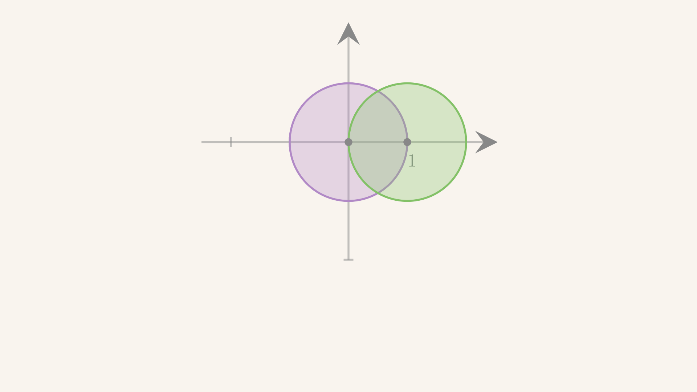

# 超几何函数
$$
\newcommand\blue[1]{{\color[rgb]{0.20, 0.43, 0.75}{#1}}}
\newcommand\red[1]{{\color[rgb]{0.839844, 0.507813, 0.488281}{#1}}}
\newcommand\green[1]{{\color[rgb]{.359375, .59765625, .41015625}{#1}}}
\newcommand\gray[1]{{\color[rgb]{0.5, 0.5, 0.5}{#1}}}
\newcommand\purple[1]{{\color[rgb]{0.63515625, 0.49609375, 0.80859375}{#1}}}
\newcommand\white[1]{{\color{white}{#1}}}
\newcommand\orange[1]{{\color[rgb]{0.63515625, 0.51015625, 0.37734375}{#1}}}
$$

---
<!-- footer: 超几何函数 -->

### 超几何方程

- 超几何方程的标准形式是
  $$
  z(1 - z) \frac{d^2y(z)}{dz^2} + [c - (a + b + 1)z] \frac{dy(z)}{dz} - aby(z) = 0
  $$
  其中 $a, b, c$ 是复常数。
- 超几何方程有三个正则奇点：$0, 1, \infty$。

---

### Indicial roots

- $z = 0$ 处的 indicial roots
  $$
  s_1 = 0, \quad s_2 = 1 - c
  $$
- $z = 1$ 处的 indicial roots
  $$
  s_1 = 0, \quad s_2 = c - a - b
  $$
- $z = \infty$ 处的 indicial roots
  $$
  s_1 = a, \quad s_2 = b
  $$
- 考虑 generic $a, b, c$：$s_1 - s_2 \not \in \mathbb{N}$

---
### $z = 0$ 附近的解

- $z = 0$ 处的第一解 (超几何级数 $F\big[\substack{a,b\\c}\big](z)$ 的定义)
  $$
  y_1(z) = \green{F \begin{bmatrix}
    a, b\\
    c
  \end{bmatrix}(z) = \sum_{n = 0}^{+\infty} \frac{(a)_n (b)_n}{(c)_n} \frac{z^n}{n!}}
  $$
  其中定义 **<green>Pochhammer symbol $(a)_n \coloneqq \prod_{k = 0}^{n - 1}(a + k)$**
- $z = 0$ 处的第二解为
  $$
  y_2(z) = F \begin{bmatrix}
    a + (\red{1 - c}), b + (\red{1 - c})\\
    \red{1 - c} + 1  
  \end{bmatrix} = z^{\red{1 - c}} \sum_{n = 0}^{+\infty} \frac{(a - c + 1)_n (b - c + 1)_n}{(\red{1 - c} + 1)_n} \frac{z^n}{n!}
  $$

---
### $z = 0$ 附近的解

- 设级数解
  $$
  y(z) = \sum_{n = 0}^{+\infty} y_n z^{n + s}
  $$
- 系数递推为
  $$
  y_{n + 1} = \frac{(n + a + s)(n + b + s)}{(n + c + s)(n + 1 + s)}y_n
  $$

---
### $z = 0$ 附近的解

- 得到超几何级数的系数形式
  $$
  \begin{align}
    y_n = \frac{y_n}{y_{n - 1}} \cdots \frac{y_1}{y_0} y_0
    = & \ y_0 \prod_{k = 1}^{n} \frac{(k - 1 + a + s)(k - 1 + b + s)}{(k - 1 + c + s)(k+ s)}\\
    = & \ y_0 \frac{(a + s)_n(b + s)_n}{(c + s)_n (s + 1)_n}
  \end{align}
  $$
- 因此级数解为 (设 $y_0 = 1$)
  $$
  y(z) = z^s \sum_{n = 0}^{+\infty} \frac{(a + s)_n(b + s)_n}{(c + s)_n (s + 1)_n} z^n
  $$
- 令 $s = 0, 1 - c$ 即可得两个解。第二个 indicial root 导致 $s + 1 = 1 - c + 1$，$c + s = 1$

---
### $z = 0$ 附近的解

> 超几何级数也可以用 $\Gamma$ 函数表示
> $$
>   F \begin{bmatrix}
>    a, b\\
>    c
>  \end{bmatrix}(z)
>   = \frac{\Gamma(c)}{\Gamma(a)\Gamma(b)} \sum_{n = 0}^{+\infty} \frac{\Gamma(a + n)\Gamma(b + n)}{\Gamma(c + n)} \frac{z^n}{n!}
> $$

---

### $z = 1$ 附近的解

- $z = 1$ 附近的第一解
  $$
  y_1(z) = F \begin{bmatrix}
    a, b\\
    a + b - c + 1
  \end{bmatrix}(1 - z)
  $$
- $z = 1$ 附近的第二解
  $$
  y_2(z) = (1 - z)^{c - a - b} F \begin{bmatrix}
    c - a, c - b\\
    c - a - b + 1
  \end{bmatrix}(1 - z)
  $$

---
### $z = \infty$ 附近的解

- $z = \infty$ 附近的第一解
  $$
  y_1(z) = z^a F \begin{bmatrix}
    a, a - c + 1\\
    a - b + 1
  \end{bmatrix}\left(\frac{1}{z}\right)
  $$
- $z = \infty$ 附近的第二解
  $$
  y_2(z) = z^b F \begin{bmatrix}
    b, b- c + 1\\
    b - a + 1
  \end{bmatrix}\left(\frac{1}{z}\right)
  $$

---
### $z = 0$ 附近的解

- 从超几何级数的系数形式可以看到，$z=0$ 与 $z = 1$ 附近的级数解的收敛半径均为
  $$
  R = 1
  $$
  > 分别有效的区域为 $|z| < 1$ 和 $|1 - z| < 1$。

  

  
  
  

---
### 超几何函数连接公式

- 超几何函数是个二阶方程：只有两个线性独立解
- 在 $|z| < 1$ 和 $|1 - z|< 1$：有四个级数解
- 这四个解必然只有两个线性独立：**连接公式 (connection formula)**
- 记四个级数解
  $$
  \begin{align}
    w_1 = & \ F \begin{bmatrix}
    a, b\\
    c
    \end{bmatrix}(z),
    & w_2 = & \
    z^{1 - c} F \begin{bmatrix}
    a - c + 1, b - c + 1\\
    2 - c
    \end{bmatrix}(z)\\
    w_3 = & \ F \begin{bmatrix}
    a, b\\
    a + b - c + 1
    \end{bmatrix}(1 - z),
    & w_4 = & \
    (1 - z)^{c - a - b} F \begin{bmatrix}
    c - a, c - b\\
    c - a - b + 1
    \end{bmatrix}(1 - z)
  \end{align}
  $$

---
### 超几何函数连接公式

- 连接公式
  $$
  w_3 = \frac{\Gamma(1 - c)\Gamma(a + b - c + 1)}{\Gamma(a - c + 1)\Gamma(b - c + 1)}w_1
  + \frac{\Gamma(c - 1)\Gamma(a + b - c + 1)}{\Gamma(a) \Gamma(b)}w_2
  $$
  $$
  w_4 = \frac{\Gamma(1 - c)\Gamma(c - a - b + 1)}{\Gamma(1 - a)\Gamma(1 - b)}w_1
  + \frac{\Gamma(c - 1)\Gamma(c - a - b + 1)}{\Gamma(c - a)\Gamma(c - b)}w_2
  $$

---
### 超几何函数的 Barnes 积分表达式

- 超几何函数可以写成 Barnes 积分的形式
  $$
  F \begin{bmatrix}
    a, b\\
    c
  \end{bmatrix}(z) = \frac{\Gamma(c)}{\Gamma(a)\Gamma(b)} \int_C \frac{\Gamma(a + s)\Gamma(b + s)}{\Gamma(c + s)} \Gamma(-s) (-z)^s \frac{ds}{2\pi i}
  $$
  > 通常人们选 $C$ 为 $-i\infty \to +i\infty$ 的直线
  > 或者其他使得积分具有 $s \to s+1$ 平移不变性的围道

---
### 超几何函数的 Barnes 积分表达式

检验上述积分表达式确实是超几何方程的解。

- 二阶导数项
  $$
  \sim - \int_C \frac{\Gamma(a + s)\Gamma(b + s)}{\Gamma(c + s)}\Gamma(-s) s(s - 1) (1-z) (-z)^{s - 1} \frac{ds}{2\pi i}
  $$
- 一阶导数项
  $$
  \sim - \int_C \frac{\Gamma(a + s)\Gamma(b + s)}{\Gamma(c + s)} \Gamma(-s) s \left({c - (a + b + 1)z}\right) (-z)^{s-1} \frac{ds}{2\pi i}
  $$

---

### 超几何函数的 Barnes 积分表达式

- 合并三项，
  $$
  \sim \int_C \frac{\Gamma(a + s)\Gamma(b + s)}{\Gamma(c + s)}\Gamma(-s) \left[ \frac{s(s+c-1)}{z} - s(s+a+b) - ab \right] (-z)^s \frac{ds}{2\pi i}
  $$
- 处理第一项，$s-1 = s'$
  $$
  \begin{align}
    & \ -\frac{\Gamma(a + s)\Gamma(b + s)}{\Gamma(c + s)}s(s+c-1) \Gamma(-s) (-z)^{s - 1} \\
  = & \ - \frac{\Gamma(a + s' + 1)\Gamma(b + s'+1)}{\Gamma(c + s'+1)} \Gamma(-s - 1) (s'+1)(s+c)(-z)^{s'}\\
  = & \ - \frac{\Gamma(a + s')\Gamma(b + s')}{\Gamma(c + s')} \frac{\Gamma(-s')}{-s' - 1} \frac{(a+s')(b+s')}{c+s'} s'(s'+c)(-z)^{s'}
  \end{align}
  $$

---
### 超几何函数的 Barnes 积分表达式

- 对积分路径平移，第一项给出
  $$
  \int_C \frac{\Gamma(a + s)\Gamma(b + s)}{\Gamma(c + s)} \Gamma(-s) (s+a)(s+b) (-z)^s \frac{ds}{2\pi i}
  $$
  > 假设平移的时候没有碰到奇点
- 剩余项 $- s(s+a+b) - ab = -(s+a)(s+b)$，刚好与第一项 **<red>抵消**

